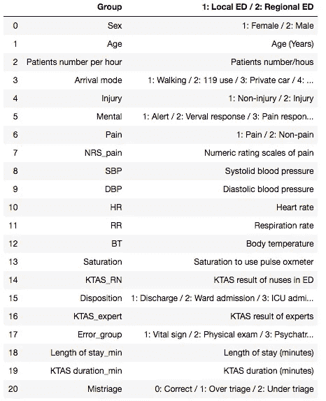
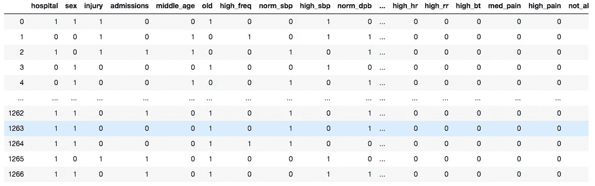
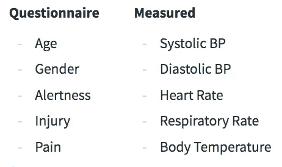
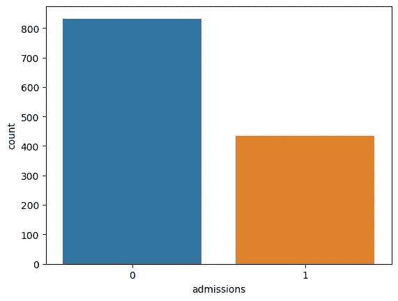
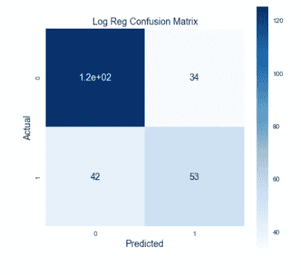
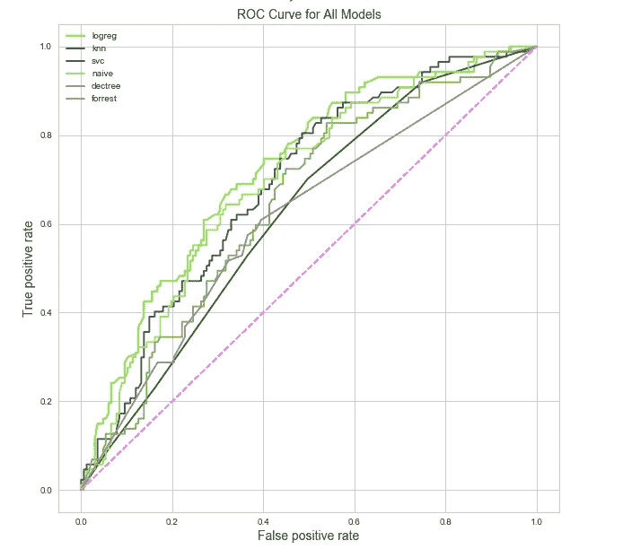
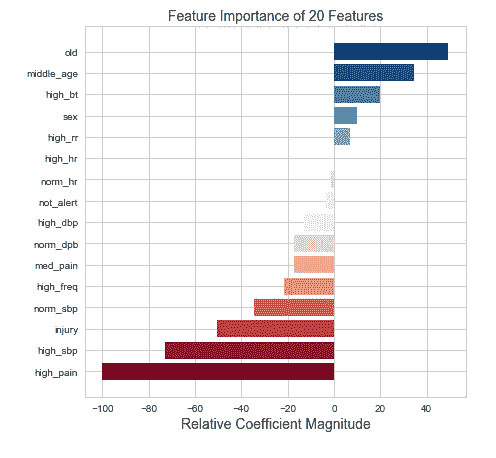

# 人工智能的分类:医院入院分类的机器学习方法

> 原文：<https://towardsdatascience.com/triage-to-ai-a-machine-learning-approach-to-hospital-admissions-classification-7d3a8d5df631?source=collection_archive---------17----------------------->

Photo by [Arseny Togulev](https://unsplash.com/@tetrakiss?utm_source=medium&utm_medium=referral) on [Unsplash](https://unsplash.com?utm_source=medium&utm_medium=referral)

# 简史

你曾经不得不在急诊室等很长时间吗？想知道为什么那个断了脚趾的家伙比你先被征召？这是伤检分类。分诊是医疗提供者根据资源可用性和患者需求对入院患者进行分类的过程。现在让我们后退一点。这个分类是什么东西？triage 这个词来自法语单词“trier”，意思是“分类”。大约在 1792 年，这个英俊的家伙(下图)是拿破仑帝国卫队的外科医生。

在受伤士兵对一些装备不良的医生的持续轰炸后，多米尼克·让·拉雷男爵(多好的名字)想“嘿伙计们。我认为有更好的方法。”因此，最初的伤检分类形式诞生了，法国人“称赞[拉雷]设计了一辆飞行救护车。”

Larrey 实施的灾难救援形式的分流包括在新来的病人身上贴上标签，标签上有颜色和文字，标明类别，如“死亡”、“立即”、“轻微”等。这使得当时的医疗提供者能够快速地优先考虑和分配资源给那些在给定时间内受益最大的患者。今天的急诊室仍然使用一种基于此的分类形式，但是，使用 1-5 的等级来代替彩色标签。

# 问题是

好吧…为什么我要让你经历这个分类历史？我相信了解一个系统的背景是开始迭代和改进的最好方法。还有什么比计算机更好的方法来迭代排序问题呢？**咳*二分搜索法*咳*冒泡排序*咳*合并排序*咳*。*如果我们可以使用一种算法来为我们的患者*进行优先排序*，而不是花费时间来生成一个甚至可能在提供商之间不一致的评级，会怎么样？嗯……好在我们是数据科学家！

为了简化这个问题，我将把重点放在住院患者(那些需要过夜并需要许多资源的患者)和临时患者(那些将在一天内离开并需要较少资源的患者)之间的区别上。与 Larrey 提出的粒度化方法相反，我对此的理由有两点:

1.  这些组是不同的，因此该算法将更加可靠和准确
2.  包括平均住院时间和总医院运营成本，每个住院病人的费用可能高达 6000 美元。这表明医院资源的负担比那些住院几个小时的病人要大得多。

因为有两个目标条件要预测，所以这是一个二元结局的分类问题(1:录取；0:未录取)。

# 数据

我用来训练这个分类器的数据来自于韩国两家医院的分类研究。在其原始状态下，大约有 1200 行和 24 个特征。原始特征的子集如下:

# 清洁和特征工程

这些数据相当混乱，有一些常见的疑点:空值、奇怪的标注、不相关的特征、不均匀的分布等等。我采取了一些步骤来清理数据并为建模做准备:

1.  删除了对该分析没有帮助的特征。
2.  空值的估算中值
3.  将离散的、不一致的特征归入更广泛的类别。
4.  为分类特征创建虚拟变量
5.  根据数据集中名为“处置”的原始要素构建预测要素(y)。这表明患者在评估后去了哪里。我把像“入院”这样的事情归类为入院，而像“出院”这样的事情则不属于入院。

干净的数据框(带有虚拟对象)如下所示:

该模型的最终特征分组如下。它们被从急诊室进入时的问卷中获取的数据和由护士测量的生命体征分开。

目标(承认与不承认)是不平衡的(我们将在后面处理这个问题):

# 建模

在深入建模之前，我们先来谈谈指标。我将使用两个重要分类指标的加权分数(称为 Fbeta):精确度和召回率。精度表示我的实际结果中的真阳性。这就是，在我预测的所有入院中，我预测的入院患者中实际上没有入院(假阳性)的比例是多少？回忆从我的预测结果中描述了我真正的积极因素。这是，在我预测的所有事情中，我错过录取(假阴性)的比例是多少？如果我的精度较低，我可能会过度分配资源，因为我预测的入院病人比实际的多。然而，低回忆率可能意味着我错过了应该住院的病人。回忆对我来说更重要，因为我宁愿过度分配资源，也不愿分配不足。为了优先考虑召回，同时也确保我不会过度分配资源，我更倾向于召回来衡量我的 beta 值，以严厉惩罚召回率低的模型。下面是我生成的一个混淆矩阵的例子:

Confused?

看到左下角有生命、宇宙和一切的答案了吗？那些是我的假阴性。这个数字越大，越多我认为不会被录取的人被录取了，这让我很吃惊。突然间，我毫无准备，没有床位和资源来安置他们。我想尽可能多的把它们移到右边。

好的。现在我们知道测量什么了。继续下一个问题。还记得我们那个讨厌的阶级不平衡问题吗？事实证明，大部分通过急诊室的人都将在一天结束时被治愈出院。被接纳的类别代表一个较小的子集。我决定使用一些不同的方法对少数类进行上采样，包括随机过采样、ADASYN 和 SMOTE。通过分析各种模型的 ROC 曲线，我最终选定了随机过采样。下面是我用随机过采样、kfold 交叉验证和均值 FBeta 作为度量考虑的模型。

在这种情况下，逻辑回归似乎是赢家(FBeta 为 0.65)。除了高 FBeta 之外，逻辑回归也是一个不错的选择，因为我将能够解释这些特征。下面是系数大小的曲线图。

Just don’t get old I guess?

虽然我*真的*不需要知道特征对预测能力的重要性，但展示一点洞察力是很好的。上面的模型没有提供任何关于分类分数的提示。为什么？这是故意的。如果我们给了我们的模型答案，我们如何自动分类？然而，我确实想看看在给定这些信息的情况下，性能会如何变化。不出所料，这个模型变得更好了。0.68 的 FBeta 可以通过指示患者严重性的某个等级 1-5 来实现。

所以。机器学习很棒。模型很棒。非常好。分诊机器人在哪里？我们可以称他为 BOTriage(工作进展中)。总之… [这里的](https://hospital-admissions-predictor.herokuapp.com/)是我创建的模拟自动分诊的示例应用程序:

For dramatic effect, you can look at how much time could be wasted manually assessing triage

The prediction page (BOTriage) offering “Admitted” or “Not Admitted” and the percent strength of prediction.

那都是乡亲们！感谢收听，至少如果将来有人问你关于分流的问题，你可以向他们推荐“那个发明了飞行救护车的法国人”。如果你有兴趣了解这个项目的更多信息，可以在我的 [GitHub](https://github.com/brittbowers/) 上找到代码，或者你可以在这里联系我[。](http://brittanybowers94@gmail.com)

# 资源

1.  分流历史:[https://www.ncbi.nlm.nih.gov/pmc/articles/PMC2564046/](https://www.ncbi.nlm.nih.gov/pmc/articles/PMC2564046/)
2.  住院费用:[https://www.ncbi.nlm.nih.gov/pmc/articles/PMC3303656/](https://www.ncbi.nlm.nih.gov/pmc/articles/PMC3303656/)