# 在 10 分钟或更短时间内搞定你的终端

> 原文：<https://towardsdatascience.com/trick-out-your-terminal-in-10-minutes-or-less-ba1e0177b7df?source=collection_archive---------3----------------------->

## 如何在短短几分钟内打造一个更好、更快、更强、更性感的终端


Image by [khamkhor](https://pixabay.com/users/khamkhor-3614842/?utm_source=link-attribution&utm_medium=referral&utm_campaign=image&utm_content=3510850) from [Pixabay](https://pixabay.com/?utm_source=link-attribution&utm_medium=referral&utm_campaign=image&utm_content=3510850)

你盯着终端的时间不一定是痛苦的。

几乎不需要时间或努力，你就可以把你的终端从一个令人沮丧的白色痛苦的地方变成一个漂亮、快速、有趣、易于使用的电源座。

GIF via [GIPHY](https://media.giphy.com/media/APPbIpIe0xrVe/giphy.gif)

终端是一个不可思议的工具。这是一个神奇的盒子，从这里你可以运行你的世界。为什么要浪费更多的时间去使用那些让你不那么兴奋的东西呢？

当你第一次开始你的编码之旅时，你会很快意识到你会花很多时间在终端上。你可能想从事程序员或开发人员的工作，或者你可能对人工智能、机器学习、数据科学或任何其他职业感兴趣。无论你走哪条路，花几分钟时间，放松一下，让你的终端成为一个快乐的地方都是一个好主意。

> 如果你使用的是苹果电脑，刚接触编程，并且完全不喜欢那种空白的感觉，那么这款适合你。


Photo by [Nicola Gypsicola](https://unsplash.com/@nicolagypsicola?utm_source=medium&utm_medium=referral) on [Unsplash](https://unsplash.com?utm_source=medium&utm_medium=referral)

## **预装的 Mac 终端**

如果你有一台 Mac，你有一个终端窗口。万岁！但是，即使进行了一些基本的定制，这可能也不是您一天中的大部分时间所希望看到的:

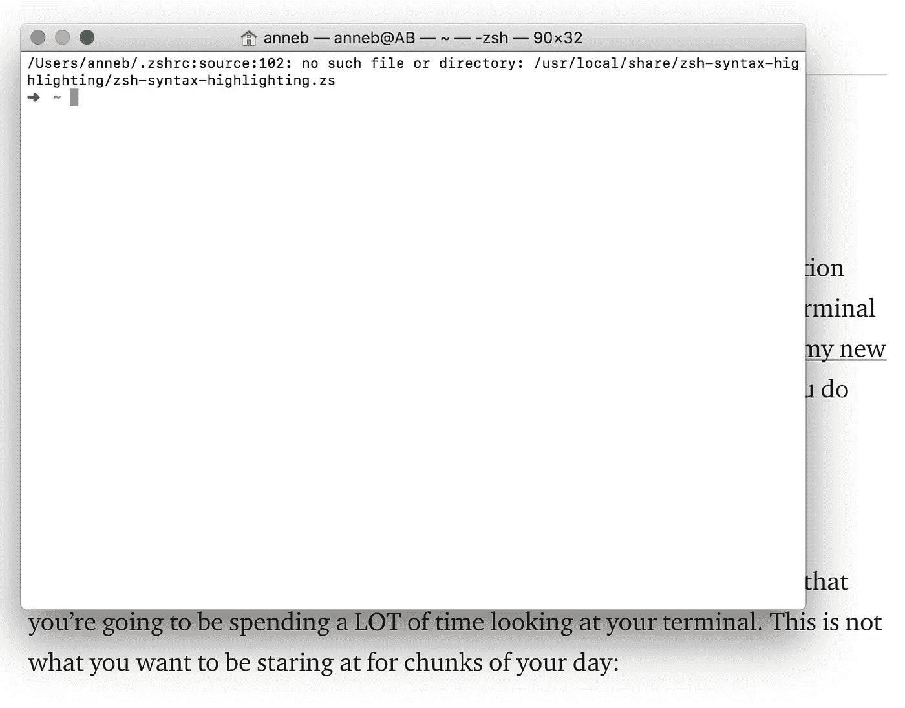

它在那里，它工作，这是伟大的。但是几乎不费吹灰之力，你就可以把你的终端变成你会兴奋地玩的东西。会让你的生活变得更轻松的东西。

## 终端与 iTerm

不一定要用终端！有一个名为 [iTerm](https://www.iterm2.com/downloads.html) 的终端得到了极大的改进，它更加可定制，并且有许多很酷的功能。你可以搜索一下。您可以拆分窗格。你有各种各样的选择，这些选择可能是你从未考虑过的。

此外，你可以让它变得非常性感，而且几乎不费吹灰之力就能轻松完成！

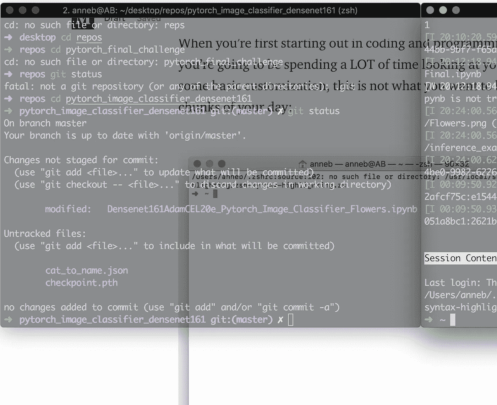

只需前往官方网站，然后点击“下载”这个大按钮。下载后，打开它并安装它，就像你做任何事情一样。(如果你感兴趣，你可以在这里找到 iTerm3 [的下载链接](https://www.iterm2.com/version3.html)。)

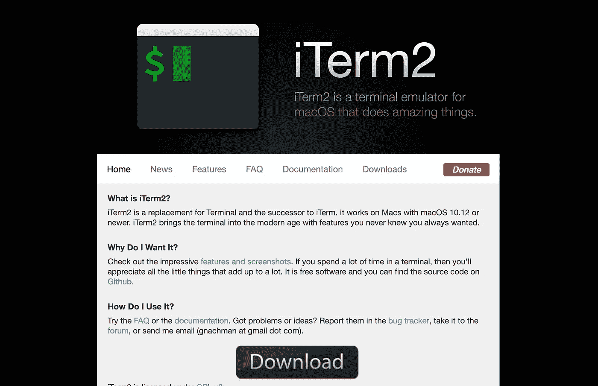

您将从如下所示的终端窗口开始:

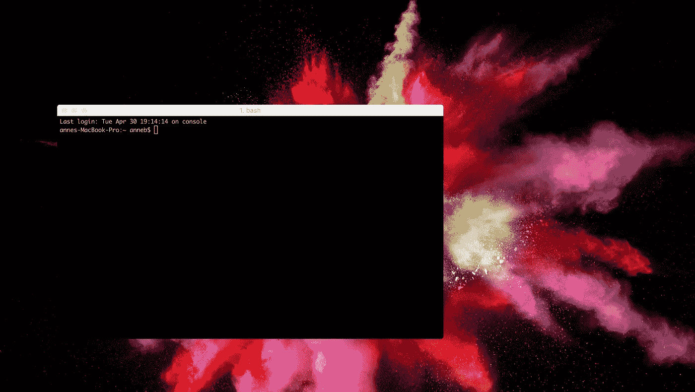

> 我们才刚刚开始。

## 关闭登录

你可能不太喜欢打开终端时弹出的“上次登录”消息。通过在您的终端中运行这个简单的命令来摆脱它:

```
touch ~/.hushlogin
```

## 抓取一些甜蜜的下载

> 重要的是要意识到在你的改变生效之前，你可能需要关闭并重新打开你的终端。
> 
> 如果您没有看到您的修改，请关闭您的终端窗口并打开一个新窗口。

## [**自制**](https://brew.sh/)

[家酿啤酒](https://brew.sh/)是你武器库中的一个好东西。他们称自己为“macOS 缺失的软件包管理器”,他们不是在开玩笑。他们安装你需要的东西，而苹果没有为你安装。

你可以通过运行

```
/usr/bin/ruby -e "$(curl -fsSL https://raw.githubusercontent.com/Homebrew/install/master/install)"
```

它会暂停并告诉你它正在安装什么。这东西非常有用，我怎么推荐都不为过。家酿啤酒是救星。

## [**Zsh**](http://zsh.org/)

默认的 shell 是 bash，如果您想保留它，这很好。但是 Zsh 更加可定制，并且以速度更快而闻名。Zsh 做的最酷的事情之一就是自动完成。任何时候你都可以输入类似“git c”的东西，然后按 tab 键，你就会得到一个可爱的小帮助窗口，里面有自动完成的建议。

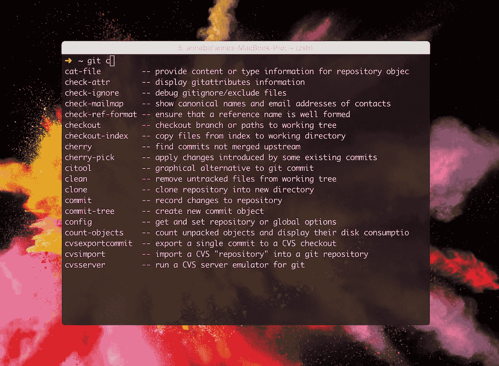

此外，Zsh 有一些非常好的插件，你真的不想错过。它预装在 Mac 上，但版本似乎总是过时，所以您会想运行:

```
brew install zsh
```

## [**Oh-My-Zsh**](https://github.com/robbyrussell/oh-my-zsh)

你喜欢 Zsh 吗？你需要得到 [Oh-My-Zsh](https://github.com/robbyrussell/oh-my-zsh) ！这是一个用于管理你的 Zsh 配置的开源框架，它有数以千计令人敬畏的助手和函数、插件和主题。您可以通过运行以下命令下载它

```
sh -c "$(curl -fsSL https://raw.githubusercontent.com/robbyrussell/oh-my-zsh/master/tools/install.sh)"
```

## 插件

你可以在这里找到官方插件的完整列表。他们随时准备出发。您只需将它们添加到您的~/中即可启用它们。zshrc 文件。(留在这里陪我。比听起来容易！)

要想知道你能立即得到什么，请访问[插件网站](https://github.com/robbyrussell/oh-my-zsh/wiki/Plugins)。向下滚动，看看所有你几乎不费吹灰之力就能安装的插件。你可能想添加 Git、GitHub、Python、Sublime、VSCode 或其他任何看起来会让你的生活更轻松的东西。

你肯定要 z。

添加插件非常容易，但是如果你是终端新手，这些说明可能没有意义。当您想要进行这样的更改时，您需要编辑您的~/。zshrc 文件。这听起来很复杂，但实际上并不复杂！要打开该文件，请运行

```
open ~/.zshrc
```

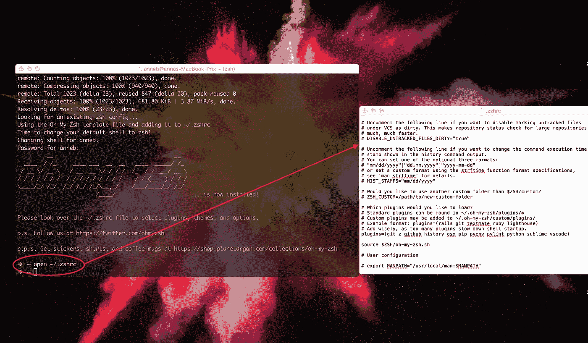

这将打开您需要进行更改的文本文件。**请务必尊重这份文件。**改变这里的某些东西能够而且将会对事情的运作方式(以及是否)产生重大影响。

当你浏览这个文件时，你会看到一些东西，如果你想改变它们，你可以取消注释。您还会看到可以添加您自己的修改的空间。

想要添加或删除插件？向下滚动到这一部分:

```
# Which plugins would you like to load?
# Standard plugins can be found in ~/.oh-my-zsh/plugins/*
# Custom plugins may be added to ~/.oh-my-zsh/custom/plugins/
# Example format: plugins=(rails git textmate ruby lighthouse)
# Add wisely, as too many plugins slow down shell startup.
plugins=(git)
```

> 好像他们想让这一切变得简单！

现在添加任何你想使用的插件。例如，您可能希望将最后一行改为

```
plugins=(git z github history osx pip pyenv pylint python sublime vscode)
```

保存它，你就可以走了！

## 语法突出显示

您希望突出显示 Zsh 语法。它会告诉你，如果你的命令有效，甚至在你运行它之前。很方便。

要启用语法突出显示，请运行

```
cd ~/.oh-my-zsh && git clone git://github.com/zsh-users/zsh-syntax-highlighting.gitecho "source ${(q-)PWD}/zsh-syntax-highlighting/zsh-syntax-highlighting.zsh" >> ${ZDOTDIR:-$HOME}/.zshrc
```

然后通过运行以下命令启用它

```
source ~/.oh-my-zsh/zsh-syntax-highlighting/zsh-syntax-highlighting.zsh
```

重新启动您的终端以使您的更改生效。

## [**Z**](https://gist.github.com/mischah/8149239)

爱 Z 爱爱爱 Z！z 更上一层楼。它让终端生活变得如此之快！要安装它，请运行

```
brew install z
```

(希望你的插件中包含了 Z。)

z 很牛逼。z 很聪明。如果您经常键入类似以下的内容:

```
cd this/is/the/path/to/the_file/ThisOne
```

现在，您将能够键入:

```
z thisone
```

你在那里！你需要做一段时间你正常的事情，而 Z 找出你喜欢做什么，然后你就可以去比赛了。

假设你总是去你的“回购”文件夹。从任何地方输入`cd repos`都不会起作用。


但是现在你只需输入`z repos`就可以从任何地方直接跳转到它！

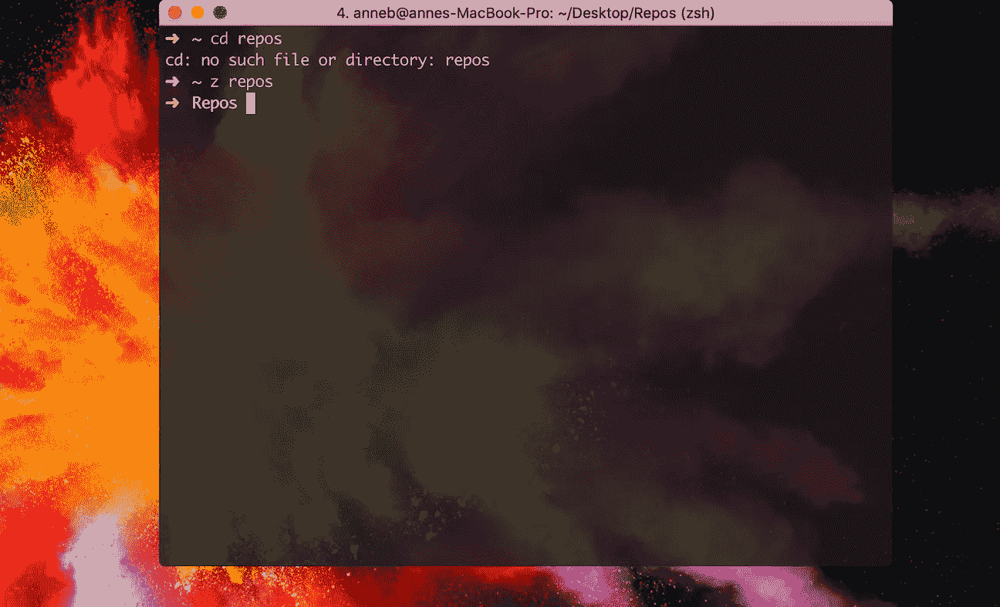

## [崇高的文字](https://www.sublimetext.com/)

如果你使用 [Sublime Text](https://www.sublimetext.com/) 作为你的主要文本编辑器，你可以通过设置 Sublime 快捷方式让你的生活变得无比简单。这样，任何时候你想用 Sublime 打开一个文件(或者创建一个新文件并用 Sublime 打开它)，你都可以使用命令`subl`。

如果您想在 Sublime 中创建和打开一个名为“test.txt”的新文件，您可以输入

```
subl test.txt
```

这将打开 Sublime 并创建一个名为“test.txt”的全新文本文件

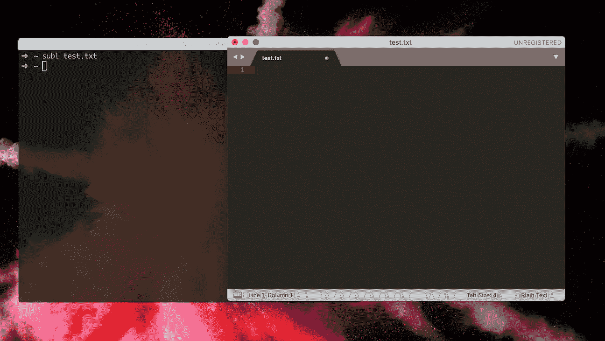

[我在这里找到了在装有 Zsh 的 Mac 上运行这个功能的最简单方法](https://gist.github.com/barnes7td/3804534)。首先**确保你已经安装了 Sublime Text，并且在你的应用文件夹**中。要启动并运行它，运行以下命令在~/bin 下创建一个目录

```
mkdir ~/bin
```

然后运行以下命令:

```
ln -s "/Applications/Sublime Text 2.app/Contents/SharedSupport/bin/subl" ~/bin/subl
```

现在运行这个命令在你的~/中添加一行。zshrc 文件

```
echo 'export PATH=$PATH:$HOME/bin' >> ~/.zshrc
```

然后用下面这行代码将 Sublime 设置为默认编辑器:

```
echo "export EDITOR='subl' -w" >> ~/.zshrc
```

重新启动终端后，您可以使用以下命令进行测试:

```
subl .
```

这应该为你打开崇高的权利！

## 让我们把它变漂亮

虽然有很多主题可以用来修改终端窗口的外观，但您可能希望从简单的开始。

打开 iTerm，将 iTerm 菜单下拉至“首选项”会弹出一个有很多选择的窗口。您可以选择您喜欢的颜色，或者使用“颜色”标签中“颜色预设”下拉菜单中的一个选项。你可能想选择一个黑色的主题或者做一些其他简单的颜色选择。在“文本”标签下，很容易改变字体和字体大小

您也可以随时导入不同的主题。我在配色方案中使用了 Atom，但是你有很多选择。看看[这个 GitHub 库](https://github.com/robbyrussell/oh-my-zsh/wiki/Themes)的例子。

如果你想安装一个定制的 iTerm 主题，那很简单。只需进入[这个 GitHub repo](https://github.com/mbadolato/iTerm2-Color-Schemes) ，然后点击顶部的图标下载主题。(我用的是 zip 文件。下载文件后，单击它将其解压缩。)

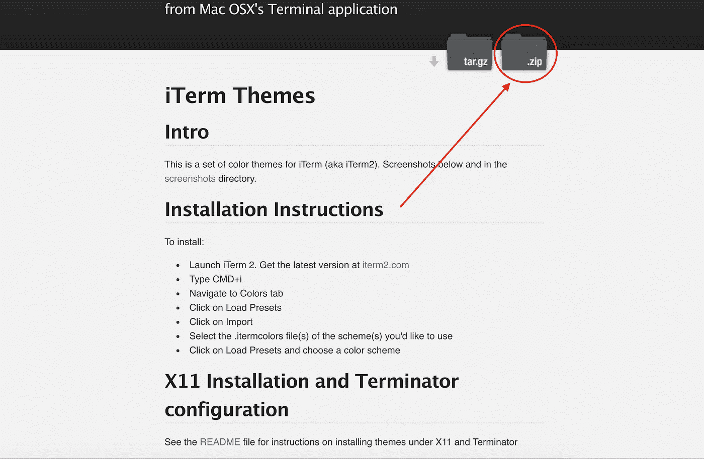

接下来，转到“首选项”，点击“颜色”标签，并在“颜色预设”下拉菜单中点击“导入”。让你选择你想要的配色方案。这将打开一个查找窗口。进入你下载的文件夹中的“schemes”文件夹，如果你想使用 Atom 主题，选择“Atom.itermcolors”并点击“打开”

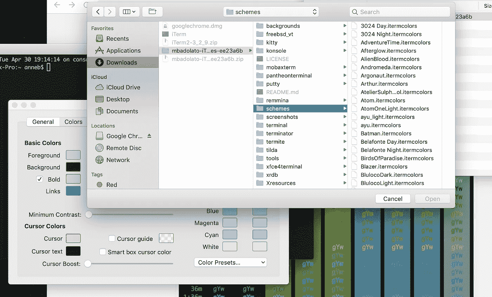

现在你可以从下拉菜单中选择“Atom ”!

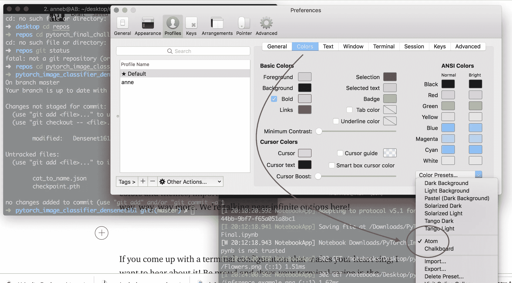

如果您想要更改字体或字体大小，请转到“文本”标签然后单击“更改字体”按钮进行更改。

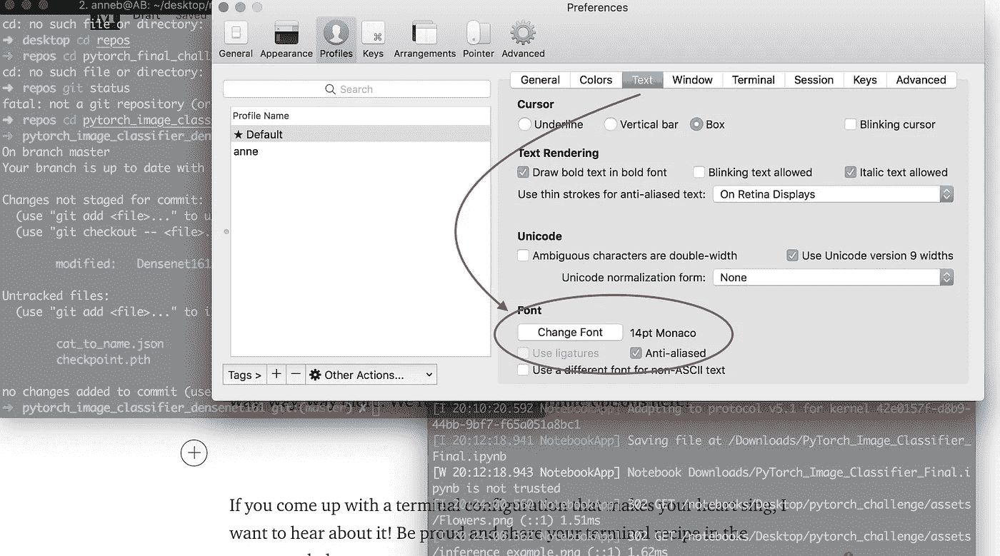

摩纳哥看起来很开心。

您还可以轻松调整窗口的透明度**。你可能想要留意你窗户后面的东西。你可能是编程新手，需要确保你仔细地按照教程学习。这很有帮助！**

只需转到“窗口”选项卡，调整“透明度:”下的滑块，直到你满意为止。

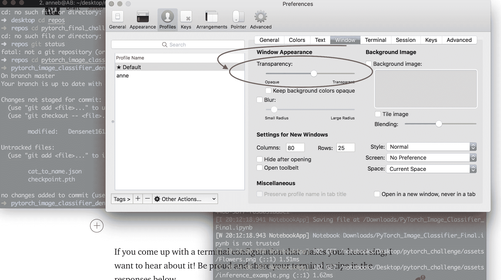

## 做你想做的事。

永远不要忘记:**你的操场，你的规则。**让你的空间牛逼起来！这只是你能做的事情的表面。有几乎无限的方式，你可以定制你的终端。

找点乐子！

如果你想出了一个让你心动的终端配置，就在下面的回复里让大家都知道吧！一如既往，在 LinkedIn 上随时联系 [@annebonnerdata](https://www.linkedin.com/in/annebonnerdata/) 。

感谢阅读！

想要更多很酷的文章和想法？查看[内容简单](https://contentsimplicity.com/articles/)！

[](https://contentsimplicity.com/articles/)