# 操纵概率的技巧

> 原文：<https://towardsdatascience.com/tricks-for-manipulating-probability-470b7eb7dfd?source=collection_archive---------16----------------------->

**概述**

*   *身份诡计*
*   *跳跃戏法*
*   *密度比例技巧*
*   *对数导数技巧*
*   *重新参数化技巧*

解决机器学习和人工智能的基本问题需要在概率方面的灵活性。这个博客旨在总结不同概率问题中应用的各种技术，使计算更容易，有时甚至是可能的！本博客假设对概率和期望有基本的理解。因此，对基础知识的预先修订可能有助于进一步理解博客。

让我们快速概述一下机器学习中常见的推理问题及其概率方程。我们将不讨论这些问题的细节。这个列表应该是作为一个复习，而不是指南。

## 证据估计:

## 力矩计算:

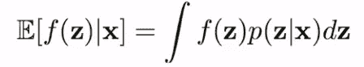

## 参数估计:

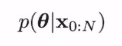

## 预测:

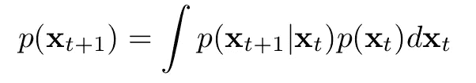

## 假设检验:

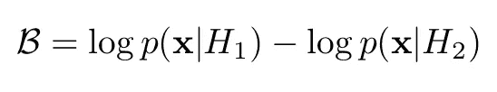

如果你不知道其中的一些应用，不要担心。这不是即将到来的讨论的焦点，而是强调 ML 中概率建模的不同领域。因此，没有任何延迟，让我们深入到上述概率问题的操纵技术。

1.  **恒等式技巧:** 这将一个对 *f(x)* w.r.t. a 分布*p(x)*的期望转换成一个对*g(x；f)* w.r.t .分配 *q(x)。这是一个非常简单却非常有效的技巧。在很多场景下，计算期望 w.r.t. *p(x)* 是比较困难的。因此，我们引入一个分布 *q(x)，*，它在数学上对我们来说很方便，并将期望值转换如下:*

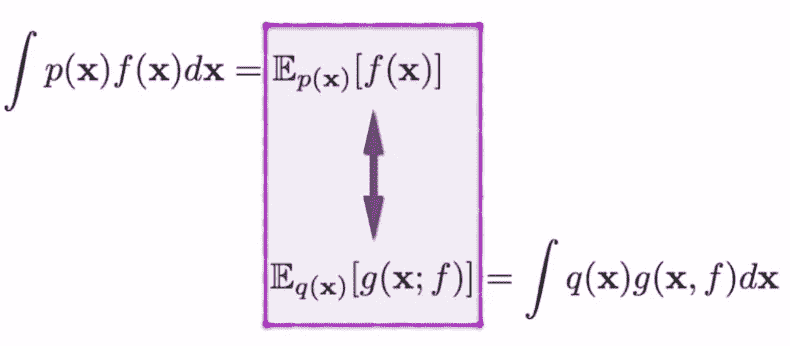

**应用:**

让我们用这个技巧来看看 ML 域的一个真实问题。

**贝叶斯公式中的证据计算**是多维变量中的一个棘手问题。在*生成模型中，*计算 *p(x)* 是主要目标。这里， *x* 是样本， *z* 是潜在变量， *p(x|z)* 是观察到 *x* 的可能性给定*z*下面给出的等式是联合概率 *p(x，z)* w.r.t. *z.* 的边缘化

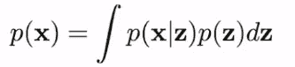

p(z) 是实际的潜在变量分布，因此很难处理。我们引入一个不同的分布 *q(z)* ，它将逼近 *p(z)* ，并且具有良好的数学性质。从这种分布*q(z)*中采样很容易，而且在许多情况下，是一种*高斯分布。我们简单地乘以和除以 q(z ),并将期望值的分布改为 q(z)。*

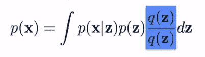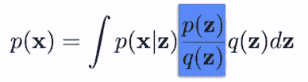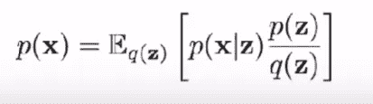

条件:

*   *q(z)* > 0，当*p(x | z)p(z)*≦*0*
*   *q(z)* 已知或者容易处理。

我们可以进一步使用蒙特卡罗
抽样方法计算期望值，因为 *q(z)* 很容易从中抽样。这表现为:

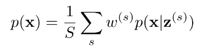

在哪里，

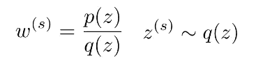

注:*我们将在《边界戏法》中讨论解决这个问题的另一种方法。*

其他地方的身份诡计:

*   操纵随机梯度。
*   推导概率界限。
*   RL 用于政策修正。

2.**边界技巧:**
这个技巧来自于‘凸分析’，我们在其中对要计算的积分进行边界处理。其中之一是**詹森不等式，**

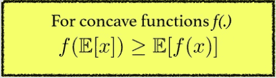

在大多数 ML 问题中，我们使用对数作为函数 *f，*，因为它们的可加性和严格的凹性。

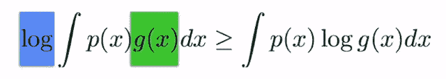

其他跳跃技巧:

*   芬切尔对偶。
*   霍尔德不等式。
*   蒙日-坎特罗维奇不等式。

一个应用出现在*变分推理中的*证据下界(ELBO)* 估计中。*我们将使用*詹森不等式*找到一个下限进行优化，而不是使用第一招中*证据计算*的蒙特卡洛估计。

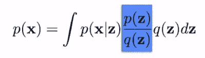

取*对数*并使用詹森不等式，

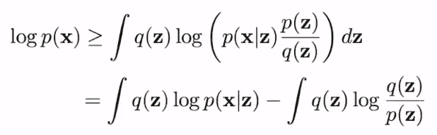

RHS 是变分下限，其中

*   第一项是重建损失。
*   第二项是在潜在变量上引入的近似分布族 *q(z)* 和原始的 *p(z)之间的 KL 散度。*

第一项采用 l2 损失或交叉熵损失的形式，取决于 *p(x|z)* 的分布，并且可以使用*期望最大化(em)算法来优化该问题。*

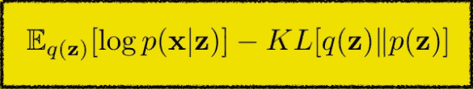

**3。密度比技巧:**
通常，当我们需要一个概率密度的比值时，一个简单的计算方法是计算两者，然后取比值。这个技巧说 ***两个概率密度的比率可以用一个分类器来计算，这个分类器使用从两个分布中抽取的样本。*** 由下式给出其中 p*(x)和 q(x)是两个概率分布，p(y=1|x) & p(y=-1|x)是分类器。

注:p*和 p 不相关。(抱歉符号滥用)。

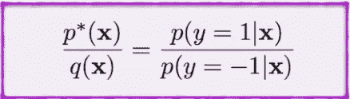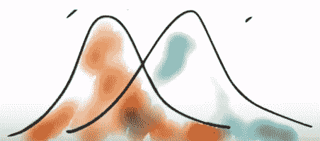

让我们看看它的起源，找出它工作的基本原理。

通过组合来自两种分布的样本来创建数据集{显示为“组合数据”}，并将+/- 1 指定为标签来表示分布{显示为“指定标签”}。现在，在等价设置中，我们可以将原始分布 p*(x)和 q(x)定义为组合数据集上的条件概率 p(x | y){显示为‘等价’}。

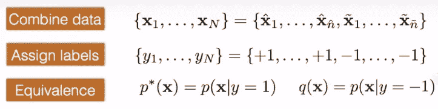

回想一下贝叶斯规则，该规则应用于条件分布 p(x|y=1)和 p(x|y=-1 ),如下所示:

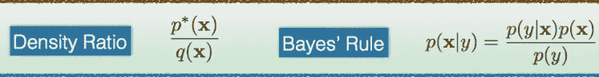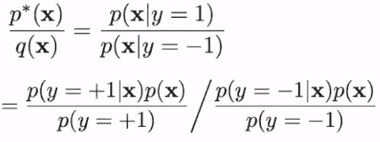

**注意:**创建一个平衡数据集，使得 *p(y=+1)等于 p(y=-1)。*因此，它进一步简化为:

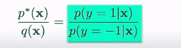

其他地方的密度比技巧:

*   生成对抗网络。
*   噪声对比估计。
*   双样本测试。

接下来，我们来看看操纵函数 *f.* 的期望梯度的技巧

下面是统计科学中最常见的梯度问题。如果分布 *q(z)* 是简单的，并且积分是一维的，则可以计算出期望值，因此也可以计算出它的梯度。但是，在一般的框架中，我们不能以封闭的形式计算期望。因此，计算其梯度成为一个不平凡的问题。

这里*φ*和 *θ* 分别是 *q(z)* 和 *f(z)* 的参数。

将期望值表示为积分形式，我们可以看到有两种方法来进行梯度估计:

1.  求密度的微分 *q(z):(得分函数估计器)*
2.  求函数 *f(z)的微分:(路径估计器)*

我们将详细了解这两种方法是如何工作的，并以 RL 为例给出一个算法来获得直觉。在示例中，我们将公式化上述梯度估计问题，并使用我们的技巧来解决它。

在此之前，这些是出现上述问题的典型领域:

*   生成模型和推理。
*   强化学习和控制。
*   运筹学
*   蒙特卡洛模拟。
*   金融和资产定价。
*   灵敏度估计。

4.**对数导数技巧:**

第一种方法是微分密度*q(z)*也称为*得分函数估计量。*

统计学中的‘分数’是什么？
得分(或线人)是对数似然函数 log 的梯度(***【θ】****)*w . r . t .参数向量 *θ* (见 [*wiki*](https://en.wikipedia.org/wiki/Score_(statistics)) *)。*

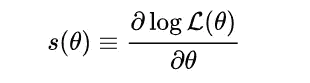

因此，在我们的例子中，诀窍是:

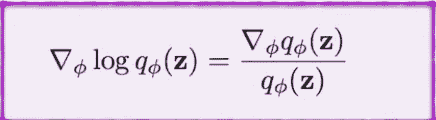

(这里， *ϕ* 为*参数，*t47】q 为*似然函数，梯度为 w.r.t. ϕ* )

得分函数的性质:
1。得分函数的期望值是 0。(容易证明。提示:詹森不等式)

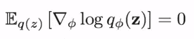

2.得分函数的方差由 *Fisher 矩阵给出。(只是一个有用的属性)*

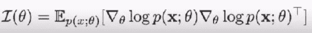

让我们来看看上面的技巧是如何用来解决随机优化问题的。

在下图中，
1。梯度为 w.r.t. *ϕ* ，积分和梯度的顺序可以互换。
2。取 *q(z)* 的梯度，并通过乘以和除以 *q(z)* 来应用恒等技巧。
3。对数导数技巧开始发挥作用。
4。所示期望的梯度被转换成所示函数的期望。

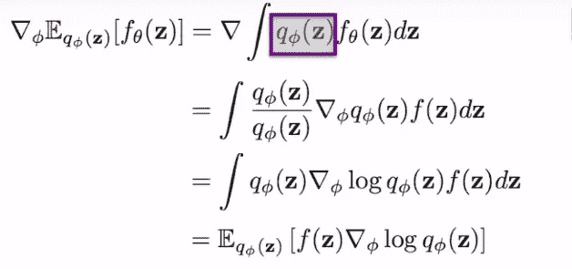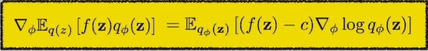

注意，我们引入了一个*常数 c* ，它不会改变使用属性“得分函数的期望值为 0”的等式。但是从 f(z) 中减去计算的*常数 c 减小了梯度的方差。*

现在，我们准备在强化学习中导出**香草** **策略梯度**。

让我们看看推导中使用的一些定义:

*   一条**轨迹**是世界上一系列的状态和行为。

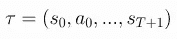

*这里，s 和 a 分别表示任意时刻 t 的状态和动作。*

*   代理人的目标是最大化某个轨迹上的累积回报，称为 ***回报。***
*   一种回报是**无限期贴现回报**，这是代理人曾经获得的所有回报*的总和，但按照他们在未来多远获得的时间贴现。这个奖励公式包括一个折扣因子 *γ* ∊ *(0，1)**

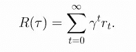

*   另一种是**有限期限未贴现回报**，也就是在一个固定的台阶窗口内获得的回报之和。我们将在推导中使用这一点。

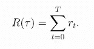

*   一个**策略 *π*** 是代理用来决定采取什么行动的规则。它可能是随机的。下面等式中的 ***π*** 表示给定状态下动作的概率分布。我们通常用 *θ* 来表示这种政策的参数，

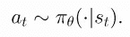

*   让我们假设环境转变 ***P*** 和策略 **π** 都是随机的。在这种情况下，***T***-步进轨迹给定策略 **π** 的概率为:

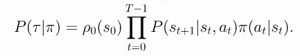

*   对数导数技巧:

*   轨迹的对数概率是:

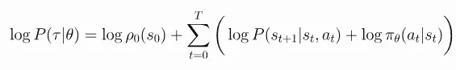

*   因此，轨迹对数概率的梯度为:

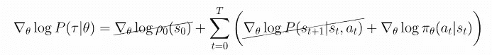

*   注意环境对 *θ* 没有依赖性，所以*初始状态概率ρ* 和*跃迁概率 P* 的梯度为零。
*   预期回报由下式表示:

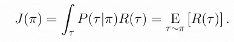

RL 的目标是选择一个策略，当代理人按照这个策略行动时，这个策略使**期望收益 *J(π)*** 最大化。RL 中的中心优化问题可以表示为:

其中，π*是最优策略。

我们希望通过梯度上升来优化策略，例如

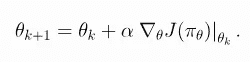

政策绩效的梯度，*【∇j(π】*，称为**政策梯度。**以这种方式优化策略的算法被称为**策略梯度算法。**任何政策梯度背后的关键思想是提高导致更高**回报**的行动概率，并降低导致更低回报的行动概率，直到你达到最优**政策**。

> 下面给出了推导过程(取自旋转 RL 的图像片段)。我强烈推荐所有 RL 从业者阅读这个资源。[链接*此处*](https://spinningup.openai.com/en/latest/user/introduction.html) *。*

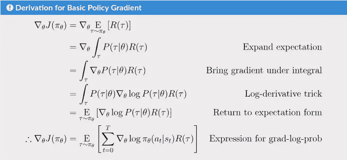

这是一个期望值，这意味着我们可以用一个样本均值来估计它。如果我们收集一组轨迹 *D = {τ}，*政策梯度可以用以下公式估算

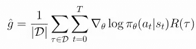

这是我们的最后一个魔术，

5.**重新参数化技巧:** 你可能在处理变分自动编码器时遇到过这个技巧。这是它在一般框架中的执行方式:

任何分布都可以表示为其他分布的变换。这方面的一个例子是*逆采样方法，*它说所有的均匀分布都可以转化为我们感兴趣的分布的逆 CDF(见 [wiki](https://en.wikipedia.org/wiki/Inverse_transform_sampling) )。一般来说，一个分布 *p(z)* 可以转换成另一个分布 *p(* ε *)* 如下:

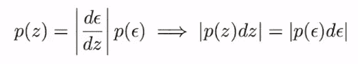

回到随机优化的第二种方法，我们有路径估计或重新参数化技巧。这次我们将操纵 *f(z)。*

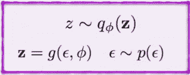

注意 *z* 是从 *q(z)采样的。*我们引入了 *p(* ε *)* 和上式定义的一个函数 *g* 。现在，代替我们问题中的 *z* (由下式给出)，我们有

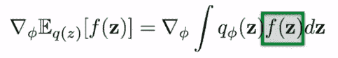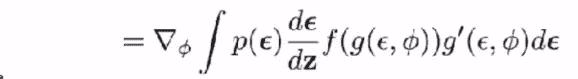

上述两种方法都有助于将期望梯度转换成某种梯度的期望，这种期望可以进一步用变分法或蒙特卡罗法来近似或有效地计算。

这都是为了操纵概率。希望下次遇到你的概率问题时，你会备上这些招数。

这是我的第一个博客。任何反馈都将受到高度赞赏。我真诚地建议仔细阅读参考资料，以便更好、更全面地理解。如果你能坚持到这里，非常感谢！

## 参考资料:

[1]Deep mind 的高级深度学习和强化学习。
[2]通过打开 AI 旋转 RL。