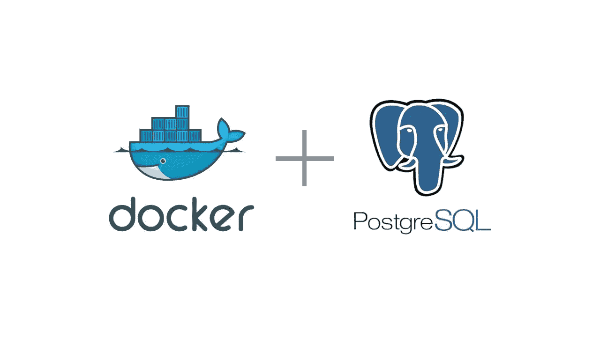

# 让你的生活变得更轻松的 Postgres 和 Docker 技巧

> 原文：<https://towardsdatascience.com/tricks-for-postgres-and-docker-that-will-make-your-life-easier-fc7bfcba5082?source=collection_archive---------15----------------------->

如今，每个人都试图在容器中运行一切，我不责怪他们，我也做同样的事情，因为在 Docker 容器中运行应用程序、数据库或其他工具是非常好的，我们都知道为什么(隔离、容易设置、安全……)。然而，有时调试、访问或通常与容器的交互会非常烦人。这包括访问、修改或查询数据库。因此，由于我广泛使用 PostgreSQL，并且已经在容器中运行了一段时间，随着时间的推移，我列出了一些命令，这些命令在对数据库服务器进行简单和不太简单的操作时会有很大帮助。

# 登录 PSQL

如果您想与数据库服务器交互，您需要做的最基本的事情就是连接到数据库本身(使用 *PSQL* ):

因此，对于名为`db`的 Docker 容器、默认用户`postgres`和数据库名`blog`，应该是

# 对数据库运行命令

您可以登录然后执行您需要的任何命令，这很好，但是一次完成通常更方便，尤其是如果您只想运行一个命令或查询:

因此，如果我们想使用与上例相同的参数列出数据库中的所有表:

这里，`\l`列出了当前数据库中的所有表格，如果您不熟悉 *psql* “反斜杠”命令，那么我强烈推荐这张[备忘单](https://gist.github.com/Kartones/dd3ff5ec5ea238d4c546)。

除了`psql`命令之外，您可以运行任何 SQL 查询，如下所示:

# 备份您的数据

有时，我需要备份数据或数据库的整个模式，有时只是作为一种*“保险政策”*，有时我可以不顾一切地进行更改，然后恢复一切，所以下面是如何做的:

在这个例子中，我们使用了`pg_dump`实用程序，它允许我们提取 PostgreSQL 数据库。我使用`--column-inserts`和`--data-only`标志只获取表行，但通常只需要模式，为此您可以使用`-s`标志。

# 执行整个 SQL 文件

有时，您需要用足够的数据填充现有数据库进行测试(请不要对生产数据库这样做)，或者使用文件中的数据，然后将它们复制并粘贴到上面的命令中会更容易。

这里我们首先需要将文件本身复制到运行容器中，然后使用`-f`标志执行它。

# 开始时预填充数据库

如果您需要不时地执行它，前面的例子已经足够好了，但是如果您每次启动数据库时都必须这样做，那就变得很烦人了。因此，如果您决定最好在一开始就填充数据库，那么这里有一个解决方案。它只需要多做一点工作:

我们需要以下文件:

*   `Dockerfile` - *Dockerfile* 为你的 Postgres 镜像
*   `create_db.sh` -创建数据库、模式并填充它的脚本。
*   `schema.sql` -包含数据库模式的 SQL 文件
*   `data.sql` -包含用于填充数据库的数据的 SQL 文件
*   `.env` -带环境变量的文件，让你的生活更轻松

第一，`Dockerfile`:

这非常简单 *Dockerfile* ，我们在这里需要做的就是将我们的脚本和模式/数据复制到映像中，以便它们可以在运行启动时使用。你可能会问，*没有* `*ENTRYPOINT*` *或者* `*COMMAND*` *，我们如何在启动时运行它？* -答案是，基本的`postgres`映像在`docker-entrypoint-initdb.d`目录中的任何脚本上运行，所以我们需要做的就是将我们的脚本复制到这个目录，PostgreSQL 会处理它。

但是剧本里有什么(`create_db.sh`)？

启动脚本首先使用指定的用户名(`POSTGRES_USER`)登录`psql`，然后创建您的数据库(`DB_NAME`)。接下来，它使用我们复制到映像中的文件创建数据库模式，最后用数据填充数据库。这里的所有变量都来自前面提到的`.env`文件，这使得随时更改数据库名称或用户名变得非常容易，而无需修改脚本本身。

更多完整的例子请见我的知识库[这里](https://github.com/MartinHeinz/blog-backend/tree/master/postgres)

# 那`docker-compose`呢？

根据我的经验，大部分时间我都是将数据库与使用它的应用程序一起运行，最简单的方法是 *docker-compose* 。通常我更喜欢通过服务名来引用 *docker-compose* 服务，而不是容器名，容器名可能是也可能不是同一个东西。如果不一样，您可以执行以下命令:

这里与前面的例子唯一不同的是`docker-compose`部分，它查找指定服务的信息。`-q`标志使得只显示容器 id，这正是我们所需要的。

# 结论

我希望这些小技巧中至少有一些能让您在处理 Docker 和 PostgreSQL 时更轻松，或者如果您只是因为在处理数据库时 Docker 可能有点烦人而避免使用它，那么我希望您在阅读完本文后会尝试一下。🙂

*注:此文最初发布于*[*martinheinz . dev*](https://martinheinz.dev/blog/3)