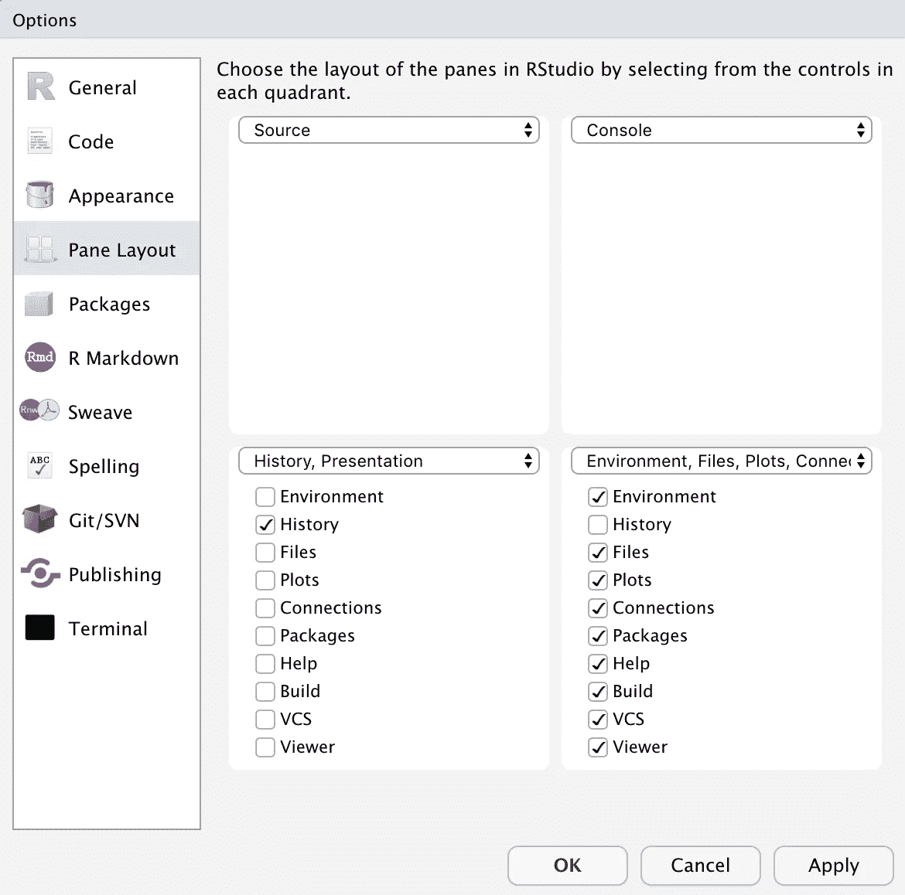

# 提高生产率的 R 技巧(第 1 部分)

> 原文：<https://towardsdatascience.com/tricks-in-r-to-boost-your-productivity-8c977242c69c?source=collection_archive---------7----------------------->


Photo by [Anete Lūsiņa](https://unsplash.com/@anete_lusina?utm_source=medium&utm_medium=referral) on [Unsplash](https://unsplash.com?utm_source=medium&utm_medium=referral)

我想和你们分享我在 R 和 RStudio 中用来提高工作效率的一些技巧。它们是公共资源(比如 StackOverflow)和我个人的最佳实践的结合。生命短暂，不要再用这些伎俩浪费时间了。我希望你能从中受益，并与我分享你的技巧。当我得到更多的时候，我会继续在帖子中添加新的技巧！

## 1.计算向量权重

在许多情况下，我们需要根据参考向量的权重将一个数分配给一个向量，其中每个条目的权重计算为其占所有条目之和的比例。例如，您的总销售预测为 1，000，跨 3 个渠道(比如 A、B、C)的历史销售分布为(300，100，100)。然后，对于 A、B、C，渠道级别的销售预测可以分别计算为(3/5 * 1000、1/5 * 1000、1/5 * 1000)。一种极端情况是，可能没有任何历史渠道销售观察。在这种情况下，甚至跨所有渠道分发可能是一种常见的选择。如果总和等于 0，那么所有条目的所有权重都应该相等，因为它们都应该等于 0。如果你经常需要调用这样的函数，你可以创建一个助手函数来实现，如下所示

一个示例调用是

```
> lw(c(1,2,3))[1] 0.1666667 0.3333333 0.5000000
```

## 2.对于大向量，将字符转换为日期

当我们通过 DBI 从 CSV 文件或数据库中读取数据时，日期列可能仍然是字符类型。人们通常使用一个命令，如 *base R* 中的`as.Date()`或 *lubridate* 包中的`ymd()`将目标列转换为日期类型。它非常适合小数据。但是，如果列中有超过 1000 万个条目，这种转换方法可能需要相当长的时间。有一种更快的方法来实现它，如下所示

查看代码，关键的技巧是首先对字符向量进行重复数据删除，将经过重复数据删除的字符向量转换为日期向量，然后将每个条目映射回原始向量中的位置。速度的提高是基于这样的假设，即大向量中的大多数日期都是重复的，这是很常见的。

## 3.检查数据框中的缺失值

每个 R 用户都应该非常熟悉`summary()`函数，以便对数据框中的所有列进行快速统计。然而，在很多情况下，我们只关心一些特定的统计数据。就我个人而言，我经常检查每一列中缺失值的数量。因此，创建了两个辅助函数:

*   `cc()`代表为我“检查清洁”。它会告诉您每一列中有多少个丢失的值。
*   `cd()`代表我的“清洁密度”。它只是告诉您每一列中缺失值的百分比。

我喜欢这些功能是因为在键盘上输入“c”和“d”比输入“summary”要快得多。

## 4.到处使用管道运算符

在我看来，R 中的管道运算符`%>%`是迄今为止最伟大的发明。它简化了我们编码时的思维流程，极大地简化了代码结构。我建议你尽可能多地使用它。显示其灵活性的几个例子如下:

*   `a %>% f(b)`相当于`f(a, b)`
*   `a %>% f(b) %>% f(c)`相当于`f(f(a, b), c)`
*   `a %>% {f(., b)}`相当于`f(a, b)`

另外，记住在 macOS 中插入管道符号的快捷方式是`CMD + SHIFT + M`。

## 5.与 H2O 合作

H2O 是我最喜欢的 R 包之一，并且正在成为 R 中的高性能机器学习框架

*   首先，我建议你总是使用命名空间约定调用 H2O 函数`h2o::`和**而不是**使用`library(h2o)`加载整个 H2O 库，因为加载整个库很可能会导致与其他常用包的函数冲突。与 H2O 的函数冲突有时会导致意想不到的后果，因为 H2O 软件包修改了其他流行软件包中许多函数的实现。
*   其次，启动 H2O 实例的命令涉及到相当多的参数设置，需要输入一些内容。我喜欢用我的个人设置而不是默认设置来启动 H2o 实例。因此，我编写了下面的助手函数，根据我的喜好来包装最初的 H2O 初始化和关闭。

## 6.在 RStudio 中优化窗格布局

大多数人使用 RStudio 中的默认窗格布局。经过几年的实践，我优化的窗格布局如下:



*   如今，由于大多数电脑屏幕都很宽，因此垂直空间非常宝贵。水平拆分源码和控制台，充分利用了屏幕空间。
*   我总是隐藏左下方的窗格以最大化源代码窗格，所以只有命令历史是左下方的窗格，这是不常使用的。
*   因为没有办法消除左下方的窗格，所以我将所有其他功能都移到了右下方的窗格中。

## 7.自动格式化您的代码

在 python 中，由于缩进的重要作用，很好地格式化代码总是令人痛苦的。在 r 中肯定不是这样，所以在 RStudio 中，你可以选择你所有的代码，在 macOS 中按下`CMD + I`的快捷键，进行自动缩进。不管你的代码有多丑，经过这个操作后，你会惊奇地发现它变得多么美丽。

更新:你现在可以在这里找到本主题[的第 2 部分。](https://medium.com/@weilin0929/tricks-in-r-to-boost-your-productivity-part-2-7222461c6671)