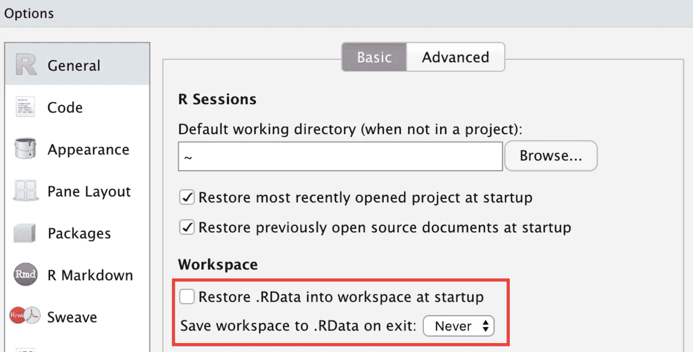
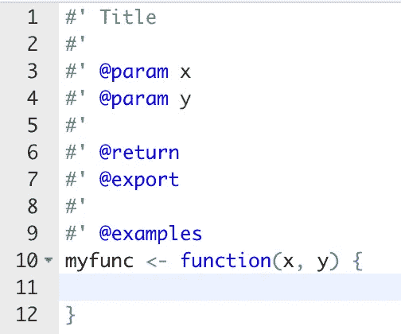
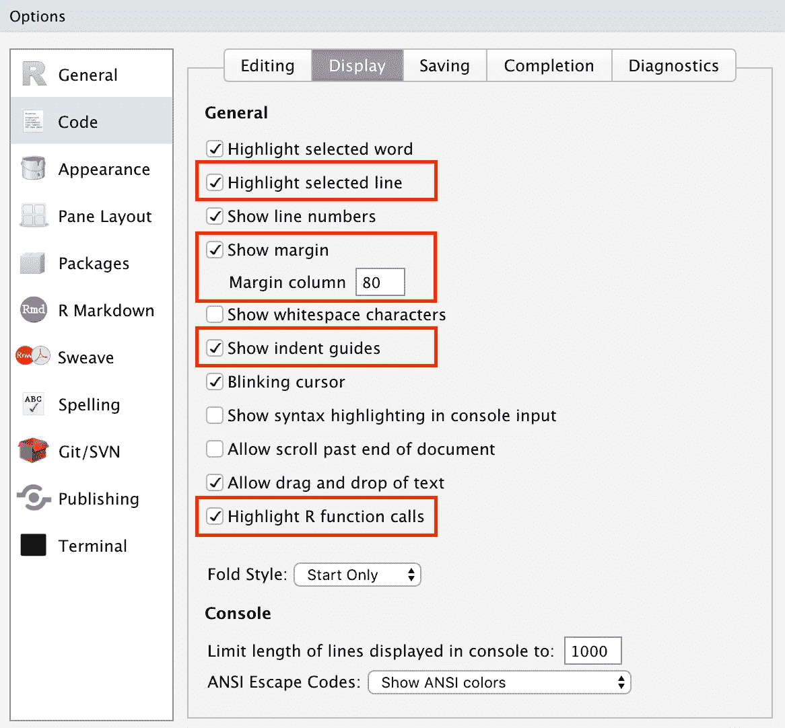
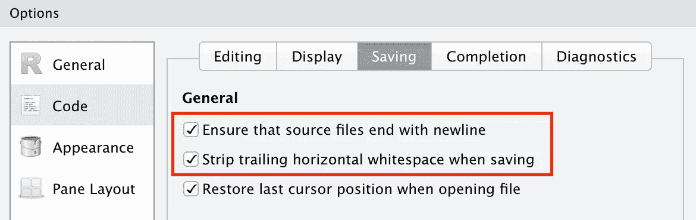
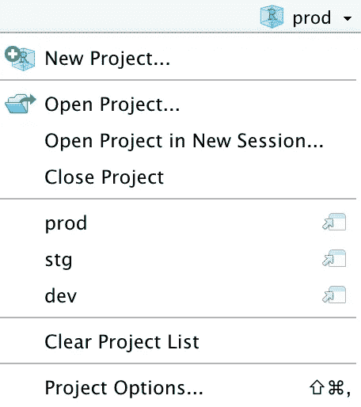

# 提高生产率的 R 技巧(第 2 部分)

> 原文：<https://towardsdatascience.com/tricks-in-r-to-boost-your-productivity-part-2-7222461c6671?source=collection_archive---------10----------------------->


Photo by [Brad Neathery](https://unsplash.com/@bradneathery?utm_source=medium&utm_medium=referral) on [Unsplash](https://unsplash.com?utm_source=medium&utm_medium=referral)

我总是热衷于能帮助我更快完成工作的工具和技巧。虽然提高生产率并不一定意味着它能给你带来好的或正确的结果，但它肯定能减少你的工作时间，这意味着犯错误的时间更少。花些时间学习技巧和工具会在你以后的工作中得到回报，这是完全值得的。继我上一篇关于 R 和 RStudio 技巧的[文章](/tricks-in-r-to-boost-your-productivity-8c977242c69c)之后，我将在这篇文章中继续与您分享一些我认为有用的其他技巧。

# **设置 R 配置文件**

当一个 R 会话启动时，它首先尝试在您的项目目录或您的主目录中搜索一个`.Rprofile`文件，如果它存在，就执行函数`.First`。你可以使用`.Rprofile`在每节课开始时执行一些事情来节省你的时间

*   加载经常工作的包(如 tidyverse、data.table、ggplot2 等。).
*   设置环境变量(例如开发环境标识符(“沙箱”、“暂存”、“生产”等)。)、AWS 凭证、您的数据库连接凭证等)。
*   设置 Java 参数(如果您需要通过 DBI/rJava 包从数据库中提取大量数据，您肯定需要设置这个参数)。
*   设置 ggplot2 主题和调色板(如果您需要使用特定品牌的调色板，这很有用)。

下面是我的`.Rprofile`的一个例子:

# 让您的数据库查询包装函数

如果您经常使用 R 来查询数据库，那么您应该考虑更好地组织您的文件结构，并编写包装器函数来使您的生活更加轻松。首先，你应该把所有的 R 文件放在一个文件夹里，把所有的 SQL 文件放在另一个文件夹里。有些人喜欢将 SQL 命令直接写入 R 函数或脚本中，我认为这不是最佳做法，它会使您的 R 代码变得难看，并且您的 SQL 代码不能被另一个 R 代码重用。组织好后，你可以编写下面的包装函数:

Wrapper Functions for database query

*   `connect_db`是一个包装函数，在您调用驱动程序并使用 url 和凭证建立数据库连接后，它会返回一个数据库连接处理程序。
*   `get_sql`是 SQL 文件解析器。
*   是您调用来执行查询的函数，在这里您可以发送一个 sql 文件路径或一个纯 SQL 字符串。您可以通过`DBI::sqlInterpolate`函数向函数传递额外的参数来替换 SQL 查询中的参数。最重要的是，我们需要在执行查询后关闭连接。

使用上面的包装器函数，所以您可以通过简单地调用下面的命令来执行 SQL 查询。

```
# String based query
accounts <- db_query('select count(*) from accounts where created_at < ?time', time = '2019-01-01')# File based query
accounts <- db_query('sql/accounts.sql', time = '2019-01-01')
```

您可以轻松地用更多的功能来扩展上述包装函数，比如删除、加载等。来满足你的需求。

# 退出时不要保存`Workspace`数据

如果您在终端中使用 R 命令行工具来完成所有工作，那么当您想要退出 R 会话时，系统会询问您是否保存您的工作区数据。如果选择保存工作区数据，一个隐藏的"。RData”文件将创建在您的工作目录中。如果您的工作空间仅包含少量数据，则可以保存数据。但是，如果您的工作空间包含大量数据(512MB 或更多)，保存过程可能需要很长时间才能执行，因为工作空间数据需要压缩到文件中，这对于大数据来说很慢。所以，我个人的建议是，千万不要保存工作区数据存储。如果您使用 RStudio，您可以设置如下选项。如果你真的想在某些场合保存数据，你可以在退出前简单地调用`save`命令。



# 包装开发

## **包重装**

如果您正在编写一个 R 包，并且想要重新加载整个开发包而不重新启动 R 会话并因此丢失数据，您可以使用`devtools`包中的函数`devtools::reload()`来实现。在 RStudio 中，重新加载的快捷方式是`CMD + SHIFT + L`。

## **包装文件**

在你的包的函数内部，你可以按`CMD + Option + Shift + R`调用`Roxygen2`为你的函数生成一个文档骨架，如下图所示。



Package Documentation Skeleton generated by Roxygen2

# RStudio 代码设置

我是 RStudio 的忠实用户，使用 RStudio 已经超过 4 年了。下面是我对 RStudio 的代码设置建议。目的是让编码体验更加愉悦高效。



Display Setting



Saving Setting

# 发展环境

我相信 99%的 R 用户使用 RStudio 作为他们主要的 R 编程 IDE。RStudio IDE 有两个主要产品。一个是 RStudio 桌面，一个是 RStudio 服务器。大多数 R 用户从桌面版本开始，主要用于特定的分析和模型开发。如果他们的需求扩展到模型部署、任务自动化、闪亮的网站、仪表板、报告等。，那么服务器版本就成了更好的选择。如果您使用服务器版本，为了更好的软件管理，您最好在您的服务器上创建您的开发、试运行和生产环境。对我来说，我只有一台 EC2 服务器，没有三台分别用于开发、试运行和生产环境的专用服务器。作为一种变通方法，您可以在 git 和 Github 控制的三个不同的文件夹版本中创建三个 R 项目，以模拟开发、登台和生产环境，如下所示:



Environment Management

*   **dev** :它是我建模和分析的沙盒。
*   **stg** :这是一个新特性的测试环境。
*   **prod** :它包含用于生成报告、仪表板和自动化任务的代码和 cron 作业。在生产环境中，您应该只通过 git pull 更改代码，而不要手动更改。

如果您使用 RStudio server 的免费版本，在项目之间切换将会重新启动 R 会话，因此会丢失数据。如果使用 RStudio Pro 版本，可以在浏览器中并排运行 3 R 会话，更加方便。