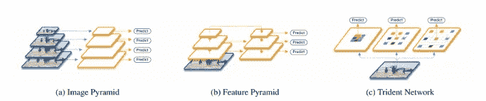
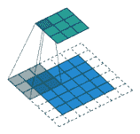
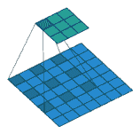
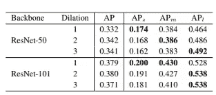
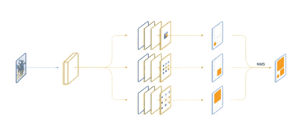
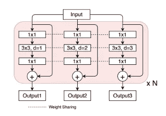
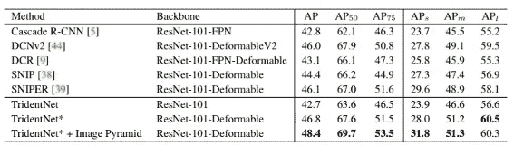

# 三叉戟网络评论

> 原文：<https://towardsdatascience.com/tridentnet-review-7f9936d2498a?source=collection_archive---------33----------------------->

TridentNet 是为解决目标检测中的尺度变化问题而提出的网络。

单级和两级检测器在处理标度变化时都有问题。存在解决尺度变化问题的方法，但是推理时间的增加使得这些方法不太适合实际应用。

Types of architectures to solve scale variance problems

解决大尺度变化的一种方法是利用多尺度图像金字塔。如图(a)所示，可以通过在多种规模下训练/测试网络来利用检测性能。

另一种方法是使用网络内特征金字塔来近似图像金字塔，具有更少的计算成本。这是通过从附近的比例级别内插一些特征通道来实现的。上图(b)是以 FPN 网络为例。

在本文中，作者提出了一种使用三叉块的网络结构，而不是像图像金字塔那样输入多尺度信息，如图所示。

standard convolution

dilated convolution

三叉戟块共享相同的参数，但它们有不同的感受野。借助于扩张的脑回，这是可能的。与标准卷积不同，扩张卷积利用扩张因子来获得更大的感受野。

# 感受野的研究

本文作者还研究了感受野对不同尺度物体探测的影响。他们通过将主干网络中的标准回旋转换为扩展回旋来测试这一点。在测试了各种扩张率后，他们发现随着感受野的增加(更大的扩张率)，检测器对小物体的性能在 ResNet-50 和 ResNet-101 上都持续下降。

Detection results with different dilation factors

如上表所示，随着膨胀率的增加，大对象的精度增加，而小对象的精度降低。

# 三叉戟网络

Illustration of the TridentNet

为了继承不同感受野大小的优点并避免它们在检测网络中的缺点，trident 架构使用了上图所示的 Trident 模块。每个 trident 块都放置在主干网络中。该块由多个分支组成，其中所有分支共享卷积权重。唯一的区别是每个分支使用不同的膨胀因子。

Inside the trident block

# 规模意识培训计划

本文还提出了一种新的训练方案来解决由尺度不匹配(例如，分支上的小对象膨胀过大)引起的退化问题。

与 SNIP 类似，为每个分支定义了一个有效的范围。在训练时，对于每个分支，仅考虑训练有效范围内的框。所有超出有效范围的框都将被过滤掉。

# 结果

Comparison of TridentNet with other state-of-the-art networks

一个应用在更快的 R-CNN 上的 TridentNet 达到了 42.7 AP。为了更好地与 SNIPER 和 SNIPER 进行比较，还使用了可变形的回旋来代替膨胀的回旋。结果表明，可变形卷积的使用也优于基于图像金字塔的 SNIP 和 SNIPER 网络。

# 参考

 [## 用于目标检测的尺度感知三叉戟网络

### 尺度变化是目标检测中的关键挑战之一。在这项工作中，我们首先提出了一个控制…

arxiv.org](https://arxiv.org/abs/1901.01892)  [## 综述:扩展网络—扩展卷积(语义分割)

### 又名“atrous 卷积”、“algorithme à trous”和“hole algorithm”

towardsdatascience.com](/review-dilated-convolution-semantic-segmentation-9d5a5bd768f5)  [## COCO 测试开发中用于对象检测的最先进的工作台

### 82 种方法的性能比较。

paperswithcode.com](https://paperswithcode.com/sota/object-detection-on-coco)