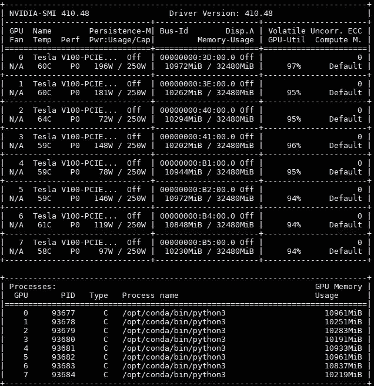

# 用 Pytorch-Lightning 进行琐碎的多节点训练

> 原文：<https://towardsdatascience.com/trivial-multi-node-training-with-pytorch-lightning-ff75dfb809bd?source=collection_archive---------3----------------------->


How you feel running on 200 GPUs

因此，您拥有这款出色的 HPC 集群，但仍然只在 1 个 GPU 上训练您的模型？

我知道。斗争是真实的。😭

Pytorch-lightning ，为人工智能研究人员设计的 Pytorch Keras，让这变得微不足道。在本指南中，我将介绍:

1.  在同一台机器的多个 GPU 上运行单个模型。
2.  在具有多个 GPU 的多台机器上运行单个模型。

*免责声明:本教程假设您的集群由 SLURM 管理。*

# 模型


AI model

我们先来定义一个 [PyTorch-Lightning](https://github.com/williamFalcon/pytorch-lightning) (PTL)模型。这将是来自 PTL 文档的[简单 MNIST 示例](https://williamfalcon.github.io/pytorch-lightning/LightningModule/RequiredTrainerInterface/#minimal-example)。

请注意，这个模型没有关于 GPU 的任何特定内容。cuda 或类似的东西。PTL 的工作流程是定义一个任意复杂的模型，PTL 将在你指定的任何 GPU 上运行它。

# 多 GPU，单机

让我们单独在 CPU 上训练我们的 CoolModel，看看是怎么做的。

要在单个 GPU 上训练，只需传入 GPU id

而对于多 GPU，只需添加更多的 id！

因此，在您的高级集群 GPU 机器上运行的完整脚本是:

# **GPU id**

让我们快速迂回到 NVIDIA GPU 旗帜之地。当你在训练器中设置 GPU[0，1]时，你是在说“在这台机器上使用 GPU 0 和 GPU 1。”该顺序对应于 NVIDIA-SMI 命令的输出



Courtesy of [servethehome.com](https://www.servethehome.com/inspur-systems-nf5468m5-review-4u-8x-gpu-server/nvidia-smi-gmnt-pytorch-8x-tesla-v100-training/)

在引擎盖下，PTL 做了以下事情来让你的模型在 GPU 上工作

1.  将 CUDA_VISIBLE_DEVICES 设置为这些 ID 和 CUDA_DEVICE_ORDER = "PCI_BUS_ID ",这保证了 ID 将对应于机器上的物理 GPU 布局(即:NVIDIA-SMI 的输出)。
2.  在您的模型上添加适当的 DistributedDataParallel 或 DataParallel 包装器。

**单节点圆滑线**

假设您提交了一个使用 2 个 GPU 的 SLURM 作业。您仍然应该将 GPU ids，1 传递给 Trainer，即使您可能实际上正在使用一个 8 GPU 节点 上的物理最后 2 个 GPU。这是因为 SLURM 会为您的工作筛选出正确的 GPU，从 0 开始索引。

现在，例如，如果您在一个交互式作业中，并且该节点有 8 个 GPU，那么您将需要相应地更改索引。

例如，通过使用不同的 GPU ids 启动脚本 4 次，或者运行如下所示的 4 个进程，您可以在单个 8 GPU 节点上运行相同的模型 4 次:

当然，您可能只是出于调试的目的才这样做，或者因为您只是直接 ssh 到一台机器上。

试管使在单个节点上运行网格搜索变得简单。这里有一个网格搜索的例子，当你不通过 SLURM 提交的时候。

# **多机训练**


Synced Training

要跨多个节点训练 PTL 模型，只需在训练器中设置节点数:

如果您创建适当的 SLURM 提交脚本并运行这个文件，您的模型将在 80 个 GPU 上训练。

请记住，您编码的原始模型仍然是相同的。底层模型不知道分布式复杂性。

这是使用 PTL 的最大优势之一，将工程任务交给框架，这样您就可以专注于研究。

一个 SLURM 脚本示例如下:

```
# SLURM SUBMIT SCRIPT #SBATCH --gres=gpu:8
#SBATCH --nodes=10
#SBATCH --ntasks-per-node=8
#SBATCH --mem=0
#SBATCH --time=02:00:00# activate conda env
conda activate my_env # run script from above
python my_test_script_above.py
```

还有其他可能特定于您的集群的标志，例如:

1.  划分
2.  限制

此外，PTL 目前只支持 NCCL 后端。这是 PyTorch 团队推荐的后端，也是拥有最快库的后端。如果一个新的，更快的出来，PTL 将尽快添加这一选项。

# 自动圆滑线脚本提交


SLURM… ugh

写 SLURM 脚本可以是一个皮塔饼。如果您想进行网格搜索，这一点尤为重要。

为此，您可以对 PTL 使用 SlurmCluster 对象，它将:

1.  为您自动提交脚本。
2.  将网格搜索分割成单独的脚本，然后全部提交。
3.  在下班前几分钟重新排队。
4.  PTL 还将保存并加载您的模型，使重新排队无缝(您不需要做任何事情来保存或加载模型，PTL 会自动完成)。

让我们修改上面的脚本来使用 SlurmCluster 示例。

首先，让我们使用 SlurmManager 配置 SLURM 作业

当**optimizer _ parallel _ cluster _ GPU**被调用时，SlurmManager 将为通过 HyperOptArgumentParser 传入的每组超参数提交一个脚本。

因此，更新后的完整脚本现在看起来像这样:

要在集群上运行网格搜索，只需:

1.  ssh 进入您的登录节点
2.  安装 lightning 后激活您的 conda env
3.  运行上面的 python 脚本

```
ssh some_nodeconda activate my_env_with_ptl# run the above script
python above_script.py
```

这可能不是您习惯的工作流，但是当您运行这个脚本时，它只会提交每个带有一组超参数的 slurm 作业。然后当脚本再次运行时，它会实际运行你传入**optimize _ parallel _ cluster _ GPU**的函数。

SLURM 会将所有 out、err 和 submit 脚本文件保存到您传递给 SlurmCluster 对象的目录中。

实际的训练日志将由实验对象来写。确保将实验版本设置为 cluster.hpc_exp_number，它在集群作业的总体方案中具有正确的实验版本。

不幸的是，由于底层的 SLURM 系统，在多个节点上的分布式训练需要更多的工作。PTL 将尽可能多的内容抽象出来，并给出了一种使用 SlurmCluster 对象来降低集群复杂度的可选方法。