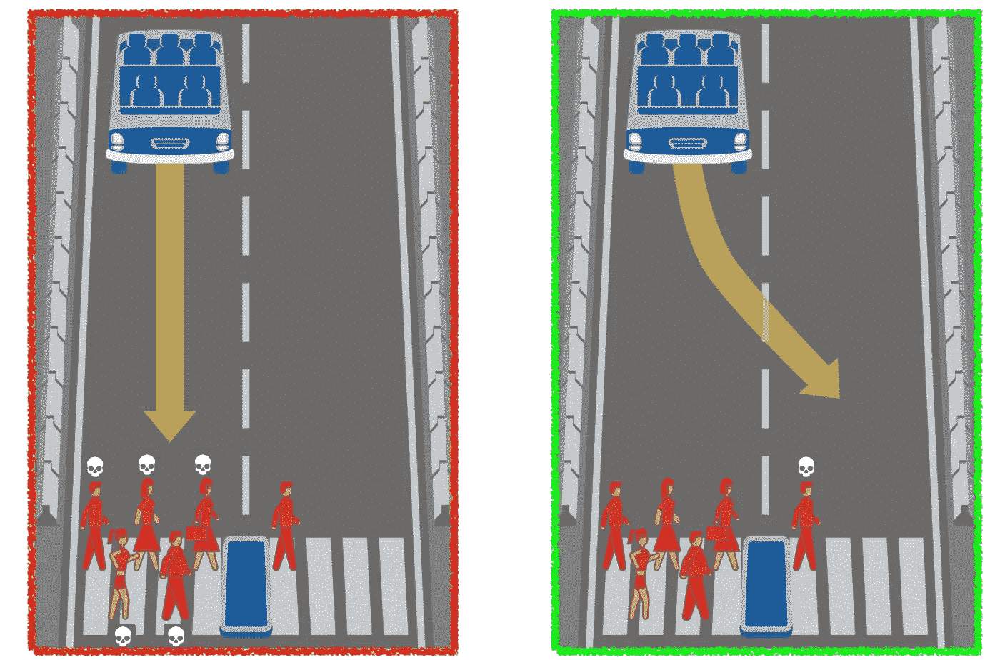
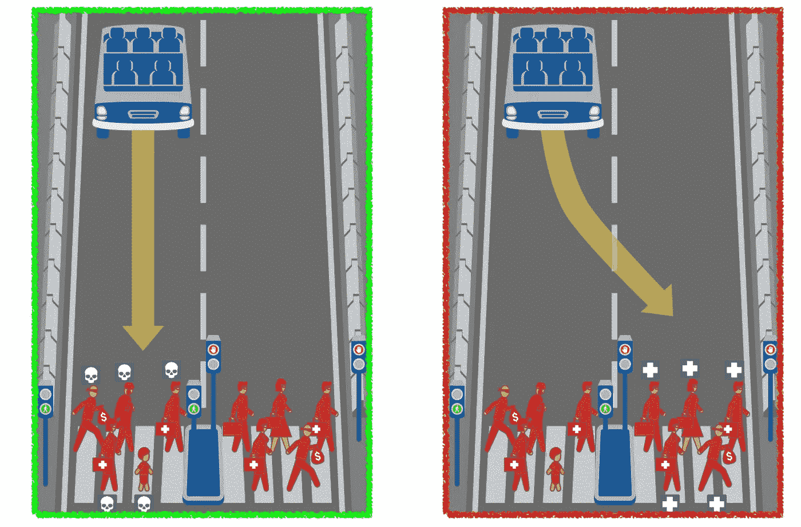
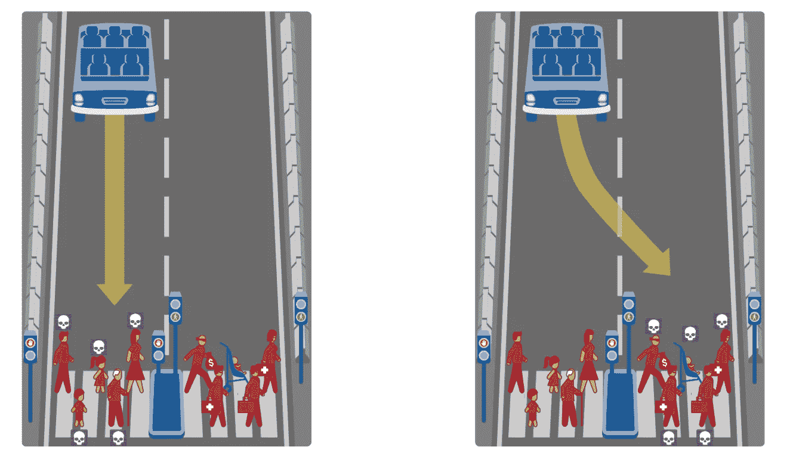
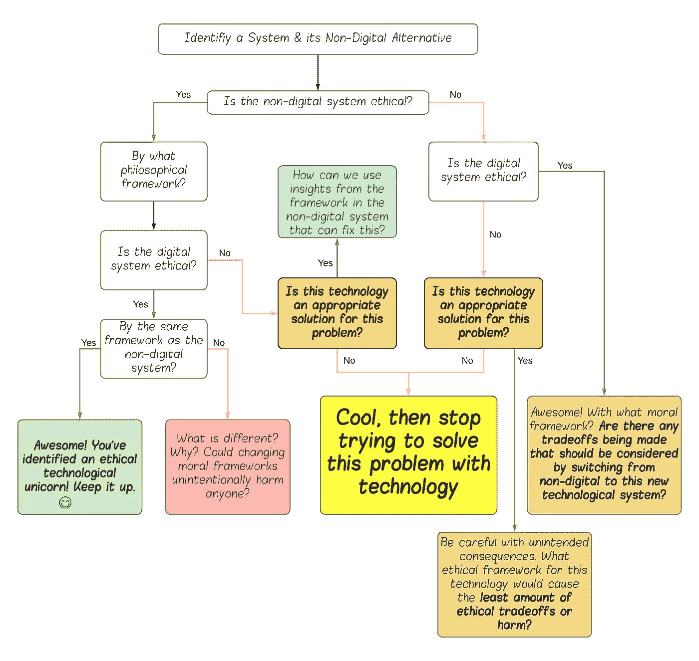
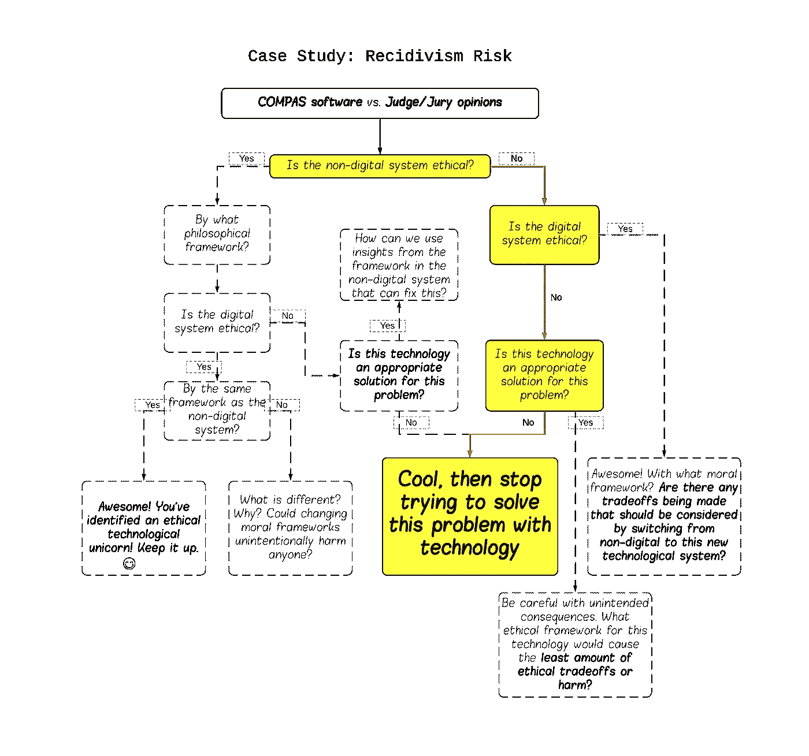
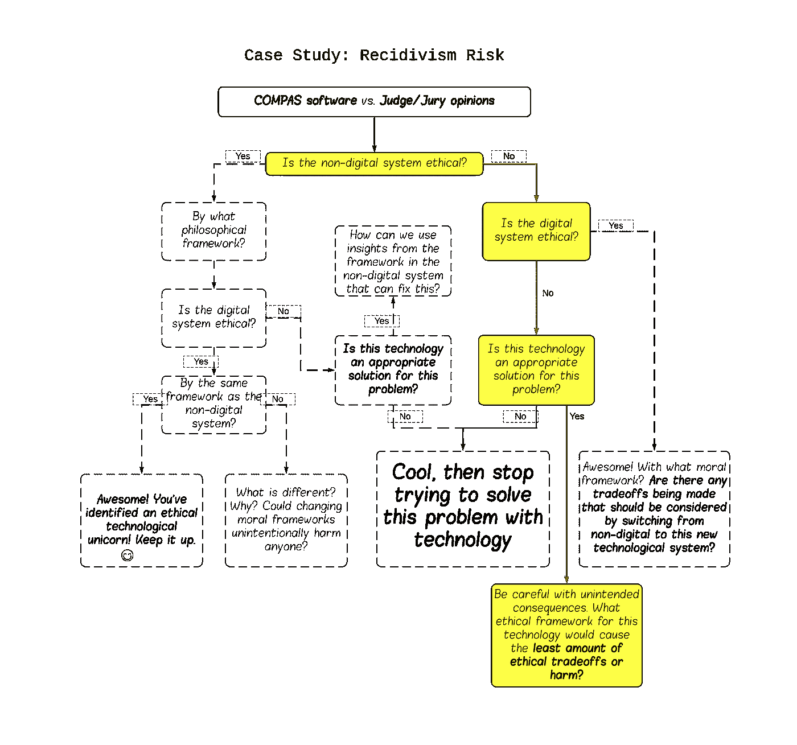

# 电车问题不再是理论上的了

> 原文：<https://towardsdatascience.com/trolley-problem-isnt-theoretical-2fa92be4b050?source=collection_archive---------4----------------------->


Photo by [Justin Bautista](https://unsplash.com/@justinb1221?utm_source=medium&utm_medium=referral) on [Unsplash](https://unsplash.com?utm_source=medium&utm_medium=referral)

你是一辆高速电车的售票员，这辆电车正以每小时 85 英里的速度在轨道上疾驰，直奔一群在轨道上玩耍的小男孩，他们幸福地意识到自己即将面临的厄运。你意识到你可以拉一个杠杆将电车切换到另一条轨道，拯救这些男孩的生命。但是在你拉下控制杆之前，你会看到一个年轻的女孩正在备用路线的铁轨上玩耍。拉这个杠杆就意味着结束她的生命。你有十秒钟的时间来决定，否则就太晚了…

***你是干什么的？***

手推车问题是菲利帕·福特在 1967 年首先提出的一个思维实验。1984 年，JJ·汤姆森博士在一篇学术论文[中再次提出了这个问题。它被引用了 1300 多次。](https://heinonline.org/HOL/LandingPage?handle=hein.journals/ylr94&div=57&id=&page=)

好消息是，关于伦理的讨论在大学的计算机科学课堂上越来越普遍。当涉及到数字系统和算法时，工程师们终于开始讨论关于价值观和公平的问题。然而，没有被高度讨论的是歧视性系统和偏见算法的后果——有意或无意——这些系统和算法已经生效，并且每天都被人类使用。

无轨电车的问题**已经被像[特斯拉](https://www.theverge.com/2019/10/23/20929529/tesla-full-self-driving-release-2019-beta)、[谷歌](https://waymo.com/)、[优步](https://www.theverge.com/2019/6/12/18662626/uber-volvo-self-driving-car-safety-autonomous-factory-level)、 [Lyft](https://self-driving.lyft.com/) 、 [Argo](https://www.argo.ai/) 、 [Embark](https://embarktrucks.com/) 和[通用汽车](https://www.gm.com/our-stories/self-driving-cars.html)这样的公司解决了。问题是这样的:**

> 如果一辆自动驾驶汽车发现自己不得不转向以拯救司机，但左转意味着撞上一名过马路的儿童，右转意味着撞上两名过马路的老年妇女——它应该转向哪个方向？

此前，谷歌选择了义务论的价值观:**无论什么东西都永远击中最小的物体**(垃圾桶和婴儿车中的婴儿没有区别)*。特斯拉选择不承担责任；人群来源的人类驾驶数据和模拟人类驾驶行为。这包括超速、急转弯和(有时)违法。

为什么 CS 教室都在理论上讨论算法和 AI？技术就在这里。**它不再是理论上的了**。是时候评估已经存在于不断增长的数字世界中的[算法了。他们做出的决定会对社会产生积极或消极的影响。](https://www.researchgate.net/publication/330479369_Crash_Mitigation_in_Motion_Planning_for_Autonomous_Vehicles)

但首先，我们必须讨论这些系统所基于的道德框架。

# **什么是伦理道德哲学？**

在我们能够从伦理上评估算法和机器学习模型之前，我们必须首先讨论编码到它们中的价值。尽管有许多伦理学和道德哲学的框架，我只打算回顾最常见的几个:

## **1。功利主义**

这个伦理理论是一个数字游戏。它关注的是一个行为的[后果](https://plato.stanford.edu/entries/consequentialism/)。根据功利主义，如果一个行为引起最大的好处/快乐和最小的痛苦/痛苦，那么这个行为就是道德的。

功利主义者可以接受摘取一个不知情的人的器官，如果这意味着拯救五个需要移植的人的生命。当谈到手推车问题时，功利主义者总是选择撞到路上最少的人——不管他们是谁。



scenario from [moralmachine.mit.edu](http://moralmachine.mit.edu/)

这种道德框架是数字系统最容易采用的，因为很容易将数字游戏转化为代码。没有任何粒度的余地。

## 2.**义务论**

义务论诞生于著名哲学家康德。这种理论较少关注后果，而更多关注行动本身。在义务论中，一个规则被选择成为普遍法则。

结果永远不能证明手段的正当性。

在电车问题的例子中，这意味着售票员必须选择一个他们永远不会打破的公平标准。这可能意味着他们选择总是拯救最多的生命，最年轻的生命，最年长的生命，等等..无论如何，都必须遵循他们的标准。

在下图中，自动驾驶汽车的道义规则可能是“*总是拯救最多的生命，这将有助于实现最大的整体利益。”*



scenario from [moralmachine.mit.edu](http://moralmachine.mit.edu/)

这类似于法律是如何产生的。一个规则涵盖了特定操作的所有情况。但是，就像政策的情况一样，义务论有一个重大缺陷:*生活中的所有事情都是有背景的*。有时候，遵循同样的规则会导致对一些人公平的决定和对另一些人不公平的决定。我们的义务论规则如何解释下面的情况？



scenario from [moralmachine.mit.edu](http://moralmachine.mit.edu/)

## 3.**美德伦理**

最后，美德伦理。这种道德哲学不太关注行为或结果，而是把所有的压力都放在做行为的人的道德品质上。换句话说，行动的动机是焦点。

如果电车售票员救了 5 个男孩的命，但只是为了让电车转向他的前女友(她最近和他分手了)，他的行为是不道德的。尽管他救了五条命，但他的动机并不单纯。

这给了人类更大的权力去打破规则，做一些对某些人来说可能有争议的事情，只要这些行为是出于良好的动机。这确实导致了一个大问题:

> **什么是良性动机？**

事实证明，这个问题的答案因人、文化和地理位置的不同而大相径庭。

# 我们所使用的系统的伦理是什么？

[giphy.com](https://giphy.com/gifs/city-ride-trolley-1388jPaZjhS4E0)

既然我们都理解了伦理和道德哲学的基础，我们就可以将这些概念应用到对当今社会产生重大影响的数字系统中。

海伦·尼森鲍姆创建的[隐私作为背景完整性](https://crypto.stanford.edu/portia/papers/RevnissenbaumDTP31.pdf)框架是一个可以帮助我们评估数字系统潜在伦理含义的工具。虽然这个框架最初是为了帮助评估数字隐私，但它可以很容易地应用于所有的数字创新。

利用尼森鲍姆框架中的一些技术，我提出了一个框架来识别和修改不道德的技术。为了让这个框架对每个人都平易近人，我将把它作为决策树来介绍。

## 让我们称之为伦理技术框架:



为了确保我们完全理解这个框架，让我们用一个用例来测试它:

> 评估被告重新犯罪的风险。
> 
> 又名:分配一个**累犯**风险分值。

**让我们回到 18 世纪、19 世纪和 19 世纪**:

在这种情况下，法庭上评估某人再犯风险的非数字替代方案通常只是法官的意见。可能会有证据表明过去的行为可能会影响被告重新犯罪的可能性，但某人的“风险评估”充其量只是一个有根据的猜测。

在过去，在统计学和技术被更广泛地应用于法庭之前，犯罪学家、法官或陪审团成员可以简单地将某人标记为“惯犯的高风险”，因为他们不喜欢他们的行为。或者更糟，因为**他们不喜欢自己的种族**。

**现在快进到 1990 年**，一种新的数字替代品进入了场景: [**COMPAS**](https://en.wikipedia.org/wiki/COMPAS_(software)) **，**一种预测被告再犯风险分数的软件。它在美国的一些州被广泛使用。

> “像这样的分数——被称为风险评估——在全国各地的法庭上越来越常见。它们被用来在刑事司法系统的每个阶段决定谁可以被释放，从指定保证金金额，到关于被告自由的更基本的决定。" ~ [机器偏差](https://www.propublica.org/article/machine-bias-risk-assessments-in-criminal-sentencing)，ProPublica

不幸的是，对 COMPAS(以及那些遭受其软件后果的人)来说，他们的算法给黑人被告的风险分数比给白人被告的高得多。他们的算法是 ***义务论*** ，但是他们评估风险的规则对任何非白人都是不公平的。这个软件是不道德的。[[1](https://www.propublica.org/article/how-we-analyzed-the-compas-recidivism-algorithm)][[2](http://law.emory.edu/elj/content/volume-67/issue-1/articles/constructing-recidivism-risk.html)][[3](https://www.propublica.org/article/machine-bias-risk-assessments-in-criminal-sentencing)]

现在，让我们想象一次重来。让我们假设现在是 1989 年，我们是 COMPAS 算法的开发者。为了不重复过去，我们决定在开始选择要在我们的训练数据集中使用哪些特征之前，我们将专注于我们算法的伦理。

我们使用方便的伦理技术框架。

玩家:

**系统:** COMPAS 软件

**非数字替代:**法官/陪审团意见

如果在 2013 年由我来决定，我们的 COMPAS 软件会达到以下标准:



或者，对于乐观的人来说，至少我们的 COMPAS 软件会映射到这里:



我的观点是:在过去，我怀疑 COMPAS 算法的设计者们有过关于道义论的对话。我怀疑如果他们选择了功利主义或基于价值观的方法，他们会研究他们的算法会做什么。老实说，这个软件的开发者似乎根本没有就道德问题进行过对话*。或者如果他们有，那一定是在他们的系统被广泛使用之后很久。*

*COMPAS 并不孤单。通过利用类似伦理技术框架的东西，今天还有哪些系统可以造成更少的社会危害？*

# ***透明度&可解释性——成功的关键***

*现在我们终于理解了我们的系统*所维护的道德和价值观。应该采取两个重要步骤:**

```
*1\. Make sure the *intended* values of the system match its reported values (ask users if they think the system is fair or not).2\. Explain these values to all stakeholders involved. This includes the users that are negatively/positively impacted by the system, the engineers who built the system, and anyone else who may interact with it.*
```

*在 COMPAS 算法的案例中，被告有权知道他们的哪些信息导致了高或低的风险分数。他们没有得到这个信息。更糟糕的是，法官也没有得到这些信息。*

*每个人都盲目地相信一种算法，这种算法就像输入其中的数百年的犯罪数据一样种族主义。*

*透明度可能有助于解决这个问题。*

# ***还剩下什么？***

*如果你参与任何一种技术的创造，或者如果你与任何一种技术互动，*你应该积极关注这些问题*。理想情况下，你应该在你的工作场所或学校里谈论算法伦理。如果你的课程感觉非常理论化，问问你的老师你是否可以开始使用当前的案例研究来推动对话。*

*我知道这些问题不容易解决，但是改变必须从某个地方开始。很可能需要一种非常跨学科的方法来评估算法和机器学习模型的价值。*

*还有一个主要的障碍:*

*公司不愿意评估他们自己算法的道德性。*

*就在我写这篇文章的时候，我意识到大型科技公司的法律部门可能会嘲笑我的话。过去几年臭名昭著的算法丑闻[[1](https://www.propublica.org/article/machine-bias-risk-assessments-in-criminal-sentencing)][[2](https://www.theverge.com/2018/1/12/16882408/google-racist-gorillas-photo-recognition-algorithm-ai)][[3](https://www.reuters.com/article/us-amazon-com-jobs-automation-insight/amazon-scraps-secret-ai-recruiting-tool-that-showed-bias-against-women-idUSKCN1MK08G)][[4](https://www.thelily.com/google-an-image-of-a-manager-or-ceo-and-youre-almost-certain-to-see-a-man/)][[5](https://rss.onlinelibrary.wiley.com/doi/full/10.1111/j.1740-9713.2016.00960.x)]已经证明，只有当道德成为法律问题时，科技行业才会关注道德。*

*这就是为什么我提出了另一种道德评估的方法:将道德作为商业指标。如果用户意识到他们正在使用的系统所宣扬的价值，他们就会更好地理解这个系统。当用户没有被他们没有意识到的价值观蒙蔽时，[他们会更加信任一个系统。](http://mingyin.org/CHI-19/accuracy.pdf)*

*[**信任直接关系到用户留存。**](https://www.sciencedirect.com/science/article/abs/pii/S014829630300122X)*

*公司害怕评估或审计他们的算法，害怕发现有问题。如果他们发现他们是不道德的，他们必须花费金钱和时间来解决这个问题。这就是为什么大多数公司的法律团队建议工程师尽可能避免算法审计，除非有诉讼或法律政策要求合规。*

*如果我们可以利用公平和道德作为商业标准，也许公司会更愿意检查自己。也许法律团队会放松。*

*这不是一个保证，但这是一个很好的开始。*

# ***遗言***

**

*Photo by [Amogh Manjunath](https://unsplash.com/@therealamogh?utm_source=medium&utm_medium=referral) on [Unsplash](https://unsplash.com?utm_source=medium&utm_medium=referral)*

*我们已经就伦理和道德哲学争论了几千年。哲学是一个理论领域，因为没有让所有人都满意的“好”和“坏”的通用标准。当持相反信仰的人辩论道德和美德时，留给他们的问题往往多于答案。*

*随着技术的出现，现在有机会*创造*具有内置价值的系统和工件。*

*如果我们不明确定义我们为一个系统选择的道德框架或价值观，我们就有可能面临意想不到的后果，这对许多人来说可能是“不公平的”。*

*通过创建更容易理解的关于系统创建所选择的价值的指南，工程师将更容易理解他们工作的社会意义。这将更容易向用户解释这些系统影响的信息。*

*可解释性建立透明度。透明建立信任。*

*我的目标不是惩罚科技公司。相反，我的目标是*通过利用课堂上开始的精彩的道德对话，激励* 他们*希望*合乎道德，并*希望*对自己负责。让我们把这些讨论应用到已经存在的问题上。*

*一起，我们可以用更大的*意图*帮助编码。*

*有意的系统降低了无意的社会伤害的风险。*

*在电车问题中，[我们不会就该救谁或杀谁达成一致。我们有不同的价值观和不同的观点。当谈到自动驾驶汽车时，谁同意或不同意并不重要，拯救谁的选择已经为我们做出。](http://moralmachine.mit.edu/)*

*是时候理解这些选择的后果了。是时候让算法设计透明化了。这不再是理论了。这就是现实。当我们提高声音时，我们有一个选择。*

*[giphy.com](https://media.giphy.com/media/105dxKnLsKBiy4/giphy.gif)*

***脚注:*** *我关于谷歌自动驾驶汽车的信息是基于一篇过时的文章。如果有人为谷歌或 Waymo 工作，并希望分享您的自动驾驶汽车在不可避免的碰撞情况下的当前目标函数，我们将非常感谢您的帮助和透明度！**