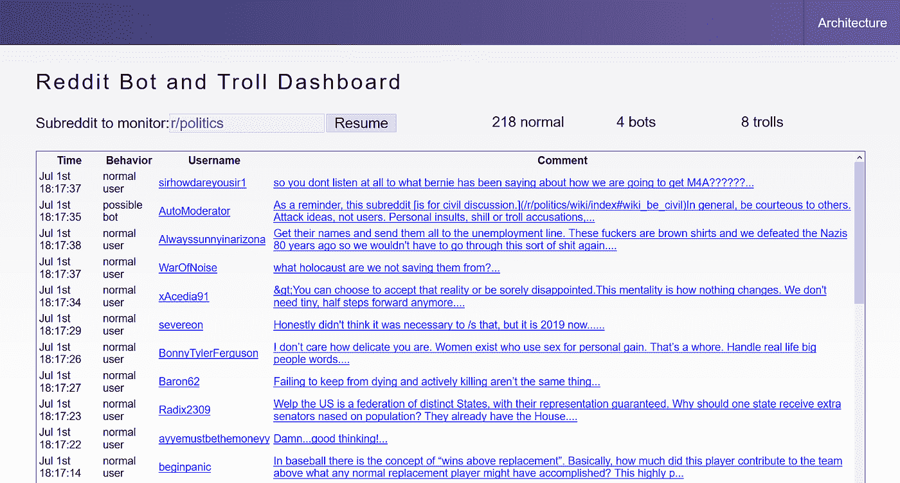
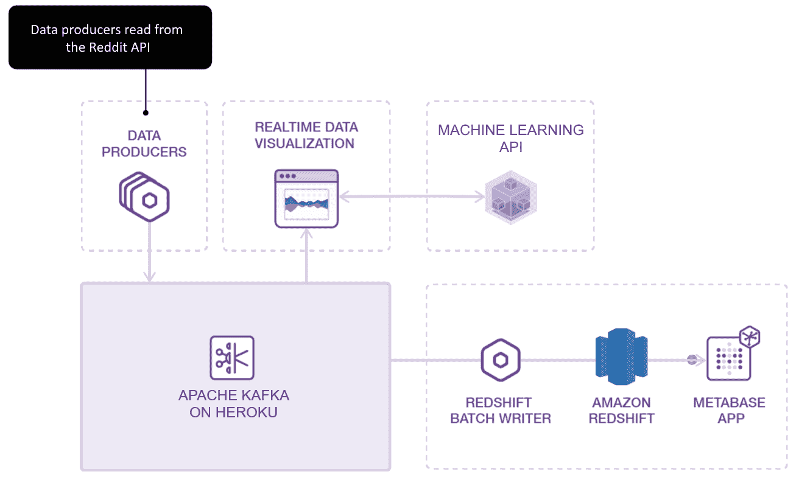

# 巨魔和机器人正在扰乱社交媒体——下面是人工智能如何阻止它们(第 1 部分)

> 原文：<https://towardsdatascience.com/trolls-and-bots-are-disrupting-social-media-heres-how-ai-can-stop-them-d9b969336a06?source=collection_archive---------13----------------------->

巨魔和机器人对社交媒体有着巨大的、通常不为人知的影响。出于商业或政治原因，它们被用来影响对话。他们允许小规模的隐藏团体来推广支持他们的议程和大规模的信息。他们可以将自己的内容推到人们的新闻源、搜索结果和购物车的顶端。有人说他们甚至可以影响总统选举。

为了保持社交网站上讨论的质量，有必要对社区内容进行筛选和调节。我们可以使用机器学习来识别可疑的帖子和评论吗？答案是肯定的，我们会告诉你怎么做。


Source: [pixabay.com](https://pixabay.com/photos/hacker-silhouette-hack-anonymous-3342696/)

# 巨魔和机器人是社交媒体的巨大痛苦

巨魔在网上是危险的，因为当你受到他们的影响或与他们接触时并不总是显而易见的。俄罗斯特工发布的帖子在脸书被多达[1 . 26 亿美国人看到，导致了最近的选举。Twitter 发布了来自俄罗斯巨魔的超过 900 万条推文](https://www.washingtonpost.com/news/the-switch/wp/2017/11/01/how-russian-trolls-got-into-your-facebook-feed/?noredirect=on&utm_term=.82754f76267b)的海量数据转储[。而且不仅仅是俄罗斯！也有报道称，在与华为发生冲突后，巨魔试图](https://www.vox.com/2018/10/19/17990946/twitter-russian-trolls-bots-election-tampering)[影响加拿大](https://www.buzzfeednews.com/article/craigsilverman/reddit-coordinated-chinese-propaganda-trolls)。这个问题甚至延伸到网上购物，亚马逊上的评论已经慢慢地被商家严重操纵。

机器人是伪装成人的计算机程序。他们可以通过集体参与或喜欢他们的内容，或者通过自动发布他们自己的内容来放大巨魔的影响。未来它们会变得更加复杂，更难被发现。机器人现在可以创建完整的文本段落来回应文本帖子或评论。 [OpenAI 的 GPT-2](https://openai.com/blog/better-language-models/) 模型可以写出感觉和外观都非常接近人类素质的文字。出于安全考虑，OpenAI 决定不发布它，但垃圾邮件发送者跟上只是时间问题。作为免责声明，并不是所有的机器人都是有害的。事实上，Reddit 上的大多数机器人都试图通过调节内容、查找重复链接、提供文章摘要等方式来帮助社区。区分有益的和有害的机器人是很重要的。

我们如何保护自己免受恶意巨魔和机器人发布的宣传和垃圾邮件的攻击？我们可以仔细调查每张海报的背景，但我们没有时间对我们读到的每条评论都这样做。答案是使用大数据和机器学习来自动化检测。让我们以毒攻毒吧！

# 在 Reddit 上识别机器人和巨魔

我们将把重点放在 Reddit 上，因为用户经常抱怨政治话题中的“巨魔”。由于匿名发帖，巨魔更容易操作。操作人员可以创建数十个或数百个账户来模拟用户参与、喜欢和评论。来自斯坦福的研究表明，仅仅 1%的 T4 账户就造成了 74%的冲突。在过去的几个月里，我们在世界新闻子网站上看到了许多类似这样的评论:

*“还有人注意到这个帖子里的虚假用户吗？我认识他们的语言。它有非常具体的特征，比如看起来有真正的好奇心，但背后却有荒谬的陈述。要求“明确的证据”和质疑陈述的真实性(这通常是好事，但不是伪装)。我想知道你是否可以通过机器学习来识别这些类型的用户/评论。”—*[***koalefant in r/world news***](https://www.reddit.com/r/worldnews/comments/aciovt/_/ed8alk0/?context=1)


我们可以利用几个现有的资源。例如，[机器人观察](https://www.reddit.com/r/botwatch/) subreddit 在 reddit 上跟踪机器人，名副其实！ [Reddit 的 2017 年透明度报告](https://www.reddit.com/r/announcements/comments/8bb85p/reddits_2017_transparency_report_and_suspect/)还列出了 944 个涉嫌为俄罗斯互联网研究机构工作的巨魔账户。

还有，有分析 Reddit 用户的软件工具。例如，设计非常好的 [reddit 用户分析器](https://atomiks.github.io/reddit-user-analyser/)可以进行情感分析，绘制用户评论的争议性，等等。让我们更进一步，建立一个工具，把权力放在版主和用户手中。

本文是由两部分组成的系列文章的第一部分，我们将介绍如何从 Reddit 的 API 中捕获数据进行分析，以及如何构建实际的仪表板。在第二部分中，我们将更深入地探讨如何构建机器学习模型。

# 创建可疑机器人和巨魔的仪表板

在本教程中，你将学习如何在机器学习的帮助下，创建一个仪表板来实时识别 Reddit 评论上的僵尸和巨魔。这可能是一个有用的工具，有助于政治子网站的版主识别和删除来自机器人和巨魔的内容。当用户向 r/politics 子编辑提交评论时，我们将捕捉这些评论，并通过我们的机器学习模型运行它们，然后在仪表板上报告可疑的评论，供版主审查。



这是我们仪表板上的一个截屏。在[reddit-dashboard.herokuapp.com](https://reddit-dashboard.herokuapp.com/)亲自尝试一下。

为了满足您的期望，我们的系统被设计为概念验证。它不是一个生产系统，也不是 100%准确。我们将用它来说明构建一个系统所涉及的步骤，希望平台提供商将来能够提供像这样的官方工具。

# 系统结构

由于社交媒体网站上的大量帖子和评论，有必要使用可扩展的基础设施来处理它们。我们将使用 Heroku 团队在使用 Apache Kafka 管理实时事件流[中编写的示例来设计我们的系统架构。这是一个事件驱动的架构，它将让我们从 Reddit API 生成数据，并将其发送给 Kafka。](https://blog.heroku.com/event-streams-kafka-redshift-metabase) [Kafka](https://kafka.apache.org/) 使处理流数据和分离我们系统的不同部分变得容易。从 Kafka 读取这些数据，我们的仪表板可以调用机器学习 API 并显示结果。我们还将数据存储在 Redshift 中，用于历史分析和用作训练数据。



# 从 Reddit 收集数据

我们的第一步是从 politics 子编辑中下载评论进行分析。Reddit 使得以 JSON 格式的结构化数据访问评论变得很容易。要获得任何子编辑的最近提交，只需请求以下 URL:

```
https://www.reddit.com/r/${subreddit}/comments.json
```

同样，我们可以访问每个用户的公共数据，包括他们的因果报应和评论历史。我们需要做的就是从包含用户名的 URL 请求这些数据，如下所示。

```
https://www.reddit.com/user/${username}/about.json
https://www.reddit.com/user/${username}/comments.json
```

为了收集数据，我们遍历了 r/politics 子编辑中的每个评论，然后加载了每个评论者的用户数据。您可以使用任何您喜欢的 HTTP 请求库，但是我们在我们的示例中将使用 [axios](https://github.com/axios/axios) for Node.js。此外，我们将把来自两个调用的数据合并到一个方便的数据结构中，该数据结构包括用户信息和他们的评论。这将使以后存储和检索每个示例变得更加容易。这个功能可以在 [profile-scraper.js](https://github.com/devspotlight/Reddit-Kafka-Producer/blob/master/profile-scraper.js) 文件中看到，你可以在[自述文件](https://github.com/devspotlight/Reddit-Kafka-Producer)中了解更多关于如何运行它的信息。

# 卡夫卡中的实时事件流

既然已经从 Reddit 收集了数据，我们就可以将评论输入 Kafka 了。在连接到 Kafka 服务器之前，您需要[在 Heroku 仪表板中创建一个主题](https://devcenter.heroku.com/articles/kafka-on-heroku#understanding-topics)。单击添加主题，并用单个分区设置主题名称。

要在 Node.js 中作为[生产者](https://kafka.apache.org/documentation/#producerapi)连接到 Kafka 服务器，您可以使用 [no-kafka](https://www.npmjs.com/package/no-kafka) 库，其中的连接信息已经在 Heroku 创建的集群中设置:

```
const Kafka = require(‘no-kafka’)const url = process.env.KAFKA_URL
const cert = process.env.KAFKA_CLIENT_CERT
const key = process.env.KAFKA_CLIENT_CERT_KEYfs.writeFileSync(‘./client.crt’, cert)
fs.writeFileSync(‘./client.key’, key)const producer = new Kafka.Producer({
 clientId: ‘reddit-comment-producer’,
 connectionString: url.replace(/\+ssl/g, ‘’),
 ssl: {
   certFile: ‘./client.crt’,
   keyFile: ‘./client.key’
 }
})
```

连接到 Kafka 后，您可以向之前创建的主题发送消息。为了方便起见，我们决定[将 JSON 消息](https://www.w3schools.com/js/js_json_stringify.asp)字符串化，然后在我们的直播应用程序中发送给 Kafka:

```
producer.send({
  topic: ‘northcanadian-72923.reddit-comments’,
  partition: 0,
  message: {
    value: JSON.stringify(message)
  }
})
```

在我们的 repo 中，样本实时流工作代码位于 [kafka-stream.js](https://github.com/devspotlight/Reddit-Kafka-Producer/blob/master/kafka-stream.js) 文件中。

# 构建主持人仪表板

我们的示例仪表板是一个 JavaScript 应用程序，它基于 Heroku 的先前版本的 twitter 显示 Kafka 演示应用程序。我们通过删除一些依赖项和模块来简化应用程序，但总体架构仍然存在:一个快速应用程序(服务器端)来消费和处理 Kafka 主题，通过 web socket 与一个 [D3](https://d3js.org/) 前端(客户端)连接，以实时显示消息(Reddit 评论)及其分类。你可以在[https://github.com/devspotlight/Reddit-Kafka-Consumers](https://github.com/devspotlight/Reddit-Kafka-Consumers)找到我们的开源代码。

在服务器端节点应用程序中，我们作为一个简单的[消费者](https://kafka.apache.org/documentation/#consumerapi)连接到 Kafka，订阅主题，并将每组消息广播到我们加载预测的函数:

```
new Consumer({
 broadcast: (msgs) => {
   predictBotOrTrolls(msgs)
 },
 interval: constants.INTERVAL,
 topic: constants.KAFKA_TOPIC,
 consumer: {
   connectionString: process.env.KAFKA_URL,
   ssl: {
     cert: ‘./client.crt’,
     key: ‘./client.key’
   }
 }
})
```

然后，我们使用 **unirest** (HTTP/REST 请求库)将来自这些消息的统一数据方案发送到我们的机器学习 API，以实时预测作者是人还是机器人或巨魔(在本文的下一节中有更多相关内容)。

最后，在我们的 app.js 中使用了一个 WebSocket 服务器[，这样前端就可以实时获取所有的显示数据。由于 subreddit 注释流是实时的，所以应该考虑和监控每个应用程序的伸缩和负载平衡。](https://github.com/devspotlight/Reddit-Kafka-Consumers/blob/master/viz/app.js#L43)

我们使用流行的 D3 JavaScript 库在 Kafka 消息流入时动态更新仪表板。从视觉上看，有一个特殊的表绑定到数据流，当最新的评论出现时，该表会更新(最新的优先)，以及检测到的每个用户类型的计数:

```
import * as d3 from ‘d3’class DataTable {

 constructor(selector, maxSize) {
   this.tbody = d3.select(selector)
   this._maxSize = maxSize
   this._rowData = []
 } update(data) {
   data.forEach((msg) => {
   this._rowData.push(msg)
 } if (this._rowData.length >= this._maxSize)
   this._rowData.splice(0, this._rowData.length — this._maxSize) // Bind data rows to target table
 let rows = this.tbody.selectAll(‘tr’).data(this._rowData, (d) => d)
…
```

详见[数据表. js](https://github.com/devspotlight/analytics-with-kafka-redshift-metabase/blob/master/viz/src/lib/data-table.js) 。上面显示的代码只是摘录。

# 调用我们的 ML API

我们的机器学习 API 旨在检查关于评论发帖人账户和最近评论历史的特征。我们训练我们的模型来检查他们的 Reddit“karma”、发布的评论数量、他们是否验证了他们的帐户等特征。我们还为它提供了一系列功能，我们假设这些功能将有助于对用户进行分类。我们将集合作为 JSON 对象传递给模型。然后，该模型为该用户返回一个预测，我们可以在我们的仪表板中显示该预测。你可以在本系列的第二部分中读到更多关于我们如何构建 [ML 模型的信息。](/identifying-trolls-and-bots-on-reddit-with-machine-learning-709da5970af1)

下面是作为请求发送给 HTTP API 的示例 JSON 数据对象(使用我们的统一数据模式)。

一个**机器人**用户的例子:

```
{
“banned_by”:null,
“no_follow”:true,
“link_id”:”t3_aqtwe1",
“gilded”:false,
“author”:”AutoModerator”,
“author_verified”:false,
“author_comment_karma”:445850.0,
“author_link_karma”:1778.0,
“num_comments”:1.0,
“created_utc”:1550213389.0,
“score”:1.0,
“over_18”:false,
“body”:”Hey, thanks for posting at \\/r\\/SwitchHaxing! Unfortunately your comment has been removed due to rule 6; please post questions in the stickied Q&amp;A thread.If you believe this is an error, please contact us via modmail and well sort it out.*I am a bot”,
“downs”:0.0,
“is_submitter”:false,
“num_reports”:null,
“controversiality”:0.0,
“quarantine”:”false”,
“ups”:1.0,
“is_bot”:true,
“is_troll”:false,
“recent_comments”:”[…array of 20 recent comments…]”
}
```

返回的响应是:

```
{
 “prediction”: “Is a bot user”
}
```

# 使用 Heroku 按钮轻松运行它

正如你所看到的，我们的架构有许多部分——包括生产者、Kafka 和一个可视化应用——这可能会让你认为它很难运行或管理。然而，我们有一个 [Heroku 按钮](https://github.com/devspotlight/Reddit-Kafka-Consumers)，允许我们只需点击一下就可以运行整个堆栈。很整洁，是吧？这为使用更复杂的架构打开了大门，而无需额外的麻烦。

如果你有技术上的倾向，试试看。你可以让 Kafka 集群运行得非常快，而且你只需为它运行的时间付费。查看我们代码的 [README](https://github.com/devspotlight/Reddit-Kafka-Consumers) 文档中本地开发和生产部署流程的文档。

# 后续步骤

我们希望鼓励社区使用这些类型的技术来控制巨魔和有害机器人的传播。这是一个激动人心的时刻，当这些社区开发出更好的机器学习和调节工具来阻止他们时，活着并看着巨魔试图影响社交媒体。希望我们能够让我们的社区论坛成为有意义讨论的地方。

查看我们的第二部分文章“[使用机器学习在 Reddit 上检测机器人和巨魔](/identifying-trolls-and-bots-on-reddit-with-machine-learning-709da5970af1)”，这将深入探讨我们如何建立机器学习模型及其准确性。