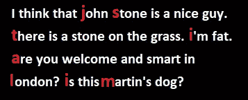

# 自然语言处理中的 Truecasing

> 原文：<https://towardsdatascience.com/truecasing-in-natural-language-processing-12c4df086c21?source=collection_archive---------6----------------------->

## 全面回顾使用 NLTK、spaCy、StandfordNLP 纠正单词大写的 NLP 方法


自然语言处理(NLP)是分析以自然语言之一表示记录的文本数据的学科。Ethnologue.com(第 21 版)有数据表明，在目前列出的 7，111 种现存语言中，有 3，995 种有发达的书写系统(如英语、法语、 [Yemba](http://yemba.net) 、汉语、……)。自然语言处理的应用包括文本分类、拼写 T20 语法纠正、信息提取、语音识别、机器翻译、文本到语音合成、同义词生成，以及更高级的领域，如摘要、问答、对话系统和语音模仿。

在本文中，我们将通过一个实际的例子来回顾现有的解决 Truecasing 的方法。[true case](https://en.wikipedia.org/wiki/Truecasing)是一个自然语言处理问题，即在无法获得相关信息的文本中找到单词的正确大写。Truecasing 有助于完成 NLP 任务，如[命名实体识别](https://en.wikipedia.org/wiki/Named_entity_recognition)、[自动内容提取](https://en.wikipedia.org/wiki/Automatic_content_extraction)、以及[机器翻译](https://en.wikipedia.org/wiki/Machine_translation)。专有名词大写可以更容易地发现专有名词，并有助于提高翻译的准确性。



有几种实用的方法可以解决真实情况问题:

*   **句子分割**:将输入的文本拆分成句子，并将每个句子的第一个单词大写。
*   **词性标注**:查找句子中每个词的定义和上下文，并分配最合适的标注。最后，用特定的标签包装单词。
*   **名称-实体-识别(NER)** :将句子中的单词分类到特定的类别，并决定大写例如人名等。
*   **统计建模**:通过对常用大写形式的词和词组进行统计模型训练。

我们将探索每一种方法，寻找现有的开源库和代码片段。我们将实施和测试有希望的方法，并解释它们如何工作或不工作。最后，我们将提出一个建议，以及开放的关注点和未来的工作。

让我们考虑下面的句子，大部分单词都是小写的。

```
text = "I think that john stone is a nice guy. there is a stone on the grass. i'm fat. are you welcome and smart in london? is this martin's dog?"
```

**分词**

自然语言工具包(NLTK)为计算机语言学家和 NLP 专家所熟知。它最初创建于 2001 年，是宾夕法尼亚大学计算语言学课程的一部分。它提供了一个直观的框架以及大量的构建模块，给用户一个实用的 NLP 知识，而不会陷入通常与处理带注释语言
数据相关的繁琐的内务处理中。通过在 Python Anaconda 提示符下运行以下命令来安装 NLTK。

```
pip install –-upgrade nltk
```

NLTK 附带了记号赋予器**。它们的工作方式类似于正则表达式，用于将字符串分成子字符串列表。特别是，下面使用句子标记器来查找我们文本中的句子列表。**

```
from nltk.tokenize import sent_tokenize
import redef truecasing_by_sentence_segmentation(input_text):
    # split the text into sentences
    sentences = sent_tokenize(input_text, language='english')
    # capitalize the sentences
    sentences_capitalized = [s.capitalize() for s in sentences]
    # join the capitalized sentences
    text_truecase = re.sub(" (?=[\.,'!?:;])", "", ' '.join(sentences_capitalized))
    return text_truecasetruecasing_by_sentence_segmentation(text)
"I think that john stone is a nice guy. There is a stone on the grass. I'm fat. Are you welcome and smart in london? Is this martin's dog?"
```

正如我们看到的第一个单词，如果每个句子的大写字母正确。然而，像`john`或`london`这样的词仍然需要正确处理。

**用 NLTK 进行词性标注**

为了能够将单词 *john* 和 *london* 识别为人名和城市，我们使用了所谓的词性技术，这是根据单词的定义和上下文将文本中的单词标记为与特定词性相对应的过程。这是一个基于上下文的监督学习解决方案，在流行的 Penn Treebank 标签集上训练。NLTK 库中的 POS 标记器为某些单词输出特定的标记。比如 NN 代表名词，用单数，比如*斯通*、*约翰*和*盖伊*。NNS 代表复数名词。下面我们将文本中的所有名词都大写。

```
from nltk.tokenize import word_tokenize
from nltk.tag import pos_tag
def truecasing_by_pos(input_text):
    # tokenize the text into words
    words = nltk.word_tokenize(text)
    # apply POS-tagging on words
    tagged_words = nltk.pos_tag([word.lower() for word in words])
    # apply capitalization based on POS tags
    capitalized_words = [w.capitalize() if t in ["NN","NNS"] else w for (w,t) in tagged_words]
    # capitalize first word in sentence
    capitalized_words[0] = capitalized_words[0].capitalize()
    # join capitalized words
    text_truecase = re.sub(" (?=[\.,'!?:;])", "", ' '.join(capitalized_words))
    return text_truecasetruecasing_by_pos(text)"I think that John Stone is a nice Guy. there is a Stone on the Grass. i'm fat. are you welcome and smart in London? is this Martin's Dog?"
```

正如我们所看到的，词性标注方法比句子分割方法取得了更好的效果。然而，我们将像`grass`和`dog`这样在标准英语中不应该大写的单词大写。

**带空间的命名实体识别**

spaCy 是工业级 NLP 的快速库。它支持词向量、语义分布和许多统计模型，我们不仅可以使用这些模型进行更好的词性标注(POS)，还可以用于命名实体识别(NER)。

而词性标注(POS)的目的是识别一个词属于哪个语法组，所以它是名词、形容词、代词等。；另一方面，命名实体识别(NER)试图找出一个词是否是一个命名实体，如人、地点、组织等。

spaCy 带有预先训练的语言模型，通常是用于各种语言处理任务的卷积神经网络，如 POS 和 NER。我们将使用 en_core_web_lg 模型，这是一个英语多任务 CNN (700 MB)。也可以使用较小的型号 en_core_web_sm (10 MB)，结果稍差。

spaCy 通过运行命令`pip install -U spacy`来安装，然后在 Anaconda 提示符下运行`python -m spacy download en_core_web_lg`来下载模型。下面我们显示文本中的单词及其相应的位置标签和 NER。

```
import spacy
spacy_nlp = spacy.load('en_core_web_lg')
words = spacy_nlp(text)
[(w.text, w.tag_) for w in words]
[('I', 'PRP'),
 ('think', 'VBP'),
 ('that', 'IN'),
 ('john', 'NNP'),
 ('stone', 'NN'),
 ('is', 'VBZ'),
 ('a', 'DT'),
 ('nice', 'JJ'),
 ('guy', 'NN'),
 ('.', '.'),
 ('there', 'EX'),
 ('is', 'VBZ'),
 ('a', 'DT'),
 ('stone', 'NN'),
 ('on', 'IN'),
 ('the', 'DT'),
 ('grass', 'NN'),
 ('.', '.'),
 ('i', 'PRP'),
 ("'m", 'VBP'),
 ('fat', 'JJ'),
 ('.', '.'),
 ('are', 'VBP'),
 ('you', 'PRP'),
 ('welcome', 'JJ'),
 ('and', 'CC'),
 ('smart', 'JJ'),
 ('in', 'IN'),
 ('london', 'NN'),
 ('?', '.'),
 ('is', 'VBZ'),
 ('this', 'DT'),
 ('martin', 'NNP'),
 ("'s", 'POS'),
 ('dog', 'NN'),
 ('?', '.')]
print([(w.text, w.label_) for w in words.ents])
[('john', 'PERSON'), ('martin', 'PERSON')]
print([(w, w.ent_iob_, w.ent_type_) for w in words])
[(I, 'O', ''), (think, 'O', ''), (that, 'O', ''), (john, 'B', 'PERSON'), (stone, 'O', ''), (is, 'O', ''), (a, 'O', ''), (nice, 'O', ''), (guy, 'O', ''), (., 'O', ''), (there, 'O', ''), (is, 'O', ''), (a, 'O', ''), (stone, 'O', ''), (on, 'O', ''), (the, 'O', ''), (grass, 'O', ''), (., 'O', ''), (i, 'O', ''), ('m, 'O', ''), (fat, 'O', ''), (., 'O', ''), (are, 'O', ''), (you, 'O', ''), (welcome, 'O', ''), (and, 'O', ''), (smart, 'O', ''), (in, 'O', ''), (london, 'O', ''), (?, 'O', ''), (is, 'O', ''), (this, 'O', ''), (martin, 'B', 'PERSON'), ('s, 'O', ''), (dog, 'O', ''), (?, 'O', '')]
```

我们获得了比 NLTK 更详细的标记，但是我们仍然不能区分物体(*石头*和城市(*伦敦*)的 NN 标记。尽管约翰被 NER 处理器识别为一个人，但是斯帕西并不将单词*斯通*的第一个实例识别为一个人。

**基于统计的真实大小写**

推断正确大小写的任务经常会出现歧义:考虑句子*中的单词 *stone* 他有一块石头*和*他与 stone* 交谈。前者指一个物体，后者指一个人。在这篇[论文](https://www.cs.cmu.edu/~llita/papers/lita.truecasing-acl2003.pdf)中提出了一种统计方法来处理这种模糊性。下面我们改编了它的[实现](https://github.com/nreimers/truecaser)。

该模型需要从训练语料库中获得的关于单字、双字和三字的频率的信息。作者提供了这样一组预训练的频率，下面称为*distributions _ English . obj*。

```
import string
import math
import pickle"""
This file contains the functions to truecase a sentence.
"""

def getScore(prevToken, possibleToken, nextToken, wordCasingLookup, uniDist, backwardBiDist, forwardBiDist, trigramDist):
    pseudoCount = 5.0

    #Get Unigram Score
    nominator = uniDist[possibleToken]+pseudoCount    
    denominator = 0    
    for alternativeToken in wordCasingLookup[possibleToken.lower()]:
        denominator += uniDist[alternativeToken]+pseudoCount

    unigramScore = nominator / denominator

    #Get Backward Score  
    bigramBackwardScore = 1
    if prevToken != None:  
        nominator = backwardBiDist[prevToken+'_'+possibleToken]+pseudoCount
        denominator = 0    
        for alternativeToken in wordCasingLookup[possibleToken.lower()]:
            denominator += backwardBiDist[prevToken+'_'+alternativeToken]+pseudoCount

        bigramBackwardScore = nominator / denominator

    #Get Forward Score  
    bigramForwardScore = 1
    if nextToken != None:  
        nextToken = nextToken.lower() #Ensure it is lower case
        nominator = forwardBiDist[possibleToken+"_"+nextToken]+pseudoCount
        denominator = 0    
        for alternativeToken in wordCasingLookup[possibleToken.lower()]:
            denominator += forwardBiDist[alternativeToken+"_"+nextToken]+pseudoCount

        bigramForwardScore = nominator / denominator

    #Get Trigram Score  
    trigramScore = 1
    if prevToken != None and nextToken != None:  
        nextToken = nextToken.lower() #Ensure it is lower case
        nominator = trigramDist[prevToken+"_"+possibleToken+"_"+nextToken]+pseudoCount
        denominator = 0    
        for alternativeToken in wordCasingLookup[possibleToken.lower()]:
            denominator += trigramDist[prevToken+"_"+alternativeToken+"_"+nextToken]+pseudoCount

        trigramScore = nominator / denominator

    result = math.log(unigramScore) + math.log(bigramBackwardScore) + math.log(bigramForwardScore) + math.log(trigramScore)

    return result

def getTrueCase(tokens, outOfVocabularyTokenOption, wordCasingLookup, uniDist, backwardBiDist, forwardBiDist, trigramDist):
    """
    Returns the true case for the passed tokens.
    @param tokens: Tokens in a single sentence
    @param outOfVocabulariyTokenOption:
        title: Returns out of vocabulary (OOV) tokens in 'title' format
        lower: Returns OOV tokens in lower case
        as-is: Returns OOV tokens as is
    """
    tokensTrueCase = []
    for tokenIdx in range(len(tokens)):
        token = tokens[tokenIdx]
        if token in string.punctuation or token.isdigit():
            tokensTrueCase.append(token)
        else:
            if token in wordCasingLookup:
                if len(wordCasingLookup[token]) == 1:
                    tokensTrueCase.append(list(wordCasingLookup[token])[0])
                else:
                    prevToken = tokensTrueCase[tokenIdx-1] if tokenIdx > 0  else None
                    nextToken = tokens[tokenIdx+1] if tokenIdx < len(tokens)-1 else None

                    bestToken = None
                    highestScore = float("-inf")

                    for possibleToken in wordCasingLookup[token]:
                        score = getScore(prevToken, possibleToken, nextToken, wordCasingLookup, uniDist, backwardBiDist, forwardBiDist, trigramDist)

                        if score > highestScore:
                            bestToken = possibleToken
                            highestScore = score

                    tokensTrueCase.append(bestToken)

                if tokenIdx == 0:
                    tokensTrueCase[0] = tokensTrueCase[0].title();

            else: #Token out of vocabulary
                if outOfVocabularyTokenOption == 'title':
                    tokensTrueCase.append(token.title())
                elif outOfVocabularyTokenOption == 'lower':
                    tokensTrueCase.append(token.lower())
                else:
                    tokensTrueCase.append(token) 

    return tokensTrueCasef = open('english_distributions.obj', 'rb')
uniDist = pickle.load(f)
backwardBiDist = pickle.load(f)
forwardBiDist = pickle.load(f)
trigramDist = pickle.load(f)
wordCasingLookup = pickle.load(f)
f.close()def truecasing_by_stats(input_text):
    truecase_text = ''
    sentences = sent_tokenize(input_text, language='english')
    for s in sentences:
        tokens = [token.lower() for token in nltk.word_tokenize(s)]
        tokensTrueCase = getTrueCase(tokens, 'lower', wordCasingLookup, uniDist, backwardBiDist, forwardBiDist, trigramDist)
        sTrueCase = re.sub(" (?=[\.,'!?:;])", "", ' '.join(tokensTrueCase))
        truecase_text = truecase_text + sTrueCase + ' '
    return truecase_text.strip()truecasing_by_stats(text)"I think that John stone is a nice guy. There is a stone on the grass. I'm fat. Are you welcome and smart in London? Is this Martin's dog?"
```

这似乎是迄今为止取得的最好成绩。问题仍然是将石*一词的一审认定为人名，即应当大写。虽然像*雪*这样的著名名字被算法正确识别并大写，但是*石*并没有被推断为人名。单词 *stone* 可能没有作为人名出现在该方法的作者所使用的训练语料库中。*

**带标准套管的真实套管**

[StanfordNLP](https://github.com/stanfordnlp/stanfordnlp) 是一个 Python 自然语言分析包，构建在 PyTorch 之上。由[社区](https://stackoverflow.com/questions/49387699/extracting-the-person-names-in-the-named-entity-recognition-in-nlp-using-python)推荐，特别用于识别与人名相关的实体。它是通向 [Stanford CoreNLP](https://stanfordnlp.github.io/CoreNLP/index.html) 的桥梁，最初是用 Java 编写的，但是即使在 NLTK 中也有使用它的方法。

如果尚未安装，则需要以下软件包:

```
pip install stanfordnlp
```

此外，我们需要运行以下命令来下载神经管道的英文模型。这将带来 ca。1.96 克数据到我们的机器。

```
stanfordnlp.download('en')
```

以下代码使用 POS 处理器创建了一个管道，并在我们的文本上评估 StandfordNLP 模型。

```
>>> stf_nlp = stanfordnlp.Pipeline(processors='tokenize,mwt,pos')
>>> doc = stf_nlp(text)
>>> print(*[f'word: {word.text+" "}\tupos: {word.upos}\txpos: {word.xpos}' for sent in doc.sentences for word in sent.words], sep='\n')word: I         upos: PRON      xpos: PRP
word: think     upos: VERB      xpos: VBP
word: that      upos: SCONJ     xpos: IN
word: john      upos: PROPN     xpos: NNP
word: stone     upos: PROPN     xpos: NNP
word: is        upos: AUX       xpos: VBZ
word: a         upos: DET       xpos: DT
word: nice      upos: ADJ       xpos: JJ
word: guy       upos: NOUN      xpos: NN
word: .         upos: PUNCT     xpos: .
word: there     upos: PRON      xpos: EX
word: is        upos: VERB      xpos: VBZ
word: a         upos: DET       xpos: DT
word: stone     upos: NOUN      xpos: NN
word: on        upos: ADP       xpos: IN
word: the       upos: DET       xpos: DT
word: grass     upos: NOUN      xpos: NN
word: .         upos: PUNCT     xpos: .
word: i         upos: PRON      xpos: PRP
word: 'm        upos: AUX       xpos: VBP
word: fat       upos: ADJ       xpos: JJ
word: .         upos: PUNCT     xpos: .
word: are       upos: AUX       xpos: VBP
word: you       upos: PRON      xpos: PRP
word: welcome   upos: ADJ       xpos: JJ
word: and       upos: CCONJ     xpos: CC
word: smart     upos: ADJ       xpos: JJ
word: in        upos: ADP       xpos: IN
word: london    upos: PROPN     xpos: NNP
word: ?         upos: PUNCT     xpos: .
word: is        upos: AUX       xpos: VBZ
word: this      upos: DET       xpos: DT
word: martin    upos: PROPN     xpos: NNP
word: 's        upos: PART      xpos: POS
word: dog       upos: NOUN      xpos: NN
word: ?         upos: PUNCT     xpos: .
```

用 StandfordNLP 得到的 POS 标签看起来棒极了！单词 *stone* 的第一个实例现在被正确识别为人名，允许正确的大写，如下所示。

```
[w.text.capitalize() if w.upos in ["PROPN","NNS"] else w.text for sent in doc.sentences for w in sent.words]
['I', 'think', 'that', 'John', 'Stone', 'is', 'a', 'nice', 'guy', '.', 'there', 'is', 'a', 'stone', 'on', 'the', 'grass', '.', 'i', "'m", 'fat', '.', 'are', 'you', 'welcome', 'and', 'smart', 'in', 'London', '?', 'is', 'this', 'Martin', "'s", 'dog', '?']
```

斯坦福 CoreNLP 也提供了一套强大的工具。它可以检测单词的基本形式(词条)、词性、公司名称、人名等。它还可以标准化日期、时间和数字量。它还被用来标记短语和句法依存关系，表示情感，以及获取人们所说的引语。StanfordNLP 只需几行代码就可以开始利用 CoreNLP 复杂的 API。想深入了解的，查看链接[的帖子这里](https://www.analyticsvidhya.com/blog/2019/02/stanfordnlp-nlp-library-python/)。

**结论**

在这篇文章中，我们研究了没有案例信息的文本的案例恢复。使用的所有技术都是在单词级别使用 NLTK、spaCy 和 StandfordNLP 工具包进行操作。在链接[这里](https://www.aclweb.org/anthology/D16-1225)的文章中提出了一种使用字符级递归神经网络(RNN)的方法，供我们当中的一些英雄参考。