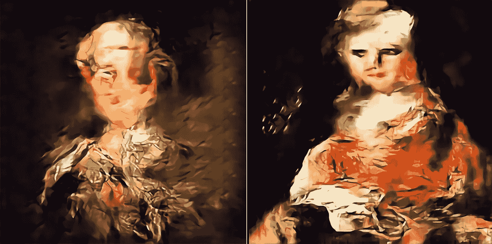
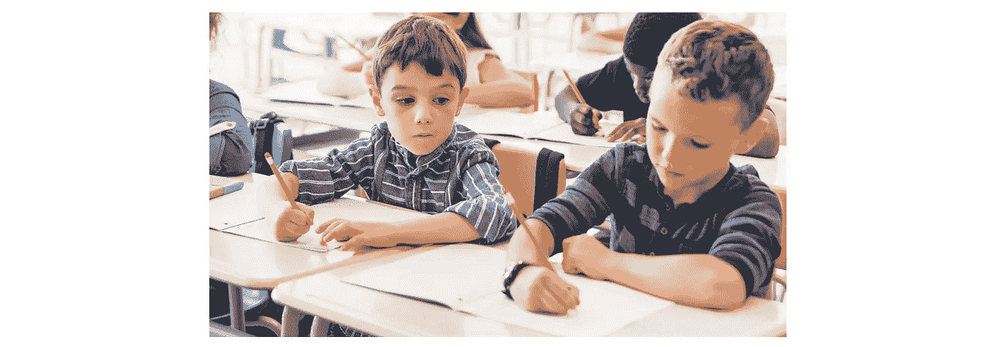
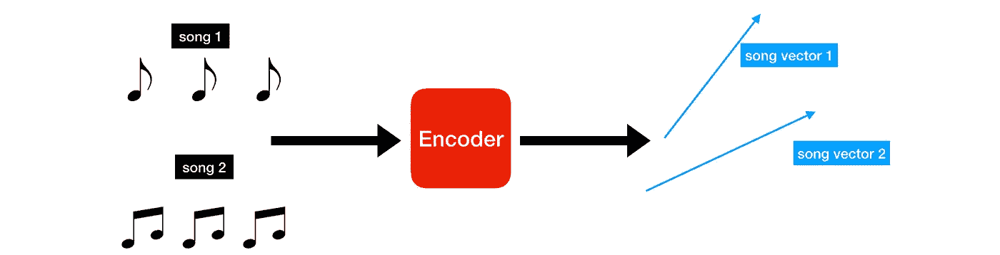
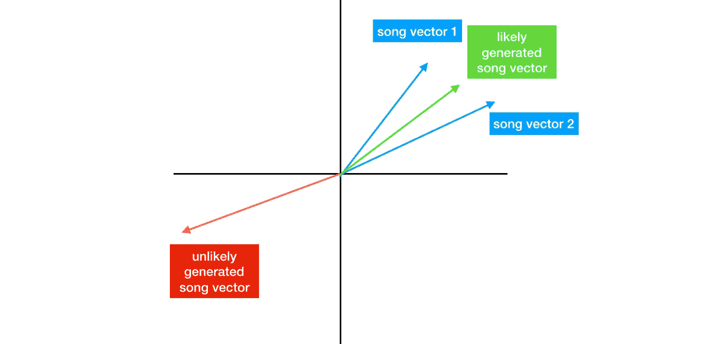
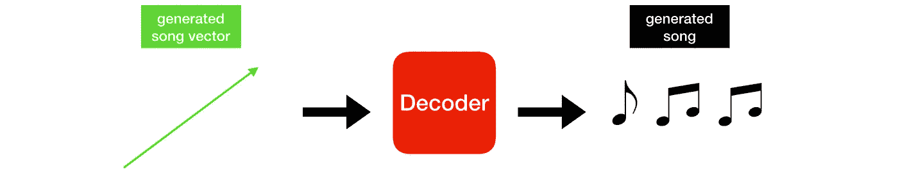
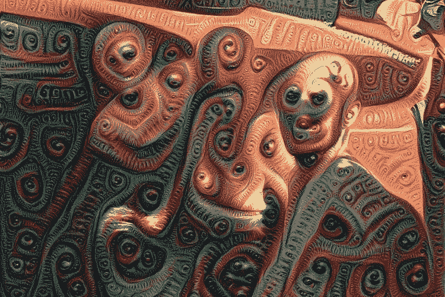
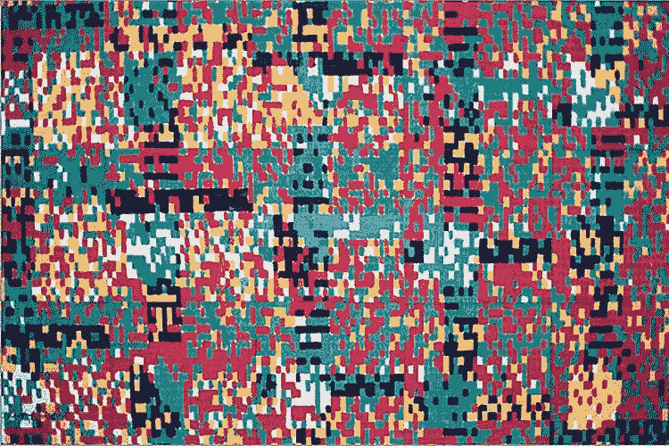
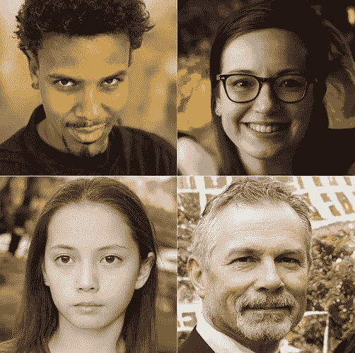

# 真正有创造力的机器人

> 原文：<https://towardsdatascience.com/truly-creative-robots-b6c9935626d1?source=collection_archive---------26----------------------->

## 为什么艺术中的创造性是人类活动(目前)

machine generated art

机器能有创造力吗？

和其他事情一样，这取决于你对创造力的定义。机器能创造艺术吗？音乐？诗歌？绝对的。这让他们变得有创造力了吗？呃，算是吧。

艺术中的大多数美——绘画、雕塑、音乐——都是通过某种创造性的媒介来表达思想和情感。例如，语言是一种媒介，艺术通过诗歌和文学来表现。那么，是什么阻止了机器人的创造力呢？毕竟，我们有绘画、创作音乐和写诗的机器。为什么不一样？

## 人类的优势

人类的艺术灵感来自**内部**和**外部**来源，而任何机器娱乐(绘画、诗歌、音乐)仅来自外部来源——对人类艺术的*模仿*。今天的机器没有任何真实、复杂的内部现实模型，它们从中汲取情感和欲望，正是人类的情感孕育了艺术。换句话说，他们没有感情。

这就是机器生成的艺术和人类创造力之间的主要区别:人们通过内在的——感觉和情感，以及外在的——他人的创作来创造艺术。机器只是简单地复制人类。

## 《模仿游戏》

那么，今天的机器是如何创造艺术的呢？

一般来说，人类艺术被大量收集——这被称为训练数据。然后，这些数据被输入机器，直到它们能够很好地学习这些模式，以近似类似的创造。通过**将**几乎任何类型的艺术编码成数字(特别是——[向量](https://www.mathsisfun.com/algebra/vectors.html)和[矩阵](https://www.mathsisfun.com/algebra/matrix-introduction.html)，机器可以开始“理解”(读取:数学建模)训练数据中的这些模式。

一旦机器知道它看到的是什么类型的数字，它就能创造出新的*和类似的*数字。

然后我们获取这些数字并**解码**它们(完全与相反的*我们最初是如何编码它们的)，并在最初创造的媒介中恰当地呈现机器产生的创造。*

借助当今最先进的技术，这种训练可以产生令人难以置信的效果。生成的艺术可以是明显的、超现实的，甚至是超现实的。有时候，完全不可能区分人类和机器的创造。

Surreal, mathematical, and [photo-realistic](/stylegan2-ace6d3da405d) examples

然而，我们仍然停留在模仿机器，而不是以新颖和有目的的方式表达自己的思考和感受的存在。同样，机器人没有激发创造力的内在自我意识，只是一个尽最大努力复制所见的数学模型。

## 有关系吗？

有些人可能会说这没什么区别——艺术就是艺术。没有正确的答案来划分界限。但是，这没有抓住重点。我们在讨论*机器创造力*的问题，肯定会有好论点的人落在线的两边。

我认为机器艺术背后的基本过程缺少一个至关重要的元素——内在灵感。仅仅通过随机过程进行模仿是不够的。

## 结论

最后，需要注意的是，这种情况不可避免地会发生变化。模型会变得更复杂，机器智能会继续发展。体验情感、表达自我和有意识意味着什么，这些基本问题对于划定机器何时真正从*内心渴望*的地方汲取灵感，而不是简单的数学模仿，将是至关重要的。

如果你对机器意识的未来感兴趣，请查看[这篇文章](/the-future-and-philosophy-of-machine-consciousness-872f272875c8)了解更多。

感谢阅读！:)