# 用基础知识理解内核技巧

> 原文：<https://towardsdatascience.com/truly-understanding-the-kernel-trick-1aeb11560769?source=collection_archive---------4----------------------->

## 在这里，我们学习内核技巧背后的基本原理。它是如何工作的？内核绝招如何在不增加计算量的情况下，**无限维**内点积(或相似度)？

<<download the="" free="" book="" class="ae lb" href="https://www.understandingdeeplearning.com/" rel="noopener ugc nofollow" target="_blank">了解深度学习，了解更多> ></download>

什么是内核技巧？尽管它对机器学习世界产生了深远的影响，但几乎没有发现可以解释内核技巧背后的基本原理。在这里，我们将看看它。在这篇文章的结尾，我们会意识到基本的概念是多么简单。或许，这种简单性使得内核技巧变得深刻。

如果你正在读这篇文章，你可能已经知道*事实上*如果函数中有点积，我们可以使用内核技巧。当我们了解 SVM 时，通常会遇到这种情况。SVM 的目标函数是，

在这个目标函数中，我们有点积 **𝐱** 𝑖ᵀ⋅ **𝐱** 𝑗.由于这个点积，SVM 变得非常强大，因为现在我们可以使用内核技巧。

这个内核是什么，它是如何让 SVM 变得强大的？

在下面，我们将看看这个概念，并得到最小的细节，以帮助我们理解。这篇文章应该澄清了大部分关于**为什么**内核技巧有效的问题，包括在**无限维中工作意味着什么？我们将从最常见的例子开始，然后扩展到一般情况。**

Figure 1: Example of a labeled data inseparable in 2-Dimension is separable in 3-Dimension. *Source: [2]*

在上面的例子中，原始数据是二维的。假设我们把它表示为， **𝐱** ={𝑥₁，𝑥₂}.我们可以在图 1(左图)中看到 **𝐱** 在其空间中是不可分的。但是它们在由下式给出的变换空间(见图 1，右侧)中是可分离的，

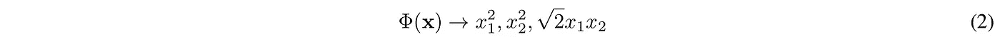

其中，φ是应用于 **𝐱** 的从二维到三维的变换函数。这些点也可以用φ(**𝐱**)→*x*₁、 *x* ₂变换分开，但是 Eq 中的那个。上面的 2 将有助于解释高维空间的使用。√2 不是必要的，但会使我们的进一步解释*在数学上更方便*。

等式中的φ。2，现在我们可以在三维空间中有一个决策边界，

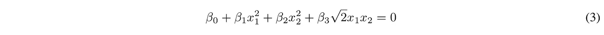

如果我们做一个逻辑回归，我们的模型会像方程。3.在 SVM，一个类似的决策边界(一个分类器)可以使用内核技巧找到。为此，我们需要找到⟨φ(**𝐱**𝑖),φ(**𝐱**𝑗)⟩的点积(见等式)。13 英寸〔4〕)我们就这么办吧。我会这样做，

*我的方式:*

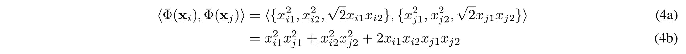

相反，我的朋友萨姆更聪明，他做了下面的事情，

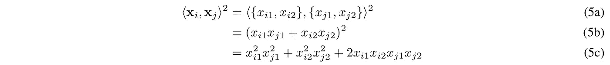

有什么不同？

计算操作:

*   *我的方式*:达到情商。在图 4a 中，我执行 3×2 的计算，以将**𝐱**I 和 **𝐱** 𝑗中的每一个变换到φ的三维空间中。之后，我们在φ(**𝐱**𝑖)和φ(**𝐱**𝑗)之间执行点积，它有 3 个额外的运算(在等式中)。4b)。**总计:9 次**操作。
*   *山姆之道*:直到 Eq。5b，Sam 做了 2 次运算。最后，在 Eq。5c，他又做了一次计算。**总计:3 次**操作。请注意，在等式中。5b 我们对一个标量求平方，因此只有一个操作。

计算空间:

*   *我的方式*:我对我的数据 **𝐱** 应用了映射转换函数φ。然后在φ空间(一个三维空间)执行我的操作。
*   *山姆之道*:山姆没有应用变换功能。他停留在最初的二维空间，得出了和我在三维空间计算时一样的结果。

萨姆绝对比我聪明。他所做的被证明是核心的把戏。但我不会就这样离开。让我们用更多的例子来讨论它。

假设我需要一个比等式 1 更大的表达式来表示我的决策边界。3(因为我们期望它工作得更好)，它同时具有一阶和二阶项，

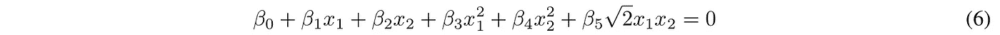

让我们再看看我和山姆的方式，

*我的方式:*

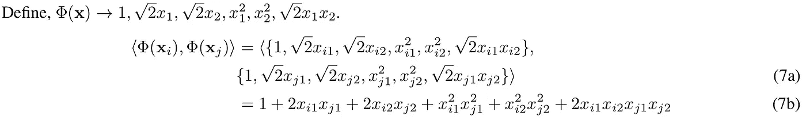

*山姆的方式:*

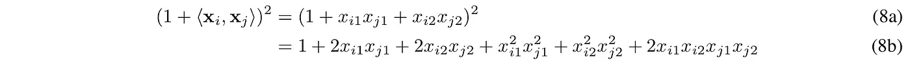

再次比较*我的方式*和*山姆的方式*:

*   我必须明确定义φ。虽然有人可能会说，山姆也必须明确地知道将 1 加到 **𝐱** 𝑖、 **𝐱** 𝑗的点积上，但是我们很快就会看到，山姆的方法很容易推广。
*   *我的方式*采取了 **16** 的操作，*山姆的方式*仍然只采取了 **3** 的操作。(再次注意，在等式中。8a，我们正在平方一个标量，因此只有一个操作。)
*   Sam 再次没有离开原来的 2-D 空间去寻找我在 5-D 空间中找到的相同的相似性度量(点积也是相似性度量)。

同样的，我们可以不断往更高维度发展。如果是 Sam，他可以很容易地找到在 9 维空间中具有三阶项的相似性度量，

*山姆的方式:*

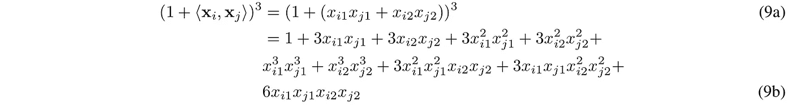

在这一点上，我甚至懒得走自己的路。我希望你明白为什么萨姆的方式明显比我的好。他只是在原始空间中计算点积，并将结果(标量)提升到幂。这和高维空间中的点积完全一样。

这正是内核的诀窍。让我们从 Sam 的方法中总结一下内核的窍门。

*   内核:在上面的例子中，Sam 使用的内核函数是，

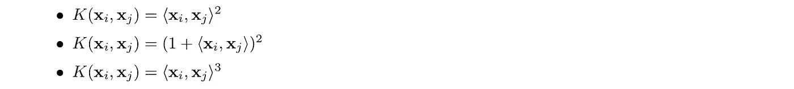

*   映射函数:Sam 不需要知道 3 维、5 维或 9 维的映射函数φ来获得这些高维空间中的相似性度量(点积)。

**神奇回顾**:山姆需要做的就是意识到有更高维度的空间可以分离数据。选择一个相应的内核，瞧！他现在在高维空间工作，同时在原来的低维空间做计算。他还在分离早期不可分割的数据。Sam 到目前为止使用的内核示例是线性内核的特例，

**在无限维中内核技巧是如何工作的？**

我们知道，核可以找到无限维空间中的相似性，**和**，而不需要在无限维空间中进行计算。如果到目前为止你还和我在一起，现在准备好迎接这个疯狂的时刻吧。

这是魔术背后的诀窍。我将用一个高斯核(也称为径向基函数，RBF)来展示这个技巧，同样的逻辑可以扩展到其他无限维核，如，指数，拉普拉斯等。

高斯核被定义为，

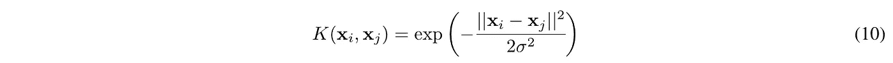

为简单起见，假设𝜎=1.方程中的高斯核。10 然后可以扩展为，

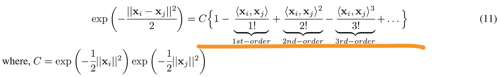

根据萨姆的计算，现在我们知道⟨、𝐱、𝑖、𝐱和𝑗⟩ⁿ将放弃𝑛-order 条款。由于高斯函数有一个无穷级数展开，我们得到了直到无穷的所有阶的项。因此，高斯核使我们能够在无限维中找到相似性。在这个例子中，我们要做的所有计算也是找到𝐱𝑖和𝐱𝑗之间的平方欧几里德距离，并找到它的指数(计算发生在原始空间)。

所以 Sam 在使用内核时没有什么可担心的了？

他有。最后，他确实需要

*   来选择使用哪个内核函数。[ [1](http://crsouza.com/2010/03/17/kernel-functions-for-machine-learning-applications/) ]有一个详尽的内核列表可供选择。而且，
*   调整内核的超参数。例如，在高斯核中，我们需要调整𝜎.T21 有一份关于这方面的论文列表。

**我们需要先知道合适的核函数吗？**

是的，我们确实需要确定哪个内核函数是合适的。然而，我们不需要先了解它。首先，我们必须认识到线性决策边界是行不通的。当我们看到模型精度很差时，就会意识到这一点，如果可能的话，可以使用一些数据可视化(例如图 1)。当意识到线性边界是行不通的时候，我们开始使用内核技巧。

大多数内核将导致非线性的、可能更好的决策边界。[ [1](http://crsouza.com/2010/03/17/kernel-functions-for-machine-learning-applications/) ]给出了一个详尽的选择列表。但是没有直接的方法知道哪个核函数将是最佳选择。传统的机器学习模型优化方法，如交叉验证，可用于寻找性能最佳的核函数。

然而，由于使用核技巧没有额外的计算来分离一些高维或无限维中的数据点，人们通过使用高斯(RBF)核来处理无限维。RBF 是最常用的核。

简而言之，作为一个经验法则，一旦你意识到线性边界是行不通的，尝试一个非线性的 RBF 核边界。

# 结论

在这篇文章中，我们介绍了内核技巧的基本细节。我们的目标是理解内核技巧。我们还找到了内核技巧如何在不增加计算量的情况下在无限维中找到点积(相似性)的答案。

如果你有不明白的地方，请留下你的评论。

*免责声明:这是我之前在 Quora 上针对这个问题发表的帖子的编辑版本，* [*什么是内核诀窍*](https://www.quora.com/What-is-the-kernel-trick) *也是 Quora 博客* [*这里*](https://dscm.quora.com/The-Kernel-Trick) *。*

# 参考

[1] [机器学习应用的内核函数](http://crsouza.com/2010/03/17/kernel-functions-for-machine-learning-applications/)

[2] [伯克利 CS281B 讲座:内核诡计](https://people.eecs.berkeley.edu/~jordan/courses/281B-spring04/lectures/lec3.pdf%20(https://people.eecs.berkeley.edu/~jordan/courses/281B-spring04/lectures/lec3.pdf)

[3] [支持向量机:参数](http://www.svms.org/parameters/)

[4] [支持向量机:讲座(斯坦福 CS 229)](http://cs229.stanford.edu/notes/cs229-notes3.pdf%20(http://cs229.stanford.edu/notes/cs229-notes3.pdf)