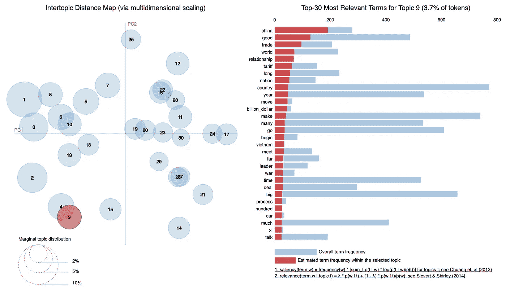
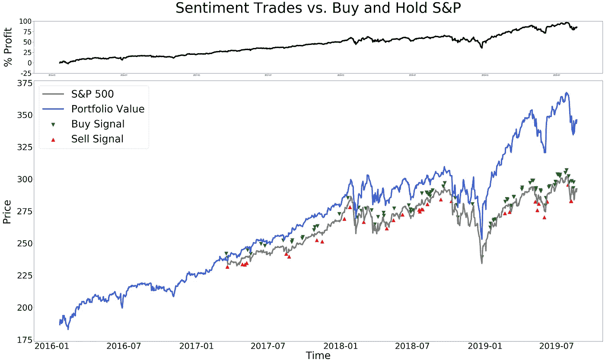

# 特朗普、推特和贸易

> 原文：<https://towardsdatascience.com/trump-tweets-and-trade-96ac157ef082?source=collection_archive---------26----------------------->

## 用 Python 中的主题建模和情感分析交易标题驱动的标准普尔 500


Photo by [🇨🇭 Claudio Schwarz | @purzlbaum](https://unsplash.com/@purzlbaum?utm_source=medium&utm_medium=referral) on [Unsplash](https://unsplash.com?utm_source=medium&utm_medium=referral)

特朗普总统最近用现代的天字第一号讲坛(他的推特)重创了金融市场。随着美国和中国继续各自的姿态，与中国正在进行的贸易摩擦已经[升温](https://www.nytimes.com/2019/09/01/world/asia/trump-trade-war-china.html)。上周日，新一轮针对中国商品的关税生效，这一次，美国[的消费者很可能将承担 15%关税增长的负担。围绕贸易谈判方向的不确定性仍然存在，除非取得重大突破，否则股市将继续受到特朗普总统言论的推动。](https://finance.yahoo.com/news/trump-tariffs-china-september-1-040027636.html)

对交易员来说幸运的是，总统并不羞于在推特上发表他对贸易的短期观点。标准普尔 500 指数的交易策略能利用特朗普总统的贸易相关推文预测市场的短期走势吗？我转向主题建模和情感分析来寻找答案。总体项目设计和工作流程如下:

1.  **数据收集和预处理:**收集原始推文并进行预处理，以将标记化和词条化的单词传递给主题模型。
2.  **使用 LDA 的主题建模:**主题建模用于为每条推文分配一个主题。只有与贸易话题相关的推文被传递用于情绪分析。
3.  **VADER 的情感分析:**识别出与交易相关的推文后，每条推文都被赋予一个情感分数。情绪得分被作为交易策略的核心输入。
4.  **回测标准普尔 500 指数数据的交易策略:**一旦情绪得分被分配，定制的交易策略被设计成根据重要的情绪得分进行交易。

让我们进入项目的一些细节，并以结果的讨论来结束！

# **数据采集和预处理**

特朗普总统的 7，779 条推文是从他上任的第一天(2017 年 1 月 21 日)到 2019 年 8 月 14 日收集的。预处理是必不可少的，以确保主题模型能够准确识别与贸易相关的推文。

使用 Gensim 和 nltk python 库执行了以下预处理步骤:

*   包含不到 20 个字符的推文(总共 375 条推文)被视为噪音，随后被删除。
*   推文被符号化；句子被拆分成单个的单词，单词全部小写，标点符号被删除。
*   使用了 nltk 中的默认停用词，以及自定义停用词。识别自定义停用词的过程是迭代的，并且包括诸如“假货、新闻、詹姆斯·科米、波多黎各等”的词，这些词主导了与贸易无关的推特话题。
*   单词被词条化以减少每个单词的基本形式。
*   二元模型后来被用于主题建模。选择二元模型来捕捉围绕单个短语的上下文。
*   最后，为了让 gensim 的数据更友好，一个详细记录一个单词在所有推文中出现次数的单词字典被创建出来。Gensim 还需要一个语料库——为每条推文创建一个字典，其中包含推文中出现的单词数量以及每个单词在推文中出现的次数。

词汇化和二元模型阶段后的预处理 tweet 示例:

```
['china', 'intent', 'continue', 'receive', 'hundred', 'billion', 'dollar', 'take', 'unfair', 'trade', 'practice', 'currency', 'manipulation', 'one_side', 'stop', 'many', 'years_ago']
```

# **用 LDA 进行主题建模**

经过预处理后，语料库和词袋词典被传递给潜在的狄利克雷分配(LDA)主题模型。参见[这里](/topic-modeling-and-latent-dirichlet-allocation-in-python-9bf156893c24)的 python 中 LDA 模型的演示。简而言之，LDA 可以用来为给定推文的主题概率分布建模。

例如，考虑这样的情况，LDA 给一条推文分配 50%与贸易相关的机会，25%与移民相关的机会，以及 25%与医疗保健相关的机会。鉴于该推文的主题概率分布的细分以及贸易主题具有最高概率的事实，该推文可以被归类为与贸易相关的。

为 LDA 模型指定的主要超参数是主题的数量。经过多次迭代和一些关于主题适当分离的主观判断，30 个主题产生了最好的结果。

```
lda_model = gensim.models.ldamodel.LdaModel(corpus=corpus,id2word=id2word,
num_topics=30, passes = 10)
```

我使用 pyLDAvis 来可视化模型分离主题的能力。下面的主题间距离图显示了一些主题之间的轻微重叠，但总的来说，该模型表现出了令人满意的分离水平。

通过分析 LDA 模型中的 30 个主题，主题 9 因其捕捉与中国贸易相关的术语的能力而脱颖而出。下面的 pyLDAvis 输出中还列出了主题 9 的相关术语的完整列表。



LDA model exhibited adequate separation of topics. Topic 9 in particular was able to capture terms related to trade with China.

一旦我对主题 9 识别与贸易相关的推文感到满意，与其他主题相关的推文就会被删除。结果只剩下 590 条推文。我对推文子集进行了最后一次扫描，以确保模型正确标记推文。原始推文及其主题百分比贡献的示例如下所示:

```
“So far you’ve had Tariffs imposed on 300 Billion Dollars worth of Chinese products but you can’t tell me that it has hurt our economy…; it really hasn’t led to any kind of serious rise in prices at the consumer level. And we are taking in $Billions!”Dominant Topic: Trade
Topic Percent Contribution: 0.653
```

上面的例子和剩余的推文子集表明，LDA 模型在识别与贸易相关的推文中通常是准确的。由于对主题建模结果感到满意，我将注意力转向了情感分析。

# VADER 的情感分析

在找到相关的推文子集后，我使用效价感知词典和情绪推理器(VADER)分析来生成情绪交易信号。VADER 是一个预先训练好的情感模型，特别适合社交媒体文本。建立 VADER 模型和下载现有词典轻而易举。点击[这里](https://medium.com/analytics-vidhya/simplifying-social-media-sentiment-analysis-using-vader-in-python-f9e6ec6fc52f)深入了解 VADER 的应用。

```
from nltk.sentiment.vader import SentimentIntensityAnalyzer
analyser = SentimentIntensityAnalyzer()
nltk.download('vader_lexicon')
sia = SentimentIntensityAnalyzer()
```

VADER 接受一串文本作为输入，并返回一个正面的、中性的、负面的和复合的情感分数。重点放在检查复合分数上，它很好地概括了文档的整体情感。复合得分范围从-1(极负)到 1(极正)。在下面的例子中，川普总统表达了对习主席的赞扬，随后 VADER 给这条推文的综合评分为 0.8439。

```
I know President Xi of China very well. He is a great leader who very much has the respect of his people. He is also a good man in a tough business. I have ZERO doubt that if President Xi wants to quickly and humanely solve the Hong Kong problem he can do it. Personal meeting? {'neg': 0.082, 'neu': 0.693, 'pos': 0.225, 'compound': 0.8439}
```

所有与交易相关的推文的综合得分都被收集起来。为了确定最有能力在短期内推动市场的推文，带有大量积极或消极情绪的推文被分离出来。

*   积极情绪:综合得分> 0.7
*   负面情绪:复合得分< -0.7

Tweets that did not meet the sentiment cutoff were dropped and as a result the final subset of data included 194 trade-related tweets with significant sentiment scores.

# Backtesting Trading Strategy on S&P 500 Data

After finding the final set of 194 tweets, I developed a straightforward custom trading sentiment strategy to backtest on the S&P 500\. Before diving into the details of the trading logic, it’s important to cover some key details and assumptions I made prior to developing the trading strategy:

1.  The SPDR S&P 500 ETF (Ticker: SPY) was used as a tradable proxy for the S&P 500 Index.
2.  The benchmark to compare the trading strategy against was a simple buy-and-hold SPY strategy.
3.  The granularity of available and free historical pricing data was restricted to open and closing daily SPY prices. As an individual, obtaining tick-by-tick pricing data for the last two and a half years was not feasible. **结果，回溯测试交易被限制在开市或闭市。**理想情况下，一旦从特朗普总统的推特(twitter)消息中识别出一个值得未来调查的信号，就应该立即进行交易。
4.  没有借贷成本就可以利用杠杆。
5.  交易成本是不存在的。
6.  如果一天内产生了多个信号，信号的平均值决定了交易的方向。

虽然上面的第四点和第五点是理想化的，是为了使计算更容易，但它们有助于抵消第三点所述限制(信号和交易执行之间的时间间隔)导致的假设的负面后果。尽管如此，重要的是要指出，更现实的假设，如借款和交易成本，将对任何交易利润产生负面影响。

现在所有的关键假设都已经涵盖，我们可以把注意力转向交易策略的发展。任何情绪交易策略的核心都是这样一个理论，即当情绪高涨时，动物精神会推动市场上涨，当情绪受挫时，动物精神会推动市场下跌。鉴于总统拥有制定关税政策的行政权力，他的情绪应该会对美国股票价格产生相当大的影响。积极关注股价和特朗普总统推特消息的市场参与者可能会同意这种相关性在现实中成立，但让我们看看利用总统短期情绪的策略是否真的有利可图。下面详细列出了基本情况、积极情绪信号和消极情绪信号的每日交易策略逻辑:

**基本情况:无交易信号**

*   投资组合只包含 100%的间谍

**积极的情绪信号:将投资组合的间谍敞口提高到 200%，持续 1 个交易日**

*   开市前出现信号*s:开市时买入，收盘时卖出*
*   信号发生在市场时段*:收盘时买入，明天收盘时卖出*
*   *信号在小时后出现:在明天开盘时买入，在明天收盘时卖出*

***负面情绪信号:卖出投资组合头寸，并在 1 个交易日内保持 0%的间谍敞口***

*   *开市前出现信号*:开市时卖出，收盘时回到 100%的间谍敞口**
*   **信号出现在市场时段*:收盘时卖出，明天收盘时恢复 100%的间谍敞口***
*   ***信号在盘后出现*:在明天开盘时卖出，在明天收盘时回到 100%间谍暴露****

***简而言之，该策略旨在增加对美国股价上涨的敞口，减少对美国股价下跌的敞口。让我们看看交易策略在 2017 年 1 月 21 日至 2019 年 8 月 14 日的回测中表现如何。在下图中，策略投资组合用蓝线表示，而基准间谍买入并持有投资组合用灰线表示。此外，绿色箭头表示触发买入信号的日期，红色箭头表示触发卖出信号的日期。***

******

*****交易策略在回溯测试期间的回报率为 85.3%，而简单的买入并持有策略同期的利润为 56.7%。**虽然回溯测试的结果令人鼓舞，但让我们花点时间思考一下为什么该策略的表现优于其基准，并讨论一下回溯测试的局限性。***

***快速眼球测试表明，大部分买入信号是在市场上涨趋势中产生的，卖出信号是在小幅抛售时产生的，这对策略来说是个好消息。然而，这种策略也有可能只是运气好——在趋势性牛市中，发出更多买入信号而不是卖出信号，听起来肯定是跑赢市场的好方法。记住这两点，是时候提醒大家*相关性并不意味着因果关系*。特朗普总统的情绪真的导致了市场波动吗？还是这些推文恰好与其他市场变动事件如经济数据发布或美联储演讲相吻合？理解特朗普推文的实际效果是一个完全不同的问题；不同于这个项目的动机是看看利用特朗普总统的情绪是否有利可图。目前，我们只能说**川普总统的情绪很有可能与市场回报正相关。*****

**回溯测试的一个更明显的限制是，它只是…对过去的测试。找到一个有利可图的回溯测试是一项有价值的研究，但是任何交易策略的真正成功是它在未来实时数据中的表现。**

**最后，让我们回忆一下，回溯测试没有考虑借贷或交易成本。将这些包括在计算中会降低策略的表现和未来的任何预期利润。**

# **结论**

**总的来说，使用 LDA 和 VADER 情绪分析的主题建模是解析总统推特上的噪音并隔离他对中国贸易的情绪的可能解决方案。根据回溯测试期间产生的情绪信号进行交易是有利可图的，优于简单的买入并持有策略的表现令人鼓舞，足以考虑根据实时数据跟踪该策略的表现。未来的工作，如格兰杰因果分析和事件研究，以分离特朗普贸易推文的实际市场效应，也值得追求。**

**投资者关心总统对贸易的政策和言论，在贸易战解决之前，请关注唐纳德·特朗普的推特。**

*****注来自《走向数据科学》的编辑:*** *虽然我们允许独立作者根据我们的* [*规则和指导方针*](/questions-96667b06af5) *发表文章，但我们不认可每个作者的贡献。你不应该在没有寻求专业建议的情况下依赖一个作者的作品。详见我们的* [*读者术语*](/readers-terms-b5d780a700a4) *。***

# **附录**

**[领英](https://www.linkedin.com/in/nick-cochrane1/)**