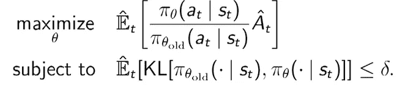
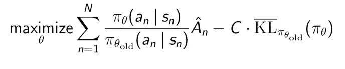
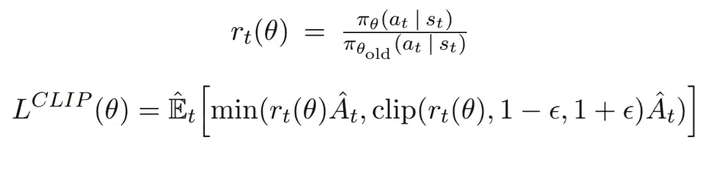

# 信赖域和最近策略优化

> 原文：<https://towardsdatascience.com/trust-region-and-proximal-policy-optimization-b10b33a9becc?source=collection_archive---------17----------------------->

Photo from [Deepmind](https://deepmind.com/blog/producing-flexible-behaviours-simulated-environments/)

欢迎来到揭开强化学习背后秘密的另一个旅程。这一次，我们将后退一步，回到策略优化，以介绍两种新的方法:信赖域策略优化(TRPO)和邻近策略优化(PPO)。请记住，在策略梯度技术中，我们试图使用梯度下降来优化策略目标函数(预期的累积回报)。政策梯度对于连续的大空间是很好的，但是也有一些问题。

*   高方差(我们用演员-评论家模型来解决)
*   延迟奖励问题
*   样品低效
*   学习速度对训练有很大影响

特别是最后一个问题困扰了研究者很长时间，因为很难找到一个适合整个优化过程的学习速率。小的学习率可能导致梯度消失，而大的学习率可能导致梯度爆炸。总的来说，我们需要一种方法来改变政策，不要改变太多，也不要改变太少，甚至更好的方法来不断改进我们的政策。这方面的一篇基础论文是:

# 信任区域策略优化(TRPO)

为了确保策略不会移动得太远，我们在优化问题中添加了一个约束，以确保更新后的策略位于信任区域内。信赖域被定义为函数的局部近似精确的区域。好吧，但那是什么意思？在信任区域中，我们确定最大步长，然后我们在区域内找到策略的局部最大值。通过重复同样的过程，我们找到了全局最大值。我们还可以根据新近似的好坏来扩大或缩小区域。这样，我们就可以确信，新政策是可信的，不会导致严重的政策退化。我们可以用 KL 散度(你可以把它想象成两个概率分布之间的距离)从数学上表达上述约束:

**新旧政策的 KL 背离必须低于 delta (δ)，其中 delta 是地区的大小。**我可以进入一些数学领域，但我认为这只会使事情变得复杂，而不是澄清它们。所以本质上，我们只有一个**约束优化问题。**

现在的问题是我们如何解决一个约束优化问题？使用[共轭梯度法](https://en.wikipedia.org/wiki/Conjugate_gradient_method)。当然，我们可以解析地解决这个问题(自然梯度下降)，但这在计算上是无效的。如果你对数值数学有所了解，你可能会记得共轭梯度法提供了一个方程组的数值解。从计算的角度来看，这要好得多。所以我们要做的就是线性逼近目标函数，二次逼近约束，让共轭梯度完成它的工作。

总而言之，该算法有以下步骤:

*   我们运行一组轨迹并收集策略
*   使用优势估计算法来估计优势
*   用共轭梯度法求解约束优化问题
*   重复

一般来说，信赖域被认为是解决最优化问题的非常标准的方法。棘手的部分是将它们应用于强化学习环境中，以提供优于简单策略梯度的优势。

虽然 TRPO 是一个非常强大的算法，但它有一个严重的问题:血腥的约束，这给我们的优化问题增加了额外的开销。我的意思是，它迫使我们使用共轭梯度法，并用线性和二次近似法来迷惑我们。如果能够以某种方式将约束直接包含到我们的优化目标中，这不是很好吗？正如您可能已经猜到的那样，这正是最近策略优化所做的。

# 近似策略优化(PPO)

这个简单的想法给了我们一个比 TRPO 更简单、更直观的算法。事实证明，它在大多数情况下都优于许多现有的技术。因此，我们不是单独添加一个约束，而是将它合并到目标函数中作为惩罚(我们从函数中减去 KL 散度乘以常数 C)。

一旦我们这样做，就不需要解决约束问题，我们可以在上述函数中使用简单的随机梯度下降。并且该算法被转换如下:

*   我们运行一组轨迹并收集策略
*   使用优势估计算法来估计优势
*   对目标函数执行随机梯度下降一定数量的时期
*   重复

一个小警告是，很难选择系数 *C* ，使其在整个优化过程中工作良好。为了解决这个问题，我们根据 KL 散度的大小来更新系数。如果 KL 太高，我们增加它，或者如果它太低，我们减少它。

就这样吗？这就是著名的近端策略优化？实际上没有。很抱歉。原来上面说的功能和原纸不一样。作者找到了一种方法来改进这个惩罚版本，使其成为一个新的、更健壮的目标函数。

嘿嘿等等。这里发生了什么？其实不多。让我解释一下。到目前为止，我故意忽略了一件事，那就是概率的分数，它似乎也出现在 TRPO 中。这就是所谓的重要抽样。我们基本上有一个新的政策，我们想评估和一个旧的政策，我们用来收集样本。通过**重要性采样**，我们可以用旧策略中的样本评估新策略，并提高采样效率。这个比值可以推断出这两种策略有多大的不同，我们用 r(θ)表示。

使用这个比率，我们可以构建一个新的目标函数，如果新政策远离旧政策，则**将削减估计的优势。这正是上面的等式所做的。如果一个动作在新策略下比旧策略下更有可能发生，我们不想过多地更新动作，所以我们裁剪了目标函数。如果在新策略下比旧策略下可能性小得多，则目标动作被展平以防止再次过度更新。**

可能只有我一个人，但我想我已经有一段时间没碰到更简单更干净的强化学习算法了。

如果你想进入兔子洞，查看来自 OpenAI 的基线[代码](https://github.com/openai/baselines/tree/master/baselines/ppo1)，它会给你一个整个算法的水晶般清晰的图像，并解决你所有的问题。当然，如果你尝试自己一个人从零开始实现，那会好得多。这不是最容易的任务，但为什么不呢。

我想现在就这样吧。继续学习…

> ***如果您有任何想法、评论、问题或者您只想了解我的最新内容，请随时在***[**Linkedin**](https://www.linkedin.com/in/sergios-karagiannakos/)**，**[**Twitter**](https://twitter.com/KarSergios)**，**[**insta gram**](https://www.instagram.com/sergios_krg/)**，**[**Github**](https://github.com/SergiosKar)**或在我的**

*要阅读完整的深度强化学习课程，学习所有你需要了解的人工智能知识，去* [*这里*](https://medium.com/@SergiosKar/deep-reinforcement-learning-course-baa50d3daa62) *。*

*原载于 2019 年 1 月 11 日*[*sergioskar . github . io*](https://sergioskar.github.io/TRPO_PPO/)*。*