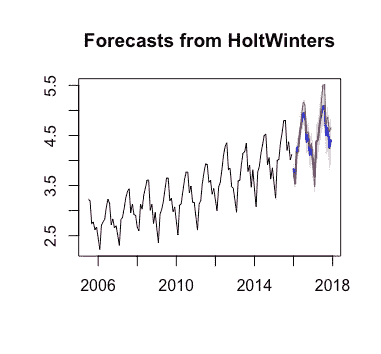
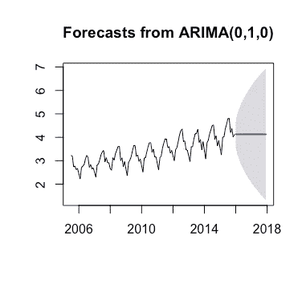
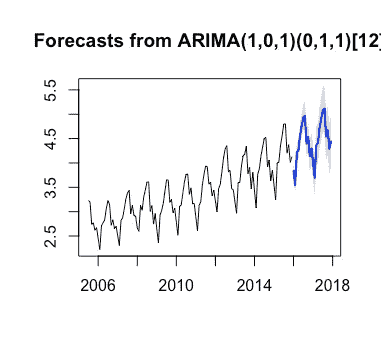
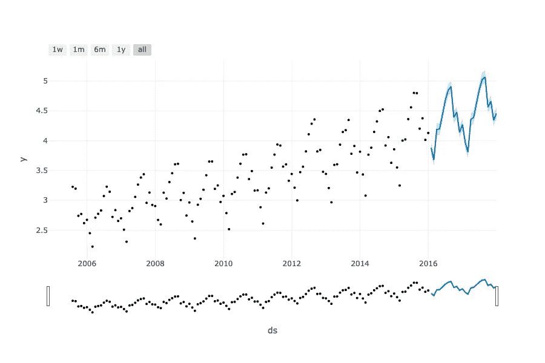

# 尝试将脸书预言家用于时间序列模型

> 原文：<https://towardsdatascience.com/trying-facebook-prophet-for-time-series-model-3170cfd416fa?source=collection_archive---------13----------------------->

当我在研究生院学习时间序列时，我的教授告诉我 Python 中没有他认为有用的好的时间序列包。最近，我了解到脸书发布了一个关于 Python 和 R 的时间序列模型的 API，名为脸书先知。由于我也有一个小项目，对 R 中的 SFO 客流量进行预测，我很高兴有一个在 Python 中构建时间序列的选项，所以我尝试了一下。

**对 2018-2019 年 SFO 客运量进行预测**
我做的项目是用我在研究生院学过的时间序列模型，建立一个模型来预测 2018-2019 年 R 月客运量。我从 Open SF 获得了客流量数据，并用 Holt-Winters 和 Box-Jerkins 方法(特别是 ARIMA 和萨米亚)训练了模型。您可以在本文末尾的链接中找到我的 Github 资源库。

下面的图片是我为霍尔特温特斯，ARIMA 和萨米亚模型建立的情节。



Plot of Holt-Winters model

霍尔特-温特斯方法通过使用指数平滑技术进行预测，换句话说，该模型是通过采用指数加权移动平均来学习的，不需要任何假设。



Plot of ARIMA model



Plot of SARMIA model

Box-Jenkins 方法是一种自回归综合移动平均模型，通过将数据集转换为平稳的来学习。我用了 ARIMA 和萨里玛模型。两者的区别在于 ARIMA 是非季节性的，而萨里玛是季节性的。

在 R 中，您可以通过使用预测包中的以下代码来避免学习超参数的麻烦。

```
library(forecast)
auto.arima()
```

但是使用 auto.arima()的缺点 R 学习的超参数不一定是最优的。例如，为 ARIMA 模型学习的超参数 R 是 ARIMA(0，1，0 ),预测完全基于上一时段。这就是为什么这个项目中 ARIMA 模型的情节看起来很好玩。

为了评估 3 个模型中的模型，我使用 RMSE 作为度量。霍尔特-温特斯、ARIMA 和萨里玛模型的 RMSE 分别为 0.1342、0.6746 和 0.1812。因此，我认为霍尔特-温特斯模型是这些模型中预测效果最好的模型。

**脸书预言家**
我对脸书预言家的第一印象还不错，因为这是我第一次看到 Python 和 Sklearn 模型的时序包。为了评估软件包是否有用，我使用相同的数据集并计算模型的 RMSE。

要使用脸书先知，您需要在 pandas dataframe 的两列中准备好您的数据集——日期和值。请注意，日期列必须是“YYYY-MM-DD”格式的日期时间数据类型(时间戳也是可以接受的)。但是，文档不建议使用其他日期时间格式。此外，日期和值的列名必须是“ds”和“y”。

一旦数据集准备好了，下一步就是为模型设置一个对象。如果你一直在用 Sklearn，这个对你来说很容易。遵循以下代码:

```
model = Prophet()
model.fit(dataset)
```

之后，您可以通过传递一个您想要预测的日期的单列数据帧作为输入来进行预测。

不幸的是，你只能使用线性模型和逻辑增长在脸书先知。Holt-Winters 和 Box-Jerkins 方法在软件包中不可用。默认情况下，线性模型是脸书先知中的默认模型。

进行预测时，文档建议使用此语法制作一个单列数据帧，并让模型进行预测。

```
future = model.make_future_dataframe(periods=365)
forecast = model.predict(future)
```

这个语法在我的项目中不起作用，因为“make _ future _ data frame(periods = 365)”返回一个 365 天的数据帧。然而，我希望的日期是 2018 年至 2019 年期间每个月的最后一天。或者，我必须手工制作数据帧。

```
from datetime import datetime
from dateutil.relativedelta import relativedeltafuture = [datetime(2016, 1, 1) + relativedelta(months=i, day=31) for i in range(24)]
future = pd.DataFrame(data=future, columns=[‘ds’])
prediction = model.predict(future)
```

“dateutil”中的“relativedelta”是 Python 中一个有用的日期包。如果您将 relativedelta(months=2，day=31)添加到 2016 年 1 月 1 日，即使您在输入中过了 31 天，它也可能会返回到 2016 年 2 月的最后一天。

一旦 dataframe 被传递给模型，它将返回我想要的结果。该模型的 RMSE 为 1.0493。事实证明，用脸书预言家学会的模型不如 r

脸书先知的另一个很好的功能是，您可以轻松地将模型和预测传递给 Plotly 进行可视化。事情就像这样简单:

```
from fbprophet.plot import plot_plotly
import plotly.offline as pyfig = plot_plotly(model, prediction)
py.plot(fig, filename=’fbprophet_plot.html’)
```

根据我得到的结果，情节看起来是这样的:



Plots for linear model in Facebook Prophet

**我的想法**
我其实很喜欢用脸书 Prophet 进行时间序列分析，主要是因为它的语法与 SKlearn 非常相似，而且 Python 中也有。在大数据世界中，Python 变得越来越重要，因此需要在 Python 中提供良好的时间序列。不幸的是，没有 Holt-Winters 和 Box-Jerkins 模型可用，模型学习的准确性是我关心的问题。最终，由脸书 Prophet 学习的模型的 RMSE 高于由 R 预测包学习的 Holt-Winters 模型。脸书先知是新的，我期待着开发人员添加更多的时间序列方法到这个包。

此外，我确实有一些困难的时间安装脸书先知。如果您使用的是 iOs，请确保安装了编译器和 Python 开发工具。最好的方法是用 Anaconda 安装。当你安装脸书先知时，一定要检查文档。

**结论**
脸书 Prophet 为用 Python 制作时间序列模型提供了很好的资源，但是缺乏成熟的统计时间序列方法来建模。如果你对应用的统计方法不是很挑剔，脸书先知是一个很好的软件包，因为它的语法与 SKlearn 非常相似，并且易于在 Plotly 中进行趋势分析。在您的 Python 代码中，您只需要有加载数据的代码，声明模型对象，用数据拟合模型，进行预测，并在 Plotly 中绘制模型。然而，如果准确性和性能是一个问题，脸书先知可能不是一个很好的选择，根据我的 SFO 客流量预测项目的结果。我建议将 Holts-Winters 或 SARIMA 在 R 中学习的模型与预测包进行比较。

**总结脸书先知**
*优点*
1。遵循 SKlearn 代码
2。进行预测的简单语法
3。Python 和 R
4 中都有。Plotly 中易于可视化的语法

*缺点*
1。只有线性模型和逻辑增长模型可用
2。难以安装
3。列名必须是“ds”和“y”

参考
脸书先知文档
[https://Facebook . github . io/Prophet/docs/quick _ start . html # python-API](https://facebook.github.io/prophet/docs/quick_start.html#python-api)

https://github.com/jacquessham/sfotraffic github 链接
T22