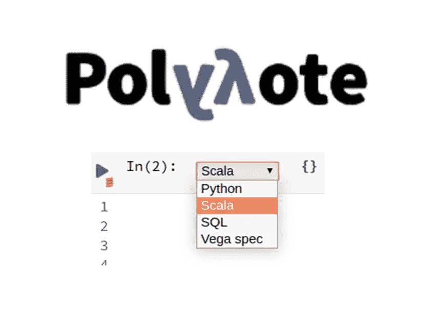
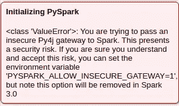
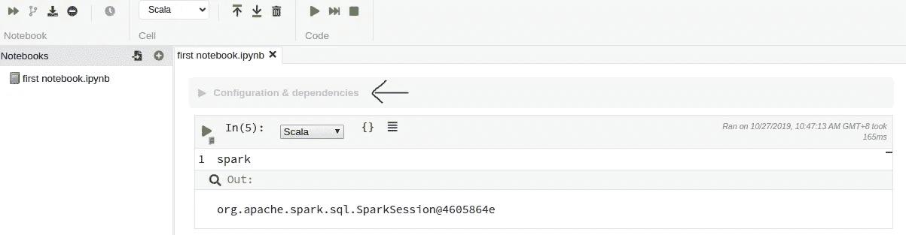
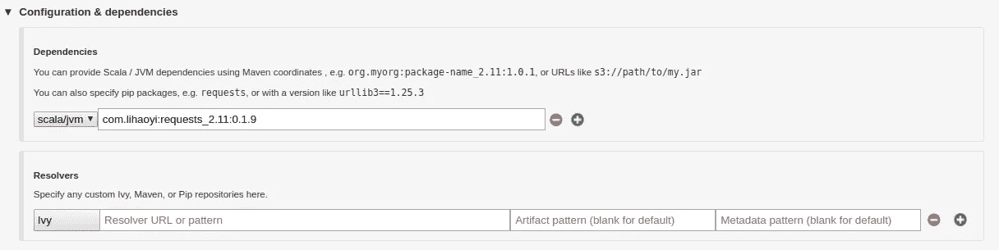
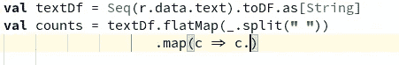
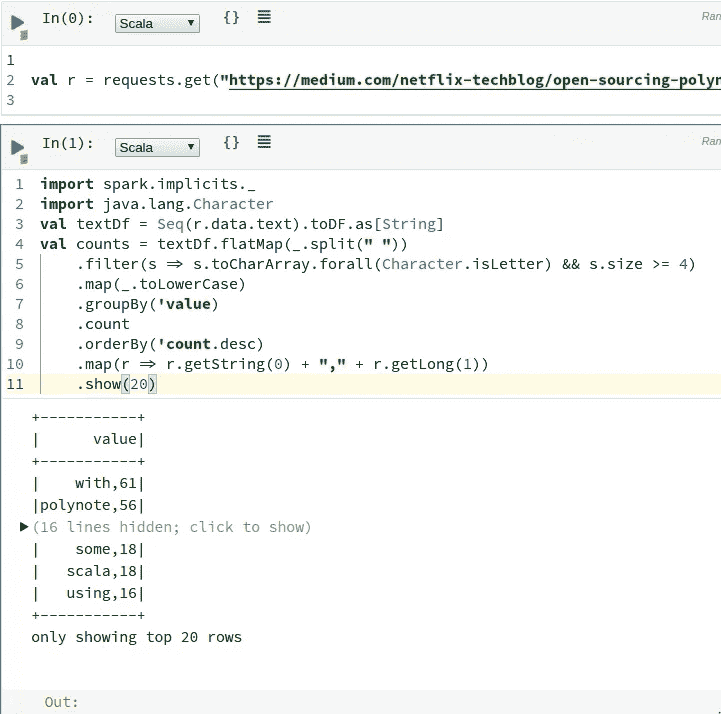
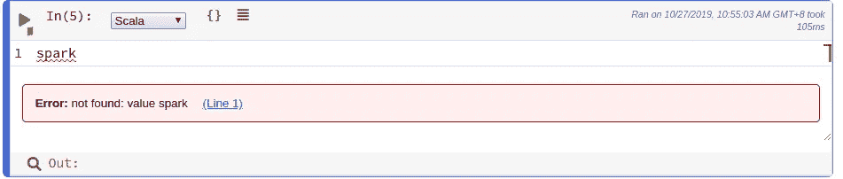
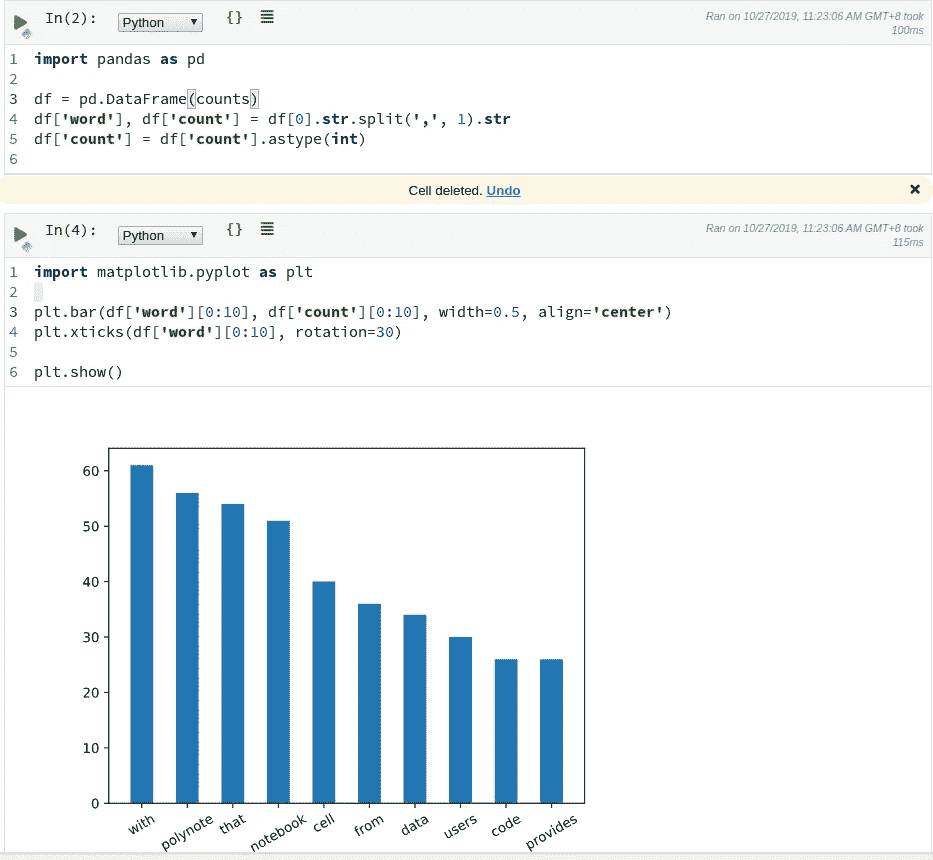
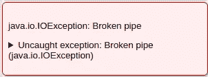

# Polynote 的第一手体验——数据工程师的最佳笔记本

> 原文：<https://towardsdatascience.com/trying-polynote-from-netflix-a-better-notebook-for-data-engineers-5107277ff2e5?source=collection_archive---------21----------------------->



网飞最近宣布了 [Polynote](https://medium.com/netflix-techblog/open-sourcing-polynote-an-ide-inspired-polyglot-notebook-7f929d3f447) ，这对致力于 Spark 和 Scala 的数据工程师来说很有希望。有许多很棒的特性，包括

*   Scala 的交互式自动完成和参数提示
*   将 Maven 存储库中的依赖项配置为笔记本级别的设置
*   Scala 和 Python 代码在同一个笔记本中，变量在它们之间共享(也称为多语言)

让我们用 Spark 中一个经典的字数统计例子来试试 Polynote。在这个例子中，我们读取了来自[网飞的 Polynote medium post](https://medium.com/netflix-techblog/open-sourcing-polynote-an-ide-inspired-polyglot-notebook-7f929d3f447) 的文本，并用它用 python matlablib 绘制了一个字数统计条形图。代码可以在[这里找到](https://github.com/yclim/polynote-examples/blob/master/first%20notebook.ipynb)

# 装置

按照它的[指南](https://polynote.org/docs/01-installation.html)，安装过程非常简单。另外，我还安装了 matplotlib

```
pip3 install matplotlib
```

如果你打算尝试它的多语言特性(例如 Scala 和 Python 之间的共享变量)，你需要再包含一个环境变量:

```
export PYSPARK_ALLOW_INSECURE_GATEWAY=1
```

如果没有，您将会看到:



# 编辑经验

使用笔记本级别的“配置和依赖项”设置，可以很容易地配置从 maven 存储库中提取依赖项。让我们包含[请求——Scala](https://github.com/lihaoyi/requests-scala)使用 HTTP get 从网飞的[博客](https://medium.com/netflix-techblog/open-sourcing-polynote-an-ide-inspired-polyglot-notebook-7f929d3f447)获取我们的文本。



数据工程师终于有了一种简单的方法，通过一个集中的 maven 资源库，向笔记本用户共享他们用 Scala 或 Java 编写的代码！

自动完成功能适用于从 maven 资源库中提取的库:


然而，lambda 函数的自动完成似乎还不能工作:



# 火花集成

在这个字数统计示例中，我们从 HTTP 获取文本，将其标记化，并保留所有长度超过 4 个字符的标记。



Spark 也可以通过“配置和依赖”设置轻松配置:


一个小问题是，spark 配置设置中至少需要一个项目，Spark 才能工作，这一点并不明显。



# 切换到 Python

现在，我们切换到 python，使用 panda 和 matplotlib 绘制条形图，只取前十个单词。



它神奇地起作用。但是，在使用 python 代码运行 cell 时，有时会弹出此异常:



当这种情况发生时，接口停止工作，唯一的解决方法是终止 Polynote 进程并重新运行它。

# 好了

Polynote 是我迄今为止试过的最好的 Spark 和 Scala 笔记本。有一些小故障，但我相信他们会在任何时间拉平。

我很高兴看到它如何在现实生活中发挥作用。例如，与 Kerberozied 化的 spark 集群集成，并以集群模式而不是独立模式运行 spark。也许在下一篇博客中会有更多的内容。

感谢阅读，编码快乐！