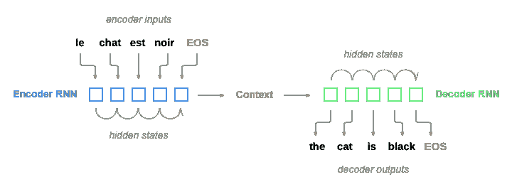
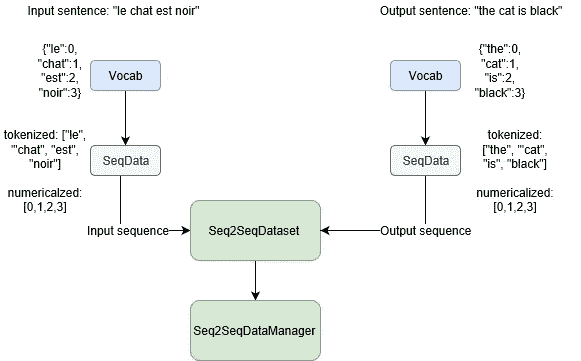
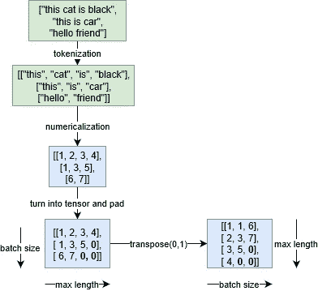
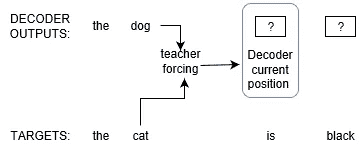
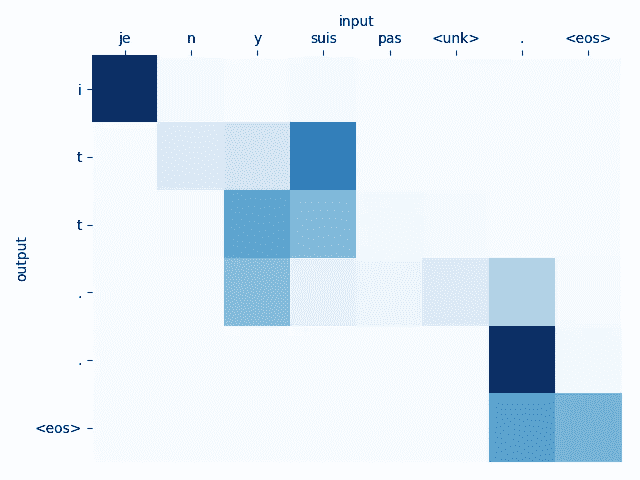

# seq2seq 教程的调整版本

> 原文：<https://towardsdatascience.com/tuned-version-of-seq2seq-tutorial-ddb64db46e2a?source=collection_archive---------7----------------------->

这是我对 [seq2seq 教程](https://github.com/spro/practical-pytorch/blob/master/seq2seq-translation/seq2seq-translation-batched.ipynb)的更新。这个帖子的代码可以在[这里](https://github.com/RRisto/seq2seq)找到。本次更新的目的是教育:获得关于 seq2seq 模型的更深入的见解，并实现深度学习(和 pytorch)的一些最佳实践。非常感谢 [fastai](https://www.fast.ai/) 的灵感。特别有用的是 [nn 教程](https://pytorch.org/tutorials/beginner/nn_tutorial.html)和 fastai [github](https://github.com/fastai/fastai) repo。代码用 python 3.7.1 编写(也在 python 3.6 上测试过)，使用 pytorch 版本 1.0.1.post2。

我应用的更改:

*   代码重构:分离数据管理和模型训练的类
*   单独的**验证数据集**。这提供了比训练数据更真实的模型性能图。训练损失/准确度将总是小于/高于验证集。如果没有验证集，您如何知道自己没有过度拟合？
*   标记化是**多重编码**
*   使用**预训练单词向量的可能性**
*   增加了**老师强行**
*   pytorch 版本 1 的小代码更新。

现在让我们快速介绍一下 seq2seq，然后查看更新。

## seq2seq 快速介绍

seq2eq 模型的介绍可以在原版[教程](https://github.com/spro/practical-pytorch/blob/master/seq2seq-translation/seq2seq-translation-batched.ipynb)中看到。在这里，我将给出非常简要的概述。Seq2seq 模型是由两个[递归神经网络](https://en.wikipedia.org/wiki/Recurrent_neural_network) (RNNs)组成的模型。其中一个将输入序列编码成上下文向量，另一个将其解码成输出序列(例如一种语言的句子到另一种语言的句子)。



Seq2seq scheme. [Source](https://github.com/spro/practical-pytorch/blob/master/seq2seq-translation/seq2seq-translation-batched.ipynb)

使用 seq2seq 的积极方面是任意长度的输入序列可以被“翻译”成任意长度的输出序列。从一种语言翻译成另一种语言通常比翻译单个单词更困难。输出序列可能比输入序列长或短。即使大小匹配，单词的顺序也可能不匹配。

seq2seq 学习的两个比较重要的概念是**注意**和**老师强制**。注意力帮助解码器“注意”输入序列的不同部分。这通常会提高模型性能，因为更细微的学习是可能的(仅使用编码的上下文向量会给学习所有细微差别带来沉重的负担)。我鼓励你去查阅原始的教程和谷歌来了解更多的细节。我将在下面的帖子中分享其中的一些。

## 数据管理

Pytorch 是一个很好的处理神经网络的库。但是它没有一种简便的方法来处理 sequence2sequence 数据集。这也是为什么我写了几个助手类[用于数据管理的原因。逻辑很简单:`Vocab`处理词汇(记号和它们相应的数字 id),`SeqData`处理单边序列(例如英语句子),`Seq2SeqDataset`处理具有相应序列的序列(例如英语句子和它们的法语翻译),并使我的数据集符合 pytorch `Dataset`类。`Seq2SeqDataManager`是一个处理整体训练和验证序列创建和管理的类。这可以从下面的方案中看出。](https://github.com/RRisto/seq2seq/blob/master/seq2seq/data/data_manager.py)



这些课程完全是定制的。一个例外是继承自 torch `Dataset`类的`Seq2SeqDataset`。它必须实现方法`__len__`(提供数据集的大小)和`__getitem__`(支持整数索引)。与 pytroch `Dataset`类兼容有助于我们稍后实现数据加载器。原始教程没有使用 pytorch 类进行数据管理。

有时输入/输出序列可能很长，这可能会使他们难以学习。这就是为什么`Seq2SeqDataset`和`Seq2SeqDataManager`可以选择过滤出符合长度标准的序列。`Seq2SeqDataManager`发动机罩下的所有处理:

```
MIN_LENGTH = 3 #min nr of tokens in sequence so that 
#sequence is kept (otherwise removed) 
MAX_LENGTH = 15 #max nr of tokens in sequence so that 
#sequence is kept (otherwise removed)
MIN_COUNT = 3 #min count of token occurences so that it is not 
#transformed to <unk> tokendata_manager = Seq2SeqDataManager.create_from_txt('data/eng-fra_sub.txt','en', 'en', min_freq=MIN_COUNT, min_ntoks=MIN_LENGTH,                                           max_ntoks=MAX_LENGTH, switch_pair=True)
```

## 批处理，数据加载器

数据加载器有助于训练，它们从训练/验证数据中抽取样本，并将其转换成一批。批处理是一组用于训练/验证的序列。更清晰的解释见下图。



Process of turning batch of input sequence to training/validation tensor

从输入序列(句子)中，我们得到记号，并从中得到记号数字 id。然后，我们从最长到最短的序列对令牌进行排序，并用填充 id 填充较短的序列(在示例 0 中)。这是在数字化序列被转换成 pytorch 张量之后完成的。当前示例中的批量大小为 3(我们有 3 个序列/句子)。为了训练，我们转置张量(改变轴 0 和 1 的顺序)。在我们每行有一个序列之前，在转置之后，我们在一行中有每个序列的第一令牌 id。

标记化和数值化在初始数据准备期间完成。使用数据加载器将一批数据转换成张量并进行转置。`DataLoader`是一个 torch 类，帮助迭代序列。创建一个很简单，这是我的[示例](https://github.com/RRisto/seq2seq/blob/master/seq2seq/data/data_manager.py)中的示例:

```
train_dataloader = DataLoader(self.train_seq2seq,
    batch_size=self.train_batch_size, 
    collate_fn=self._collate_fn)
```

这就是遵从 torch `Dataset`有用的地方:我们可以将它作为输入提供给`DataLoader`。第二个参数显示了我们每次运行需要多少个序列，而`collate_fn`是我们的自定义函数，用于将序列转换为转置填充张量。在我们的示例中，函数执行以下操作:

```
#this is a bit simplified from the one in github example
#[https://github.com/RRisto/seq2seq/blob/master/seq2seq/data/data_manager.py](https://github.com/RRisto/seq2seq/blob/master/seq2seq/data/data_manager.py)
def _collate_fn(self, data:list):
        #data is list of sequences (each list element is a list of 
        #input and corresponding output token ids, example:
        #[[[1, 2, 3, 4],[1, 3, 5]],
        #[[1, 2, 3, 4],[1, 3, 5]]] #sort sequences from longest to smallest using input 
        #sequence lengths
        data.sort(key=lambda x: len(x[0]), reverse=True) 

        #zip into separate input, output sequences
        input_seq, target_seq = zip(*data)

        #turn into tensors, pad and transpose and calc seq lengths
        input_tens, input_lens = self._to_padded_tensor(input_seq)
        target_tens, target_lens = self._to_padded_tensor(target_seq) return input_tens, input_lens, target_tens, target_lens
```

要获得数据加载器，我们可以使用`Seq2SeqDataManager`并查看第一批训练:

```
train_dataloader, valid_dataloader = data_manager.get_dataloaders() #lets see one batch from training data
next(iter(train_dataloader))
```

最后一行代码应产生类似于以下内容的输出:

```
(tensor([[ 25, 135,  25,  95,  41,   0,   0,   0,  96, 117],
         [  0, 163,   0,  29,   5,   5,   4,   5,   5,   5],
         [  5,   5,   5,   5,   3,   3,   3,   3,   3,   3],
         [  3,   3,   3,   3,   1,   1,   1,   1,   1,   1]]),
 tensor([4, 4, 4, 4, 3, 3, 3, 3, 3, 3]),
 tensor([[  0, 162,  74,  74,  14,  65,   0,  74,  48,  48],
         [  7,   7,   7,   7,   4,   7,   4,   7,   7,   7],
         [  3,   3,   3,   3,   3,   3,   3,   3,   3,   3]]),
 tensor([3, 3, 3, 3, 3, 3, 3, 3, 3, 3]))
```

第一个张量是输入张量(转置，由我们的`collate_fn`产生)，第二个是输入序列长度的张量，第三个输出张量和第四个输出序列长度的张量。

如您所见，我定制了数据处理部分，但是对于模型的数据输入，我使用了 pytorch 类。定制 pytorch 类非常方便(pytorch 文档非常有用)。这避免了从头开始编写所有内容(和一些调试),并且只定制 pytorch 中没有的内容。

## 学习者

为了管理编码器和解码器的初始化和训练，我创建了`[Seq2SeqLearner](https://github.com/RRisto/seq2seq/blob/master/seq2seq/model/seq2seq_learner.py)`类。基本上这个类初始化我们的 seq2seq 模型。创建很简单，您需要 data_manager 并指示隐藏层大小:

```
hidden_size=300
learner=Seq2seqLearner(data_manager,hidden_size)
```

在最初的教程中，事情有点松散(不是在函数/类中)，这使得处理它们更容易出错。`[Seq2SeqLearner](https://github.com/RRisto/seq2seq/blob/master/seq2seq/model/seq2seq_learner.py)`是火炬`nn.Module`的子类。这继承了它的一些方法。我们可以看到我们模型的架构:

```
learner
```

产出:

```
Seq2seqLearner(
  (encoder): EncoderRNN(
    (embedding): Embedding(285, 300, padding_idx=1)
    (gru): GRU(300, 300, num_layers=2, dropout=0.1, bidirectional=True)
  )
  (decoder): LuongAttnDecoderRNN(
    (embedding): Embedding(269, 300, padding_idx=1)
    (embedding_dropout): Dropout(p=0.1)
    (gru): GRU(300, 300, num_layers=2, dropout=0.1)
    (concat): Linear(in_features=600, out_features=300, bias=True)
    (out): Linear(in_features=300, out_features=269, bias=True)
    (attn): Attn()
  )
)
```

拥有学习者类有助于将所有培训、验证和预测相关代码集中在一起。`[Seq2SeqLearner](https://github.com/RRisto/seq2seq/blob/master/seq2seq/model/seq2seq_learner.py)`中最重要的方法是 fit(训练/验证编码器，解码器用户给定的历元数)，forward(训练/评估编码器/解码器在一个历元中的单个批次)，predict(使用编码器，解码器对新序列预测输出)。

## 验证集

当我们训练模型时，验证集的有用性变得很明显。

```
#initialize learner
hidden_size=300
learner=Seq2seqLearner(data_manager,hidden_size)batch_size=100
learning_rate=0.001
learner.fit(2,learning_rate, show_attention_every=5, show_attention_idxs=[0])
```

我们可以看到训练产生了这样的东西:

```
0:0:25.0 (1 50.0%) loss train: 3.712 loss valid: 3.179
0:0:25.3 (2 100.0%) loss train: 2.491 loss valid: 3.152
```

这是一个具有 2 个纪元的玩具示例，但是我们已经可以看到训练损失显著减少，而验证损失几乎没有变化。原始示例使用数据中的随机文本来显示模型输出。这还不错，在我的例子中也是这样做的，但这并不能概括我们在更广泛/量化的范围内做得如何。培训损失下降得非常快，但是验证损失趋于缓慢下降，并在某个点饱和。这个点显示了我们开始过度拟合的地方。始终使用验证集！

## 令牌化是多核的

我还更新了令牌化，以利用多核的优势(如果您的计算机有多个内核的话)。这样做的函数在[标记化](https://github.com/RRisto/seq2seq/blob/master/seq2seq/data/tokenizer.py)模块中:

```
def proc_all_mp(self, strings:list, ncpus:int=None):
        #get number of cpus, make sure it is not 0
        ncpus = ncpus or num_cpus() // 2
        if ncpus == 0:
            ncpus = 1
        #apply function proc_all (basically turns string 
        #into tokens of words) to a list of strings so that strings
        # list is partitioned by number of cores 
        #each gets roughly equal size
        with ThreadPoolExecutor(ncpus) as e:
            return sum(e.map(self.proc_all, \ 
                   partition_by_cores(strings, ncpus)), [])
```

功能`partition_by_cores`和`partition`也很简单:

```
def partition_by_cores(a, ncpus):    
    sz=(len(a) // ncpus) or 1 #if ncpus is more than len(a) 
    return partition(a, sz)def partition(a, sz):    
     """splits iterables a in equal parts of size sz"""
     return [a[i:i + sz] for i in range(0, len(a), sz)]
```

这利用了多核计算机的优势。在序列列表较长的情况下，多核处理有助于节省时间。这部分纯属抄袭 [fastai](https://github.com/fastai/fastai) 库。

## 预先训练的单词向量

改进模型的一种方法是初始化嵌入，不是用零或随机浮点，而是用预训练的字向量。这应该已经编码了一些关于不同单词之间关系的信息。例如，facebook 收集了这些在这里找到的。使用`data_manager`加载它们:

```
#first one is for input sequence, second output
data_manager.load_ft_vectors('data/wiki.en.vec', 'data/wiki.fr.vec')
```

保留当前词汇所需的向量。之后，初始化模型和训练。一个重要的注意事项:`hidden_size`和单词向量的长度必须匹配(例如，我希望每个单词向量的长度为 300)！

```
hidden_size=300 
learner=Seq2seqLearner(data_manager,hidden_size)
```

也可以使用自定义单词向量，从技术上讲，它们必须是字典:

```
hidden_size = 2 
#silly vectors with length of two and only with two tokens
x_silly_wordvector = {'this':[-0.3,0.2],'is':[0.1,0.5]}
y_silly_wordvector = {'le':[-0.4,0.2],'cat':[0.6,0.5]}learner = Seq2seqLearner(data_manager,hidden_size,
    emb_vecs_x = x_silly_wordvector, 
    emb_vecs_y = y_silly_wordvector)
```

尝试它们，它们使训练更快(使用更少的时期，你应该得到类似或更好的结果，因为没有预先训练的单词向量)。

## 在教师的强迫和关注下进行培训

原例说了几个关于老师强制的话，但没有实现(除了变量`teacher_forcing_ratio`被初始化但没用过)。我通过添加几行代码解决了这个问题:

```
if random.random() < self.teacher_forcing_ratio: 
                    #next input istaken from target
                    decoder_input = target_batches[t]                else: 
                    #next input is taken from decoder prediction
                    decoder_input = decoder_output.data.max(1)[1]
```

这随机选择将什么作为下一次预测的输入提供给解码器:

*   先前解码器输出或
*   以前的实际目标(如果高于阈值)

下图描述了为什么这很重要。



Example of teacher forcing

在模型训练期间，解码器一次给出一个输出(在图中为一个令牌)。这意味着前一个输出会影响下一个输出。解码器可能会给出错误的猜测(在图形中，真实的令牌应该是“猫”，但解码器预测的是“狗”)。这反过来可能会导致其他不可预测的输出完全错误(标记为“？”)例如)令牌。教师强制确保我们偶尔不使用解码器先前的输出作为下一个预测的输入，而是使用真实的目标值。这可能有助于模型更快地收敛。现在我们准备训练模型。

训练本身很简单:

```
batch_size=100
learning_rate=0.001
learner.fit(2,learning_rate, show_attention_every=5, show_attention_idxs=[0])
```

通常你希望有尽可能大的批量来满足你的记忆。要使用 cuda(或特定设备),只需将其设置为 fit:

```
learner.fit(2,learning_rate, show_attention_every=5, show_attention_idxs=[0], **device='cuda'**)
```

在培训过程中，您将会看到所指示的验证批次序列的注意事项`show_attention_idxs=[0]`指示索引为 0 的验证批次序列(第一个序列)注意事项会在每 5 个时期(`show_attention_every=5`)后显示。



Example decoder attention

解码器注意力只是一个应用于输入以获得输出的权重矩阵(张量)。从左图中，我们可以看到在每次输出预测中，解码器关注的是输入序列的哪一部分。例如，在输出标记“I”的情况下，注意力集中在输入标记“je”上。

训练后，学习者可以用来进行预测:

```
learner.predict('Je suis sûr.', device='cpu')
```

这可能会给出类似的输出:

```
i <unk> . <eos>
```

请注意，在训练过程中，我们为每个序列添加了一个字符串结束标记“<eos>”(以便解码器知道它何时到达了末尾)。我们可以使用我们想要的任何设备(默认为 cpu)进行预测，学习者被转换为在运行中使用该设备。</eos>

## 失败，棘手的部分

棘手的部分是储蓄。这是我想通过使用`torch.save`来使用`nn.Module`全部力量的地方，但是发现我的使用 spacy 的记号赋予器有酸洗的问题。相反，保存分两步完成:

*   保存数据 _ 管理器
*   保存学习者状态字典(点击阅读更多关于保存状态字典的信息)

```
data_manager.save('example_data_manager.pth')
torch.save(learner.state_dict(), 'example_state_dict.pth')
```

加载以相同的顺序完成，但多了一个步骤:

*   加载数据 _ 管理器
*   初始化学员对象
*   向学员添加保存的状态字典

```
data_manager_new=Seq2SeqDataManager.load('example_data_manager.pth')
model=Seq2seqLearner(data_manager_new,hidden_size) 
model.load_state_dict(torch.load('example_state_dict.pth'))
```

在场景后面，data_manager 在保存期间将 tokenizer 设置为`None`，并在加载期间重新初始化它们。我知道，这不是最有说服力的解决方案，但我不想浪费时间，因为它毕竟只是一个教程。

## 摘要

这是对原始教程的温和更新。我希望你能从这篇文章中学到一些东西。为了更好地理解 seq2seq 模型，请深入研究教程代码。更好的是尝试做出改变。我希望我在以下几点上说服了你:

*   官方的例子可能有缺陷，要持怀疑态度。努力改善他们！
*   在 pytorch 的情况下，尽可能多地使用原始的类和方法，您不必从头开始编写所有的东西(尽管出于学习的目的，这并不是一个坏主意)
*   Seq2seq 型号很酷:)

祝你更新我的例子愉快。