# 在命运大令上调整多任务 Pytorch 网络

> 原文：<https://towardsdatascience.com/tuning-a-multi-task-fate-grand-order-trained-pytorch-network-152cfda2e086?source=collection_archive---------16----------------------->

在之前的帖子中，我在 Keras ( [here](/multi-task-learning-on-fate-grand-order-with-keras-261c5e8d3fb8) )中做了一些多任务学习，在完成那篇帖子后，我想在 Pytorch 中做一个多任务学习的后续帖子。这主要是因为我认为在另一个框架中构建它对我来说是一个很好的练习，然而在这篇文章中，我将讲述我如何在构建模型后做了一些额外的调整，这是我在构建基于 Keras 的模型时没有经历的。

我还将这个模型作为我在另一系列帖子中建立的面部相似度管道的一部分([第一部分](/finding-familiar-faces-with-a-tensorflow-object-detector-pytorch-feature-extractor-and-spotifys-3e78858a8148)和[第二部分](/deeper-dive-into-finding-similar-faces-with-spotifys-annoy-tensorflow-and-pytorch-c434897bd627))。

简单回顾一下，多任务模型是指单个模型通过优化来解决一系列通常相关的问题。从机械上来说，这是通过将来自模型管道的某个核心部分的输出馈送到一系列输出“头”来完成的，这些输出“头”的损耗可以被评分和组合，通常通过相加，然后网络可以根据总损耗来调整其权重。

我注意到，在培训这些人的时候，集中精力提高单个任务的难度有点大，因为用于优化的损失函数是通过将各个损失函数相加而创建的。然而，通过对 Pytorch 网络的一些早期实验，我发现传统的调优策略相当有效。

我使用的基本调整策略是吴恩达在他的在线讲座中概述的策略，其中大多数机器学习算法都在方差和偏差之间进行权衡，但对于神经网络来说，情况并非如此。有了神经网络，这种权衡就不那么令人担心了，因为我们可以使用不同的机制来解决这两个问题。在网络欠拟合的情况下，您可以增加额外的计算能力，在网络过拟合的情况下，您可以应用正则化，如丢弃或批量归一化。通过平衡这两种机制的应用，您可以调整您的网络。

> 在这篇文章中，所有的艺术图片都用最后一批标准化 pytorch 模型的输出进行了说明。

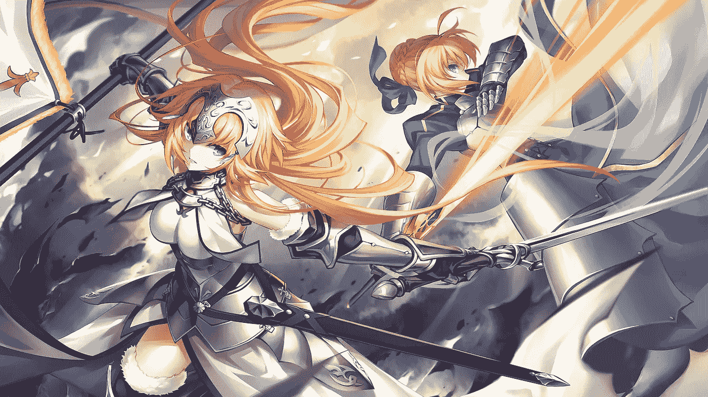

Gender: Female, Region: Europe, Fighting Style: melee, Alignment: LG, Main Colors: [‘Silver’, ‘Gold’, ‘Blue’]. Two characters, both are from Europe, use melee weapons, are LG in alignment and the colors seem pretty good.

# 数据集和管道

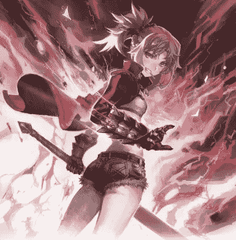

Gender: Female, Region: Asia, Fighting Style: melee, Alignment: CG, Main Colors: [‘Red’, ‘Black’, ‘White’]. This character is European and has a Chaotic Neutral alignment but figured I should include to show that the model puts out alignments besides LG and NE

这个项目的数据集与我之前的基于 Keras 的多任务学习帖子相同，它由手机游戏《命运大令》(FGO)中大约 400 个角色的图像组成。数据集由大约 40 个不同的字符和 26 个不同的标签组成，以创建多标签样式的数据集。

这些类别包括角色的性别，他们来自的地区，战斗风格，图像的主要颜色，以及角色排列(合法的好，真正的中立，混乱的邪恶，等等)。要了解更多细节，请查看之前的[帖子](/multi-task-learning-on-fate-grand-order-with-keras-261c5e8d3fb8)。

我必须做的另一个真正的修改是定制 Pytorch 数据集类，它接受一系列列表并输出图像和模型的 5 个目标向量。Pytorch 使得获取数据集类并根据需要修改它变得很容易。通常只需编写自己的 init、getitem 和 len 函数。我的大部分修改来自 getitem 部分，在那里我指定了如何读入图像并从目标列表列表中获取相应的目标，我戏称其为“列表之王”。

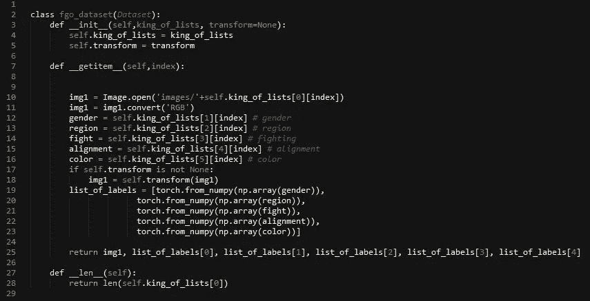

I like the colored code vs the grey code snippets you can add into the blog post

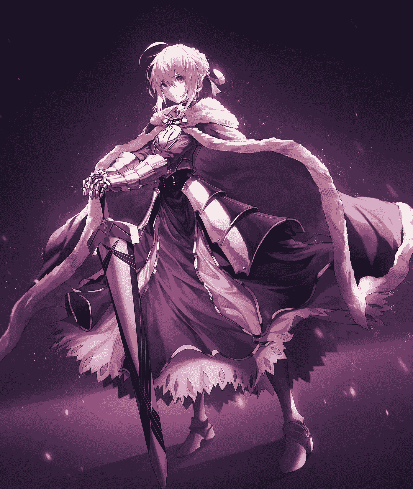

Gender: Female, Region: Europe, Fighting Style: melee, Alignment: NE, Main Colors: [‘Silver’, ‘Gold’, ‘Purple’]. Similar to the Keras model it looks like it has learned about the relationship between color and character alignment in the sense characters with evil alignments tend to be drawn with darker colors in FGO.

# 构建基本 Pytorch 模型

对于这一个，我的第一步是从一个非常基本的模型开始。我首先用 Resnet50 作为主干构建了一个模型，将它的输出送入 5 个输出头。

在 Pytorch 中构建定制网络非常简单，只需初始化需要在 init 部分优化的层和内容。然后，在 forward 部分定义数据如何流经模型。对于这个用例，我真正要做的是初始化核心模型(resnet50 ),然后将输出输入到我创建的 5 个 heads，y2o，y3o，y4o，y5o)中的每一个。这些是模型的输出，而不是你通常看到的标准的单一输出。

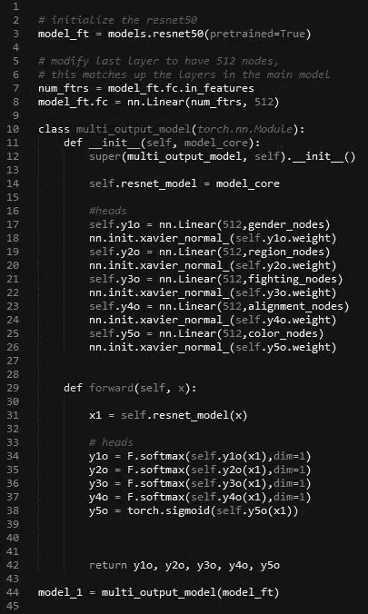

first model with just a Resnet50 and 5 output heads

要查看训练循环，请随意查看笔记本([此处](https://github.com/sugi-chan/pytorch_multitask))。很大程度上只是我在修改标准 Pytorch 网络。然而有趣的是损失函数是如何计算的。我原以为这样做起来会更复杂……但实际上非常简单……基本上我只是计算每个头部的损失(损失 0、损失 1、损失 2、损失 3、损失 4 ),将它们加在一起，然后用于反向传播。

```
loss0 = criterion[0](outputs[0], torch.max(gen.float(), 1)[1])
loss1 = criterion[1](outputs[1], torch.max(reg.float(), 1)[1])
loss2 = criterion[2](outputs[2], torch.max(fight.float(), 1)[1])
loss3 = criterion[3](outputs[3], torch.max(ali.float(), 1)[1])
loss4 = criterion[4](outputs[4], color.float())loss = loss0 + loss1 + loss2 + loss3 + loss4
loss.backward()
```

我用 Adam 优化器对这个基本模型进行了 50 个时期的训练，学习率为 0.0001，随着时间的推移而衰减，并保存了具有最佳验证损失的模型。请参见下面所有 5 项任务的得分。

```
val gender_Acc: 0.9390
region_acc: 0.6707
fighting_acc: 0.8537
alignment_acc: 0.7439
color_acc: 0.8384
```

总体不可怕，但也不伟大。然而，总的来说，它确实比我之前的文章《VGG 的 Keras》要好。

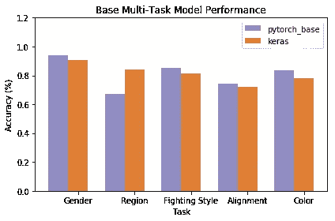

基本 Pytorch 模型通常优于 Keras 模型。这是有意义的，因为 Keras 模型使用 VGG19 模型作为冻结权重的主干，而这一轮的 Resnet 正在数据集上进行微调。

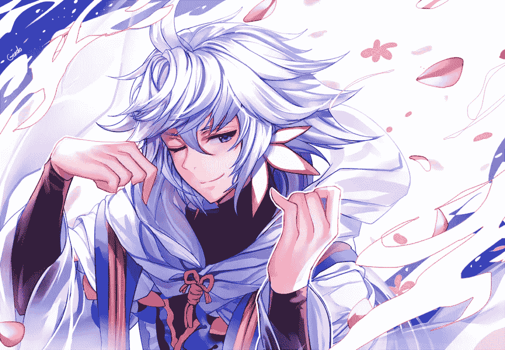

Gender: Male, Region: Middle East, Fighting Style: magic, Alignment: LG, Main Colors: [‘White’, ‘Blue’, ‘Purple’]. This one was good to see in the Pytorch model… because the Keras one would always label this character as “Female”. so this is another are where the new Pytorch models are well performing.

这是一个不错的开始，但我认为我可以提高所有车型的性能。基本上我认为 Pytorch 模型仍然不适合。作为回应，我添加了两个更密集的大小为 256 的图层，并将其输入到模型中。以下代码片段进行了修改。基本上只是增加了两层尺寸为 256 的 x1 和 x2。

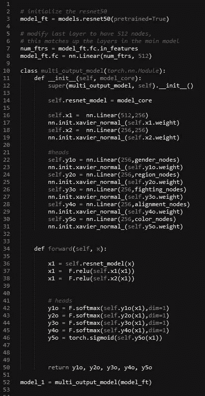

Added two layers x1 and x2 for extra firepower

在训练这个新模型之后，与我构建的基本 Keras 和 Pytorch 模型相比，训练和验证准确性有所提高，总体性能更好。

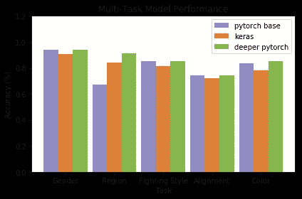

一方面，我们可以称之为一天，但我在这里注意到的另一件事是，虽然模型整体表现更好，但它现在过度适应训练集。请参见下面第二款产品的得分。

```
 Training
gender_Acc: 0.9877
region_acc: 0.9417
fighting_acc: 0.9509
alignment_acc: 0.7577
color_acc: 0.8723Validation
gender_Acc: 0.9390
region_acc: 0.9146
fighting_acc: 0.8537
alignment_acc: 0.7439
color_acc: 0.8506
```

现在它是过度拟合，我想我可以添加一些正则化来尝试和抵消它。这需要一些修补，但我发现在这种情况下，相对高水平的批处理规范化是有用的。在这次运行中，我最终使用 2e-1。

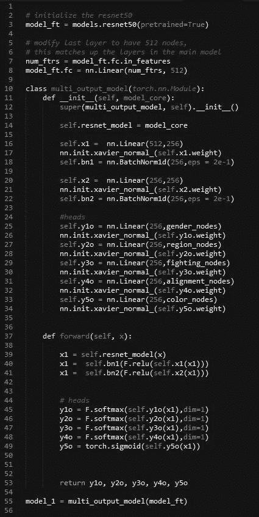

added bn1 and bn2 to act as regularization

在这第三轮之后，增加了批量标准化的模型显示，在排列上比以前的最佳准确度增加了大约 10 个百分点，我认为这是最难的类别，在战斗风格上增加了 5 个百分点。而在性别和肤色上有所下降。它与给定字符的起源区域相关联。所以总的来说，我会说这部分有混合的成功，但确实有助于一个困难的类别。

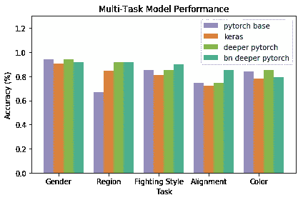

```
Training
gender_Acc: 0.9816
region_acc: 0.9540
fighting_acc:  0.9632
alignment_acc: 0.8926
color_acc: 0.8129Validation
gender_Acc: 0.9146
region_acc: 0.9146
fighting_acc: 0.9024
alignment_acc: 0.8537
color_acc: 0.7912
```

需要注意的是，虽然我添加了批处理规范来尝试和减少过度拟合，但训练和验证之间的差距与以前类似…然而，模型的预测似乎比以前概括得更好，这也是添加正则化的目标结果之一。


Gender: Female, Region: Middle East, Fighting Style: ranged, Alignment: NE, Main Colors: [‘Blue’, ‘Gold’, ‘Black’]. Character has a LG alignment and don’t quite see the blue here, but the rest of the details are pretty good.

# 结论和总结

我认为这个简单的调优过程是一个很好的指标，表明您在普通网络上使用的策略仍然可以应用于多任务模型。这其中的一个困难是，很难针对多任务模型中的特定缺陷，现在我只是针对更大的总体问题(所有节点的过度拟合和欠拟合)。在这些头上添加额外的层和节点是一个选项，但随后会成为您需要调整的额外的超参数。

因此，最终的两个模型表现得相当相似，基础更深的网络在颜色和性别方面表现得更好，在区域方面打成平手，而批量标准化模型在战斗风格和对齐方面表现得更好。

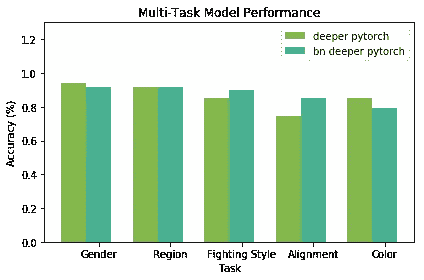

这就提出了选择什么模式的问题。你可以计算 Fbeta 之类的东西来处理它，尝试在所有不同的任务中做出一个组合的度量。如果你的目标是拥有一个单一的最佳模型，那么拥有这个单一的度量标准是有意义的。

如果你对使用多个模型持开放态度，另一个选择是采用表现良好的模型，并集合它们进行预测。这将允许您利用每个不同模型的性能更好的区域。我认为这在这种情况下是可行的，即一个模型在比对类别上表现更好，而第二个模型在多个不同类别上表现更好，差距较小。

在另一种情况下，你有一个较低的执行任务，在这种情况下，颜色不太好，你可能会成功地将专门的模型添加到整体中，以尝试和提高这些领域的性能。

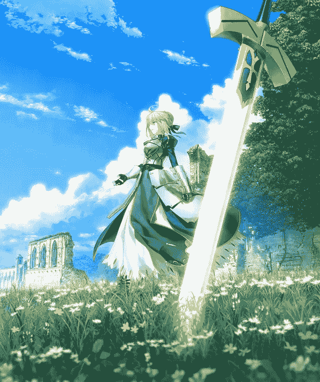

Gender: Female, Region: Europe, Fighting Style: magic, Alignment: LG, Main Colors: [‘Blue’, ‘White’, ‘Silver’]. 15th anniversary photo for the character, only thing wrong with the predicted outputs I would say is the fighting style… there is a sword stuck in the ground but the model says she uses magic