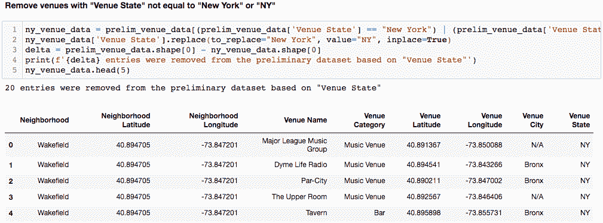
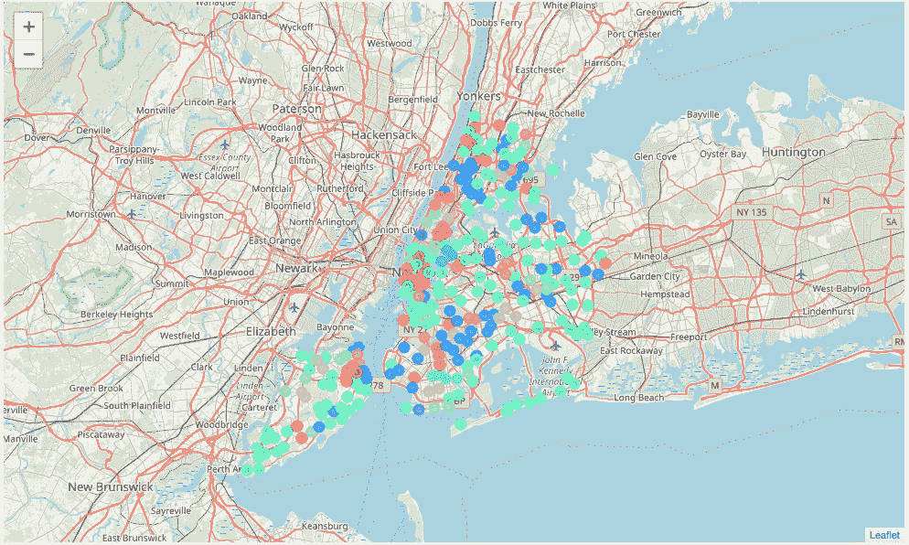
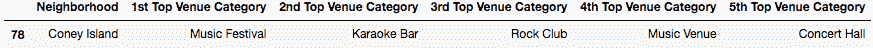

# 收听纽约的音乐街区

> 原文：<https://towardsdatascience.com/tuning-in-to-nycs-music-neighborhoods-efb7ae77a4cd?source=collection_archive---------17----------------------->

## K-Means 通过音乐档案聚类邻居

# 摘要

机器学习允许创建能够识别多维数据集中的模式的计算模型。这个项目旨在利用 Foursquare 的“Places API”和一种叫做“k-means clustering”的机器学习算法来识别具有类似“音乐档案”的“纽约市”社区。

# 介绍

## 背景

音乐是一种艺术形式，已经并将永远深深地嵌入城市、社区和更广泛的人群的文化活动中。音乐是一种交流和表达的方式，有时甚至是抗议的方式，它有能力和平地将大量志同道合的人聚集在一起，影响流行文化，用一首令人难忘的歌词催眠你，让你在淋浴时潜意识地连续几周唱歌，即使在有意识地对自己这样做感到失望之后…..我跑题了……

## 问题

城市在某种程度上是由音乐实体组成的，如唱片店、乐器供应商、音乐厅、圆形剧场等等，它们不仅满足当地居民的音乐需求，也满足来自世界各地的游客的需求。对于较大的城市，音乐实体可以分散开来，从而形成一个随着时间的推移而发展和变化的时尚利基社区生态系统。这种生态系统通常由寻找酷音乐场景的人通过自然生活体验(流浪/浪荡)或以互联网评论、评论和与现实生活中的人交谈的形式推荐来了解。

这个项目旨在量化一个大都市纽约市的社区的“音乐档案”,以识别相似音乐场景的集群。

## 利益相关者

不同的团体可能对能够基于可用音乐商店的类型来量化邻域相似性的模型感兴趣。这种模型将能够通知那些喜欢住在音乐发生的地方的租房者和购房者，他们的下一个家就在合适的位置。未来的音乐场所初创企业可以利用该模型来识别缺乏现场音乐场所的社区，并确保他们投资于一个未饱和的地区。未来的音乐零售商，如唱片和乐器销售商，同样可以利用这种模式来确保他们开展的业务中竞争对他们有利。

# 方法学

## 数据源

*NYU 空间数据仓库:*我使用 NYU 空间数据仓库托管的“2014 年纽约市街区名称”数据集作为街区名称和相关位置质心的基础[0]。下图显示了此信息的一个示例:

DataFrame created from NYU’s ‘2014 New York City Neighborhood Names’

*Foursquare—‘Places API’*:我将使用 four square 的‘Places API’来获取与‘场馆’(four square 定义的)相关的数据，这些数据被归类为与音乐有某种关联[1]。值得注意的是，Foursquare 将“地点”定义为一个人们可以去或签到的地方，并且“地点”不一定是音乐地点，而是可以是任何机构，如餐馆或零售商店。每个 Foursquare“地点”被分配一个“类别”，每个“类别”与一个特定的“类别 ID”相关联。右图显示了 Foursquare 提供的“categoryID”值，该值将用于获取纽约市内与音乐相关的场所:

Foursquare Music-Related Venue CategoryIDs

## 资料检索

*街区名称&位置质心数据:*由 NYU 空间数据仓库托管的“2014 年纽约市街区名称”数据集可轻松下载为 JSON 文件并导入 Jupyter 笔记本:

Importing the newyork_data.json fie

然后，将与每个邻域相关的“区”、“邻域”、“纬度”和“经度”值从 JSON 转换为 Pandas 数据框架，作为分析的基础。

Creating a DataFrame out of the JSON data

*Foursquare 音乐相关场地数据* : 如本报告数据来源部分所述，Foursquare 拥有众多的“[场地类别](https://developer.foursquare.com/docs/resources/categories)，用于标识各类场地。对“API . four square . com/v2/ventures/search？”的“get”请求提供类别 ID 的端点将返回该类别的地点。下面的示例代码向 Foursquare 发送一个“get”请求，请求一个属于“音乐商店”类别的场所(categoryID = ' 4 BF 58 DD 8d 48988 D1 Fe 941735 '):

Example Foursquare Places API Request

通过递归地发送“get”请求到前面提到的端点，确保结果特定于具有音乐相关“类别 id”的场所，创建了与每个纽约市街区相关的音乐相关场所的初步数据集。对于每个邻域，我们可以在一个“get”请求中包含所有选定的类别 id，方法是将它们作为逗号分隔值传递。下面显示了一个创建所需 url 的函数和一个示例:

Dynamically creating API request URLs

下面的函数递归地向 Foursquare 发送一个“get”请求，请求所有与音乐相关的地点。在遍历 NYU 数据集中的每个邻域时，该函数将每个与音乐相关的地点条目附加到一个列表中，并且在遍历每个邻域后，创建所有结果的数据帧。对于数据集中的每个条目，包括邻居名称和位置，以及地点名称、位置和类别。

Recursively retrieving music-related venues for each New York City neighborhood

最终的初步场馆数据框架包括从 Foursquare 中抽取的 9，442 个场馆:

9,442 venues were pulled from Foursquare

由于我对超出 Foursquare 的 API 速率限制有一些问题，在获得初步数据集后，将一个副本保存到 csv，以便将来的开发不需要从 Foursquare 重新请求信息。

Write data to csv

Sample of csv file

# 探索性数据分析

下面的一系列图片旨在捕捉我探索从 Foursquare 检索的数据的过程，以更好地了解在我的请求期间实际上是什么样的场地。在一个完美的世界中，每个条目都与音乐相关，并且位于纽约市，但是这需要被验证。以下问题说明了如何对初步场馆数据进行预处理，如本报告的数据预处理部分所示。

## **问题**:场馆位于哪些州？

**回答**:从 API 请求中提取的大多数条目都包含一个等于“纽约”或“NY”的“州”参数某些条目包含等于“CA”、“MA”和“NJ”的“state”参数，需要删除。

Showing the Venue State counts

## **问**:参赛作品属于哪个场馆类别？

**答**:这个数据集中有 149 个独特的场馆类别。有些类别与音乐无关，这是因为使用了 Foursquare 定义的更高级别的“场地类别”。与音乐无关的类别将被删除。

Showing the Venue Category counts

## **问题**:有多少场馆没有填写“城市”参数？

**答**:下图显示有不少场馆没有填写“城市”参数。起初，我认为这不会是一个问题，因为我仍然有一个与每个条目相关联的纬度和经度。经过进一步分析，确定没有“城市”参数的条目不再是活跃的机构，因此将被删除。

Showing venues that do not have a Venue City parameter

## **问题**:数据集中有空值吗？

**回答**:没有。

Checking for null values in the data

## **问题**:检索到多少个独特场馆？

**答**:初步数据集中，唯一场馆名称比条目总数少。这意味着存在与多个邻近区域相关联的场所，这是由于 API 请求中半径被设置为 1000 米而导致查询重叠的结果。这是可以接受的，因为场地在邻近区域质心的步行距离内，可以影响邻近区域的场景。

Checking for duplicate Venue Names

# 数据预处理

## 数据清理

根据上面探索性数据分析部分中列出的答案清理初步数据集。首先，位于“纽约”或“NY”以外的州的场馆被移除。“地点州”等于“纽约”的条目被更改为“纽约”

Removing venues not in New York state

Foursquare 返回的没有“场馆城市”并给予“不适用”待遇的条目也被删除:

Removing venues with no Venue City parameter

基于包括在初步数据集中的独特场所类别，创建了音乐相关场所类别的列表。这个列表用于过滤掉混入我们请求中的与音乐无关的条目。

Removing venues that are not music-related

下图显示了 ny _ music _ venues 数据帧中的条目总数和唯一条目数。如前所述，一些场馆被分配给多个街区，因为场馆位于街区质心位置的 1000 米以内。

Checking for duplicate venues

## 一键编码场馆类别

为了使用 Foursquare 的类别值来找到基于音乐场所的相似邻居，使用 Pandas 的“get_dummies”功能创建了每个条目的一个热编码表示。结果是纽约市音乐相关场所的数据框架，其中条目场所类别由匹配场所类别列中的值 1 表示，如下所示:

One-Hot-Encoding categorical variables

## 数据可视化

使用 one hot encoded DataFrame 确定了纽约市每个场馆类别和街区的场馆数量:

Total amount of venues of each category in each neighborhood

使用上面显示的场馆数量的数据框架，为选定的场馆类别创建了水平条形图，以帮助可视化每个特定场馆最多的前 25 个社区。使用以下循环和 matplotlib:

Code for recursively plotting top neighborhoods with venues of particular category

拥有最多“音乐厅”的社区

拥有最多“音乐场所”的社区

拥有最多“夜总会”的社区

“爵士俱乐部”最多的街区

“钢琴酒吧”最多的街区

## 特征生成

纽约市音乐相关场所的编码数据集随后被用于量化每个街区的音乐概况。对于每个场馆类别，计算了场馆在每个社区的分布百分比。然后，该信息将用于使 K-Means 聚类算法适合数据，以努力确定相似音乐场所简档的邻域。

首先，确定每个类别的场馆总数:

Creating a dictionary of venue category and total count

最后，根据场馆类别，计算每个街区的场馆相对于数据集中场馆总数的百分比。很明显，Astoria 的“Lounge”列中显示的值表示位于 Astoria 的休息室在数据集中所占的百分比。

Percentage of entities of particular venue in a particular neighborhood

根据上述内容，创建了一个数据框架，显示每个街区的前五大音乐场所类别:

Showing the top five venue categories per neighborhood

# 结果

## 集群建模

Scikit-learn 的 K-Means 聚类用于根据音乐场所百分比确定相似的邻域。下图显示了正在缩放的数据和正在创建的 K 均值模型:

Clustering neighborhood venue data

一个新的数据框架是通过合并邻居位置数据和聚类标签和顶级场馆类别创建的。

Merging neighborhood location and cluster data

## 集群可视化

以下代码通过基于分类标签对每个邻域点进行着色，使用 follow 来可视化相似音乐配置文件的邻域:

Code to generate a folium leaflet map with neighborhoods colored by cluster

Map of New York City showing clusters

## 聚类评估

下面的代码遍历并打印每个分类的结果:

Code to iterate through and print each cluster

由此产生的集群可以在本文档附录的集群部分看到。每个聚类显示一个邻域列表及其各自的顶级场馆类别。我们可以将得到的聚类与数据可视化部分中的条形图进行比较，并根据与音乐相关的场地计数来判断聚类是否正确地对邻近区域进行了分组。

有趣的是，一些集群非常小，有时只包含一个邻居，并且似乎已经确定了一个利基音乐简档。这方面的例子有:

*集群 1 —康尼岛—音乐节(康尼岛音乐节)*

*第二组团——林肯广场——歌剧院(大都会歌剧院)*

诸如集群 4 和集群 7 的其他集群非常大，并且看起来是具有诸如音乐场所、夜总会、摇滚俱乐部、休息室等各种现场音乐类型场所的分组邻居。

集群 9、11、12、13 和 14 的集群间第一大场馆类别都是相同的；爵士俱乐部、录音室、摇滚俱乐部、爵士俱乐部和钢琴俱乐部。有趣的是，集群 9 和集群 12 都主要对爵士乐感兴趣，但由于它们的其他顶级场所类别不同，这意味着不同的音乐概况，所以它们被不同地分组。

# 结论

机器学习和聚类算法可以应用于多维数据集，以发现数据中的相似性和模式。使用*高质量*场地位置数据，可以生成具有相似音乐简档或任何简档的邻居的聚类。关于*高质量*有一个前言，因为分析模型的好坏取决于对它们的输入(垃圾输入，垃圾输出)。幸运的是，Foursquare 提供了一个强大的“位置 API”服务，虽然(正如我们所看到的)并不完美(没有什么是完美的)，但可以在类似的研究和模型制作中加以利用。

这个项目并没有完成，可以用不同的方式进行扩展。Foursquare 的 API 可以被进一步询问，以检索和考虑纽约市更多与音乐相关的场所。可以获得音乐相关场所的新数据集，并可能与从 Foursquare 检索到的数据集合并。DBSCAN 聚类算法在保持密集聚类和忽略异常值方面更好，可以实现该算法并与 KMeans 进行比较。该聚类模型可以成为推荐系统的基础，该推荐系统旨在向用户提供相似音乐档案的邻居。

我期待着在未来继续探索和利用音乐相关的数据集。

GitHub 项目:[https://github.com/cascio/IBM_Data_Science_Capstone](https://github.com/cascio/IBM_Data_Science_Capstone)

个人领英:[https://linkedIN.com/in/mscascio](https://linkedIN.com/in/mscascio)

个人网站:[https://cascio.co](https://cascio.co)

推特:【https://twitter.com/MCasiyo 

# 参考

[0] — [2014 纽约市街区名称— NYU 空间数据仓库](https://geo.nyu.edu/catalog/nyu_2451_34572)

[1]—[‘Places API’文档— Foursquare](https://developer.foursquare.com/docs/api/endpoints)

# 附录

## 簇

> 群集 0:

> 群组 1:

> 第二组:

> 第三组:

> 第 4 组:

> 第 5 组:

> 第 6 组:

> 第 7 组:

> 第 8 组:

> 第 9 组:

> 第 10 组:

> 第 11 组:

> 第 12 组:

> 第 13 组:

> 第 14 组:

