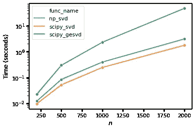
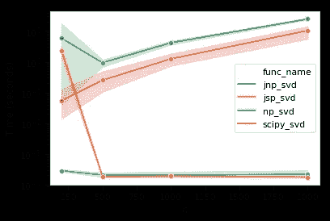
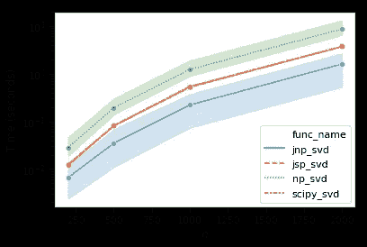

# 带 JAX 的涡轮增压 SVD

> 原文：<https://towardsdatascience.com/turbocharging-svd-with-jax-749ae12f93af?source=collection_archive---------22----------------------->

在[之前的文章](/pca-and-svd-explained-with-numpy-5d13b0d2a4d8)中，我写了两种常用的降维方法的基本原理，奇异值分解(SVD)和主成分分析(PCA)。我还用 numpy 解释了他们的关系。快速回顾一下，一个以 0 为中心的矩阵 ***X*** *(n 个样本× m 个特征*)的奇异值(***∑***)*)，等于其特征值的平方根(***λ***)，使得使用 SVD 计算 PCA 成为可能，这通常更高效。*

*在这篇文章中，我将探索一些 SVD 算法，并用 Python 对平方稠密矩阵( ***X*** ， *n×n* )进行基准测试。我还有一个非常令人兴奋的发现:最近开发的由 [XLA 编译器](https://www.tensorflow.org/xla)支持的 [JAX 库](https://github.com/google/jax)能够显著加速 SVD 计算。我们开始吧！*

# *SVD 怎么算？*

*奇异值分解是探索性数据分析和机器学习中一种常见的基本技术，但我们实际上如何计算出左右酉矩阵( ***U*** ， ***V*** *)和奇异值呢？通过我远非详尽的文献综述，至少有四种算法可以求解稠密矩阵的完全奇异值分解。甚至更多的算法可用于稀疏矩阵的截断/缩减 SVD，为了效率，其仅计算最大的 *k* 奇异值。在本帖中，我将重点介绍密集矩阵和完整的 SVD 算法:*

1.  ***分治法(GESDD)** :两阶段算法。它首先通过 [Householder 反射](http://mlwiki.org/index.php/Householder_Transformation)将输入矩阵简化为双对角形式，然后将双对角矩阵分成更小的矩阵，以计算奇异值和酉矩阵 U 和 v。最后，整个输入矩阵的奇异值就是更小的子矩阵的奇异值。在[这里](https://en.wikipedia.org/wiki/Divide-and-conquer_eigenvalue_algorithm)可以看到这个算法更深入的讲解。这种算法在概念上类似于 [MapReduce](https://en.wikipedia.org/wiki/MapReduce) ，其中大块数据被分成多个块进行并行处理，每个块的结果可以使用简单的函数进行聚合，例如求和和连接。*
2.  ***通用矩形方法(GESVD)** :也是一种两阶段算法，其中第一步与 GESDD 相同。第二步可以使用迭代 [QR 分解](https://en.wikipedia.org/wiki/QR_decomposition)得到奇异值。更多数学细节可在[这里](https://web.stanford.edu/class/cme335/lecture6.pdf)获得。*

*这两种算法都在用 Fortran 编写的经典线性代数库 [LAPACK](http://www.netlib.org/lapack/) 中实现。分治法[被证明](https://www.netlib.org/lapack/lug/node32.html)比一般的矩形法快得多，但是占用更多的内存。*

# *Python 中的 SVD 实现*

*Scipy 和 Numpy 都包含在各自的线性代数子模块下计算 SVD 的方法:*

*   *[numpy.linalg.svd](https://docs.scipy.org/doc/numpy/reference/generated/numpy.linalg.svd.html) :“使用 LAPACK 例程` _gesdd '执行分解”。但通过查看这个函数的源代码，似乎 numpy 是通过一些用 c 编写的调用宏来调用 LAPACK 的，这样设计的目的很可能是为了规避构建 numpy 时对一个 Fortran 编译器的要求。*
*   *[scipy.linalg.svd](https://docs.scipy.org/doc/scipy/reference/generated/scipy.linalg.svd.html) :提供更多参数，如`overwrite_a`、`check_finite`，为 svd 计算提供潜在的加速。它还有一个参数`lapack_driver`，用于在 LAPACK 中的 GESDD 和 GESVD 算法之间进行选择。*
*   *[scipy . sparse . Lina LG . svds](https://docs.scipy.org/doc/scipy/reference/generated/scipy.sparse.linalg.svds.html):执行截断 SVD，计算稀疏矩阵的最大 *k* 奇异向量。虽然这个函数也能够计算完整的 SVD，但是它的效率比 scipy.linalg.svd 低得多。*

*您可能想知道为什么在 numpy 和 scipy 中都有`linalg.svd`的实现。`np.linalg.svd`和`scipy.linalg.svd`有什么区别？我在 [scipy 的 FAQ](https://www.scipy.org/scipylib/faq.html#why-both-numpy-linalg-and-scipy-linalg-what-s-the-difference) 中找到了这个问题的答案:`scipy.linalg`是使用 f2py 对 Fortran LAPACK 更完整的包装，而 numpy 则试图独立于 LAPACK。*

**

*Timings for numpy/scipy SVD methods as a function of matrix size *n**

*为了比较不同 SVD 实现的速度，我建立了一个非常简单的基准，通过改变大小为 *n* 的方阵的大小来测量 numpy 和 scipy 中 SVD 实现的执行时间。如上图所示，scipy ( `scipy_svd`)和 numpy ( `np_svd`)中的分治法(GESDD)比 QR 分解法(GESVD)快一个数量级以上(`scipy_gesvd`)。scipy.linalg.svd 也比它的 numpy 版本快得多，这可能是因为它与 LAPACK 的通信效率更高。*

# *JAX 和 XLA*

*让我们绕一小段路到 JAX，这是谷歌最近开发的开源库，旨在加速线性代数计算。 [JAX](https://github.com/google/jax) 是一个“非官方”的谷歌项目，配备了[亲笔签名的](https://github.com/hips/autograd)和 [XLA](https://www.tensorflow.org/xla) 编译器，汇集在一起进行高性能机器学习研究。XLA(加速线性代数)是 Tensorflow 背后的编译器，用于在不改变源代码的情况下加速模型计算。它的工作原理是将多个简单操作“融合”到一个内核中。JAX 在 [jit](https://jax.readthedocs.io/en/latest/jax.html#just-in-time-compilation-jit) (实时)函数中实现了 XLA 编译器，以允许显式编译 Python 函数。下面是 JAX 简单用法的快速浏览，展示了如何用 jit 编译器加速原始 Python 函数。*

*JAX 的另一个显著特点是，XLA 编译的代码会被自动缓存，如果重复运行可以重用，以进一步加快进程。这在[教程](https://github.com/google/jax#a-brief-tour)中有演示。*

*此外，JAX 还在子模块`jax.numpy`和`jax.scipy`下提供了 XLA 加速器支持的 numpy 和 scipy 函数，尽管目前并不支持所有的 numpy/scipy 函数。幸运的是，`linalg.svd`对于 numpy 和 scipy 都已经在 JAX 实现了。*

# *密集矩阵的奇异值分解函数基准测试*

*随着 JAX 加速 numpy 和 scipy，我可以比较他们的表现与他们的香草同行。我使用了与之前相同的计时函数来获得以下结果。*

**

*First attempt in timing JAX powered SVD implementations*

*乍一看，这看起来很惊人:JAX 驱动的 numpy 和 scipy 都大大超过了 SVD 的简单的 numpy 和 scipy 实现。但是，这看起来好得令人难以置信:JAX 驱动的奇异值分解怎么可能快四个数量级，并且几乎有一个***O***【1】的复杂度呢？在检查了我的计时功能后，我发现 JAX 可能已经找到了一种方法，通过缓存以前运行的结果来作弊。为了防止 JAX 这样做，我编写了另一个计时函数，在每次试验中生成一个全新的随机密集矩阵，从而得到下面这个更真实的结果。*

**

*Timings of SVD methods with and without JAX acceleration as a function of matrix size n*

*上图显示，numpy ( `jnp_svd`)中 JAX 支持的 SVD 函数在速度上明显优于所有其他计数器，而 JAX 支持的 scipy 实现(`jsp_svd`)与其普通的 scipy 对应物没有任何差异。值得更多地研究实现，找出原因。这可能与 scipy 和 numpy 与 LAPACK 交互的不同方法有关，这可能会影响它们被 XLA 编译器进一步优化的能力。*

*还有必要提一下，所有的基准测试结果都是从 CPU 运行时生成的。我还试图通过 Google Colab 在单个 GPU 和单个 TPU 运行时上运行它们。而且看起来 GPU 并没有促进`jax.numpy`的加速，而 TPU 从 CPU 产生几乎相同的结果。这些观察结果也需要进一步研究。*

*但是从所有这些基准测试结果中得到的好消息是，您可以通过切换到`jax.numpy` 来轻松加速您的机器学习工作流，而无需进行重大的代码更改！*

*以上所有基准测试的 Jupyter 笔记本都可以在这里找到:[https://gist . github . com/Wang 10/d6f 43 db 76 ca 260516d 149d 92 b 8834 bf9](https://gist.github.com/wangz10/d6f43db76ca260516d149d92b8834bf9)*

# *参考*

*   *[SciPy 中的奇异值分解](http://fa.bianp.net/blog/2012/singular-value-decomposition-in-scipy/)*
*   *[Python 中的稀疏 SVDs】](https://jakevdp.github.io/blog/2012/12/19/sparse-svds-in-python/)*
*   *[为什么既有 numpy.linalg 又有 scipy.linalg？有什么区别](https://www.scipy.org/scipylib/faq.html#why-both-numpy-linalg-and-scipy-linalg-what-s-the-difference)*
*   *[数学 2071:实验室#9:奇异值分解](http://www.math.pitt.edu/~sussmanm/2071Spring08/lab09/lab09.pdf)*
*   *[分治特征值算法](https://en.wikipedia.org/wiki/Divide-and-conquer_eigenvalue_algorithm)*
*   *[SVD 的 LAPACK 文档](https://www.netlib.org/lapack/lug/node32.html)*