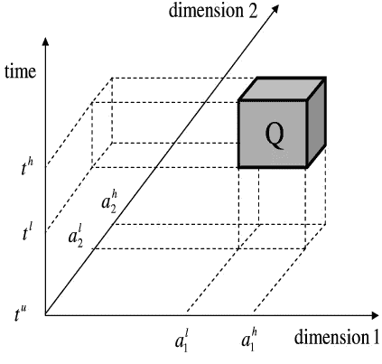

# 将亚马逊 S3 变成时空数据库！

> 原文：<https://towardsdatascience.com/turn-amazon-s3-into-a-spatio-temporal-database-40f1a210e943?source=collection_archive---------14----------------------->

## 好吧，充满希望这个标题，S3 到底有什么可能？事实证明，相当多。事实上，这篇文章描述了如何使用 S3 搜索 n 维。

# 用于存储的 S3

S3 是亚马逊几乎无限的存储产品。您可以在 S3 存储桶中存储任何大小的文件，这些文件将被冗余地存储在一个区域内多个设施的多个设备上。对于您希望频繁交互的文件，标准存储成本约为每月每 GB 3c(US)。如果您将数据标记为存储在 S3 冰川，则费用为每月每 GB 0.4c，如果需要，您可以在几个小时内将其恢复到标准状态。

我把世界表面的一大块区域的船只运动数据存储在 S3，并配置旧数据自动转移到冰川。一天可能有多达 2700 万条记录，逗号分隔值(CSV)格式占用 2.4GB。事实上，我将原始数据(AIS NMEA)存储在 S3，Java Lambda 触发器创建了一个 CSV 版本。

# 随机访问 S3

我喜欢云服务的一点是发现成本和功能方面的最佳点，我想知道我是否可以快速廉价地查询 S3 的数据集。

原来 S3 的文件是可以随意获取的。我可以使用 Range HTTP 请求头指定一个字节范围，这就是将返回的全部内容(没有延迟损失)。

随机访问支持索引查找。如果我通过使用索引知道了我的记录在文件中的大致位置，那么我就可以只抓取文件的那一部分并提取我想要的信息。

# GIS 系统如何执行空间查询？

2 维、3 维或更多维的窗口查询是在相同维数的框内搜索数据。例如，如果我有整个美国的时空数据，那么窗口查询可能是在特定的一天午餐时间查找芝加哥特定郊区的记录。



Fig 1\. A spatio-temporal window query ([researchgate.net](https://www.researchgate.net/figure/Spatio-temporal-query-and-spatio-temporal-bucket_fig1_220113571))

GIS 系统如何对 2D 空间和时空数据进行窗口查询？

空间查询通常用 R 树来完成，R 树是一种相当复杂的数据结构。搜索平面文件中表示的树结构可能意味着在遍历树时进行多次随机访问读取。更重要的是，读取在本质上是串行的，因为在完成前一次读取之前，我不知道下一次读取的位置。更多的离散串行读取意味着更多的延迟，尤其是当我在 S3 读取平面文件时，每次读取都会遇到延迟。

# 将 3 维或更多维映射到希尔伯特曲线

在 3 维或更多维时，一种流行的索引技术是使用空间填充曲线将多维区域映射到一维。空间填充曲线的一个很好的选择是希尔伯特曲线。将您的 3D 域分割成 1024x1024x1024 个单元的规则网格，然后由一条摆动线组成的希尔伯特曲线将访问所有 1m 个点。

作为一个插曲，这里有几个 2D 的例子，这条曲线被称为希尔伯特曲线。


Fig 2\. 2D Hilbert Curve, 4 bits


Fig 3\. 2D Hilbert Curve, 8 bits

这是希尔伯特曲线的三维动画:

希尔伯特曲线有一些很好的*局部性*属性，因为它没有大的跳跃，曲线上的下一个值只有一个单位之遥。这意味着，如果两个点具有彼此接近的索引，那么它们在几何上也将彼此接近。不保证相反的情况。

# 稀疏索引

现在，所有数据点都映射到一个维度，我可以在该维度中对它们进行排序，然后使用简单的一维数据库索引查找技术。当您索引数据库表中的列时，您最终能够在每个表中找到与该列中的值相对应的精确行。但是，索引中的条目可以与表中的行一样多。如果你使用所谓的*稀疏索引*，那么你有一些行的位置，但是你可能需要在它们之后做一些额外的阅读来找到其他的。一个*稀疏索引*可以比一个完整索引小得多，比如说是一个完整索引大小的 0.1%。

我在这里拐弯抹角，所以让我们进入正题。如果我将我的 2，700 万条记录(2.4GB 的 CSV 文件)按照 Hilbert 索引的升序值(10 位，100 万个点)进行排序，然后创建一个小的稀疏索引文件(440K)，我就能够通过对数据的随机访问进行快速窗口查询。我甚至可以并行地进行搜索，因为我预先知道我的记录(大约)在哪里。理想情况下，我想到的查询在空间和时间上都很小，尽管我发现不受时间限制的查询也可以很好地工作。

# 一个图书馆来帮忙

在将搜索框转换成希尔伯特曲线上的范围(如果范围太多，可能会将其变粗)以及从那里访问索引所指向的字节范围方面，这里有一些棘手的问题需要处理。幸运的是，这些问题由一个名为[*sparse-Hilbert-index*](https://github.com/davidmoten/sparse-hilbert-index)的 java 库来处理，这个库是我在 GitHub 上完成并发布的。

让我们试一个例子。我的 CSV 输入数据如下所示:

```
mmsi,messageId,time,lat,lon,speedKnots,heading,course,navigationStatus,rateOfTurn,source,specialManoevreIndicator,timeSecondsOnly,isUsingRAIM,class
4124607775,18,1543283257000,-66.97455333333333,33.95234833333333,8.7,67.3,67,,,NORAIS2,,35,N,N,
4124607775,18,1543283257000,-66.97455333333333,33.95234833333333,8.7,67.3,67,,,NORAIS2,,35,N,N,
538006789,1,1543283259000,-39.57300333333333,33.18371833333333,12.7,85.1,84,UNDER_WAY_USING_ENGINE,-13,NORAIS2,0,39,Y,N,A
...
```

我通过运行这段代码创建一个排序的数据文件和一个 Hilbert 索引(感谢 [*commons-csv*](https://github.com/apache/commons-csv) ):

Viewing search statistics

13 分钟后，在 i5 笔记本电脑上完成了 2700 万条 CSV 记录的排序，并创建了索引文件。

然后，我将`input-sorted.csv` (2.4GB)和`input-sorted.csv.idx`部署到一个 S3 桶，并尝试查询如下所示的数据。首先我会数一个小时悉尼地区的记录数。我将使事情变得更简单，并假设数据在一个公共可访问的桶中，因此我不需要进行身份验证(但只有当您的数据不敏感时才这样做)。

加载索引文件(如果需要，可以在本地缓存):

执行搜索:

加载索引文件(440K)花费了 500 毫秒。

上面的搜索在**169 毫秒**中通过不太灵活的企业互联网连接找到了 2389 条记录。读取了 3347 条记录(命中率为 0.71)。稀疏索引导致了一定程度的浪费，但是我们当然不需要在服务器上安装 GIS 系统！

有趣的是，如果我们查询整个时间维度(24 小时)的悉尼(澳大利亚)地区的数据集，那么性能仍然是合理的:6720 毫秒返回 36940 条记录，命中率为 0.55。(部分)读取了 37 个块(由索引条目指向的 S3 对象的部分)，第一个字节的平均*时间* (TTFB)为 114 毫秒(因此我们的互联网连接的延迟导致了 4200 毫秒的运行时间)。靠近 S3(比如 EC2 或 Lambda)可以节省大量时间，但我们的另一个锦囊妙计是从 S3 同时读取。

# 使用并发！

在上面的搜索命令中，您会看到`concurrency`参数被设置为 1。我发现，对于 S3 的这个数据集，通过普通互联网连接的最佳数字是 8；也就是说，同时检索、解析、过滤和合并 8 个组块。耗时 6720ms 的查询(主要是因为无约束的时间维度)现在耗时 **839ms** ！

# 从 AWS 搜索

我也从 EC2 (t2.large)进行了测试，正如预期的那样，第一个字节的时间减少到了大约 50 毫秒。有了并发性，全天查询减少到了 380 毫秒。随着延迟的下降，我认为寻道时间开始发挥更大的作用，并发级别的最佳点似乎是大约 4。

# 流式 API

用于从搜索中检索记录的 api 通过 [*RxJava*](https://github.com/ReactiveX/RxJava) 库提供流功能。

# 其他格式

请记住，CSV 不是存储和检索数据的最有效方法。更有针对性的二进制格式可能会使您的查询速度快很多倍。

# 调谐

稀疏索引中的条目数量对命中率有很大的影响(命中率是一种衡量您为了找到所请求的内容而读取了多少记录的指标)。如果您可以在本地缓存索引文件，或者将它们放在速度更快的存储器上，那么您可以在每个索引文件中使用更多的条目。实验是必由之路。为不同大小的同一个文件创建多个索引，看看哪一个最适合您的查询模式。

一般来说，如果您的查询是定制的，这样它们就不会返回很多记录，那么您的响应时间应该是上面提到的顺序。使用不受约束的维度进行搜索(就像前面查询中的时间)*可能会有效，但是我建议只使用一个不受约束的维度。*

# 查看搜索统计数据

当您执行搜索时，您可以指定`withStats`选项来查看有关搜索的各种指标:

```
index
.search(bounds)
.withStats()
.concurrency(1)
.url(url)
.last()
.forEach(System.out::println);
```

生产:

```
WithStats [elapsedMs=169, recordsFound=2389, recordsRead=3347, hitRatio=0.7138, bytesRead=392261, timeToFirstByteMsTotal=94, timeToFirstByteMsAverage=94.0000, chunksRead=1]
```

# 二维呢？

我已经运行了一个 3 维的例子，但是稀疏的希尔伯特指数对于 2 维也同样适用。因此，S3 也可以成为您的 2D 空间数据库。

# 不仅仅是 S3

注意，Azure Blob 存储和 Google 云存储也通过 HTTP Range 头提供随机访问。你可以使用这些存储选项以及稀疏希尔伯特索引 T2 库。

# 雅典娜呢？

这个问题问得好！特别是当 AWS 在 S3 桶中提供 CSV 文件(和其他格式)的 [Athena](https://aws.amazon.com/athena/) 时，它可以在 1.5 秒内完成 2GB CSV 文件的完整扫描！

当你考虑到与全扫描相比，在大量数据上运行许多索引搜索的成本时，稀疏希尔伯特索引方法可能会更有吸引力。Athena 的成本很低(为查询而扫描的数据为 5 美元/TB)，但在一定规模下可能会变得非常重要。在某些情况下，进行大量全扫描搜索所产生的功耗也可能在伦理上具有挑战性(也很难计算)。我认为在大文件搜索方面很难与 Athena 竞争，但可能有一些边缘情况有利于*稀疏希尔伯特索引*！

火上浇油的是，Athena 支持 Parquet 格式，这种格式可以被索引，这样每个页面都有 min-max 统计数据。如果您对您想要查询的字段进行排序(在我们的例子中，我们将添加一个计算的 Hilbert 索引列),那么 Athena 可以*在理论上*自己进行索引查找(未经测试)。Athena 仍然需要查看每个页面的统计数据(默认情况下为 1Mb ),所以理论上它不如精确知道要搜索哪些页面的*稀疏希尔伯特索引*有效。**请注意**截至 2019 年 6 月，Athena**不**支持索引拼花格式以实现更快的访问( [1](https://stackoverflow.com/questions/52472054/how-do-you-get-athena-presto-to-recognize-parquet-index) )。当支持到来时，它将是值得尝试的！

# 带回家

*   从平面文件或存储服务(如 S3)中进行高效的空间、时空甚至 n 维查询是可能的！
*   转到 [*稀疏希尔伯特指数*](https://github.com/davidmoten/sparse-hilbert-index) 获取该用例的易用库支持
*   评估雅典娜也为您的查询需求