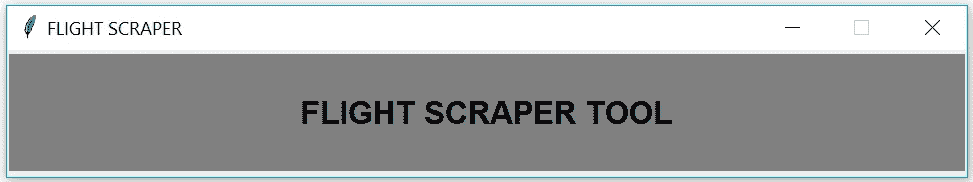
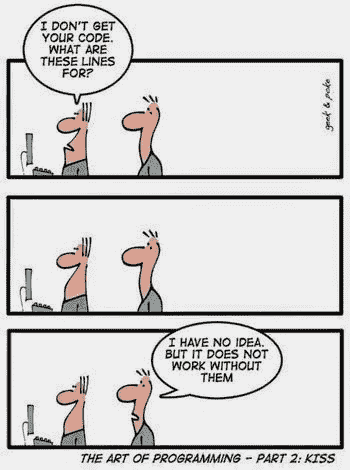
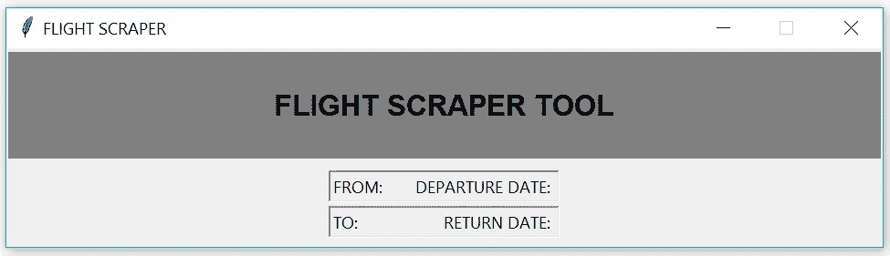
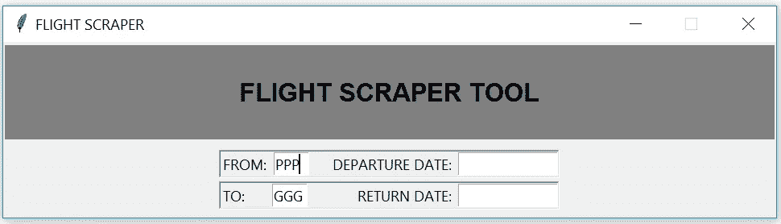
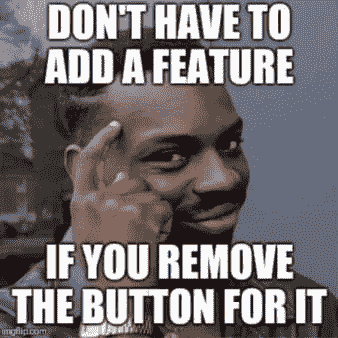
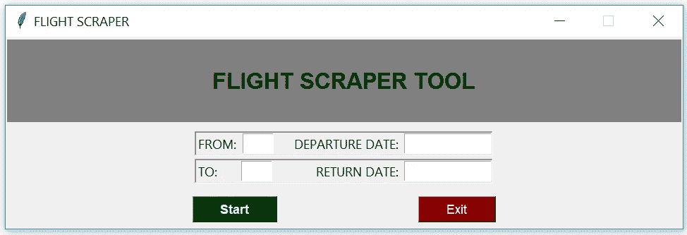
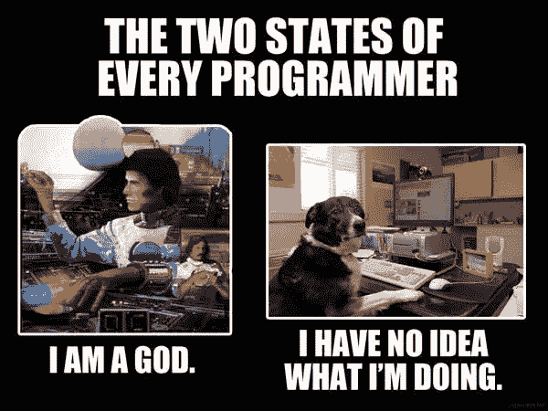

# 使用 Tkinter，将您以前的 Python 项目变成令人敬畏的工具

> 原文：<https://towardsdatascience.com/turn-your-previous-python-projects-into-awesome-tools-with-tkinter-2e61f2241e29?source=collection_archive---------2----------------------->

Because building your own tools is… sexy?! (photo credit: [Todd Quackenbush](https://unsplash.com/photos/IClZBVw5W5A))

## 笔记本很无聊！

所以你在 Jupyter 笔记本上写了你的第一个脚本，每次你想使用这个脚本的时候，你疯狂地运行每个单元格。不太实用吧？当然，你可以安装一些扩展和一些小部件，我甚至看到一篇文章，有人创建了一个在笔记本中实时更新的仪表板。但是，如果你能创建自己的程序，只需点击一下鼠标就能启动，这不是更酷吗？作为一个附带项目，我决定制作一些关于我文章中代码的视频，所以我很乐意听到你关于格式、持续时间和任何其他反馈的意见！谢谢！

> 您将能够建立简单的模板，可以把您的旧的和未来的脚本变成个性化的工具！

一个**，**图形用户界面也称为 GUI，*是一种用户界面形式，允许用户通过图形图标*与电子设备进行交互。这是一个普通人称为“应用程序”的花哨术语。除非您是从命令行阅读这篇文章(这实际上有点奇怪……)，否则您现在很可能正在使用 GUI。

我喜欢 Jupyter 笔记本，因为它们易于使用，并让您在单独的单元格中构建代码。对于任何初学 Python 和编程的人来说，这无疑是最好的切入点，但是如果你真的想从事数据科学，你还需要更多的东西。笔记本完成后，说“完成”并转移到另一个项目是很容易的，但是如果你给他们自己的界面呢？如果代码不太复杂并且结构良好，**你甚至可以为每个脚本使用一个简单的模板**，就像我在本文中分享的那个。

有一段时间，当我想从事任何 Python 项目时，我都坚持使用 Jupyter 笔记本。我努力去理解工作背后的框架。py 文件，但最终，它点击了！这件事发生在我搜索 Tkinter 资源的时候，所以你大概能感觉到我的意思…今天不会使用 Jupyter 笔记本了！我们将使用。py 文件和一个 IDE。

> 我的文章是为非 IT 人士而写的，所以如果你是这种情况，**不必惊慌！**在整个代码过程中，我会一直陪着你，并尽力回答评论中的每一个问题

## 您可以利用这个 Tkinter 项目做些什么:

*   创建用户界面来运行您的脚本
*   要求用户在文本字段中输入一些内容，并将其用作变量
*   单击运行代码特定部分的按钮
*   要求用户选择一个文件以使用文件对话框提示
*   *奖励:不再与 Jupyter 独家合作！*

对于这个项目，我将使用我以前的[文章](/if-you-like-to-travel-let-python-help-you-scrape-the-best-fares-5a1f26213086)作为我们的应用程序使用的脚本的来源。这是一个从 Kayak 检查航班价格并编译结果的基本脚本。它有一些硬编码的输入，但正如我提到的，我们希望我们的体验更像一个正常的程序，所以我不得不稍微调整一下。我在我制作的作为文章补充的[视频](https://youtu.be/z1nN5pvhdA8)中解释了它。我强烈建议你看一看，因为为了简洁起见，一些细节必须从文章中删除！

在继续之前，您需要几样东西:

*   代码编辑器:我将使用 Spyder，它并不完美，但已经足够好了。如果你不确定这是什么意思，试试看你是否安装了 [IDLE](https://docs.python.org/3/library/idle.html) 。它预装了 Python，所以您在这里应该没问题。*趣闻:IDLE 是用 Tkinter 造的！*
*   包:显然你需要安装[***Tkinter***](https://wiki.python.org/moin/TkInter)包。有很多在线资源可以帮助你做到这一点。但是如果你想掌握它，我会在最后留下几本推荐的书。
*   模块:您需要将之前的 FlightScraper 脚本更新为。我分享的 py 文件 [***这里***](https://gist.github.com/fnneves/6635bbcf1a27ba17dbb4e9a2f3c11cc0) 。把它放在你将要处理的文件夹中。

## 每个程序都从一个窗口开始

Tkinter 一开始可能看起来很奇怪，很难理解，这就是为什么我会一个块一个块地构建代码，试图解释我们正在创建什么，以及它如何在应用程序中显示。假设您已经安装了所有东西，只需为项目创建一个文件夹，并创建一个扩展名为. py 的文件。

每个 Tkinter 应用程序都需要这样构建。我们称这个*为 tk。Tk()* 来创建应用程序窗口，然后我们构建我们的应用程序，在用 *window.mainloop()* 来“编译”所有东西之前，在我们想要的地方放置小部件(框架、按钮、标签等)。我不会详细介绍 Tkinter 是如何工作的，但如果你想了解什么是*循环*和构建一个应用程序的基本结构，请查看他们的[资源](https://wiki.python.org/moin/TkInter)。

在这一点上，我们讨论我们将需要的小部件可能更好。顺便说一下，小部件是 Tkinter 的元素(如按钮、标签、框架、条目等)。我只使用几个，如果你掌握了这些基本知识，你就可以很容易地自己去测试其他人了。

*   **框架**:我们的应用程序将被分成三个框架堆叠在一起。顶部框架将用于放置我们的标题，而底部将显示我们的应用程序按钮。中间的框架将由另外两个框架组成(是的，您可以将一个小部件放在另一个小部件中！)
*   **网格**:我将使用网格作为定义应用程序布局的一种方式。如果你喜欢冒险，可以试试 Place，它可以让你用屏幕上特定的 x，y 坐标来设置位置。在我看来，网格是最容易理解和使用的，所以我们将使用它并打包。
*   **Pack** :它也是一个布局管理器，真的很好理解……每次使用。pack()它会将小部件堆叠在之前打包的小部件下面。
*   标签:简单地说，它们是文本框。我们将在页眉和输入框旁边使用它。
*   **条目**:它是一个小部件，让用户编写某种输入，比如城市和日期。
*   **按钮**:我真的需要解释什么是按钮吗？！玩笑归玩笑，在按钮部件中有一个名为*命令*的参数，它告诉按钮当它被按下时运行什么功能。

## 现在你知道了配料，让我们来看看食谱

所以让我们直接进入主题。下面是前三帧和标题的代码。我用网格法把它们放在 app 里。您可能已经注意到了，标题在顶部(第 0 行第 0 列)，中心在中心(1，0)，底部框架在中心框架的下面(2，0)。我添加了一些参数，比如边框宽度和*pady*(y 轴填充)，让它看起来更漂亮。当我们创建框架时，我们需要告诉 Tkinter 它们属于哪个窗口，我们通过将 *window* 变量(我们的主窗口)作为框架的主窗口来定义它。这里的关键点是，参数 master 用于每个小部件中，它定义了小部件的放置位置。

我们还在标题中放置了一个标签，因此在标签小部件中传递了 *frame_header* 。每个小部件的流程都是一样的。你用你想要的小部件创建一个变量，告诉 Tkinter 它属于哪里，然后把它放在应用里。由于 *frame_header* 将只包含标题标签，我们将其放在位置 0，0。摆弄标签参数来理解你的格式选项！[这个](https://www.tutorialspoint.com/python/python_gui_programming.htm)是关于 Tkinter 以及如何使用这些小部件的非常好的资源，并附有例子。

> 记住上面的代码必须放在 *window.mainloop()之前，否则程序不会运行*

这是一个好主意，节省一些时间和挫折以后总是测试你在做什么。你可能认为你把所有的东西都放在了最合适的位置，但是当你运行这个文件的时候，这简直是疯了。它发生了！所以我们需要不时地运行这个文件，看看小部件是如何显示的。这是没有办法的。如果你来自 Jupyter 笔记本，先不要惊慌。您正在使用的编辑器可能有运行文件的方法(希望是 Python 文件！).在 Spyder 中，您可以在编辑器中直接使用 F5，控制台将运行代码。事实上，大多数 IDE 都有相同的快捷方式(F5)来运行文件。就是这么简单…如果你有我给你看的代码，**和最后的*main loop()***，在你运行它之后，应该会弹出一个窗口。恭喜你，这是你第一个 GUI 的开始！

它看起来还不太像，但我们会到达那里。如果你注意代码，我说我放了三个框架，但是只有标题出现了…是的，那是我和 Tkinter 的第一次斗争。我没有意识到**框架只有在有某种元素的情况下才会出现**。咄…！所以接下来我们将处理其余的帧。您可以关闭应用程序窗口，并根据需要多次运行该文件。

## 检查之前先打包

让我们在中心框架内再添加两个框架， *frame_main_1* 和 *frame_main_2* 。同时，让我们也为这些帧添加标签。我想有一个输入框的每一个标签。我们接下来会处理这个问题。

标签的逻辑和框架一样。我们告诉 Tkinter 标签属于帧 1 和帧 2，以及它们将显示什么文本。拥有 GUI 的目的是让用户更流畅地与程序交互，所以我们需要决定我们希望用户给我们什么输入。如果您还记得另一篇文章中的代码，我们需要一些字符串来构建我们的 url，所以本质上，我们期待来自用户的字符串。标签下面的线就是这样。

我们将四个变量定义为 *StringVar()* 。很难用简单的术语来解释，但是可以把这种变量想象成**，当程序运行**时，Tkinter 能够跟踪的对象。然后，您可以创建当这些变量发生特定事件时要执行的操作。他们还是一串，但属于不同的品种！

我不得不在最后一行加上*。pack()* 因为否则，如果我们再次运行程序，什么也不会显示。请随意删除最后几行，然后再次运行程序。它将显示与之前完全相同的框，只有标题。我在这一点上告诉你，因为这些线不会停留在这个位置，因为我们需要在打包所有东西之前添加更多的部件(和一些功能)。文章最后一段应该有完整代码的链接！

if you run it now, it’s clear we’re getting there

## 等等，还有功能？！

我故意把函数留到后面，但是它们必须放在 import 语句下面的某个地方**和 widgets 部分**之前。这里有四个函数，其中两个是我们的条目表单所需要的(使城市条目中的字母大写，并将长度限制为 3 个字符)。我们还将有两个按钮，一个运行机器人，另一个退出应用程序。 *run_app* 函数将在后面介绍。

我们希望用户输入什么？简单…我们希望他们键入城市(出发和到达)，以及旅行日期(出发和返回)。有了这个，机器人就可以做自己的事了。第三个[视频](https://youtu.be/PjPyfy825sM)涵盖这部分！

我将需要函数 *caps_from* 和 *caps_to* ，因为我们需要在输入框中使用它们的 bind 方法。什么*。bind()* 的作用是等待小部件中的事件发生，并运行一个序列/函数。在这种情况下，小部件是输入框，事件是按键释放，函数将限制字符长度并将字母转换为大写。非常简单，我觉得这是你的保留曲目的一个很好的技巧！

如果您要一段一段地进行，只需将 *tkinter_app3.py* 中之前的 *pack()* 语句替换为这个代码片段中的整个代码 *tkinter_app5.py.*

you can only type 3 letters, and it converts them to upper case as you type

## 按钮在哪里？！

是的，是时候让按钮显示在应用程序中了。我们已经处理了退出应用程序的功能。这个命令叫做“destroy ”,听起来超级毛骨悚然和恐怖，但它就是这么做的:它破坏了窗户！所以，我们的 *close_app* 函数就是一行， *window.destroy()* 。我们之前创建的 *run_app* 函数将简单地在控制台中打印“run ”,所以如果我们收到一个文本说“run ”,我们将知道它正在工作。

这一部分可以直接放在最后一个代码片段的下面， *mainloop()* 将负责正确的执行。所以你可以打包小部件，然后再创建几个，打包在下面。重要的是跟踪你正在使用的订单。否则，**更复杂的脚本会变得混乱**。

按钮小部件很容易与参数“command=”中的函数进行映射。注意我是如何将一个指向 *run_app* 函数，另一个指向 *close_app* 。哦，这些按钮的主人是*底部框架。*

瞧啊！界面完整。它看起来很粗糙，校准可能会更好(至少可以这么说)，但嘿…这是你的应用程序，所以继续改进它吧！

finally, something that looks like an actual tool!

**这应该给了你为你的脚本**构建简单应用的基础，但我们仍然需要将这个项目链接到我们的 Flight Scraper 脚本，并重做 *run_app* 函数，用“开始”按钮激活它。下面是 *run_app* 函数最终的样子。该功能使用*方法。get()* 在条目上，它将使用 Flight_bot()启动我们的 Bot。然后，它将用户输入传递给作为机器人一部分的函数 *start_kayak* 。你应该能从上一篇文章中认出它的名字。

> 请注意:为了启动机器人，您需要在初始导入中导入它！！查看第四个视频

我是这样做的:将上一篇文章中的脚本(在 jupyter 笔记本中)改编成一个名为 flight_scraper_bot.py 的 py **文件，并**将其放在与我们正在处理的文件夹**相同的文件夹中。从那里，我们可以**导入它**并在我们的程序中使用它。这个 py 文件可以在这里[找到。我们需要添加到 tkinter 文件中的行是:*from Flight _ scraper _ Bot import Flight _ Bot*](https://gist.github.com/fnneves/6635bbcf1a27ba17dbb4e9a2f3c11cc0)**

这已经包含在我们脚本的最终版本和编译版本中，我把它放在这里****供您抓取。这比在整篇文章中复制和粘贴多个片段要容易得多。不客气！****

****我在[视频](https://www.youtube.com/playlist?list=PLQIdXEwylGffOfofVgeaMI-kSJHBAOaVv)中对它进行了更详细的介绍，所以如果你需要帮助，一定要看看它们。就像我在开始提到的，你的评论对帮助我提高文章和视频的质量非常重要，所以请随时发送你的反馈和问题！****

******这本** [**的书**](https://amzn.to/2Ypm66e) 有我需要知道的一切，无论何时我正在与一个特定的小部件作斗争。如果你想掌握 Tkinter，我相信它可以帮助你。如果你对网页抓取部分感兴趣，这是我用来学习 Selenium 和其他人的 [**书**](https://amzn.to/31rBwUH) 。*(如果您使用此链接，我会收取少量费用，无需您支付额外费用。我确实需要很多咖啡来写这些文章！)*****

********

****it’s funny because it’s true…****

*****感谢您的阅读！如果你喜欢这篇文章，我邀请你看看我的其他故事。我主要感兴趣的是数据科学、* [*区块链*](https://medium.com/@fneves/do-you-even-know-what-blockchain-is-34b180ffbf6d) *和数字货币、技术，以及其他一些类似* [*摄影*](https://fnevesphotography.pixieset.com/?utm_medium=tdsftkint) *！*****

*****如果你想取得联系，可以在这里联系我****或者直接回复以下文章。*******