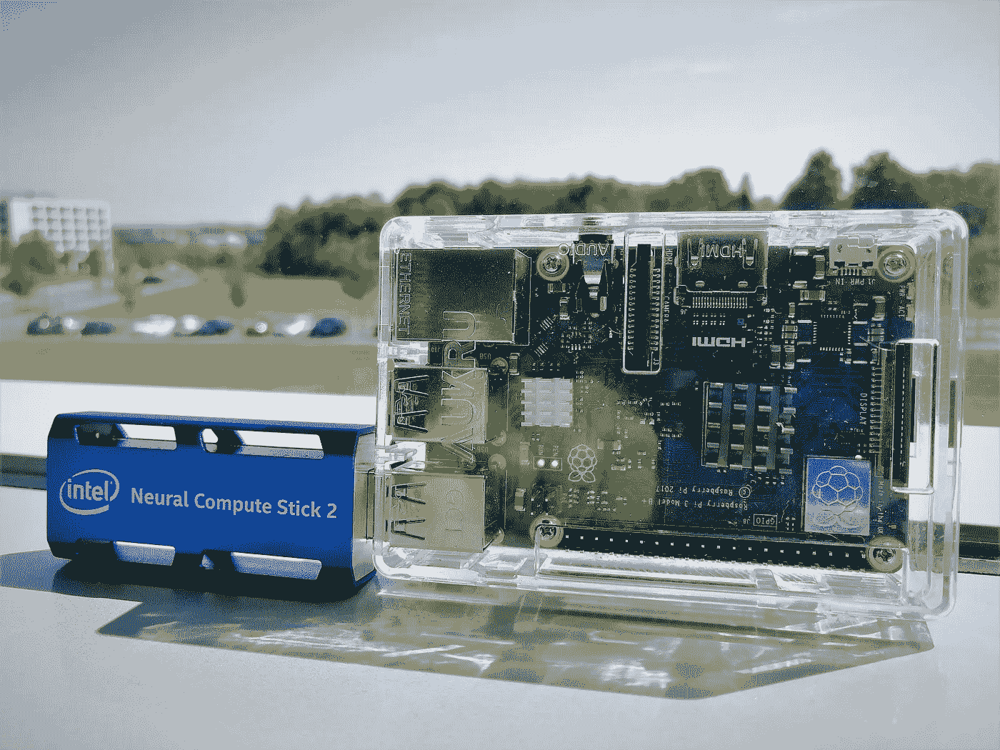
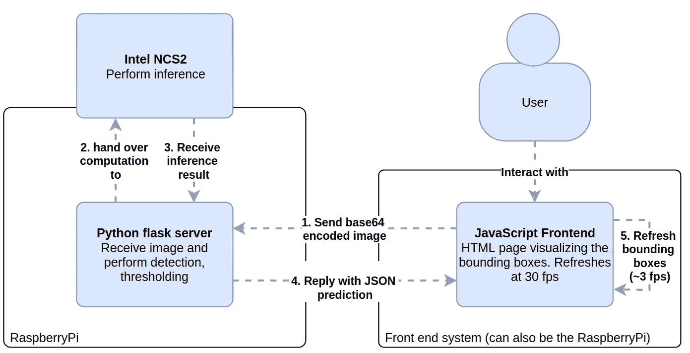
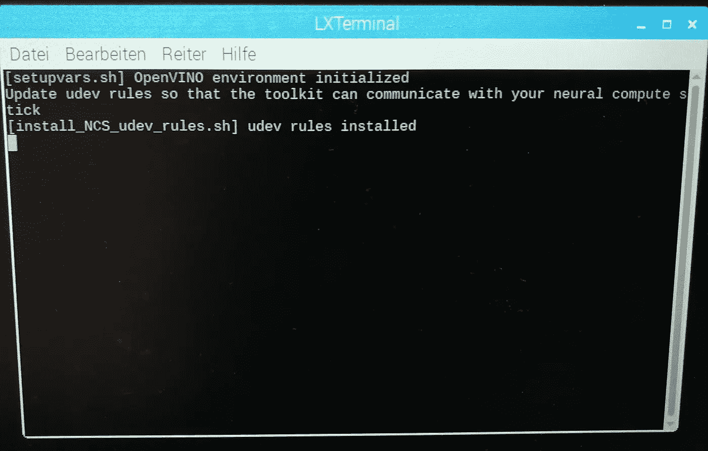
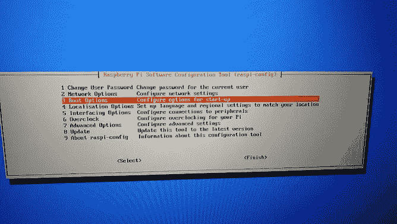
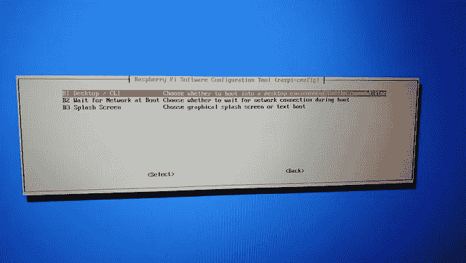
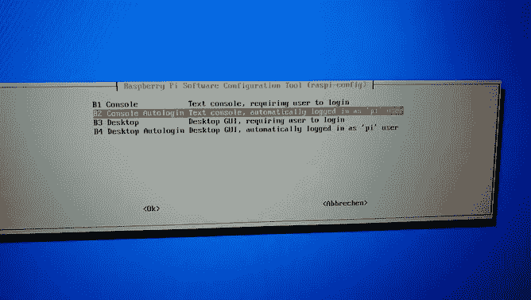
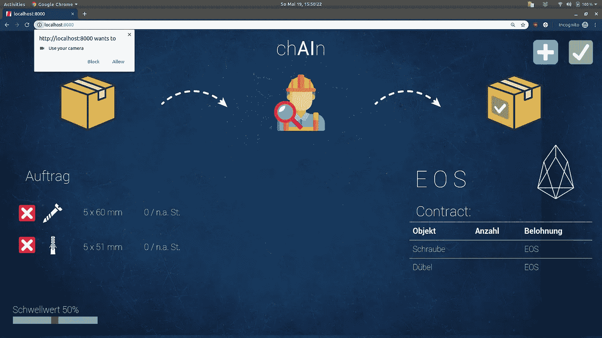
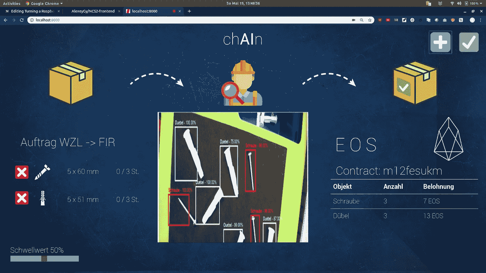

# 借助英特尔 Movidius NCS2，将 Raspberry Pi 3B+变成强大的对象识别边缘服务器

> 原文：<https://towardsdatascience.com/turning-a-raspberry-pi-3b-into-an-object-recognition-server-with-intel-movidius-ncs2-8dcfebebb2d6?source=collection_archive---------9----------------------->

## 我们通过部署 [MobileNet-SSD](https://github.com/chuanqi305/MobileNet-SSD) 架构，使用[英特尔 OpenVINO](https://software.intel.com/en-us/openvino-toolkit) 平台，将 raspberry PI 3B+变成一个对象识别服务器。



The Intel NCS2 attached to a Raspberry Pi Model 3B+, the hardware used in this tutorial

在这一部分中，我们将在英特尔神经计算棒中使用一个易于编译的神经网络，以便它能够接收 Base64 编码的图像，并将它们转换为边界框预测。此外，还将提供一个向 PI 发送摄像机输入的前端示例。请不要忘记查看由 Mattio Varile 撰写的关于如何部署和测试模型的精彩 w [评论。](/speed-up-predictions-on-low-power-devices-using-neural-compute-stick-and-openvino-98f3ae9dcf41)

*   预训练和编译的模型将在附件中提供。
*   为自定义数据集训练和编译模型以及前端的更多细节将是另一个故事的一部分，敬请关注！



System diagram visualizing the flow of information via numbers. Click here for the draw.io diagram: [https://drive.google.com/file/d/17yTw1YnhjOJh_EjIYLqGVYuYjnB8pKyl/view?usp=sharing](https://drive.google.com/file/d/17yTw1YnhjOJh_EjIYLqGVYuYjnB8pKyl/view?usp=sharing)

[0。要求](https://medium.com/p/8dcfebebb2d6#2e40)

*   [1。准备树莓酱](https://medium.com/p/8dcfebebb2d6#e6df)
*   [1.1。安装 NOOBS 镜像](https://medium.com/p/8dcfebebb2d6#a219)
*   [1.2。安装最新的英特尔 OpenVINO 软件](https://medium.com/p/8dcfebebb2d6#73a4)
*   [1.3。在神经计算棒上部署对象检测](https://medium.com/p/8dcfebebb2d6#ea8f)
*   [3。运行服务器并设置开机自动启动](https://medium.com/p/8dcfebebb2d6#071e)
*   [4。使用示例 GUI 部署我们的服务器](https://medium.com/p/8dcfebebb2d6#05ea)
*   [5。结论和展望](https://medium.com/p/8dcfebebb2d6#4ad3)

更新 1，2019 年 5 月 29 日:现在包括系统图，
更新 2，2019 年 8 月 5 日:pybase64 因未使用而从要求中删除

# 0.要求

*   树莓派，最好是 3B+型，但其他型号也可以[https://www.raspberrypi.org/products](https://www.raspberrypi.org/products)
*   英特尔 NCS 2[https://software.intel.com/en-us/neural-compute-stick](https://software.intel.com/en-us/neural-compute-stick)

可选择的

*   一些 USB 摄像头
*   一些其他的计算机来运行前端

# 1.准备树莓酱

# 1.1.安装 NOOBS 映像

在 FAT32 格式的微型 SD 卡上刷新 NOOBS 图像。[https://www.raspberrypi.org/downloads/](https://www.raspberrypi.org/downloads/)

正常启动 USB 镜像，设置账户密码，连接互联网等…

确保同时安装 python3、pip3 和 wget

```
sudo apt-get update
sudo apt-get install python3-picamera python3-pip wget
```

# 1.2.安装最新的英特尔 OpenVINO 软件

下载 OpenVINO 工具包

```
cd ~/Downloads && wget [https://download.01.org/opencv/2019/openvinotoolkit/l_openvino_toolkit_raspbi_p_2019.1.094.tgz](https://download.01.org/opencv/2019/openvinotoolkit/l_openvino_toolkit_raspbi_p_2019.1.094.tgz)
```

我建议遵循以下指南，直到(不包括)“构建和运行对象检测示例”一节。

 [## 为 Raspbian*操作系统安装 OpenVINO 工具包——open vino 工具包

### open vino toolkit 以前被称为英特尔计算机视觉软件开发套件。这些步骤适用于 32 位 Raspbian* 9 操作系统…

docs.openvinotoolkit.org](https://docs.openvinotoolkit.org/latest/_docs_install_guides_installing_openvino_raspbian.html) 

成功完成所有操作后，当您打开一个新的终端时，您应该会看到以下输出:



# 1.3.在神经计算棒上部署对象检测

我们将使用 flask 服务器来接收用于预测的编码图像。你可以在下面的 github 库【https://github.com/AlexeyGy/NCS2-server 找到所有的代码

a)首先在您的主文件夹中创建一个名为 detection_server 的新文件夹。

```
mkdir ~/detection_server && cd detection_server
```

b)用以下内容创建一个 requirements.txt 文件。该文件包含所需的包。

*   flask 是网络服务器，flask-cors 是传递 cors 头的包装器(跨站点脚本需要)，更多关于它的[在这里](https://developer.mozilla.org/en-US/docs/Web/HTTP/CORS)
*   注意 OpenCV (cv2)不在这个包列表中，因为这个包是在步骤 1.2 中与 OpenVINO 一起安装的。这是因为 OpenVINO 提供了自己的 cv2 风格，包括对 CNN 架构的支持。

```
flask-cors
flask
```

现在快跑

```
pip3 install -r requirements.txt
```

自动安装软件包。

c)设置服务器启动脚本，创建一个名为 RUN 的文件。嘘

d)下载预训练的 MobileNet-SSD 架构中间表示文件，该文件可以区分螺钉和 rawl 钉。请继续关注本教程的第二部分，我们将讨论培训。

```
mkdir models && cd models && wget [https://github.com/AlexeyGy/NCS2-server/raw/master/models/no_bn.bin](https://github.com/AlexeyGy/NCS2-server/raw/master/models/no_bn.bin) && wget [https://github.com/AlexeyGy/NCS2-server/raw/master/models/labelmap.prototxt](https://github.com/AlexeyGy/NCS2-server/raw/master/models/labelmap.prototxt) && wget [https://raw.githubusercontent.com/AlexeyGy/NCS2-server/master/models/no_bn.xml](https://raw.githubusercontent.com/AlexeyGy/NCS2-server/master/models/no_bn.xml)
```

您可以看到该架构包含三个文件，一个包含可能标签的 labelmap，一个包含冻结网络权重的. bin 文件和一个包含网络拓扑的. xml 文件。更多信息可以在[这里](https://software.intel.com/en-us/openvino-toolkit)找到。


Intel IR model. Image courtesy of Intel [https://software.intel.com/sites/default/files/managed/ed/e9/inference-engine-700w-300h.png](https://software.intel.com/sites/default/files/managed/ed/e9/inference-engine-700w-300h.png)

e)现在让我们创建实际的服务器，使用以下内容创建文件 server.py。下面将提供关于各个功能的更多细节。

*   在第 12 行，我们使用英特尔 OpenVino cv2.dnn.readNet 函数读取提供的模型文件
*   第 14 行为我们的计算设置了一个更好的运行目标
*   第 17- 19 行包含了我们的 flask 服务器的一些标准配置，
*   第 23 行使用 flask-cors 包装器来设置 cors 头，更多信息[在这里](https://developer.mozilla.org/en-US/docs/Web/HTTP/CORS)
*   第 25–29 行是可选的，它们为所有不包含正确格式的 jpg 或 png 图像的输入数据设置了一个过滤器
*   第 31 行为我们的 flask 服务器设置了默认路由，我们接受包含图像的 POST 请求
*   除了传递给服务器 s.t .的图像之外，第 37 行还允许我们接受一个阈值。所有低于阈值的预测都不会返回
*   第 43 行返回预测结果的 JSON
*   第 46–50 行中的函数执行实际的图像处理，我们稍后将进入相应的 util_mobilnet.py 文件。以下是对其功能的高级概述
    —首先执行特定于 Mobilenet-SSD 架构的预处理和缩放步骤
    —然后网络进行推理(第 48-49 行)
    —最后执行后处理步骤，包括阈值过滤

f)最后，让我们创建并查看 util_mobilnet.py 文件

*   第 5 行配置了 mobilnet 需要的尺寸，因为它是在 300x300 的正方形图像上训练的，我们将它设置为我们的尺寸
*   read_labels 函数逐行读取 labelmap 文件来定义支持的类
*   第 21 行中的预处理函数处理传入图像的颜色和尺寸，mobilnet 需要任意的转换来正确处理图像
*   第 32 行中的后处理函数检查所有预测，并过滤掉低于阈值的预测，此外，不返回背景预测

# 3.运行服务器并设置启动时自动启动

为了最小化 raspberry PI 上的资源使用，我们想要建立一个客户端服务器应用程序，其中 flask 服务器接收图片并返回边界框预测。

我发现自动启动烧瓶的最佳方法是 a)将烧瓶启动添加到。b)使用自动登录将系统设置为自动启动到 cli。

a)至于将这些行添加到。bashrc 文件，确保将“Downloads”文件夹设置为您下载 OpenVINO 工具包的文件夹

b)在终端中运行以下行

```
sudo raspi-config
```

您将看到以下屏幕，您应该在其中选择选项 3 引导选项/ 1 桌面 CLI / 2 控制台自动登录



select the options as per screenshots

现在，启动后，你会看到树莓会在端口 5000 上自动启动 flask 服务器，恭喜！

# 4.使用示例 GUI 部署我们的服务器

以下步骤应该在另一台机器上执行，但是如果您选择在 Raspberry 上运行 GUI，它们也可以在 Raspberry 上执行(这会导致性能降低)。

克隆库[https://github.com/AlexeyGy/NCS2-frontend](https://github.com/AlexeyGy/NCS2-frontend)

```
git clone [https://github.com/AlexeyGy/NCS2-frontend](https://github.com/AlexeyGy/NCS2-frontend)
```

只需运行运行。SH 文件来运行一个简单的 python 服务器。你可以通过 localhost:8000 访问它，但是在你看到任何图像之前，你可能需要让它访问你的相机。



permission request

服务器会将网络摄像头图片发布到地址 [http://192.168.0.2:5000/](http://192.168.0.2:5000/) ，如果您使用的不是您的 raspberry，请确保将其定制到您的 raspberry 的地址。

我会写另一篇文章，介绍 JavaScript 前端如何确保边界框绘图只有在收到来自我们的 raspberry 服务器的新响应时才会刷新。

给定的示例 GUI 来自 FIR 的一个试点演示器，我们用它来演示智能合同平台的可能用例。在以后的文章中会有更多的介绍。



您可以通过浏览器的 JavaScript 控制台调试设置。

# 5.结论和展望

这是前端和后端一起运行的整个系统的 gif 图:

螺丝和罗尔塞的检测示例

如果在两台机器上运行，运行的系统能够传送 60fps 的视频，检测时大约 8 fps。用户体验不会受到影响，因为预测是由 JavaScript 前端以异步方式显示的。我发现太多的检测帧会导致糟糕的用户体验，因为检测更新得太快了！

随着边缘计算的到来，像[谷歌这样的其他竞争对手也加入了这场竞赛](https://cloud.google.com/edge-tpu/)，我们将迎来神经计算棒的一些令人兴奋的未来用例。

## 请继续关注培训和前端设计部分。

# 资源

*   [Mattio Varile 撰写的关于如何部署和测试模型的文章](/speed-up-predictions-on-low-power-devices-using-neural-compute-stick-and-openvino-98f3ae9dcf41)
*   [英特尔神经计算棒官方教程](https://software.intel.com/en-us/articles/get-started-with-neural-compute-stick)
*   [更多关于 Movidius on Raspberry inc .的信息性能测量](https://www.pyimagesearch.com/2019/04/08/openvino-opencv-and-movidius-ncs-on-the-raspberry-pi/)作者[**Adrian rose Brock**](https://www.pyimagesearch.com/author/adrian/)