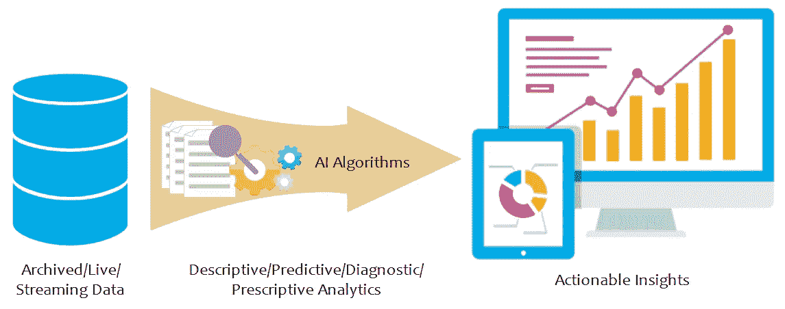
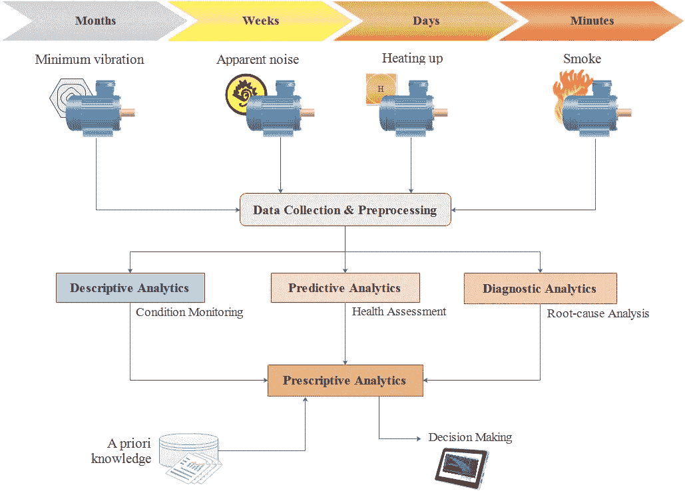

# 将数据转化为可操作的见解

> 原文：<https://towardsdatascience.com/turning-data-into-actionable-insights-c246969fa4c?source=collection_archive---------14----------------------->

Credit: Alaa Khamis

## 数据和见解

洞察力是新的黄金，而不是数据，因为数据没有价值，除非这些数据转化为重要的可操作的洞察力。这些见解可用于支持决策，并有助于改进设计和制造流程。机器学习算法可以用来完成不同的应用数据挖掘任务。这些任务可以是描述性分析、预测性分析、诊断性分析和规定性分析。描述性数据分析提供对过去和现在的洞察，而预测性分析预测未来。诊断分析提供根本原因分析，说明性分析就可能的结果及其预期影响提出建议。

## 数据分析

描述性数据分析提供了对数据及其性质的更好理解，并识别数据中的模式或关系。这些描述性模型回答了以下问题:

*   发生了什么事？
*   现在发生了什么？
*   某个变量的趋势是什么？
*   变量之间有什么关系？
*   一个项目相对于其他项目或基准项目的表现如何？

预测模型对数据的未来值进行预测，并预测新的特性，而不是像描述性分析那样只是探索数据属性。这些模型回答了以下问题:

*   会发生什么？
*   什么时候会发生？
*   会在哪里发生？

诊断分析提供根本原因分析来回答以下问题:

*   为什么会这样？
*   为什么会这样？

最后但并非最不重要的一点是，规范模型侧重于决策支持。这个决策支持或推荐引擎回答以下问题。

*   从预测模型中获得的预测会如何影响其他一切？
*   需要做出什么样的主动决策/行动？
*   我们如何从预测/建议中受益？
*   最好的行动是什么？
*   采取这一行动的最佳时机是什么？
*   这一行动会产生什么影响？

## 以预测性维护为例

预测性维护是一种预防性维护方法，它依赖于对实际机器状况、运行效率和运行状况的其他指标的定期监控和分析，以检测早期问题，最大限度地减少计划外停机的次数和成本，并防止关键设备发生灾难性故障。根据麦肯锡的数据，到 2025 年，预测性维护将帮助公司节省 6300 亿美元。幸运的是，机电设备不会毫无征兆地损坏。故障发生前几个月，可以发现最小的振动。故障前几周，明显的噪声开始出现。在机器升温前几天和故障前几分钟，它开始冒烟。

Data Analytics | Credit Alaa Khamis

在这种情况下，描述性分析可以洞察机器的当前状况。而预测模型可以执行健康评估并预测任何初期问题或可能的故障或异常。诊断分析提供根本原因分析，最后，说明性分析模型可以处理由描述性分析模块生成的关于机器当前状态的信息、来自预测性分析模块的健康评估以及任何其他可用的先验知识。然后，它会针对主动行动或维护计划提出及时的建议/决策，以降低任何可能的风险。使用这些推荐的决策和由说明性分析模型生成的预期影响信息，用户可以考虑最高优先级的维护需求来主动规划维护，或者可以创建工作订单并向指定的技术人员发送关于所需维护的消息，以便保持生产力并减少停机时间和维护支出。

数据汇总、可视化、聚类、数据关联和序列发现是描述性分析中的常见任务。而预测分析使用分类、回归和时间序列分析来提供信息，如异常预测、故障风险评分、故障前时间或剩余使用寿命估计和/或退化趋势。诊断分析使用事件和因果因素分析、变化分析、障碍分析、故障树分析和自然语言处理等技术来解释可能的故障原因。规定性分析采用来自机器学习、算法推理、优化和自然语言处理的不同人工智能技术来提供建议，以减轻机器中任何可能的风险。

在当前弱/窄的 AI 浪潮中，分类和回归是最常见的成熟和使用的 ML 技术。强/一般人工智能浪潮将使更复杂的 ML 技术成熟，以处理更多依赖于认知数据收集和准备、聚类、数据关联和时间序列分析的数据，包括序列发现、趋势/周期性/季节性、相似性分析和存档、流式和实时数据中的异常检测。