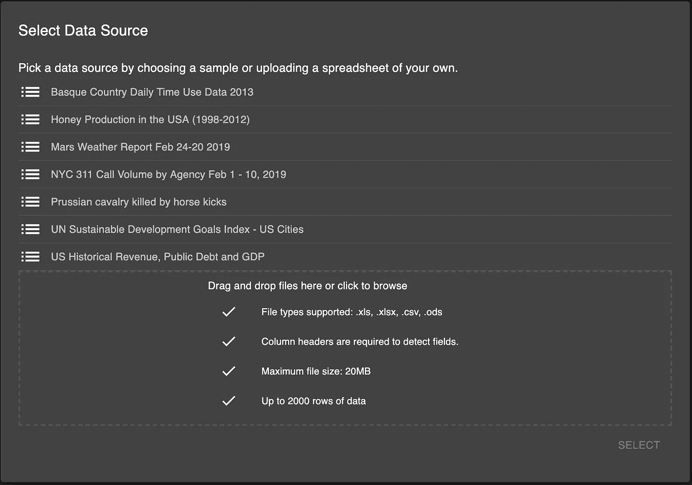
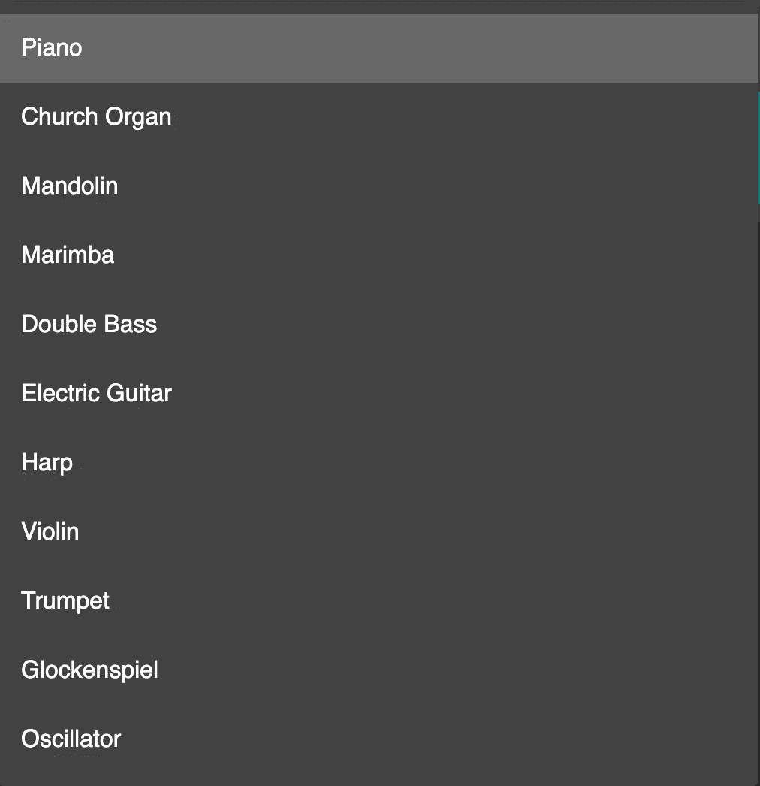

# 将数据转化为声音

> 原文：<https://towardsdatascience.com/turning-data-into-sound-4854a35b3504?source=collection_archive---------8----------------------->

## 听起来是个好主意！

Photo by [Spencer Imbrock](https://unsplash.com/photos/JAHdPHMoaEA?utm_source=unsplash&utm_medium=referral&utm_content=creditCopyText) on [Unsplash](https://unsplash.com/search/photos/music?utm_source=unsplash&utm_medium=referral&utm_content=creditCopyText)

我在[西蒙·罗杰斯](https://medium.com/u/e093dae6814e?source=post_page-----4854a35b3504--------------------------------)的[帖子](https://medium.com/@smfrogers/sonification-make-beautiful-music-with-your-data-d8fd59b84f3f)的启发下，介绍了 [TwoTone](https://twotone.io/) ，一个将数据表示为声音的工具，我创建了我的第一个数据“发音”(也就是数据的音乐表示)。这让我特别感兴趣，因为我只梦想创造令人瞠目结舌的可视化效果，但从未想过我可以将数据转换成另一种格式，尤其是声音。这篇文章涵盖了双音以及如何使用它的基础知识。

**什么是发音？**

发音是指使用声音来表示数据，通常是为了补充或取代传统的可视化。尽管它已经存在了相当长的时间(1908 年首次使用)，但它还没有像可视化一样被探索——这使得它成为想要尝试新事物(和酷)的人的绝佳选择。

**什么是 TwoTone？**

TwoTone 由[数据化技术](https://datavized.com/)在[谷歌新闻倡议](https://newsinitiative.withgoogle.com/)的支持下构建，是一个进行发音的工具。它既是一个网络应用程序(在你的浏览器上运行)，也是一个命令行应用程序(在你的电脑上运行)，允许没有任何音乐或技术背景的用户从他们的数据集创建声音，以便更好地理解它们！

有了上面的特性，对于想打入数据科学领域而没有太多背景知识的人来说，它是一个非常棒的工具！这很容易上手。

**数据如何转化为音频？**

为了将数值转换成音频，TwoTone 使用**音阶，**由此*较高的*值对应于*较高的*音高。你可以在这里阅读更多关于它的信息。事不宜迟，让我们开始使用双色调吧！

**如何使用 TwoTone？**

在这篇文章中，我将使用 TwoTone 的更加用户友好和易用的[网络应用。](http://app.twotone.io)

前往 [app.twotone.io](http://app.twotone.io) 开始吧！您不需要帐户，但您肯定需要数据集—您可以选择自己的帐户，也可以使用任何可用的默认帐户。点击“开始”按钮后，系统会提示您选择“数据源”

TwoTone accepts any form of tabular data with the above specifications

我将使用数据集“美国历史收入、公共债务和 GDP”，这是 TwoTone 作为样本提供的数据集之一。也可以选择添加自己的数据(确保符合要求)。

在您按下“选择”后，您将获得一个门户网站的迷你导览(请不要跳过)。随着巡演的突出显示，一个音频轨道是*自动*为您生成的！你说完了吗？号码

重要的一点是，TwoTone 仅支持每个音轨一个数据源，这对于音阶来说有直观的意义。但是，您可以添加多个“轨道”来添加更多的数据！

很明显，你可以用数据做更多的事情，为什么要降低要求呢？让我们探索一些有趣的特性:

**1:不同的乐器**

Photo by [John Matychuk](https://unsplash.com/photos/gUK3lA3K7Yo?utm_source=unsplash&utm_medium=referral&utm_content=creditCopyText) on [Unsplash](https://unsplash.com/search/photos/instruments?utm_source=unsplash&utm_medium=referral&utm_content=creditCopyText)

是的，你没听错。您可以选择用不同的工具来表示您的数据！弹出打开音轨的乐器下拉菜单，您可以查看以下菜单:

Different instruments supported by TwoTone

没错！您可以在 12 种不同的乐器中“声音化”您的数据！选择您最喜爱的乐器，然后按下播放按钮，聆听您的数据。

**2:多首曲目——成为 DJ**

Photo by [Skullector R](https://unsplash.com/photos/hGQPTlJxIso?utm_source=unsplash&utm_medium=referral&utm_content=creditCopyText) on [Unsplash](https://unsplash.com/search/photos/dj?utm_source=unsplash&utm_medium=referral&utm_content=creditCopyText)

是的，你也可以通过混音成为 DJ。点击右下方的“+”图标添加另一个音轨，并选择“音阶”(我们稍后会谈到另一个选项)。Tada！还会自动为您创建另一个音频轨道。现在，你可以改变数据源或乐器来改变这个轨道的声音，并尝试混合！

PS:不一定要停在两条轨道上。

**3:带旁白的讲故事**

Photo by [Jason Leung](https://unsplash.com/photos/mZNRsYE9Qi4?utm_source=unsplash&utm_medium=referral&utm_content=creditCopyText) on [Unsplash](https://unsplash.com/search/photos/speech?utm_source=unsplash&utm_medium=referral&utm_content=creditCopyText)

添加另一个轨道时还记得另一个选项吗？那是旁白！您可以通过在曲目之间或期间进行叙述，将自己的声音添加到数据中，并制作成一个美丽的故事。通过这种方式，您可以用数据讲述一个“故事”,并从多个受众的数据中获得见解和意义。

完成后，您可以导出音频(右下角)并将其下载到您的计算机上！这是我第一次发音！

*如果你制作了一个发音，请通过回复这个故事或发送给我来与我分享！我总是对用数据(和发音)讲故事感兴趣。*