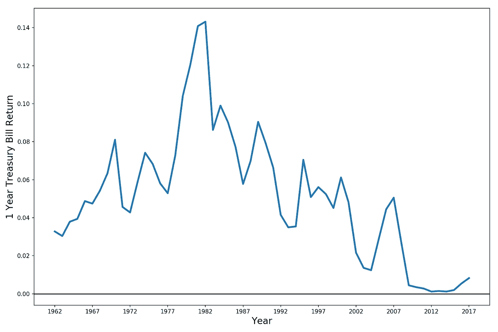
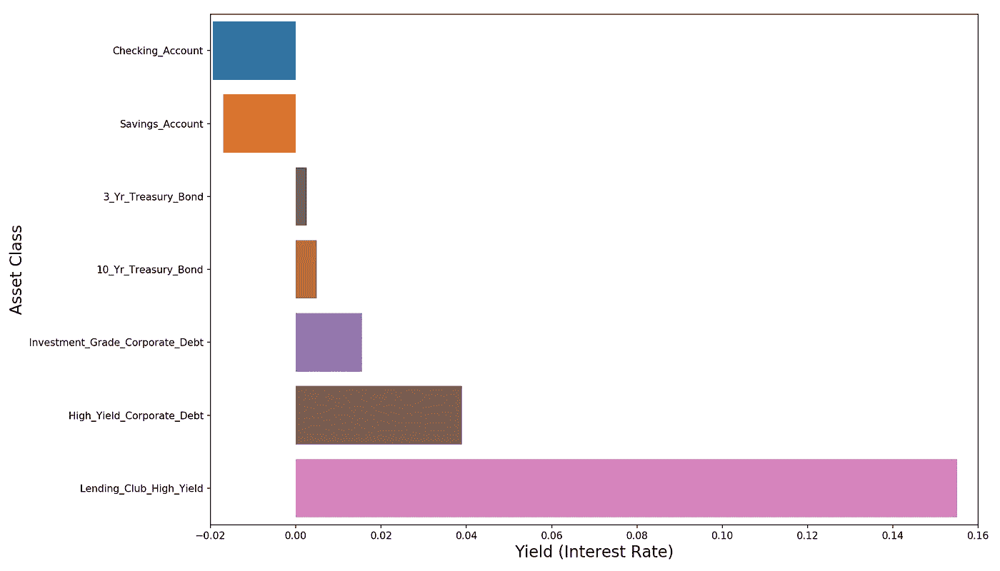
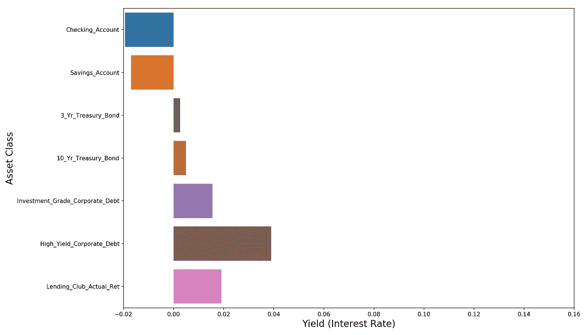
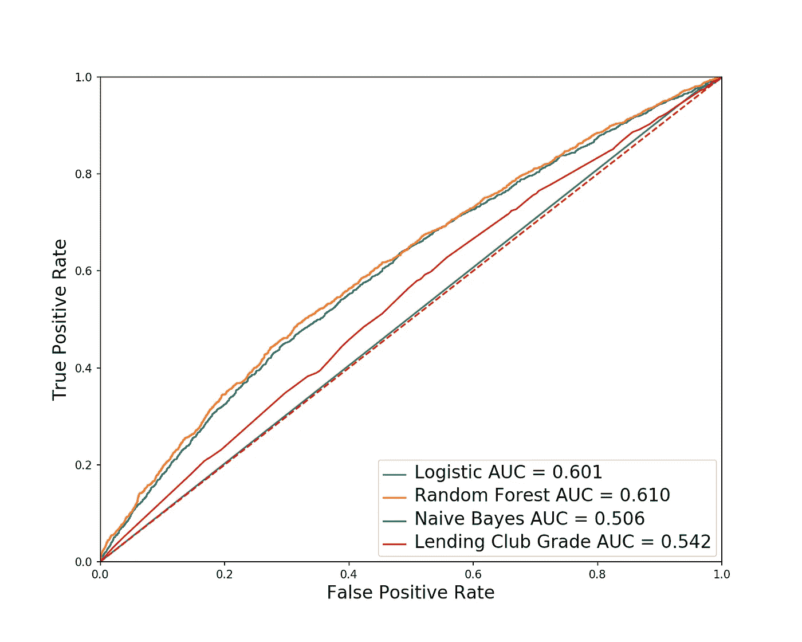
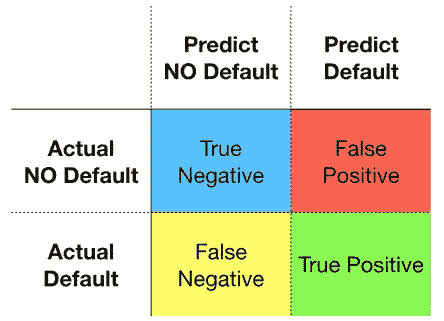
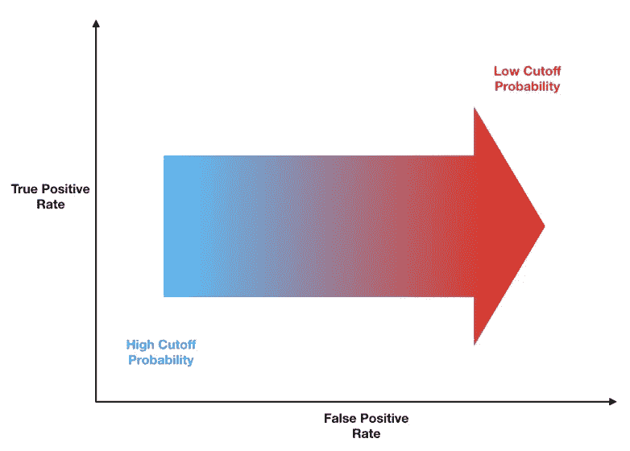
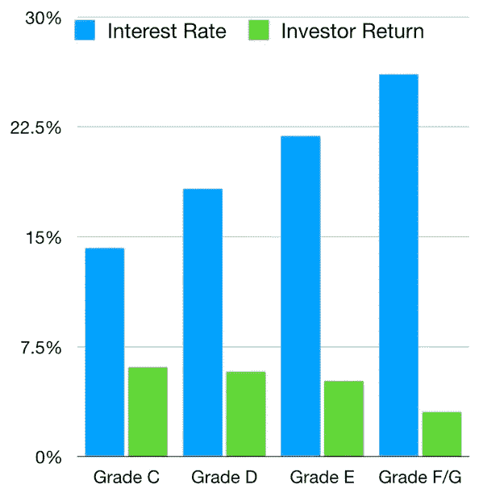
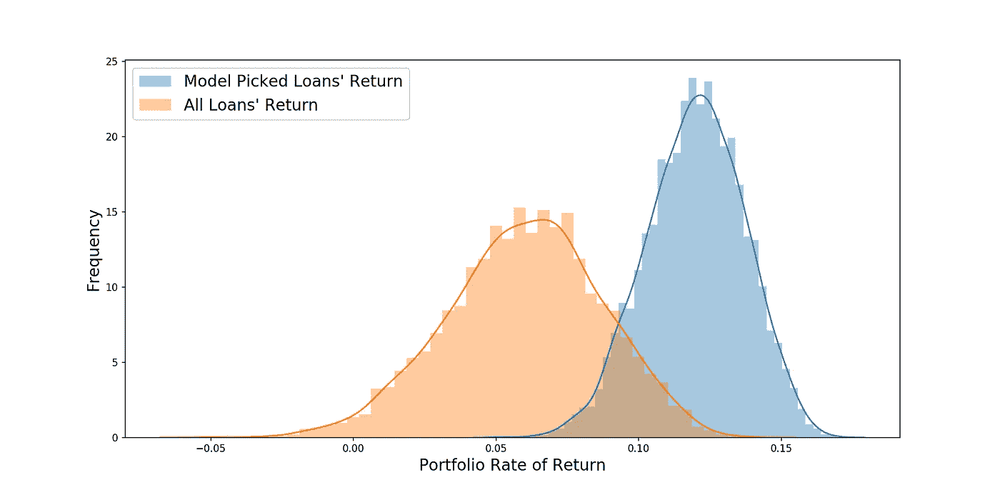

# 将 Lending Club 的最差贷款变成投资黄金

> 原文：<https://towardsdatascience.com/turning-lending-clubs-worst-loans-into-investment-gold-475ec97f58ee?source=collection_archive---------15----------------------->

So shiny…

## 我们使用机器学习从 Lending Club 最垃圾的贷款中挖掘利润

这是我完成的一个机器学习项目的文字记录。在这篇文章中，我希望:

*   *描述一下我预测贷款违约的算法。*
*   *使用该算法构建一个获得高于平均回报率的清洁贷款投资组合。*
*   *介绍并解释 ROC 曲线、精确度和召回率。*

*你可以在我的 GitHub* *上找到我用来运行分析的* [*代码。*](https://github.com/yiuhyuk/Project_3_Metis_Final)

L [ending Club](https://finance.yahoo.com/quote/LC/) 是最初的 P2P 贷款公司之一，也是金融科技的宠儿(尽管不再是了)，是一项有趣的业务。他们通过把想借钱的人和愿意借钱的人联系起来来赚钱。Lending Club 通过筛选出风险最高的借款人，并使用其专有算法为所有通过筛选的贷款申请人分配一个等级(和利率)，从而为这一过程增加价值。

我们今天对它们感兴趣，因为它们提供了目前很少有其他投资资产提供的东西——丰厚的利率。对于那些关注金融趋势的人来说，你们知道自 2008 年金融危机以来，美联储(美国中央银行)已经将收益率推至并维持在历史低位。请查看下面的图表:

The One Year Treasury Bill Rate is Pretty Low These Days

这种低利率货币政策的最终结果是整个风险范围内的收益率下降**(收益率是利率的另一种说法)**。从抵押贷款利率到高收益债券(向负债水平相对于收入较高的公司发放的贷款)的利率，所有收益率都被压缩至历史低点，因为投资经理会购买任何能够为他们带来可观回报的东西。

如果你有兴趣投资一些能给你固定利率的东西，这是你的选择菜单(见下图)。在通胀和美国国债勉强跑赢通胀后，你的银行账户为你赢得了负回报。将风险曲线进一步延伸到各种类型的公司债也没有多大帮助。但是那边是什么？

Inflation Adjusted Yields for Various Investment Assets

粉色条真的跳出来对吧？“Lending Club High Yield”是 Lending Club 的 D、E、F 和 G 评级贷款收益率的加权平均值(其中 A 最高，G 最低)。这些垃圾贷款(金融业对风险贷款的说法)比它们的高评级(A、B 和 C)同行提供了更高的收益率。**A、B 和 C 级贷款的平均收益率比垃圾贷款的收益率低大约 12%*！***

# *问题是*

*那么有什么问题呢？问题是这些垃圾贷款的违约率极高。*

> ***我看到大约 28%的垃圾贷款违约了！**(我的数据集是 2015 年由 Lending Club 发起的每 36 个月的贷款)*

*下图显示了这一巨大的违约率是如何影响我们本以为会获得的 15%的收益率的。违约让我们的通胀调整收益率从 15%下降到仅仅 2%！2%的回报包括收回的部分——在借款人违约后从借款人那里提取的欠款。*

**

*After Defaults, Lending Club Junk Loans Yield Very Little (All Yields are Inflation Adjusted)*

# *但是还是有希望的！*

*并非一切都没了。**如果我们能够建立一个分类模型，可靠地预测哪些贷款将成为坏账，那么我们就可以将投资集中在我们的模型认为最不可能违约的垃圾贷款上。首先让我们后退一步，回答这个问题，“什么是分类模型？”***

*分类是机器学习算法的一个流行目标——我们想知道一个观察值属于哪一类(也称为组)。对观察结果进行精确分组的能力对于各种业务应用程序非常有用，比如预测某个特定用户是否会购买某个产品，或者预测某笔贷款是否会违约。*

*如果上面的段落听起来很熟悉，那是因为我几乎一字不差地引用了之前的博客文章。[在那篇文章中，我写了大量关于随机森林分类器](/understanding-random-forest-58381e0602d2)的内容——我们现在将使用该算法将每笔贷款分类为可能违约或不可能违约。*

*如果你想更深入地了解随机森林是如何工作的，请阅读那个帖子。但是这里是 TLDR — **随机森林分类器是许多不相关的决策树的集合。**树木之间的低相关性产生了多样化效应，使得森林的预测平均优于任何单个树木的预测，并对样本外数据具有鲁棒性。*

*随机森林算法采用以下两种技巧来减少树之间的相关性—[**【bagging】(引导聚合)和特征随机性(查看我在随机森林上的帖子了解更多)**](/understanding-random-forest-58381e0602d2) **。***

# *特征选择*

*我用来构建模型的贷款数据和特征来自 Lending Club 的网站。我下载了。包含 2015 年承保的所有 36 个月贷款数据的 csv 文件。如果你在没有使用我的代码的情况下玩他们的数据，**一定要仔细清理以免数据泄露。**例如，其中一列代表贷款的收款状态——这是我们在发放贷款时肯定无法获得的数据。*

*正如贷款数据所预期的那样，大多数特征都与借款人的个人和财务特征有关:*

*   *房屋所有权状况*
*   *婚姻状况*
*   *收入*
*   *债务收入比*
*   *信用卡贷款*
*   *贷款特征(利率和本金金额)*

*因为我有大约 20，000 个观察值，所以我使用了 158 个特性(包括一些自定义特性——ping me 或[查看我的代码](https://github.com/yiuhyuk/Project_3_Metis_Final),如果你想知道细节的话),并且依赖于适当地调整我的随机森林来保护我免于过度适应。*

# *使用 ROC 曲线的模型选择*

*尽管我让它看起来像随机森林和我注定要在一起，我也考虑过其他模式。下面的 ROC 曲线显示了这些其他模型如何与我们心爱的随机森林(以及随机猜测，45 度虚线)相比较。*

**

*ROC Curves for the Various Classification Models I Tried (Validation Data)*

*等等，你说什么是 ROC 曲线？我很高兴你这么问，因为我写了一整篇关于它们的博文！*

*万一你不想读那篇文章(真让人难过！)，这是一个略短的版本 ROC 曲线告诉我们，我们的模型在收益(真阳性率)和成本(假阳性率)之间的权衡有多好。让我们根据我们当前的业务问题来定义这些意味着什么。*

**

*The Confusion Matrix*

*   ***真阳性率，也称为召回率，是真阳性与实际违约的比率。**在我们的混淆矩阵(左侧)中，它是绿色方框除以绿色和黄色方框之和。**它告诉我们用我们的模型正确分类的实际违约的百分比。***
*   ***误报率是误报与实际无违约的比率。**在我们的矩阵中，它是红色方框除以红色和蓝色方框之和。**它告诉我们被我们错误归类为违约的干净贷款的百分比。***

> *关键是要认识到**虽然我们想要一个漂亮的大数字在绿盒子里——增加真阳性也是以牺牲红盒子里更大的数字为代价的(更多的假阳性)。***

*让我们看看为什么会出现这种情况。对于每一笔贷款，我们的随机森林模型都给出了违约概率。但是什么构成了默认预测呢？25%的预测概率？50%呢？或者我们想额外确定 75%？答案是视情况而定。*

> *决定一个观察值是否属于正类的概率截止值**是一个我们可以选择的超参数。***

*这意味着我们的模型的性能实际上是动态的，并根据我们选择的概率截止值而变化。如果我们选择一个非常高的截止概率，如 95%，那么我们的模型将只把一小部分贷款归类为可能违约(红色和绿色框中的值都很低)。但另一方面，我们的模型只捕获了实际违约的一小部分——或者换句话说，我们的真实正利率很低(黄色框中的值比绿色框中的值大得多)。*

*如果我们选择一个非常低的截止概率，例如 5%，就会出现相反的情况。在这种情况下，我们的模型会将许多贷款归类为可能违约(红色和绿色框中的大额贷款)。由于我们最终预测大多数贷款将会违约，因此我们能够捕捉到绝大多数的实际违约(高真实正利率)。但结果是，红框中的值也非常大，因此我们背负着很高的假阳性率。*

**

*How a ROC Curve is Generated*

## *回到 ROC 曲线*

*哇，这是一个比预期更长的题外话。我们终于准备好复习如何阅读 ROC 曲线了。*

*左边的图表显示了 ROC 曲线上的每条线是如何绘制的。对于一个给定的模型和截断概率(比如截断概率为 99%的随机森林)，我们通过其真阳性率和假阳性率将其绘制在 ROC 曲线上。在我们对所有截止概率做了这些之后，我们在 ROC 曲线上画出一条线。*

*但这实际上意味着什么呢？*

> *右边的每一步都代表着截断概率的降低——伴随着假阳性的增加。**因此，我们需要一个模型，对于每一个额外的假阳性(产生的成本),该模型能够获得尽可能多的真阳性。***

*这就是为什么模型越呈现驼峰形状，其性能就越好。曲线下面积最大的模型是驼峰最大的模型，因此也是最好的模型。*

*咻终于解释完了！回到上面的 ROC 曲线，我们发现 AUC 为 0.61 的随机森林是我们的最佳模型。其他一些有趣的事情需要注意:*

*   *名为“Lending Club Grade”的模型是一个以 [Lending Club 自己的贷款等级(也包括子等级)](https://www.lendingclub.com/info/demand-and-credit-profile.action)为特征的[逻辑回归](https://medium.com/me/stats/post/163de52ea900)。虽然他们的成绩显示出一些预测能力，**我的模型优于他们的这个事实暗示着他们，不管是有意还是无意，没有从他们的数据中提取出所有可用的信号。***

**

*Average Interest Rate and Investor Return for Lending Club Loans (2007 to Q1/2019)*

*   *雪上加霜的是， **Lending Club 的高风险贷款表现不如它们的安全贷款**，这是现代投资组合理论的信徒[所厌恶的(左图)。这里的含义是，Lending Club 可能不会向风险较高的借款人收取足够高的利率。**我的预感是，达到收入目标的压力正迫使他们收取更低的利率，以吸引更多的借款人。**](https://en.wikipedia.org/wiki/Modern_portfolio_theory)*
*   *朴素贝叶斯分类器产生的结果与随机猜测的结果相同。在某个时候，我会写这个模型，但我对它的糟糕表现感到惊讶。*

## *为什么是随机森林？*

*最后，我想详细解释一下为什么我最终选择了随机森林。仅仅说其 ROC 曲线的 AUC 最高是不够的，即曲线下面积(逻辑回归的 AUC 几乎一样高)。作为数据科学家(即使在我们刚刚起步的时候)，我们应该寻求理解每个模型的利弊。以及这些利弊如何根据我们正在分析的数据类型和我们试图实现的目标而变化。*

***我选择了随机森林，因为我的所有特征与目标变量的相关性都很低。**因此，我觉得从数据中提取一些信号的最佳机会是使用一种算法，这种算法可以捕捉我的特征和目标之间更微妙的非线性关系。我还担心过度拟合，因为我有很多特征——来自金融，我最糟糕的噩梦总是打开一个模型，看到它以惊人的方式爆炸，第二次我把它暴露给真正的样本数据。随机森林提供了决策树捕获非线性关系的能力，以及它自己对样本外数据的独特鲁棒性。*

# *特征重要性*

*scikit-learn 中的随机森林实现有一个方便的“feature_importances_”属性。如果我们检查一下我们的模型，我们会发现三个最重要的特征是:*

1.  *贷款利率(很明显，利率越高，月供越高，借款人违约的可能性越大)*
2.  *贷款金额(与以前相似)*
3.  *债务收入比(负债越多，违约的可能性越大)*

# *精确度和召回率*

*好了，我们现在有了模型，所以终于到了构建投资组合的时候了。也是时候回答我们之前提出的问题了，“在决定是否将贷款归类为可能违约时，我们应该使用什么样的概率截止值？”*

*让我们定义两个关键术语:*

***Precision:** 当我们的模型将一笔贷款归类为可能违约时，它实际违约的概率是多少？*

*强调精确度的模型具有高概率截止值，并且会导致更多的假阴性。*

***回想一下:**在所有实际违约的贷款中，我们的模型标记了多少可能违约的贷款？*

*一个强调回忆的模型有一个低的概率截止值，会导致更多的假阳性。*

> *分类中一个关键但又被忽视的部分是决定是优先考虑精确度还是召回率。这与其说是一个数据科学问题，不如说是一个商业问题，它要求我们对我们的目标有一个清晰的认识，以及假阳性的成本与假阴性的成本相比如何。*

*我强烈主张召回。**请记住，我们的目标是找到一套我们可以放心投资的干净贷款。假阴性(我们预测没有违约，但贷款违约)会让我们付出真金白银的代价，而假阳性(预测违约，但贷款没有违约)只是一种机会成本——因此，即使贷款看起来有点不可靠，我们也应该扔掉它。总会有更多的贷款可供选择，所以在决定是否投资我们辛苦赚来的钱时，我们应该非常谨慎。***

*让我们用一个概率截止值 **20%。***

# *最后，投资结果*

*我有一个秘密要坦白——在我们分析的开始，我隐藏了大约 6500 笔贷款，这样我们现在可以用它们来执行真正的样本外测试。让我们看看我们做得怎么样。*

*在我们测试的 6500 笔贷款中，有 28%违约。但是在我们的模型归类为安全(不太可能违约)的大约 450 笔贷款中，**只有 15%违约。**我们能够将违约频率降低近 50%！*

*这很酷，但当我们将其转化为回报时，情况会是怎样呢？Lending Club 建议投资者购买并持有至少 100 笔贷款的投资组合(以实现多样化)。因此，让我们使用蒙特卡罗模拟，从整个测试集中随机选择 100 笔贷款，并从我们的干净集(由我们的模型挑选的贷款)中反复选择 100 笔贷款(我们将运行 5000 次模拟)，看看我们做得如何。*

**

*Return Comparison — Model Picked Loans vs. All Loans*

> *当我们只投资于我们的模型所选择的贷款时，我们成功地将获得的回报从整个测试集的 6%提高到了 12%!胜利！*

# *结论*

*看起来我们能够成功预测哪些贷款更有可能违约，避免它们，并最终获得显著更高的回报。*

*我们还了解了更多关于随机森林的知识，如何解释 ROC 曲线，以及精度和召回因素如何影响我们模型的概率截止值。*

*如果你喜欢这个，请看看我的其他帖子(下面的链接)。干杯！*

# *链接*

****更多来自数据科学上的真知:****

*[*了解随机森林如何工作*](/understanding-random-forest-58381e0602d2)*

*[*了解逻辑回归如何工作*](/understanding-logistic-regression-using-a-simple-example-163de52ea900)*

*[*我的数据科学训练营经历*](/how-i-feel-about-data-science-and-the-metis-bootcamp-experience-398b171289d0)*

****更多来自贵府的真才实学:****

*股票比现金有超额回报吗？*

*[*下一次股市低迷可能会是什么样子*](/the-anatomy-of-a-stock-market-downturn-6527e31406f0)*