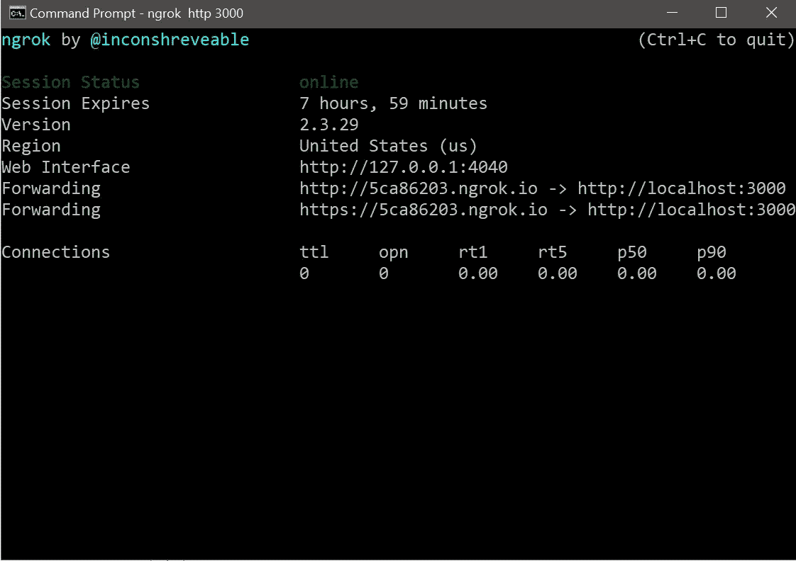
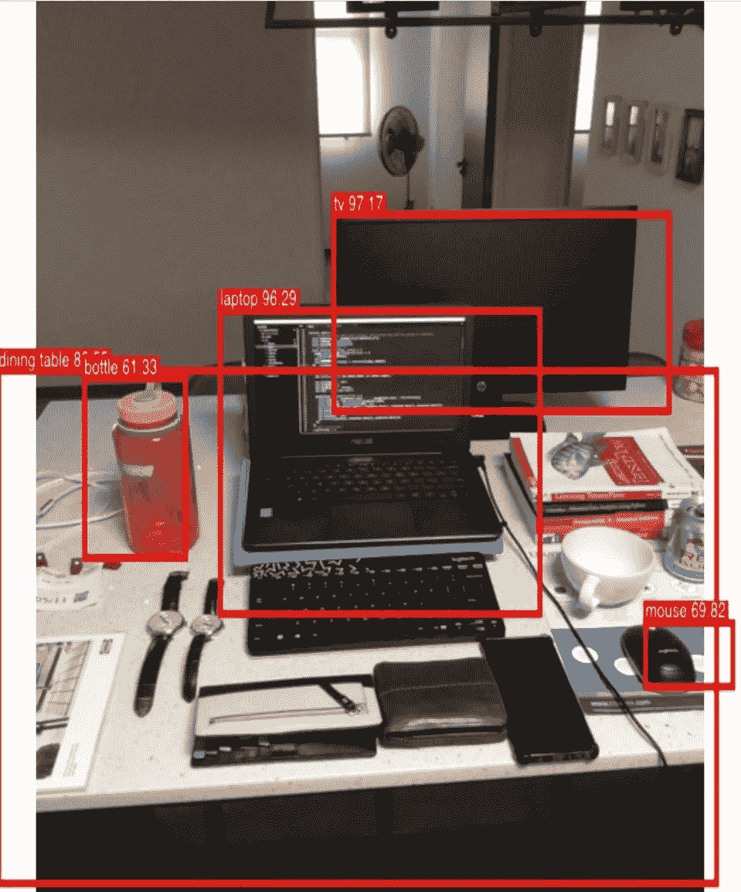

# 把你的手机摄像头变成一个物体探测器(靠你自己！)

> 原文：<https://towardsdatascience.com/turning-your-mobile-phone-camera-into-an-object-detector-on-your-own-1428055b8e01?source=collection_archive---------20----------------------->

## 是时候释放你相机的潜能了！

如果更多人只需几行代码就能把手机摄像头变成物体探测器，会怎么样？写这个故事是为了给大家的生活注入乐趣！这可能是开始学习 JavaScript 和反应的一个很好的方法！

这个故事假设了 JavaScript、npm 和 React 的简单基础知识。嗯，可能真的很容易实现，只要按照步骤！如果你需要任何帮助，请在下面给我留言。

# 安装和初始准备

为了安装 npm，安装 [Node.js](https://nodejs.org/en/download/) ，npm 就会随之而来。然后，启动“命令提示符(cmd)”，指向要安装 React 应用程序的目录，并输入以下命令:

```
npx create-react-app obj-detector
cd obj-detector
npm install @tensorflow/tfjs @tensorflow-models/coco-ssd
```

该命令将创建一个新的 React 应用程序和一个名为“obj-detector”的新目录。然后它将安装 tensorflow.js 和 COCO-SSD(也称为上下文中的公共对象和单次多框检测)。

# 代码

进入 *obj-detector/src/* 目录，打开这个文件 *App.js* 。用以下代码替换所有内容:

接下来，用以下代码替换 *App.css* 中的所有内容:

```
.app-position {
  position: fixed;
  margin: auto;
}
```

仅此而已，真的！是时候部署应用程序了。

# 部署

回到控制台，当您在目录 *obj-detector* 中时，输入以下命令来部署应用程序:

```
npm start
```

过一会儿，你应该能在你的浏览器上看到一个指向 [http://localhost](http://localhose) :3000 的页面。允许使用您的网络摄像头，并花时间玩您的物体检测器！请注意，用于检测的文件相对较大，因此需要一段时间才能开始工作。

# 等等，你不是说我们可以用手机吗？

是的，当然。然而，还有几个步骤要做。

首先，下载这个软件 [Ngrok](https://ngrok.com/download) 并按照页面上的前 3 步来设置软件。接下来，在保持运行 *npm start* 的现有命令提示符的同时，启动另一个命令提示符并输入以下内容:

```
# Run the code on cmd while in the directory that has ngrok.exe
ngrok http 3000
```



You should see this after running the code

接下来，使用你的手机，在你的浏览器中访问 *https* URL(在我的情况下，是*https://5ca 86203 . ngrok . io*)，像往常一样，给浏览器访问你的相机的权限，等待探测器加载。是时候在你的手机上玩你自制的物体探测器了！

或者，你可以通过这里的访问它，我在 Heroku 上部署它。如果您担心图像的存储，您可以放心，相机不会存储任何图像。(因为是在免费账号上而且我也没有那么大的存储磁盘空间来存储那么多数据！)



Screenshot taken from my iPad. That’s what it can detect!

这就是目前实现的全部内容。如果实施有任何问题，请给我留言。干杯！

*一个接一个的项目，我着迷于事物如何使用收集的数据和建立在其上的模型工作，并通过部署模型来解决现实生活中的问题。目前，我在计算机视觉和深入思考我们如何感知世界方面投入了大量时间，希望将其转化为计算机视觉的发展。你可以通过我的* [*LinkedIn*](http://www.linkedin.com/in/JackieTanSG) *联系我。*