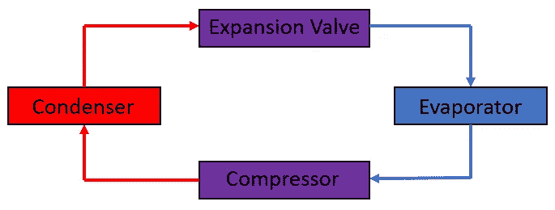
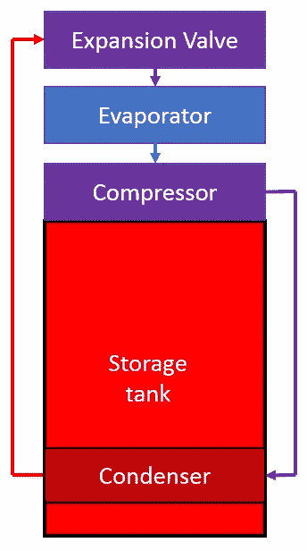

# 自动性能图创建教程

> 原文：<https://towardsdatascience.com/tutorial-automatically-creating-a-performance-map-of-a-heat-pump-water-heater-7035c7f208b0?source=collection_archive---------24----------------------->

## 您可以学习在真实世界场景中自动分析实验室数据

许多寻求学习如何用 Python 编程的人要求实际的例子，在那里他们可以通过解决现实世界的问题来学习 Python。它为这个过程提供了更多的背景和意义。

别再看了。这是教程中第一篇这样做的文章。本教程将教你 Python 编程，给出确切的代码，多元回归等数据科学概念，如何自动化整个过程，并通过解决一个常见的工程问题来实现。

我们将解决的工程问题是创建一个性能图，预测热泵热水器的性能，作为周围条件的函数。如果那句话里的专业术语对你没有任何意义，也不用担心。接下来的几节将回答你的问题。

本教程将教你几个重要的概念，例如:

*   "性能图"和"热泵热水器"的定义、
*   如何编写[自动化科学数据分析](/automating-scientific-data-analysis-part-1-c9979cd0817e)的 Python 代码，
*   如何[分割数据文件](/automating-scientific-data-analysis-part-2-12331b46003)、[自动分析测试](/automating-analysis-of-scientific-data-sets-84f5027d6d26)、[检查那些结果是否有错误](/checking-automated-data-analysis-for-errors-a97a22a35ad7)、[验证](/how-to-choose-between-multiple-models-a0c274b4228a)、[记录一个简单的仿真模型](/automating-scientific-data-analysis-part-4-110d14421527)，以及
*   [多元回归](/understanding-multiple-regression-249b16bde83e)。

但是首先要做的是。让我们确保你理解上面的术语，因为它们是遵循教程的关键。

## 什么是热泵？

热泵本质上是一种在两个位置之间传递热量的装置。维基百科上的定义是“热泵是一种将热能从热源转移到所谓的散热器的装置。”热泵的一个例子是美国家庭中常见的家用空调。这些设备将热量从热源(在这种情况下是建筑物的内部)传递到散热器(建筑物的外部)。

> "热泵是一种将热能从热源转移到所谓的散热器的装置。"—维基百科

但是热泵是怎么做到的呢？它是如何将热量从冷空间转移到热空间的？通过热力学的“魔力”。图 1 提供了热泵一般功能的示意图。

Figure 1: Schematic of a Heat Pump

制冷剂沿箭头方向流过图 1 中列出的所有设备。制冷剂是设计用于在特定条件下升高/降低温度的传热流体，在热泵中非常有用。

图 1 所示的四个设备都使制冷剂通过不同的过程，驱动热泵。当制冷剂通过系统时，会经历以下过程:

*   **压缩机**:压缩机基本上就是一个泵。制冷剂以气体形式进入压缩机，在压缩机中被泵压至更高的压力。当它被泵到更高的压力时，制冷剂变热，导致温度非常高的气体通过冷凝器。
*   **冷凝器**:冷凝器是连接制冷剂和散热器的热交换器。由于此时制冷剂的温度非常高，它会将热量散失给散热装置进行冷却。在我们的空调例子中，散热器是外部空气(是的，制冷剂比热空气更热！).制冷剂通过冷凝器时冷凝，形成高压中温液体。
*   **膨胀阀**:膨胀阀是将制冷剂导入另一侧的低压环境和条件，使制冷剂膨胀的阀门。随着它的膨胀，它会进一步冷却。这产生了一个低温流体，因为它通过蒸发器。
*   **蒸发器**:蒸发器是另一个热交换器，这次连接热源。以空调为例，这是室内的低温条件。由于液体非常冷，它会从室内带走热量，从而提高制冷剂的温度。当它变热时，制冷剂膨胀，导致压缩机产生冷气体。

因此循环重新开始。

> 设备传递的热量取决于冷凝器和蒸发器的传热速率。正如那些研究过热传递的人所知道的，这些点的热传递速率是由冷凝器和蒸发器周围的空气温度决定的。

在那个描述中有三种不同类型的能量转移。泵消耗电力以确保制冷剂通过循环。热量从制冷剂传递到冷凝器中的散热器。热量从热源传递到蒸发器中的制冷剂。设备传递的热量取决于冷凝器和蒸发器的传热速率。正如那些研究过热传递的人所知道的，这些点的热传递速率是由冷凝器和蒸发器周围的空气温度决定的。

这就产生了术语“性能系数”。性能系数表示相对于泵消耗的能量，从热源传递到散热器的热量。通常超过一个。不过，它对热源和散热器的温度非常敏感。随着这些温度越来越接近制冷剂温度，传递的热量越来越少，因此在不改变所需泵送能量的情况下降低了热泵的性能。

现在我们了解了热泵，下一个要探索的概念是热泵热水器(HPWH)。

## 什么是热泵热水器？

热泵热水器是一种用于加热水的热泵。他们使用一个大的储水箱，通常有 55 到 80 加仑，储存热水以备不时之需。热泵将周围空气(热源)中的热量传递给储存在水箱中的水(散热器)。图 2 显示了热泵热水器的示意图。

Figure 2: Schematic of a Heat Pump Water Heater

请注意，热泵的四个部分与图 1 中列出的部分相同。唯一真正的区别是冷凝器位于热水储水箱内。这样，热制冷剂将热量传递给水箱中的水。同时，蒸发器将周围空间的热量转移给制冷剂。这样，它将热量从空间中的空气传递到水中。

## 什么是性能图？

在介绍热泵一节中，我们提到性能系数取决于冷凝器和蒸发器周围的温度。这意味着性能系数将随着周围温度的变化而变化。这些温度会改变。室外温度不是全天恒定的。空调运行时，室内温度会发生变化。

人们可以想象一个曲线图或函数来描述两个温度变化时的性能系数。

这是一张性能图。性能图是在影响设备的条件发生变化时识别设备性能的一种方式。这是一个多变量方程，表示器件性能与这些条件的函数关系。

在科学和工程领域，创建性能图是一项常见的工作。这方面的一个例子是建筑能源模拟。预测新建筑的能源消耗，并设计新的方法来减少建筑能源消耗在美国是一个很大的领域。这些人使用模拟模型来预测建筑的性能。这些模拟模型需要预测安装在建筑物中的设备所消耗的能量。由于热泵用于建筑，这些模型需要预测热泵的性能。这些热泵的性能是由这些模型预测的，使用的是，你猜对了，性能图。

## 接下来是什么？

这篇文章介绍了理解和遵循教程所需的背景概念。接下来的教程将教你获取一组描述 HPWH 在不同条件下的性能的实验室测试数据并生成性能图所需的步骤。它将教你编写自动完成这项工作所需的 Python 代码。它将让您有机会在现实世界的例子中学习这些有用的技能。

如果你只是通读文章，本教程将会很有用。您将能够理解这些概念，您将看到所有工作都完成了，并且您将看到自己完成这些工作所需的 Python 脚本。然而，它真正有用的地方是，如果你能够编写代码，生成结果，并自己检查答案。为此，我创建了一个配套数据集。如果你下载了数据集，你就能跟上，确保你做的每件事都是正确的，并尽可能多的学习。

可以在[这里](https://peter-grant.my-online.store/HPWH_Performance_Map_Tutorial_Data_Set/p6635995_20036443.aspx)找到配套数据集。

该数据集包含伪造的结果，模拟您可能从实验室获得的结果。它包含来自三个实验的准数据，展示了热泵热水器随着空间和水温变化的性能。

第一项任务，也是本教程的第一步，是[将数据集分割成独立的文件](/automating-scientific-data-analysis-part-2-12331b46003)，每个文件提供一次测试的结果。那篇文章很快就会发表。

## 教程目录

这是一系列文章的一部分，教你自动分析实验室数据和绘制热泵热水器性能图所需的所有技巧。本系列的其他文章可以通过以下链接找到:

[分割数据集](/splitting-data-sets-cac104a05386)

[自动分析实验室测试数据](/automatically-analyzing-laboratory-test-data-32c27e4e3075)

[检查分析的实验室数据是否有错误](/checking-analyzed-laboratory-data-for-errors-4bd63bcc554d)

[如何编写检查数据质量的脚本](https://medium.com/zero-equals-false/how-to-write-scripts-that-check-data-quality-for-you-d8762dab34ca)

[如何在 Python 中自动生成回归](https://medium.com/zero-equals-false/how-to-perform-multivariate-multidimensional-regression-in-python-df986c35b377)