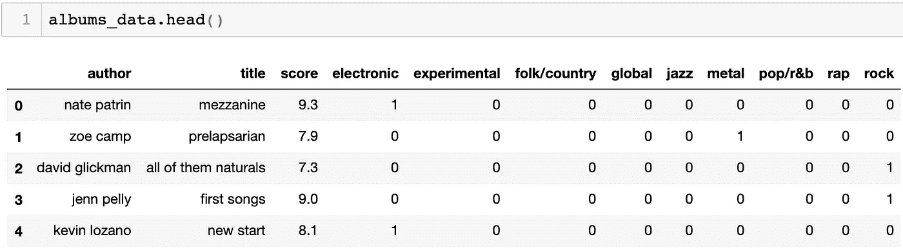
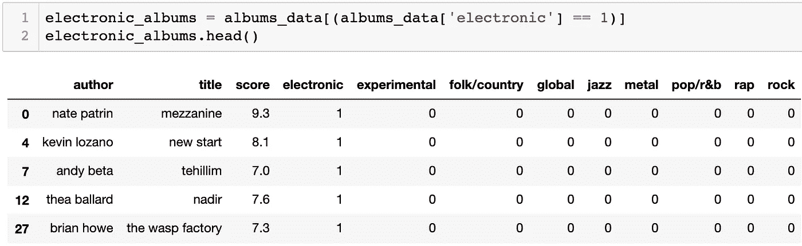
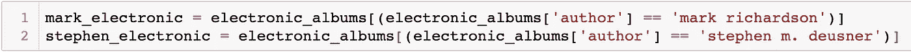
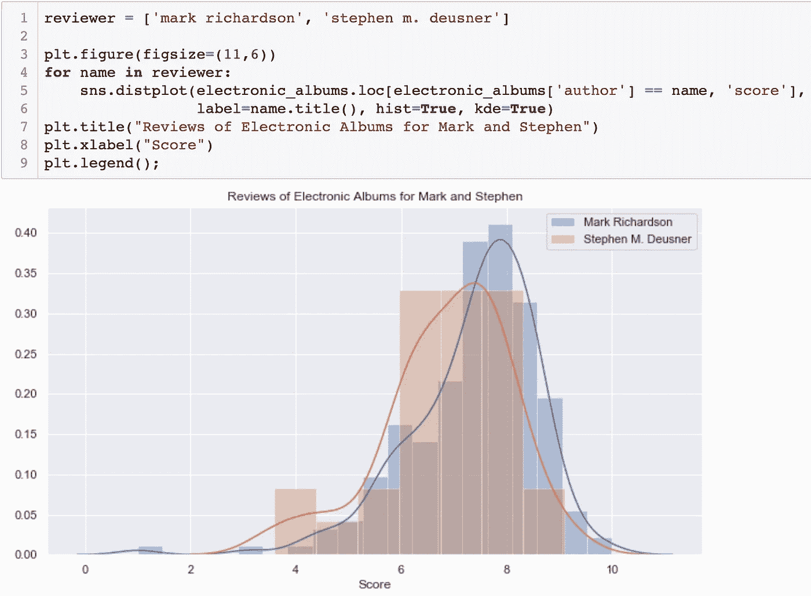
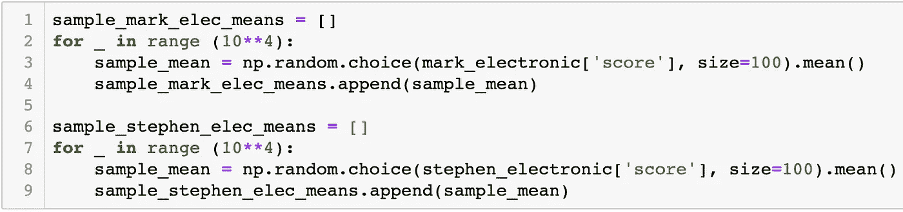
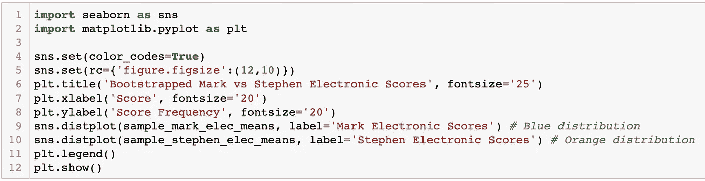
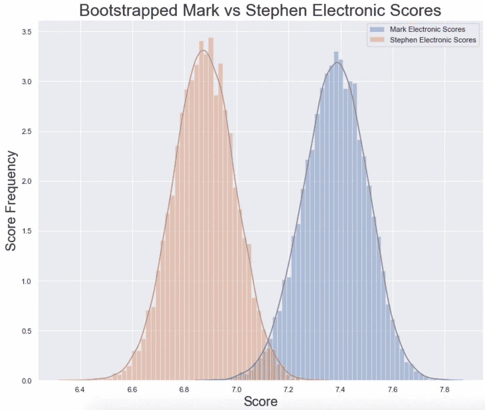
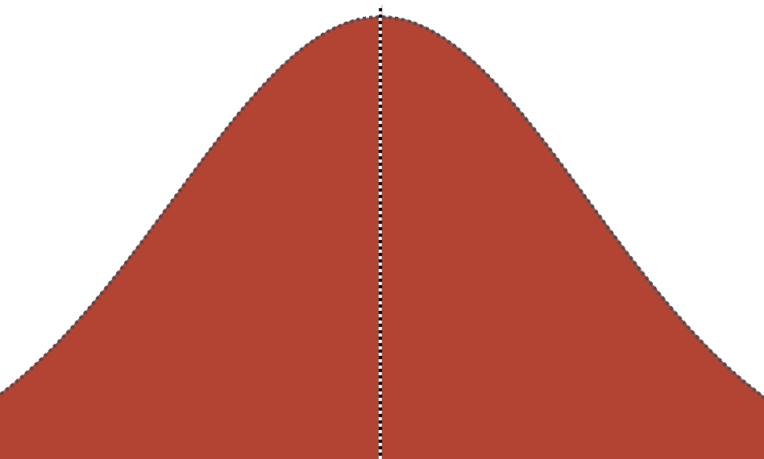
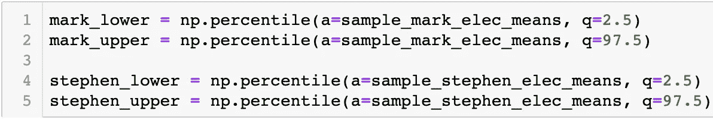
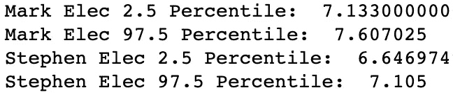

# 使用置信区间和引导的教程

> 原文：<https://towardsdatascience.com/tutorial-for-using-confidence-intervals-bootstrapping-860ba716aef3?source=collection_archive---------16----------------------->

## 验证假设检验的另一种方式

Photo by Lisa Fotios

在本教程中，我将尝试展示如何使用 bootstrapping 和置信区间来帮助突出样本分布之间的统计显著差异。

First 5 Rows of albums_data

首先，假设我们有一个名为 **albums_data** 的数据集，其中包含专辑评论者的姓名、他们给每张专辑的评分以及每张专辑所属的流派。由于一些专辑有多个流派，这些流派是使用虚拟录制的(换句话说，每个流派都有自己的栏)。如果我们想问这个问题“评论者 X 和评论者 Y 在他们如何评论特定流派的专辑方面有统计学差异吗？”我们可以用自举和置信区间来回答这个问题。

# 马克和斯蒂芬

***首先*** ，我们需要定义我们要问的问题。让我们假设我们想知道两个评论家，马克和斯蒂芬，在他们如何给电子专辑评分方面是否有统计学上的显著差异。为了回答这个问题，我们创建了两个假设，称为零假设和备择假设。我们的零将永远是没有差别的场景。这是我们的两个假设:

**零假设:**“Mark 的电子分数和 Stephen 的电子分数之间没有*统计上的显著差异。”*

***替代假设:**“Mark 的电子分数和 Stephen 的电子分数之间*存在*统计上的显著差异。”*

**

*Filtering the albums_data to only electronic albums.*

****其次*** ，我们需要过滤我们的 **albums_data** 只包含属于电子流派的专辑。*

**

*Creating two separate datasets for both reviewers.*

****第三个*** ，我们需要为我们想要比较的两个评论者创建两个单独的数据集。我们这样做是为了在引导公式中具体引用每个样本。我们需要的两个数据集是 Mark 和 Stephen 的。*

*我们差不多准备好出发了！但是，在我们开始之前，让我们先来看看 Mark 和 Stephen 的电子分数的当前分布情况:*

**

*Current electronic score distribution, pre-bootstrapping.*

*正如我们在上面看到的，马克和斯蒂芬的分数有很多重叠。我们还可以看到，斯蒂芬的分布比马克的分布略偏左。然而，我们从图表中看不到的是这两个样本之间是否存在统计上的显著差异。换句话说，我们不能仅仅通过看上面的图表来拒绝或接受我们的零假设。*

# *什么是引导*

*好了，快休息。我知道我已经读了一半教程，还没有对什么是自举给出一个合适的解释。设置很重要，但是让我快速解释一下引导背后的想法。我们知道我们想要回答的问题是，我们的零假设或替代假设是否正确。任何假设检验的目的都是为了回答整个群体的问题，而不仅仅是为了我们现有的数据。*

*大多数时候，我们只能处理人口数据的样本。因此，我们需要最大限度地利用我们的样本。为此，我们从样本数据中抽取重复的小样本，计算每个样本的平均值，并创建这些平均值的新分布。如果我们做 10，000 个迷你样本，我们在这个新的分布中将有 10，000 个均值。我们对两个样本都这样做(在上面的例子中，我们对 Mark 和 Stephen 都这样做)。*

*这是明确的解释。如果这对于你来说是一个新的概念，我保证随着教程的进行，它会变得更有意义。*

# *回到马克和斯蒂芬*

*因此，正如我们刚刚在上一节中了解到的，我们在自举中的第一步是从我们的数据集中提取一些小样本，并计算每个样本的平均值。我们分别为马克和斯蒂芬做这件事。*

**

*下面是创建这些**方法列表**的代码。为了快速浏览正在发生的事情，我们创建了 10**4(也就是 10，000)个方法列表。每个列表在数据集中选择 100 个随机评论分数来计算平均值。我们这样做是为了马克和斯蒂芬。最终输出是两个列表( *sample_mark_elec_means* 和*sample _ Stephen _ elec _ means*)，每个列表包含 10，000 个均值。*

*信不信由你，就自举复杂性而言，差不多就是这样了。然而，在当前的列表格式中，它不是特别有用。让我们在图表上查看这些分布:*

****

*哇！这比我们之前制作的图表更能说明问题。请记住，这里唯一的不同是，这个图表使用了我们从引导工作中获得的 10，000 个随机生成的**表示**。上图是所有**实际**分数的分布。*

*虽然看起来这些分布非常不同，但我们实际上不能说是否有统计上的显著差异。你看到分布中有重叠的地方了吗？我们需要知道每个样本的**置信区间**是否重叠。如果它们**确实与**重叠，我们接受我们的零假设，并得出结论:在马克和斯蒂芬的电子分数之间**没有**统计上的显著差异。*

# *置信区间*

*好了，关键时刻到了。马克和斯蒂芬的电子成绩在统计上有显著差异吗？首先，我们需要确定我们的假设是单尾的还是双尾的。*

***单尾:**单尾检验要求样本之间的差异在**特定方向**。例如，如果我们的替代假设是“马克的电子分数在统计上显著地 ***比斯蒂芬的电子分数*** 高”，那么我们将使用单尾测试。*

***双尾:**双尾检验是假设中不需要方向差异的情况。我们的另一个假设是“Mark 的电子分数和 Stephen 的电子分数之间存在统计学上的显著差异”，这并没有指定任何一个样本需要高于(或低于)另一个样本。它只要求在**的任一方向**有差异。*

**

*Two-Tailed Test. Distribution sans 2.5% on each end for 95% Confidence Interval.*

*所以我们知道我们有一个双尾检验。但是当谈到置信区间时，这意味着什么呢？嗯，澄清什么是置信区间可能很重要。置信区间是我们在接受或拒绝我们的零假设时希望有多自信。如果我们希望 95%确信马克和斯蒂芬的电子分数之间存在差异，我们将有 5%的置信区间。然而，正如我们刚刚在上面学到的，我们有一个双尾检验。这意味着这 5%将被分成样本分布的两个尾部(2.5%在左尾部，2.5%在右尾部，马克和斯蒂芬都是如此)。这个范围也可以写成:2.5%-97.5%之间 *(97.5%就是 100%减去 2.5%)* 。本质上，这只是切断了马克和斯蒂芬分布的末端，如上图所示。*

**

*Calculating the 2.5% and 97.5% confidence interval cutoffs for both samples.*

**

*Results from the above code.*

*现在我们想知道，马克和斯蒂芬的分布(两端各有 2.5%***截断*** )在我们的 bootstrap 图中重叠吗？这是一个快速而容易回答的问题。我们需要做的就是找出马克和斯蒂芬的 2.5%和 97.5%的值。幸运的是，Python 库 numpy 为我们找到了这些百分比的值。正如我们在输出中看到的，马克的 2.5%和 97.5%临界值在 7.13 和 7.61 之间，而斯蒂芬的临界值在 6.65 和 7.11 之间。*

*我们问自己的问题是:“这些分布在两端没有 2.5%的情况下重叠吗？”。我们可以看到 7.11 小于 7.13，这意味着两个分布之间没有重叠。换句话说，我们可以**拒绝我们的零假设**并以 95%的置信度得出结论，马克和斯蒂芬的电子分数之间存在统计学上的显著差异。*

*太多了。我希望这篇教程对你有用。记住，这是一个双尾测试。如果它是单尾的(假设一个样本高于另一个样本)，我们将把**的全部 5%放入一个尾**。我们把它放在哪个尾部，取决于我们假设哪个样本比另一个大。*

# *摘要*

*我想最后一次快速浏览一下这个过程。首先，我们确定想要回答什么问题，并创建适当的无效假设和替代假设。其次，我们为想要比较的两个样本创建两个数据集。第三，我们为每个样本创建我们的自举均值列表。第四，我们可视化的自举平均分布。第五，我们计算置信区间(双尾模型每端 2.5%，单尾模型特定端 5%)。最后，我们比较置信区间并寻找任何重叠。如果没有重叠，我们可以拒绝零假设，接受另一个假设。如果不是，我们接受我们的零假设。*