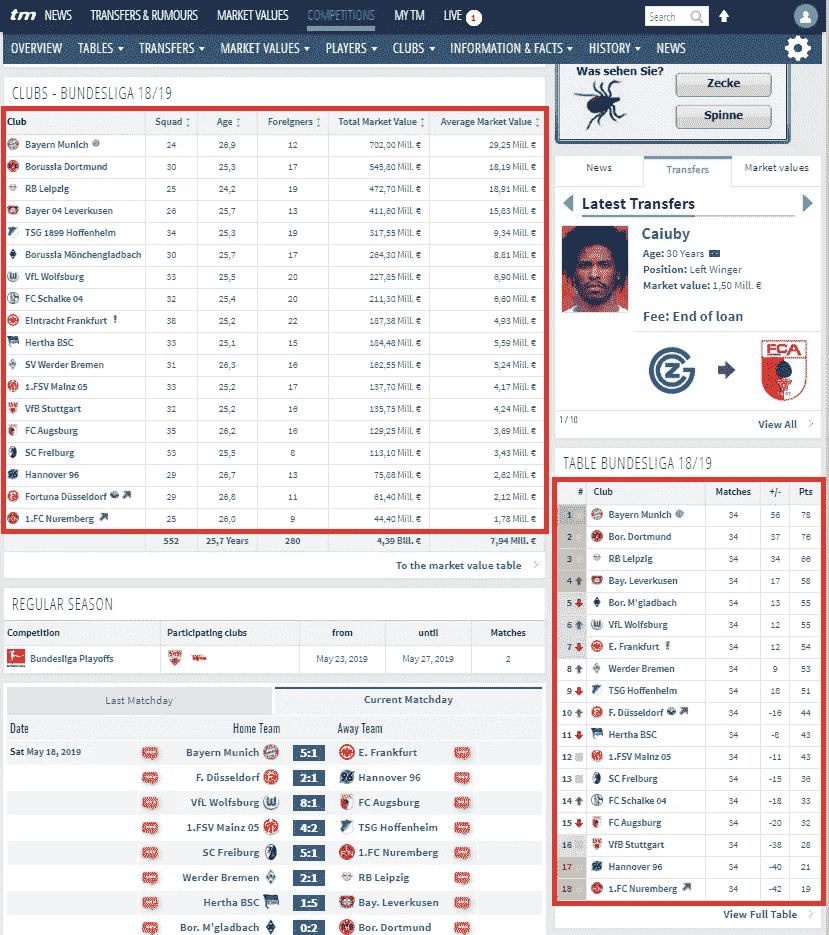
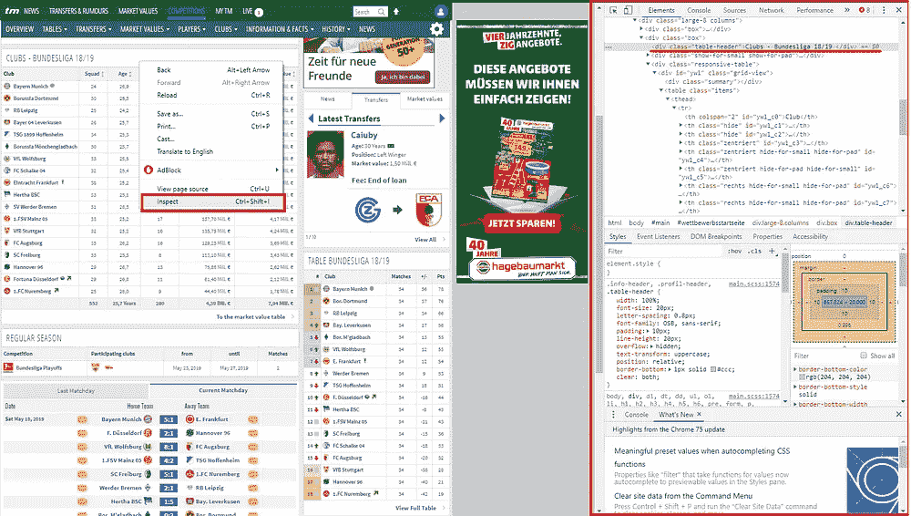
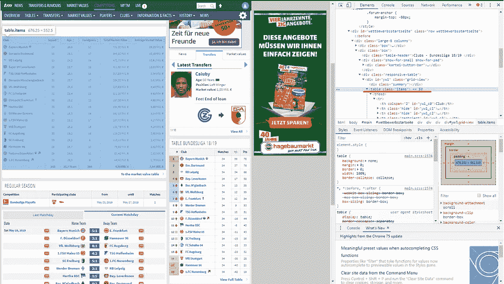
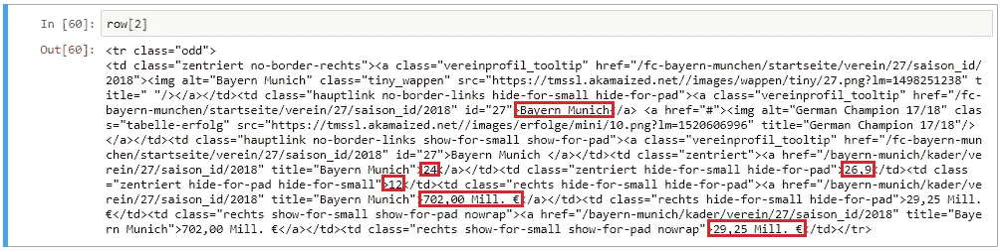
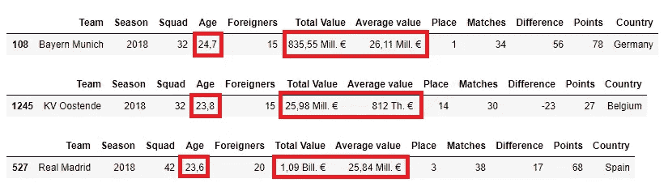
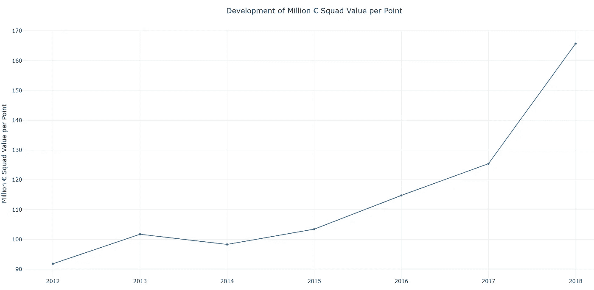
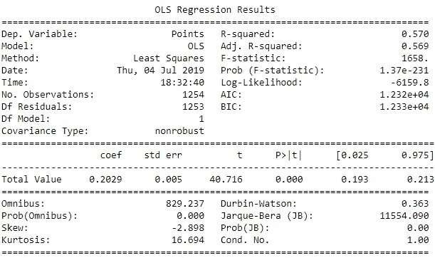

# 教程:从假设到网络搜集分析

> 原文：<https://towardsdatascience.com/tutorial-from-the-hypothesis-to-the-analysis-with-web-scraping-98ac3c774bd?source=collection_archive---------14----------------------->

## 一个真正的数据科学项目的教程，收集所需的数据，清理，转换并最终分析它


通常人们有一些有趣的想法来分析，然后发现没有免费的数据来回答这个问题。获取所需数据的一种有趣方式是网络搜集。互联网上有大量的数据，但这些数据无法以结构化的方式进行分析。通常，教程以读取数据开始，以保存数据结束。在本教程中，我想走一条不同的道路。我想带你踏上一个真实世界的数据科学项目之旅。我们从我们的想法开始:我们收集、清理和转换数据，并用收集到的数据集回答我们的问题。更详细的分析不刮部分可以在这里找到[](/money-makes-the-world-go-round-and-thus-also-the-soccer-847bb5350535)**。**

## *这个想法和我们的假设*

*近日，2018/2019 赛季全国及国际比赛以足球落幕。传统上，在夏季休赛期，转会窗口打开，俱乐部在市场上争夺最好的球员。令人吃惊的是，同样的俱乐部一次又一次地为他们的球星花费创纪录的金额。仅皇马就在埃登·阿扎尔投资了 1.35 亿英镑。因此，我想探究的问题是，球队的价值和运动上的成功有多大的关联。未来几年除了巴萨和皇马还会有其他冠军吗？其他联赛呢？我的假设是，更高的团队价值也会带来更高的成功。所以我有了一个有趣分析的想法，但是没有数据。然而，我知道网上有球队价值的数据库。所以先来点数据吧！*

## *我们需要一些数据——通过网络搜集收集的数据*

*网页抓取有不同的软件包。两个最著名的图书馆当然是 Scrapy 和 BeautifulSoup。Scrapy 是一个建立在异步网络库上的强大框架，这使得它非常有性能。它还具有许多功能来避免典型的刮擦问题。这些包括例如重定向、重试请求、避免服务器过载等。然而，由于复杂性，Scrapy 的学习曲线也明显高于 BeautifulSoup。这个库主要用于解析和提取 HTML 中的数据。在抓取时出现的所有异常和问题都必须由程序员来识别，并在编码中加以考虑。然而，这样做的好处是，用户实际上必须在这里处理问题，并从头开始学习网络抓取。因此，我们将在这里使用 BeautifulSoup。*

## *数据库*

*所需数据可在 transfermarkt.com[1]上找到。例如，在图 1 中，您可以看到 2018/2019 赛季德国德甲联赛的阵容值。在同一页上，你会发现一个当前赛季的结果表:排名，净胜球和积分。如果我们不厌其烦地搜集数据，我们应该提取出所有我们需要的信息用于进一步的分析。*

**

*Figure 1: The red-marked area contains the required information*

*说到 web 抓取，我们通常对页面的某个部分感兴趣，我们希望有选择地从中提取信息。在我们的例子中，我们首先要提取两个表的内容(图 1)。为了做到这一点，我们需要识别包含元素的 HTML 标签。每个浏览器都提供了识别 HTML 标签的可能性。在这个例子中，我使用的是谷歌浏览器(图 2)。首先，右键单击包含必要数据的区域。然后你点击`Inspect`，它会在右边打开一个菜单。如果您将鼠标移动到菜单中的每一行，站点就会突出显示与 HTML 代码相关的区域(图 3)。*

****

*Figure 2: Inspecting the region of interest with your browser / Figure 3: The HTML-Code of the are of interest*

*所以第一个表在 HTML 元素`table`中，类名为`items`。其中，有元素`thead`、`tfood`和`tbody`，它们又包含进一步的元素。基本内容在`tbody`中找到，它包含表中每行的`tr`元素。第一步我们不需要更多的信息。因此，我们首先导入所需的模块:*

```
*import pandas as pd
import numpy as np
import requests
from bs4 import BeautifulSoupimport warnings
warnings.filterwarnings('ignore')*
```

*然后，我们将 URL 赋给一个变量，并设置一个用来模拟真实用户的头。否则，一些页面会直接阻止请求。我们将使用模块`requests`调用 URL 并加载内容。然后我们将使用`BeautifulSoup`解析`requests`对象的内容，以提取我们需要的内容:*

```
*url = 'https://www.transfermarkt.com/bundesliga/startseite/wettbewerb/L1/plus/?saison_id=2018'
headers = {"User-Agent":"Mozilla/5.0"}
response = requests.get(url, headers=headers, verify=False)
soup = BeautifulSoup(response.text, 'html.parser')*
```

*`soup`元素现在包含了解析后的页面。从`soup`元素中，我们能够提取所需的表格:*

```
*table = soup.find('table', {'class' : 'items'})*
```

*现在，我们可以将表中的每一行保存在一个列表中:*

```
*row = table.findAll('tr')*
```

*通过键入`len(row)`，我们发现总共有 20 个元素。德甲 18 支球队，页眉页脚。我们应该找到拜仁慕尼黑:*

**

*Figure 4: Bayern Munich*

*现在我们有了第一个俱乐部的数据。在图 4 中红色标记的区域，我们有名字，球队的规模，平均年龄，外国人的数量，总市值和平均市值。但是我们如何将数据转换成合理的形式来分析它呢？为此，我们首先必须删除所有带有后缀`.text`的 HTML 代码。`Row[2].text`让我们的信息更具可读性:*

```
*'\nBayern Munich Bayern Munich 3224,715835,55 Mill. €26,11 Mill. €835,55 Mill. €26,11 Mill. €'*
```

*这看起来好多了，但是现在我们在一个变量中有了所有的信息。因此，我们将带有`findAll['td']`的行按列划分，这样我们可以寻址每个单元格并保存它。现在，类似于这些行，我们也可以寻址单个列或组合两者:*

```
*In:
row[2].findAll('td')[1].text
row[2].findAll('td')[3].text
row[2].findAll('td')[4].text
row[2].findAll('td')[5].text
row[2].findAll('td')[6].text
row[2].findAll('td')[7].textOut:
'Bayern Munich '
'32'
'24,7'
'15'
'835,55 Mill. €'
'26,11 Mill. €'*
```

*现在我们有了用循环读取整个表的所有东西:*

*我们能够从列表中创建一个数据框架。我们总是跳过第一行，因为我们已经刮去了我们不需要的标题。*

## ***更动态地抓取数据***

*当然，我们不会大费周章只读取一个表。我们将在七年的时间里读出排名前十的联赛。这样我们就有了一个可靠的数据库来进行计算。首先，我们为每个联盟创建一个字典，其中存储了每个赛季的数据:*

*然后我们用每个联盟的 URL 创建一个列表。你还记得 2018/2019 赛季的拜仁网址吗？*

```
*[https://www.transfermarkt.com/bundesliga/startseite/wettbewerb/L1/plus/?saison_id=2018'](https://www.transfermarkt.com/bundesliga/startseite/wettbewerb/L1/plus/?saison_id=2018')*
```

*在列表中，我们只存放:*

```
*[https://www.transfermarkt.com/bundesliga/startseite/wettbewerb/L1/plus/?saison_id=](https://www.transfermarkt.com/bundesliga/startseite/wettbewerb/L1/plus/?saison_id=)*
```

*我们用一个循环来添加年份。这样，我们可以为我们的项目编写一个灵活的脚本。十大联赛的完整列表如下:*

*现在我们需要一个嵌套循环。最外层的循环遍历带有联盟 URL 的列表，内层循环遍历 2012 年到 2018 年:*

## *数据转换*

*这样一来，我们每个联赛从 2012 年到 2018 年每个赛季都有十本字典。首先，我们将合并每个联盟的所有赛季，然后将所有联盟合并到一个数据集。问题是，如果我们最终将所有数据组合在一起，为什么我们不直接将所有数据收集到一个数据集中。如果没有一年或一个联赛的数据，我已经将`try`和`except`块包含在刮削部分以避免错误。因此，我们仍然获得最大可能的数据量和数据质量。首先，我们连接每个联赛的每个赛季，将各自的国家存放在单独的数据集中，然后合并所有联赛:*

*让我们来看看三个精选的俱乐部:*

```
*df_final.loc[df_final['Team'] == 'Bayern Munich']
df_final.loc[df_final['Team'] == 'KV Oostende']
df_final.loc[df_final['Team'] == 'Real Madrid']*
```

**

*Figure 5: String values ​​that still need to be converted*

*到目前为止，数据看起来不错，但是我们没有数字，尽管在`Total value`和`Average value`有字符串。在图 5 中，我们看到了添加工厂。€。€和比尔。每个牢房里都有€。在将列转换为 float 之前，我们必须移除这些。在 Age 列中，分隔符仍然是逗号，而不是点。我们还必须清理这个列:*

*然后我们可以将所有列转换为 float:*

*为了安全起见，我们将数据集保存一次:*

```
*df_final.to_pickle(“…path\\df_final.pkl”)
df_final.to_excel(“…path\\df_final.xlsx”)*
```

## *我们终于可以回答我们的问题了*

*在搜集和清理数据之后，我们有了一个干净的数据集来检验我们的假设。首先，让我们用下面的代码来看看平均团队值的演变:*

**

*我们看到球队的平均价值不断增加。球队在所有联赛中投资，所以总的来说，在他们的球队中投资更多。现在，让我们来看看这两个变量相互关联的程度:*

*`df_final.corr()['Total Value']['Points']`*

*相关系数是`0.664`，这意味着我们有很强的正相关性。这种相关性并没有说明任何因果关系。我们假设更高的团队价值也导致更大的运动成功。我们将做一个回归，看看球队价值观对得分的影响有多大:*

**

*调整后的 R 为 0.569。这意味着队值解释了点的方差的 56.9%。结果具有统计学意义，每增加 100 万欧元，得分平均增加 0.2029 分。*

## *结论*

*在这篇文章中，我们首先提出了一个假设，然后在网上确定了一个数据库。我们研究了网络抓取的基础知识，并基于一个特定的问题开发了一个脚本，通过它我们可以有目的地读取网站的数据。然后，我们准备和清理数据，为我们的分析奠定基础。使用基本的统计方法，我们检查了我们的假设。
团队价值和运动成功之间的相关性非常显著。此外，球队价值对得分的影响非常大。
更详细的分析可以在[这里](/money-makes-the-world-go-round-and-thus-also-the-soccer-847bb5350535)找到。*

## *Github:*

*archiv:
[https://github.com/bd317/tutorial_scraping](https://github.com/bd317/tutorial_scraping)
教程第一步:
[https://github . com/BD 317/Tutorial _ scraping/blob/master/Soccer _ Scrape _ Tutorial _ Part _ 1% 20(1)。ipynb](https://github.com/bd317/tutorial_scraping/blob/master/Soccer_Scrape_Tutorial_Part_1%20(1).ipynb)
完整脚本:
[https://github . com/BD 317/Tutorial _ scraping/blob/master/Soccer _ Scrape _ Tutorial _ Part _ 2 . ipynb](https://github.com/bd317/tutorial_scraping/blob/master/Soccer_Scrape_Tutorial_Part_2.ipynb)*

## *来源:*

*[1][https://www.transfermarkt.com](https://www.transfermarkt.com/)
【2】[https://www . uefa . com/memberassociations/uefarankings/country/#/yr/2019](https://www.uefa.com/memberassociations/uefarankings/country/#/yr/2019)*

*[如果您喜欢中级数据科学，并且还没有注册，请随时使用我的推荐链接加入社区。](https://medium.com/@droste.benedikt/membership)*