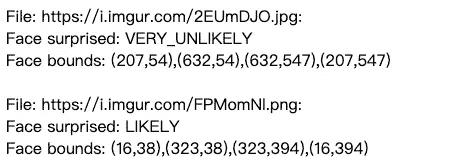

# 教程:使用 Python 和 Heroku 的 Google Vision API

> 原文：<https://towardsdatascience.com/tutorial-google-vision-api-with-python-and-heroku-3b8d3ff5f6ef?source=collection_archive---------5----------------------->

## 了解如何使用 Google Vision API


Image by author

正如我们之前了解到的，谷歌视觉人工智能可以分为两个部分， **AutoML 视觉和视觉 API** 。对于 Vision API 参考，这里是以前的帖子，讨论 Vision API 可以做什么，如何创建 API 键，然后用 **curl** 查询它。

[](/ml-study-jam-detect-labels-faces-and-landmarks-in-images-with-the-cloud-vision-api-a80e89feb66f) [## ML Study Jam — Vision API

### 使用云视觉 API 检测图像中的标签、人脸和地标

towardsdatascience.com](/ml-study-jam-detect-labels-faces-and-landmarks-in-images-with-the-cloud-vision-api-a80e89feb66f) 

今天，我们将学习如何在 **Python** 中使用它。然后我们可以在将来的项目中使用它。

在我们开始之前，我想和你分享一下官方教程。

[](https://codelabs.developers.google.com/codelabs/cloud-vision-api-python/index.html?index=..%2F..index#0) [## 通过 Python 使用 Vision API

### 谷歌云视觉 API 允许开发人员轻松地将视觉检测功能集成到应用程序中…

codelabs.developers.google.com](https://codelabs.developers.google.com/codelabs/cloud-vision-api-python/index.html?index=..%2F..index#0) 

在接下来的段落中有一个快速教程，但是如果你想在阅读之后了解更多的细节，你仍然可以从 Google Codelabs 中学习。太好了，现在我们开始吧。

# 步骤概述

1.  建立一个 Vision API 项目。
2.  启用 Vision API。
3.  验证 API 请求并下载`keyFile.json`。
4.  用`keyFile.json`设置`GOOGLE_APPLICATION_CREDENTIALS`。
5.  安装谷歌客户端视觉 API 客户端库。
6.  编写 Python 代码来查询 Vision API。
7.  将代码推至 [Heroku](https://dashboard.heroku.com/) 。

# 第一步。建立一个 Vision API 项目。

1.  登录到[谷歌云平台控制台](http://console.cloud.google.com)并创建一个新项目。


2.命名项目并点击**创建**按钮。


3.点击**主动云壳**。


4.然后底部会出现一个控制台外壳。
运行`$ gcloud auth list`以确认您已通过身份验证。并运行`$ gcloud config list project`确认项目 id。


# 第二步。启用 Vision API。

运行命令行`$ gcloud services enable vision.googleapis.com`


# 第三步。验证 API 请求并下载`keyFile.json.`

根据 Google Codelabs 教程，我们需要创建一个服务帐户和一个访问 Vision API 的密钥。

> 为了向 Vision API 发出请求，您需要使用一个*服务帐户*。一个*服务帐户*是一个属于你的项目的帐户，它被 Google 客户端 Python 库用来发出 Vision API 请求。

单击下面的链接，并按照`Setting up authentication` GCP 控制台的步骤操作。

 [## Vision API 客户端库|云 Vision API 文档| Google 云

### 本页显示了如何开始使用 Cloud Vision API 的云客户端库。阅读有关客户端的更多信息…

cloud.google.com](https://cloud.google.com/vision/docs/libraries#client-libraries-usage-python) 

1.  [转到创建服务帐户密钥页面](https://console.cloud.google.com/apis/credentials/serviceaccountkey?_ga=2.195063340.-1201461484.1549874559&_gac=1.261428863.1571476113.Cj0KCQjw6KrtBRDLARIsAKzvQIGBUmJ3lHgLrzXidQ7oxbLau9FsbWI-CLXE2b6cvEbkQj_aE0z4dM8aApSoEALw_wcB)
2.  从**服务账户**列表中，选择**新服务账户**。
3.  在**服务帐户名称**字段中，输入一个名称。
4.  不要从**角色**列表中选择值。访问此服务不需要任何角色。

如果所有设置都设置正确，用户界面将如下所示:


5.点击**创建**。将出现一条注释，警告此服务帐户没有角色。

6.点击**创建无角色**。一个 JSON 文件，包含你下载到你电脑上的密钥。


# 第四步。用`keyFile.json`设置`GOOGLE_APPLICATION_CREDENTIALS`

将 JSON 文件重命名为`keyFile.json`。然后用文件设置`GOOGLE_APPLICATION_CREDENTIALS`。

```
export GOOGLE_APPLICATION_CREDENTIALS=~/Desktop/keyFile.json
```

# 第五步。安装谷歌客户端视觉 API 客户端库。

1.  运行`pip freeze | grep google-cloud-vision`来检查库是否已经安装。


2.如果您没有设置环境，请运行`pip install --upgrade google-cloud-vision`。


# 第六步。编写 Python 代码来查询 Vision API。

将以下代码复制并保存为 Python 文件。

运行 Python 文件来测试是否正确设置了所有环境设置。

```
/usr/local/opt/python/bin/python3.7 [path/to/your/filename.py]
```

我们上传了两位巨星的照片，并使用 Vision API 中的人脸检测来获取他们的人脸边界和情感。

输入数据:


images from [WikiMedia](https://commons.wikimedia.org/wiki/File:Robert_Downey_Junior.jpg) and [Pinterest](https://www.pinterest.com/pin/565342559452130279/)

以下是输出:

```
=========================================================File: {pic}Face surprised: VERY_UNLIKELYFace bounds: (207,54),(632,54),(632,547),(207,547)=========================================================File: {pic}Face surprised: LIKELYFace bounds: (16,38),(323,38),(323,394),(16,394)
```

恭喜你！这意味着我们已经成功查询了 Vision API。尝试官方教程中的其他 Vision APIs。

 [## 教程|云视觉 API 文档|谷歌云

### 无论您的企业是刚刚踏上数字化转型之旅，还是已经走上数字化转型之路，谷歌云的解决方案…

cloud.google.com](https://cloud.google.com/vision/docs/tutorials) 

# 第七步。将代码推至 [Heroku](https://dashboard.heroku.com/) 。

> **注:根据**[**Mandar Vaze**](https://medium.com/@mandarvaze/please-do-not-recommend-committing-keyfile-json-8de574c17d3a)**的建议，我们不应该将个人** `***keyFile.json***` **上传到公共空间。如果您对安全问题有所顾虑，请参考** [**本帖**](https://learnings.desipenguin.com/post/goog-cred-heroku/) **寻求解决方案。**

如果你还是不太了解 Heroku，请先看看之前的帖子。

[](https://medium.com/better-programming/line-bot-with-python-and-heroku-tutorial-e8c296f3816f) [## 教程:使用 Python 和 Heroku 的 LINE Bot

### 从头开始，建立你的线机器人

medium.com](https://medium.com/better-programming/line-bot-with-python-and-heroku-tutorial-e8c296f3816f) 

在第 6 步中，该项目在本地运行良好，但我们需要将其构建为应用程序或 web 使用的在线服务。

1.  下面是代码示例，请下载并在下面的步骤中学习如何在线推送。

[https://github . com/mutant 0113/Google _ Vision _ API _ sample/blob/master/medium-Google-Vision-API . zip](https://github.com/mutant0113/Google_Vision_API_sample/blob/master/medium-google-vision-api.zip)

2.将你自己的谷歌服务账号`keyFile.json`添加到文件夹`medium-google-vision-api/config/`

3.创建一个新的 Heroku 项目。

```
heroku login
heroku create [your/project/name] --buildpack heroku/python
```

4.链接项目并将代码推送到主分支。

```
cd [path/to/your/local/project/download/from/step1]
heroku git:remote -a [your/project/name]
git push heroku master
```

5.将`GOOGLE_APPLICATION_CREDENTIALS`和`keyFile.json`设定在 Heroku 上。

```
heroku config:set GOOGLE_APPLICATION_CREDENTIALS='config/keyFile.json'
```


6.确保至少有一个应用程序实例正在运行。

```
heroku ps:scale web=1
```

7.打开 Heroku 网站

```
heroku open
```

如果一切都设置正确，您应该会看到网站的内容像图片一样。



8.您可以在 hello/views.py 和 hello/vision_api.py 中编辑代码

今天到此为止。我们现在可以开始使用 Google Vision API 编写代码了。希望这篇文章能帮助你更多地了解 Google Vision API。

如有任何问题或建议，欢迎在本文下方留言评论。再见。

# 参考

云愿景 API 定价

 [## 定价|云愿景 API 文档|谷歌云

### 云视觉 API 提供了一组用于分析图像的功能。在这些情况下，我们让您只需支付…

cloud.google.com](https://cloud.google.com/vision/pricing) 

我们的 Heroku 代码基于官方样本代码。

[](https://devcenter.heroku.com/articles/getting-started-with-python) [## 使用 Python 开始使用 Heroku

### 本教程将让你在几分钟内部署一个 Python 应用程序(一个简单的 Django 应用程序)。再坚持几分钟…

devcenter.heroku.com](https://devcenter.heroku.com/articles/getting-started-with-python) 

Node.js 版本的另一个教程。

[](https://medium.com/@naz_islam/how-to-authenticate-google-cloud-services-on-heroku-for-node-js-app-dda9f4eda798) [## 如何在 Heroku for Node.js App 上认证谷歌云服务

### 在这篇文章中，我将讨论如何授权各种谷歌云服务，如数据存储、云存储…

medium.com](https://medium.com/@naz_islam/how-to-authenticate-google-cloud-services-on-heroku-for-node-js-app-dda9f4eda798)