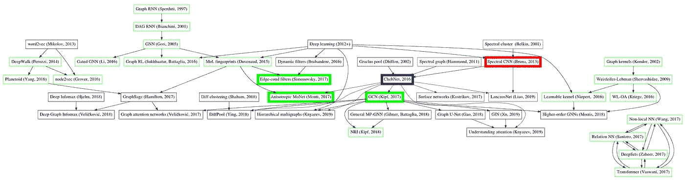
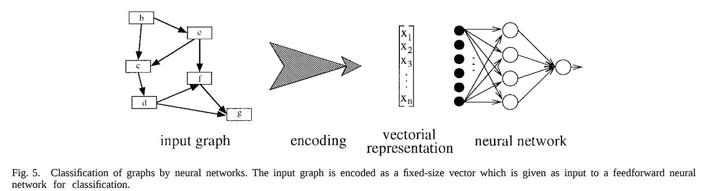
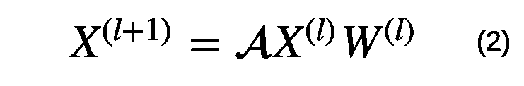
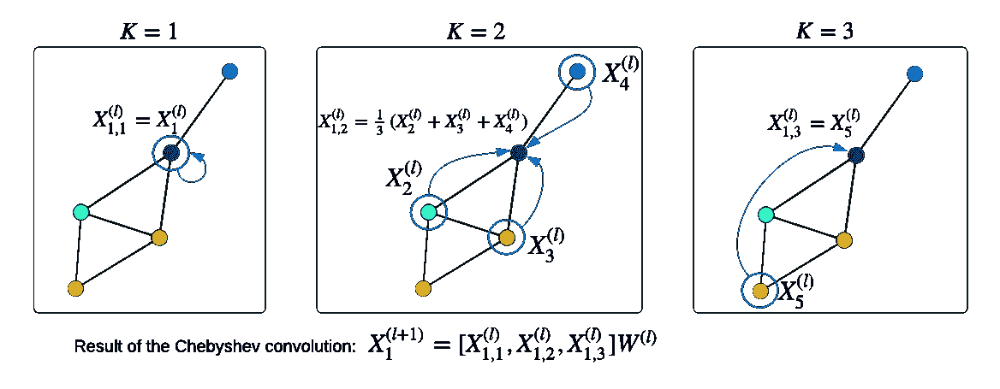
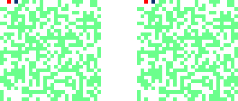
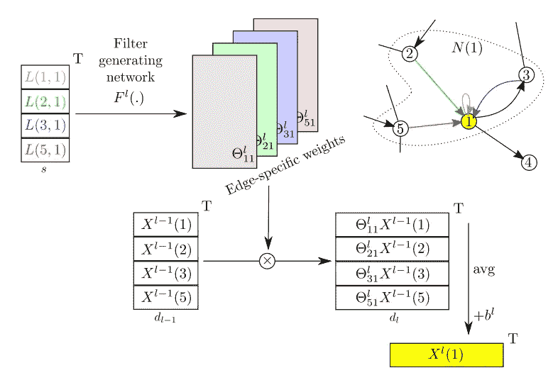
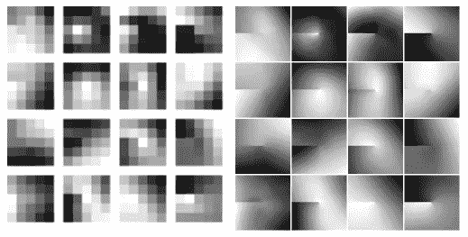
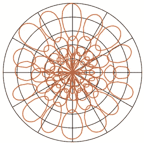

# 定义在图上的各向异性、动态、谱和多尺度滤波器

> 原文：<https://towardsdatascience.com/tutorial-on-graph-neural-networks-for-computer-vision-and-beyond-part-2-be6d71d70f49?source=collection_archive---------12----------------------->

## 作为“计算机视觉图形神经网络教程”的一部分

我将通过使用 Python 和 PyTorch 提取关键思想并解释里程碑方法背后的简单直觉，来概述重要的图形神经网络工作。本帖继续 [*我的教程第一部分*](https://medium.com/p/3d9fada3b80d) *。*



Graph of Graph Neural Network (GNN) and related works. Some other important works and edges are not shown to avoid further clutter. For example, there is a large body of works on dynamic graphs that deserve a separate overview. Best viewed on a very wide screen in color.

# 20 多年的图形神经网络

在上面的“**图神经网络(GNN)的图及相关著作**”中，我补充了我最近一年接触到的关于图的论文。在该图中，两个作品之间的有向边表示一篇论文基于另一篇论文(尽管没有必要引用它),作品的颜色表示:

*   红色— **光谱方法**(需要拉普拉斯图的特征分解，这将在下面解释)
*   绿色—在**空间域**中工作的方法(不需要拉普拉斯图的特征分解)
*   蓝色—相当于光谱方法，但不需要特征分解(因此，实际上是空间方法)
*   黑色——是 GNNs 的补充方法，与 GNN 本身的选择无关(例如，集中注意力)。

请注意，为了避免混乱，其他一些重要的作品和边缘没有显示出来，只有一小部分作品，用粗体框突出显示的**将在本文中介绍。声明:我仍然在那里找到了挤压我们自己最近作品的空间😊。**

大多数重要的方法都包含在这个非详尽的作品列表中:

*   Nicket 等人，2015 年，[知识图的关系机器学习综述](https://arxiv.org/abs/1503.00759)
*   布朗斯坦等，2016，[几何深度学习:超越欧几里德数据](https://arxiv.org/abs/1611.08097)
*   汉密尔顿等，2017，[图上的表征学习:方法与应用](https://arxiv.org/abs/1709.05584)
*   Kipf 等人，2018，[结构化深度模型:图形上的深度学习及超越](http://tkipf.github.io/misc/SlidesCambridge.pdf)，演示幻灯片。
*   巴塔格利亚等人，2018 年，[关系归纳偏差、深度学习和图网络](https://arxiv.org/abs/1806.01261)
*   张等，2018 [关于图的深度学习:一个调查](https://arxiv.org/abs/1812.04202)
*   周等，2018，[图神经网络:方法与应用综述](https://arxiv.org/abs/1812.08434)
*   吴等，2019，【图神经
    网络综合研究】
*   Petar Velič ković，2019，[深度神经网络中结构的复兴](https://www.repository.cam.ac.uk/handle/1810/292230)，博士论文。
*   尼普斯和 CVPR [视频教程](https://sungsoo.github.io/2018/02/01/geometric-deep-learning.html)

使用神经网络对图进行分类的第一项工作似乎是由[亚历桑德罗·斯佩尔杜蒂和安东尼娜·斯塔丽塔在](https://ieeexplore.ieee.org/document/572108)发表的一篇 **1997** 关于“用于结构分类的监督神经网络”的论文。



A figure from ([Sperduti & Starita, 1997](https://ieeexplore.ieee.org/document/572108)), which is strikingly similar to what we are doing now, after more than 20 years.

> [斯珀杜蒂&斯塔里塔，1997](https://ieeexplore.ieee.org/document/572108) :“到目前为止，神经网络已经被用于对非结构化模式和序列进行分类。然而，标准的神经网络和统计方法通常被认为在处理复杂结构时是不够的，因为它们是基于特征的方法。”

自 1997 年以来，关于从图中学习的大量工作已经在如此多的不同方向上增长，如果没有一些智能的自动化系统，很难保持跟踪。我相信我们正在使用基于神经网络的方法(基于我的教程第一部分*】*中的 [*中解释的公式(2)】,或者神经网络和其他方法的某种组合。*](https://medium.com/p/3d9fada3b80d)



Graph neural layer’s formula (2) from [*the first part of my tutorial*](https://medium.com/p/3d9fada3b80d) *that we will also need in this part. Keep in mind, that if we need to compute a specific loss for the output features or if we need to stack these layers, we apply some activation like ReLU or Softmax.*

回顾一下我们在第一部分中使用的符号，我们有一些无向图 *G* 和 *N* 节点。该图中的每个节点都有一个 *C* 维特征向量，所有节点的特征都表示为一个 *N* × *C* 维矩阵 *X⁽ˡ⁾.*在一个典型的图网络中，比如 GCN ( [Kipf & Welling，ICLR，2017](https://arxiv.org/abs/1609.02907) )，我们将这些特征 *X⁽ˡ⁾* 馈送到一个具有 *C* × *F* 维可训练权重 *W⁽ˡ⁾* 的图神经层，这样该层的输出就是一个 *N* × *F* 矩阵*𝓐是一个 *N* × *N* 矩阵，其中条目𝓐 *ᵢⱼ* 指示节点 *i* 是否连接到节点 *j* 的相邻节点*。这个矩阵被称为*邻接矩阵*。我使用𝓐而不是普通的 *A* 来强调这个矩阵可以被*规范化*以促进深层网络中的特征传播。出于本教程的目的，我们可以假设𝓐= *A* ，即矩阵乘积𝓐 *X⁽ˡ⁾* 的第 *i* 至第*t51】行将包含节点 *i* 邻居的特征的总和。***

在本部分教程的剩余部分，我将简要解释概览图中用**粗体**框显示的我选择的作品。我推荐[布朗斯坦等人的评论](https://arxiv.org/abs/1611.08097)进行更全面和正式的分析。

请注意，尽管我在下面深入研究了**光谱图卷积**的一些技术细节，但最近的许多作品(如[徐等人的 GIN，2019](https://arxiv.org/abs/1810.00826) )都是在没有光谱卷积的情况下建立的，并在一些任务中显示出很好的结果。然而，了解谱卷积的工作原理仍然有助于理解和避免其他方法的潜在问题。

# **1。光谱图卷积**

[布鲁纳等人，2014，ICLR 2014](https://arxiv.org/abs/1312.6203)

我在我的[另一篇文章](/spectral-graph-convolution-explained-and-implemented-step-by-step-2e495b57f801)中详细解释了谱图卷积。

为了这部分教程的目的，我在这里简单总结一下。谱图卷积的正式定义与信号/图像处理中的[卷积定理](https://en.wikipedia.org/wiki/Convolution_theorem)非常相似，可以写成:


Spectral graph convolution, where ⊙ means element-wise multiplication.

其中 *V* 为特征向量，*λ*为 [**图拉普拉斯**](https://en.wikipedia.org/wiki/Laplacian_matrix) *L* 的特征值，通过特征分解可以找到:*l*=*vλvᵀ；w*_ 光谱滤光片。在本教程中，我将假设“*对称归一化拉普拉斯算子*”。它是基于图的邻接矩阵 *A* 上的*唯一*来计算的，这可以用几行 Python 代码来完成，如下所示:

```
**# Computing the graph Laplacian
# A is an adjacency matrix** import numpy as npN = A.shape[0] **# number of nodes in a graph**
D = np.sum(A, 0) **# node degrees**
D_hat = np.diag((D + 1e-5)**(-0.5)) **# normalized node degrees**
L = np.identity(N) — np.dot(D_hat, A).dot(D_hat) **# Laplacian**
```

这里，我们假设 *A* 是对称的，即 *A* = *A* ᵀ，并且我们的图是无向图，否则节点度不是明确定义的，并且必须做出一些假设来计算拉普拉斯算子。在计算机视觉和机器学习的背景下，图形拉普拉斯定义了如果我们以公式(2)的形式堆叠几个图形神经层，节点特征将如何更新。

所以，给定图的拉普拉斯 *L* ，节点特征 *X* 和过滤器 *W* _spectral，在 Python **图上的谱卷积**看起来非常简单:

```
**# Spectral convolution on graphs
# X is an *N×1 matrix of 1-dimensional node features*** **# L** **is an** ***N******×N* graph Laplacian computed above
# W_spectral are** ***N******×******F weights (filters) that we want to train*** from scipy.sparse.linalg import eigsh **# assumes *L* to be symmetric***Λ**,V* = eigsh(L,k=20,which=’SM’) **#** **eigen-decomposition (i.e. find *Λ******,V)***
X_hat = V.T.dot(X) **# *20*****×*****1* node features in the "spectral" domain**
W_hat = V.T.dot(W_spectral)  **# 20×*F* filters in the** **"spectral" domain**
Y = V.dot(X_hat * W_hat)  **# *N******×******F* result of convolution**
```

其中我们假设我们的节点特征 *X⁽ˡ⁾* 是一维的，例如 m 像素，但是它可以扩展到 *C* 维的情况:我们将只需要对每个*通道*重复这个卷积，然后像在信号/图像卷积中一样对 *C* 求和。

公式(3)本质上与使用傅立叶变换的规则网格上的信号的[频谱卷积](https://en.wikipedia.org/wiki/Convolution_theorem)相同，因此为机器学习产生了一些问题:

1.  可训练权重(滤波器)的维数取决于图中节点的数量；
2.  *W_* 光谱也取决于图结构中编码的特征向量 *V.*

这些问题阻碍了扩展到具有可变结构的大型图形的数据集。

为了解决第一个问题，[布鲁纳等人](https://arxiv.org/abs/1312.6203)提出在谱域对*滤波器进行平滑*，根据谱理论使*滤波器在空间域更加局部化*。其思想是，您可以将公式(3)中的滤波器 *W_* 频谱表示为𝐾预定义函数(如样条函数)的和，并且我们学习这个和的 *W* 的 *N* 值，而不是学习这个和的 *K* 系数 *α* :


We can approximate our N dimensional filter*W_*spectral as a finite sum of *K* functions f, such as splines shown below. So, instead of learning N values of *W_*spectral, we can learn K coefficients (alpha) of those functions; it becomes efficient when K << N.

虽然 *fk* 的维数确实取决于节点 *N* 的数量，但是这些函数是固定的，所以我们不学习它们。我们唯一知道的是系数 *α* ，因此 *W_* 光谱不再依赖于 *N* 。为了使我们在公式(4)中的近似合理，我们希望 *K* < < *N* 将可训练参数的数量从 *N* 减少到 *K* ，更重要的是，使其独立于 *N* ，以便我们的 GNN 可以消化任何大小的图。

虽然解决了第一个问题，但是这种平滑方法没有解决第二个问题。

# **2。切比雪夫**图**卷积**

[Defferrard 等人，NeurIPS，2016 年](https://arxiv.org/abs/1606.09375)

上面的频谱卷积及其平滑版本的主要缺点是，它仍然需要对一个 *N* × *N* 维拉普拉斯图 *L* 进行本征分解，这产生了两个主要问题:

1.  🙁特征分解的复杂度是巨大的，O( *N* )。此外，在大图的情况下，在 RAM 中以密集格式保持图拉普拉斯是不可行的。一种解决方案是使用稀疏矩阵，并用 Python 中的`scipy.sparse.linalg.eigs`找到特征向量。此外，您可以在具有大量 RAM 和 CPU 内核的专用服务器上预处理所有训练图。在很多应用中，你的测试图也可以提前预处理，但是如果你不断有新的大图涌入，特征分解会让你难过。
2.  🙁另一个问题是，你训练的模型最终与图的特征向量 *V* 密切相关。如果您的训练图和测试图具有非常不同的结构(节点和边的数量)，这可能是一个大问题。否则，如果所有的图形都非常相似，问题就不大了。此外，如果您在频域中使用一些平滑滤波器，如上面讨论的样条，那么您的滤波器将变得更加局部化，适应新图形的问题似乎更加不明显。然而，这些模型仍然非常有限。

那么，切比雪夫图卷积和这些有什么关系呢？

原来它同时解决了**两个问题！**😃

也就是说，它避免了计算昂贵的特征分解，并且滤波器不再“附着”于特征向量(然而它们仍然是特征值*λ)*的函数)。此外，它有一个非常有用的参数，通常表示为 *K* ，具有与我们上面的公式(4)中的 *K* 相似的直觉，确定滤波器的局部性。非正式地:对于 *K* =1，我们只将节点特性 *X⁽ˡ⁾* 提供给我们的 gnn 对于 *K* =2，我们馈 *X⁽ˡ⁾* 和𝓐*x⁽ˡ⁾*；对于 K=3，我们馈*x⁽ˡ⁾***𝓐*x⁽ˡ⁾***和𝓐*x⁽ˡ⁾*；对于更大的 *K* 以此类推(我希望你已经注意到这个模式)。更准确正式的定义见 [Defferrard et al.](https://arxiv.org/abs/1606.09375) 和下面我的代码，加上额外的分析在( [Knyazev et al .，NeurIPS-W，2018](https://arxiv.org/abs/1811.09595) )中给出。****

****由于邻接矩阵的[幂属性](https://en.wikipedia.org/wiki/Adjacency_matrix#Matrix_powers)，当我们执行𝓐 *X⁽ˡ⁾* 时，我们实际上对 2 跳邻居进行平均(或求和，取决于𝓐如何归一化)，并且类似地，对𝓐 *ⁿX⁽ˡ⁾* 中的任何 *n* 进行平均，如下图所示，其中我们对 *n* 跳邻居进行平均。****

********

****Chebyshev convolution for *K*=3 for node 1 (dark blue). Circled nodes denote the nodes affecting feature representation of node 1\. The [,] operator denotes concatenation over the feature dimension. W*⁽ˡ⁾ are 3C*×F dimensional weights.****

****注意，为了满足切比雪夫基的正交性，𝓐 假设图中没有回路，因此在矩阵乘积𝓐 *X⁽ˡ⁾* 的每 *i* 行中，我们将具有节点 *i* 的邻居的特征，但是**没有**节点 *i* 本身的特征。节点 *i* 的特征将作为矩阵 *X⁽ˡ⁾.单独输入*****

****如果 *K* 等于节点数 *N* ，则切比雪夫卷积非常接近于频谱卷积，因此滤波器的感受域将是整个图形。但是，正如卷积网络的情况一样，由于我已经讨论过的一些原因，我们不希望滤波器与输入图像一样大，因此在实践中， *K* 取合理的小值。****

> ****根据我的经验，这是最强大的 gnn 之一，在非常广泛的图形任务中取得了很好的结果。主要的缺点是在向前/向后传递中必须循环遍历 *K* (因为切比雪夫多项式是递归的，所以不可能并行化它们)，这会降低模型的速度。****

****与上面讨论的样条一样，我们不是训练滤波器，而是训练切比雪夫多项式的系数。****

********

****Chebyshev basis used to approximate convolution in the spectral domain.****

****要生成切比雪夫基，可以使用以下 Python 代码:****

```
****# Set K to some integer > 0, like 4 or 5 in our plots above
# Set n_points to a number of points on a curve (we set to 100)** import numpy as npx = np.linspace(-1, 1, n_points)
T = np.zeros((K, len(x)))
T[0,:] = 1
T[1,:] = x
for n in range(1, K-1):
    T[n+1, :] = 2*x*T[n, :] - T[n-1, :] **# recursive computation**   
return T**
```

****生成样条和切比雪夫基的完整代码在[我的 github repo](https://github.com/bknyaz/examples/blob/master/splines_cheb.py) 中。****

****为了说明切比雪夫滤波器在不规则网格上的表现，我再次遵循[布鲁纳等人](https://arxiv.org/abs/1312.6203)的实验，从 MNIST 网格中随机抽取 400 个点，其方式与我展示拉普拉斯图的特征向量的方式相同。我在从这 400 个位置采样的 MNIST 图像上训练了一个切比雪夫图卷积模型(相同的不规则网格用于所有图像),下面显示了一个用于 *K* =1 和 *K* =20 的过滤器。****

********

****A single Chebyshev filter (K=3 on the left and K=20 on the right) trained on MNIST and applied at different locations (shown as a red pixel) on a irregular grid with 400 points. Compared to filters of standard ConvNets, GNN filters have different shapes depending *on the node at which they are applied*, because each node has a different neighborhood structure.****

# ******3。GCN******

****[Kipf &韦林，ICLR，2017](https://arxiv.org/abs/1609.02907)****

****您可能已经注意到，如果增加切比雪夫卷积的 *K* ，可训练参数的总数就会增加。例如，对于 *K* =2，我们的权重 *W⁽ˡ⁾* 将是 2 *C* × *F* 而不是仅仅 *C* × *F* 。这是因为我们将特征*x⁽ˡ⁾*t16】t17】和𝓐 *X⁽ˡ⁾* 连接成一个单一的 *N* ×2 *C* 矩阵。更多的训练参数意味着模型比更难训练，需要标注更多的数据进行训练。图表数据集通常非常小。在计算机视觉中，MNIST 被认为是一个很小的数据集，因为图像只有 28×28 维，只有 60k 个训练图像，而在图网络中，MNIST 是相当大的，因为每个图将有 *N* =784 个节点，60k 是大量的训练图。与计算机视觉任务相比，许多图形数据集只有大约 20-100 个节点和 200-1000 个训练样本。这些图可以表示某些小分子，标记化学/生物数据通常比标记图像更昂贵。因此，训练切比雪夫卷积模型可能导致训练集的严重过拟合(即，模型将具有接近 0 的训练损失，但将具有较大的验证或测试误差)。所以， [Kipf & Welling](https://arxiv.org/abs/1609.02907) 的 GCN 本质上是将节点特征*x⁽ˡ⁾*t36】t37】和𝓐 *X⁽ˡ⁾* 的矩阵“合并”成一个单独的 *N* × *C* 矩阵。结果，与具有 *K* =2 的切比雪夫卷积相比，该模型需要训练的参数少了两倍，但具有 1 跳的相同感受野。主要的技巧是通过将一个[单位矩阵](https://en.wikipedia.org/wiki/Identity_matrix) *I* 添加到𝓐 中，并以特定的方式对其进行规范化，从而将“自循环”添加到您的图中，因此现在在矩阵乘积的每一行*I**x⁽ˡ⁾*中，我们将拥有节点 *i、* **的邻居的特征，以及节点 *i.* 的**特征****

> ****这个模型似乎是一个标准的基线选择，非常适合许多应用程序，因为它的轻量级、良好的性能和对较大图形的可伸缩性。****

## ****3.1.GCN vs 切比雪夫层****

****GCN 卷积和切比雪夫卷积的区别如下图所示。****

****上面的代码遵循与我的教程 的第一部分 [*中相同的结构，在那里我比较了经典的 NN 和 GNN。GCN 和切比雪夫卷积中的一个主要步骤是重新标度图拉普拉斯 *L* 的计算。进行这种重新调整是为了使特征值在[-1，1]的范围内，以便于训练(这在实践中可能不是非常重要的步骤，因为权重可以在训练期间适应)。在 GCN，如上所述，在计算拉普拉斯算子之前，通过添加单位矩阵将自循环添加到图中。这两种方法的主要区别在于，在切比雪夫卷积中，我们*递归地*遍历 *K* 来捕获 *K* 跳邻域中的特征。我们可以将这样的 GCN 或切比雪夫层与非线性交错堆叠起来，构建一个图形神经网络。*](https://medium.com/p/3d9fada3b80d)****

****现在，让我礼貌地打断一下😃我们的频谱讨论并给出了另外两种令人兴奋的方法背后的大致想法:边缘条件滤波器，由 [Simonovsky & Komodakis，CVPR，2017](https://arxiv.org/abs/1704.02901) 和莫奈，由 [Monti 等人，CVPR，2017](https://arxiv.org/abs/1611.08402) ，它们共享一些类似的概念。****

# ******4。边缘调节的**滤波器****

****[西蒙诺夫斯基&CVPR 科莫达基斯，2017](https://arxiv.org/abs/1704.02901)****

****如你所知，在 ConvNets 中，我们通过优化一些损失来学习权重(过滤器)，如[交叉熵](https://pytorch.org/docs/stable/nn.html#torch.nn.CrossEntropyLoss)。同样，我们在 GNNs 中学习 W⁽ˡ⁾。想象一下，你有另一个网络来预测这些权重，而不是学习这些权重。因此，在训练过程中，我们学习辅助网络的权重，它以一幅图像或一个图形作为输入，并返回权重 *W⁽ˡ⁾* (他们工作中的θ)作为输出。该想法基于**动态滤波器网络** ( [Brabandere 等人，NIPS，2016](https://arxiv.org/abs/1605.09673) )，其中“动态”意味着滤波器 *W⁽ˡ⁾* 将根据输入而不同，这与标准模型相反，在标准模型中，滤波器在训练后是固定的(或静态的)。****

********

****Using an auxiliary “filter generating network” Fˡ to predict edge-specific weights Θ for the main network. Xˡ⁻¹ are input node features and Xˡ are output features. The figure shows a single iteration of “dynamic convolution” for node 1 (in yellow). Standard GNNs typically would simply average (or sum) features of node 1 neighbors (nodes 2, 3, 4, 5) , which would correspond to having an isotropic filter (Θ would be a constant vector). In contrast, this model has anisotropic filters, because it predicts different edge values between node 1 and all it’s neighbors based on edge labels L, so that features Xˡ(1) are computed as a weighted average of neighbors’ features. Figure from ([Simonovsky & Komodakis, CVPR, 2017](https://arxiv.org/abs/1704.02901)).****

****这是一种非常普遍的卷积形式，除了图像之外，还可以很容易地应用于图形或点云，正如他们在 CVPR 的论文中所做的那样，并获得了出色的结果。然而，没有“[免费的午餐](https://en.wikipedia.org/wiki/No_free_lunch_theorem)”，训练这样的模型相当具有挑战性，因为常规的网格约束现在已经放松，解决方案的范围急剧增加。这对于具有许多边的较大图形或较深层中的卷积来说尤其如此，这些图形通常具有数百个通道(特征数量， *C)* ，因此您可能最终会为每个输入总共生成数千个数字！在这方面，标准 ConvNets 非常好，因为我们没有浪费模型的能力来训练预测这些权重，而是直接强制要求滤波器对所有输入都应该相同。但是，这种先验使 ConvNets 受到限制，我们不能直接将它们应用于图形或点云。因此，一如既往，在特定任务中，灵活性和性能之间会有一些权衡。****

> ****当应用于图像时，如 MNIST，边缘条件模型可以学习预测*各向异性*滤波器——对方向敏感的滤波器，如边缘检测器。与我的教程 的第一部分 [*中讨论的高斯滤波器相比，这些滤波器能够更好地捕捉图像中的某些模式，例如数字中的笔画。*](https://medium.com/p/3d9fada3b80d)****

********

****Convolutional filters learned on MNIST sampled in low (left) and high (right) resolutions. Figure from ([Simonovsky & Komodakis, CVPR, 2017](https://arxiv.org/abs/1704.02901)).****

****我想再强调一次，每当我们有一个带有辅助网络的复杂模型时，在某种意义上它就变成了一个先有鸡还是先有蛋的问题。为了解决这个问题，其中一个网络(辅助网络或主网络)应该接收到非常强的信号，这样它就可以隐式地监控另一个网络。在我们的 [BMVC 论文](https://arxiv.org/abs/1907.09000)中，类似于[Simonovsky&Komodakis](https://arxiv.org/abs/1704.02901)的工作，我们在生成边的网络上应用了额外的约束来促进训练。我将在后面的帖子中详细描述我们的工作。****

# ******5。莫奈******

****[蒙蒂等人，CVPR，2017 年](https://arxiv.org/abs/1611.08402)****

****MoNet 不同于本文中讨论的其他作品，因为它假定具有节点坐标的概念，因此更适合于几何任务，如 3D 网格分析或图像/视频推理。它有点类似于 [Simonovsky & Komodakis](https://arxiv.org/abs/1704.02901) 的边缘条件滤波器，因为它们也引入了预测权重的辅助可学习函数𝐷(𝑤、𝜃 *，ρ* 。不同的是，这些权重取决于节点极坐标(角度𝜃和半径*ρ*)；并且该函数的可训练参数𝑤被约束为高斯分布的均值和方差，从而我们不是学习 *N* × *N* 矩阵，而是仅学习与图大小 *N* 无关的固定大小的向量(均值和方差)。就标准 ConvNets 而言，对于每个滤波器来说，只学习 2 个值(高斯分布的平均值和方差)是相同的，而不是分别学习 3×3、5×5 或 11×11 维滤波器的 9、25 或 121 个值。这种*参数化*将极大地减少 ConvNet 中的参数数量，但滤波器捕捉图像特征的能力非常有限。****

****[Monti 等人](https://arxiv.org/abs/1611.08402)训练高斯的𝐽均值和方差，转换节点坐标的过程类似于将它们拟合到[高斯混合模型](https://scikit-learn.org/stable/modules/mixture.html)。如果我们希望我们的过滤器足够全局，那么这个模型的训练计算量相当大，但它可能是视觉任务的一个很好的选择(参见我们的 [BMVC 论文](https://arxiv.org/abs/1907.09000)进行比较)，但在非视觉任务上，它往往比简单的 GCN 差( [Knyazev 等人，NeurIPS-W，2018](https://arxiv.org/abs/1811.09595) )。由于函数 *D* 依赖于坐标，生成的滤波器也是各向异性的，并且具有如下图所示的定向和拉长的高斯形状。****

********

****Filters trained with MoNet in polar coordinates 𝜃 and *ρ*. Each ellipse corresponds to a slice of a Gaussian at some fixed level. The idea is that if the coordinates of the i-th node are close to the middle of the j-th Gaussian, then the generated weight at index (i,j) will have a value close to 1.****

```
*****Pseudo-code of the MoNet layer using PyTorch*****# assume X to be input *N***×***C* node features**
**# coord are *N*×*N*×*2* node coordinate differences between all pairs of nodes (node degrees for non-geometric tasks)
# coord can be viewed as angular and radial edges between nodes**1\. Generate *J* Gaussian-shaped filters based on coordinates of nodes    using some trainable function D
   weights = D(coord)  # weights: *J*×*N*×*N*
2\. Multiply node features X by these weights
   X = torch.bmm(weights, X.expand(J, N, C))  # X: *J*×*N*×*C*
3\. Project features by a learnable linear transformation
   X = fc(X.permute(1, 2, 0).view(N, J*C))  # X: *N*×*F* 4\. Feed X to the next layer**
```

# ****结论****

****尽管讨论了很长时间，我们只是触及了皮毛。图形神经网络的应用正在扩展，远远超出了典型的图形推理任务，如分子分类。不同图形神经层的数量增长非常快，类似于几年前卷积网络的情况，因此很难跟踪它们。在这一点上，[py torch Geometric(PyG)](https://github.com/rusty1s/pytorch_geometric)——一个从图表中学习的好工具箱——经常用新颖的图层和技巧填充它的集合。****

*****鸣谢:本教程的很大一部分是我在 SRI International 实习期间在* [*穆罕默德·阿梅尔*](https://medium.com/u/6cf41cb2c546?source=post_page-----be6d71d70f49--------------------------------) *(* [*主页*](https://mohamedramer.com/) *)和我的博士导师格拉汉姆·泰勒(* [*主页*](https://www.gwtaylor.ca/) *)的指导下编写的。我也感谢*[*Carolyn Augusta*](https://www.linkedin.com/in/carolynaugusta/)*的有用反馈。*****

****在 [Github](https://github.com/bknyaz/) 、 [LinkedIn](https://www.linkedin.com/in/boris-knyazev-39690948/) 和 [Twitter](https://twitter.com/BorisAKnyazev) 上找我。[我的主页](https://bknyaz.github.io/)。****

****如果你想在你的论文中引用这篇博文，请使用:
[*@ misc*](http://twitter.com/misc)*{ Knyazev 2019 Tutorial，
title = {用于计算机视觉及超越的图形神经网络教程}，
author={Knyazev，Boris and Taylor，Graham W and Amer，Mohamed R}，
year={2019}
}*****