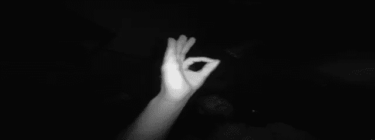
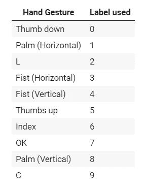
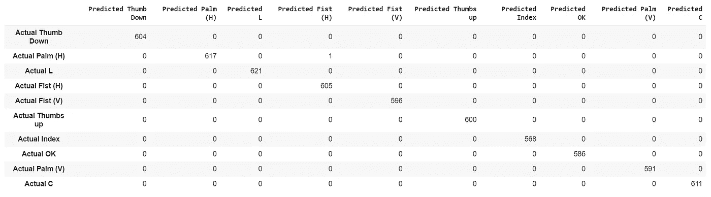

# 教程:使用深度学习和 CNN 制作手势识别模型

> 原文：<https://towardsdatascience.com/tutorial-using-deep-learning-and-cnns-to-make-a-hand-gesture-recognition-model-371770b63a51?source=collection_archive---------1----------------------->

首先，[这是包含代码的 Github 库](https://github.com/filipefborba/HandRecognition)。该项目采用 Jupyter 笔记本的形式，可以上传到谷歌合作实验室，在没有环境问题的情况下工作。



机器学习对于各种现实生活中的问题非常有用。它通常用于分类、识别、检测和预测等任务。此外，自动化使用数据的流程非常有效。基本思想是使用数据生成一个能够返回输出的模型。这个输出可以用新的输入给出正确的答案，或者产生对已知数据的预测。

这个项目的目标是训练一个机器学习算法，能够对不同手势的图像进行分类，例如拳头、手掌、拇指和其他手势。例如，这个特殊的分类问题对[手势导航](https://www.youtube.com/watch?v=Lbma7c55wf8)很有用。我将使用的方法是借助基于 Tensorflow 和 Keras 的卷积神经网络进行深度学习。

深度学习是更广泛的机器学习方法家族的一部分。它基于处理输入数据的图层的使用，从这些图层中提取要素并生成数学模型。这个“模型”的创建将在下一次会议中更加清晰。在这个特定的项目中，我们的目标是对手势的不同图像进行分类，这意味着计算机必须“学习”每个手势的特征，并对它们进行正确分类。例如，如果给定一个做竖起大拇指手势的手的图像，模型的输出需要是“手在做竖起大拇指的手势”。我们开始吧。

# 加载数据

这个项目使用了 Kaggle 上的[手势识别数据库](https://www.kaggle.com/gti-upm/leapgestrecog/version/1)(引用如下)。它包含了 20000 张不同手和手势的图片。在数据集中呈现了 10 个不同的人的总共 10 个手势。女被试 5 人，男被试 5 人。
这些图像是使用 Leap Motion 手部跟踪设备拍摄的。



Table 1 — Classification used for every hand gesture.

有了这些，我们必须准备图像来训练算法。我们必须将所有图像加载到一个名为 **X** 的数组中，并将所有标签加载到另一个名为 **y** 的数组中。

```
X = [] # Image data
y = [] # Labels# Loops through imagepaths to load images and labels into arrays
for path in imagepaths:
  img = cv2.imread(path) # Reads image and returns np.array
  img = cv2.cvtColor(img, cv2.COLOR_BGR2GRAY) # Converts into the corret colorspace (GRAY)
  img = cv2.resize(img, (320, 120)) # Reduce image size so training can be faster
  X.append(img)

  # Processing label in image path
  category = path.split("/")[3]
  label = int(category.split("_")[0][1]) # We need to convert 10_down to 00_down, or else it crashes
  y.append(label)# Turn X and y into np.array to speed up train_test_split
X = np.array(X, dtype="uint8")
X = X.reshape(len(imagepaths), 120, 320, 1) # Needed to reshape so CNN knows it's different images
y = np.array(y)print("Images loaded: ", len(X))
print("Labels loaded: ", len(y))
```

Scipy 的 train_test_split 允许我们将数据分成一个训练集和一个测试集。训练集将用于构建我们的模型。然后，测试数据将被用来检验我们的预测是否正确。使用了一个 random_state 种子，因此我们的结果的随机性可以被重现。该函数将随机播放它正在使用的图像，以最大限度地减少训练损失。

```
# Percentage of images that we want to use for testing. 
# The rest is used for training.
ts = 0.3X_train, X_test, y_train, y_test = train_test_split(X, y, test_size=ts, random_state=42)
```

# 创建模型

为了简化这里构建的模型，我们将使用线性回归的概念。通过使用线性回归，我们可以创建一个简单的模型，并使用等式 *y = ax + b* 来表示它。
*a* 和 *b* (分别是斜率和截距)是我们试图寻找的参数。通过寻找最佳参数，对于任何给定的 *x* 值，我们可以预测 *y* 。这是相同的想法，但更复杂，使用卷积神经网络。

卷积神经网络(ConvNet/CNN)是一种深度学习算法，可以接受输入图像，为图像中的各个方面/对象分配重要性(可学习的权重和偏差)，并能够区分彼此。与其他分类算法相比，ConvNet 中所需的预处理要低得多。虽然在原始方法中，过滤器是手工设计的，但是经过足够的训练，CNN 有能力学习这些过滤器/特征。


Figure 1 — Example of Convolutional Neural Network.

从图 1 和想象我们讲过的线性回归模型方程，我们可以想象输入层是 *x* ，输出层是 *y* 。隐藏层因模型而异，但它们用于“学习”模型的参数。每一个都有不同的功能，但他们致力于获得最佳的“斜率和截距”。

```
# Construction of model
model = Sequential()
model.add(Conv2D(32, (5, 5), activation='relu', input_shape=(120, 320, 1))) 
model.add(MaxPooling2D((2, 2)))
model.add(Conv2D(64, (3, 3), activation='relu')) 
model.add(MaxPooling2D((2, 2)))
model.add(Conv2D(64, (3, 3), activation='relu'))
model.add(MaxPooling2D((2, 2)))
model.add(Flatten())
model.add(Dense(128, activation='relu'))
model.add(Dense(10, activation='softmax'))# Configures the model for training
model.compile(optimizer='adam', loss='sparse_categorical_crossentropy', metrics=['accuracy'])# Trains the model for a given number of epochs (iterations on a dataset) and validates it.
model.fit(X_train, y_train, epochs=5, batch_size=64, verbose=2, validation_data=(X_test, y_test))
```

CNN 将一系列过滤器应用于图像的原始像素数据，以提取和学习更高级别的特征，然后模型可以使用这些特征进行分类。CNN 包含三个组件:

*   卷积层，将指定数量的卷积滤镜应用于图像。对于每个子区域，图层执行一组数学运算，以在输出要素地图中生成单个值。然后，卷积层通常对输出应用 ReLU 激活函数，以将非线性引入模型。
*   池层，对卷积层提取的图像数据进行下采样，以降低特征图的维度，从而减少处理时间。最大池算法是一种常用的池算法，它提取特征地图的子区域(例如，2x2 像素的分块)，保留其最大值，并丢弃所有其他值。
*   密集(完全连接)图层，对卷积图层提取的要素执行分类，并由汇集图层进行缩减采样。在密集层中，该层中的每个节点都连接到前一层中的每个节点。

# 测试模型

既然我们已经编译和训练了模型，我们需要检查它是否是好的。首先，我们运行“model.evaluate”来测试准确性。然后，我们进行预测，并绘制出带有预测标签和真实标签的图像，以检查一切。这样，我们就可以看到我们的算法是如何工作的。稍后，我们制作一个混淆矩阵，这是一个特定的表格布局，允许可视化算法的性能。

```
test_loss, test_acc = model.evaluate(X_test, y_test)print('Test accuracy: {:2.2f}%'.format(test_acc*100))
```

6000/6000[= = = = = = = = = = = = = = = = = = = =]—39s 6 ms/步

测试准确率:99.98%

```
predictions = model.predict(X_test) # Make predictions towards the test sety_pred = np.argmax(predictions, axis=1) # Transform predictions into 1-D array with label number# H = Horizontal
# V = Verticalpd.DataFrame(confusion_matrix(y_test, y_pred), 
             columns=["Predicted Thumb Down", "Predicted Palm (H)", "Predicted L", "Predicted Fist (H)", "Predicted Fist (V)", "Predicted Thumbs up", "Predicted Index", "Predicted OK", "Predicted Palm (V)", "Predicted C"],
             index=["Actual Thumb Down", "Actual Palm (H)", "Actual L", "Actual Fist (H)", "Actual Fist (V)", "Actual Thumbs up", "Actual Index", "Actual OK", "Actual Palm (V)", "Actual C"])
```



Figure 3 — Confusion matrix showing the predicted outcomes and the actual image label.

# 结论

基于上一节中给出的结果，我们可以得出结论，我们的算法基于深度学习模型以足够的置信度(> 95%)成功地对不同的手势图像进行了分类。

我们模型的准确性直接受到我们问题的几个方面的影响。呈现的手势相当清晰，图像清晰，没有背景。此外，存在合理数量的图像，这使得我们的模型更加健壮。缺点是，对于不同的问题，我们可能需要更多的数据来将我们的模型参数推向更好的方向。此外，鉴于其抽象性，深度学习模型很难解释。然而，通过使用这种方法，开始解决实际问题变得更加容易，因为我们不必考虑特征工程。这意味着我们不需要用边缘或斑点检测器预处理图像来提取重要特征；CNN 为我们做的。此外，它可以相对容易地适应新问题，通常表现良好。

如上所述，解决该问题的另一种方法是使用特征工程，例如二值化阈值(检查手的区域)、圆检测和其他方法来检测图像上的独特特征。然而，有了 CNN 的方法，我们就不用担心这些了。

有疑问吗？欢迎在[Github 资源库](https://github.com/filipefborba/HandRecognition)上发送问题/议题！

# 信用

T.Mantecón，C.R. del Blanco，F. Jaureguizar，N. García，“使用 Leap Motion Controller 提供的红外图像进行手势识别”，Int。糖膏剂智能视觉系统的先进概念，ACIVS 2016，意大利莱切，第 47–57 页，2016 年 10 月 24–27 日。(doi:10.1007/978–3–319–48680–2 _ 5)