# 通过圆圈和用户交互实现 Tweets 数据可视化

> 原文：<https://towardsdatascience.com/tweets-data-visualization-with-circles-and-user-interaction-485cad7ff248?source=collection_archive---------19----------------------->

## 如何利用 circles 和 Matplotlib 从一组 tweets 中创建有趣、漂亮且“可探索”的可视化


Photo by: [https://m.yourshot.nationalgeographic.com/photos/8981395/](https://m.yourshot.nationalgeographic.com/photos/8981395/)

在这里，我们将讨论如何利用圆圈从一组推文中创建一个有趣的、美丽的、可探索的可视化。这个想法是，每个圆圈将对应一条推文，我们将组织所有的圆圈，以便它将成为数据可视化的一个有趣的静态图像。此外，可视化可以设计为我们可以通过点击静态图像上的相应圆圈来浏览推文。我们将会看到，我们实际上可以做到这一点，甚至不改变静态图像的一部分。这里讨论的实现将使用 *Matplotlib* 来完成。

# 模型

一个圆圈将被用来代表一条推文。圆圈的颜色透明度将反映该推文的转发数量(也可能是喜欢的数量，取决于你的兴趣)。颜色较深的圆圈代表转发量较高的推文。透明度高的圆圈是转发次数少的推文。在数据集中的所有推文中，肯定有一条推文的转发次数最高，这条推文将由一个没有透明度的圆圈表示。因此，只有转发量最高的推文才会是彩色的，没有透明度。数据集中的所有其他推文将会更加透明。

到目前为止，我们只为可视化添加了一个度量:转发的数量(或喜欢的数量)。但是我们可以利用圆的另一个属性，那就是大小(半径)。那么尺寸代表什么呢？有很多选择..但是让我们选一个。默认情况下，所有圆圈的半径都是 1，但如果一条推文的赞数多于转发数，那么我们会将圆圈的半径设置为 2。通过这种方式，我们的眼睛可以很容易地区分哪些推文的点赞数多于转发数。

现在我们应该如何组织圈子？我们可以只是分散图中的圆圈，但这看起来很乱，圆圈可能会相互重叠。我们可以将圆放在散点图中(x 轴和 y 轴代表两个额外的测量值)，但是圆也可以相互重叠。所以，我们想要的是没有两个圆互相重叠。这需要我们自己写算法。对于我们的例子，我们将使用一种类似于圆形装箱算法的算法(一般 [**例**](https://en.wikipedia.org/wiki/Circle_packing) &具体 [**例**](http://www.codeplastic.com/2017/09/09/controlled-circle-packing-with-processing) )。圆的位置将是随机的，但是居中，并且将尽可能地紧凑。

以下是一个样本非常少的示例(为简单起见):

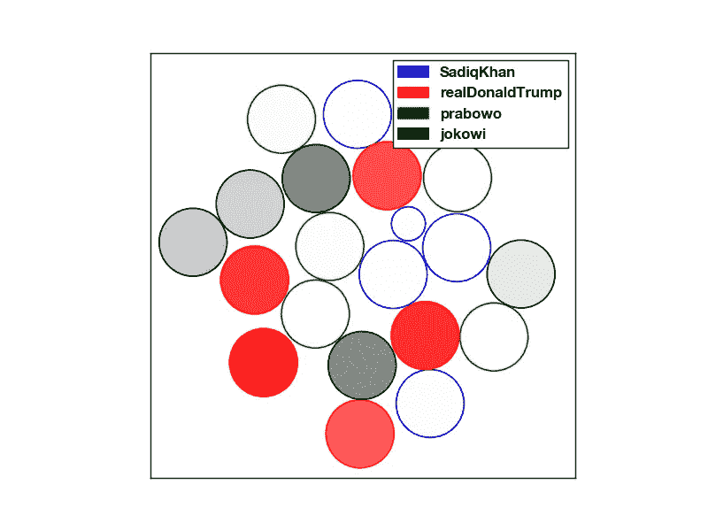

Visualization with small samples (5 tweets for each account)

上图是使用小样本(5 条推文)的可视化示例，这些样本来自 Sadiq Khan(伦敦市长)、Donald Trump(美国总统)、Prabowo Subianto(印度尼西亚总统候选人)和佐科·维多多(印度尼西亚总统)的推特账户。汗和特朗普的推文收集于 2018 年 11 月 25 日，普拉博沃和佐科维的推文收集于 2018 年 11 月 22 日。我们可以很容易地看到，唐纳德·特朗普的推特比其他人有更多的反应。只有一条推文的转发量超过了点赞量，它来自萨迪克·汗。以下是两条推文的快照(一条来自特朗普，另一条来自萨迪克·汗):

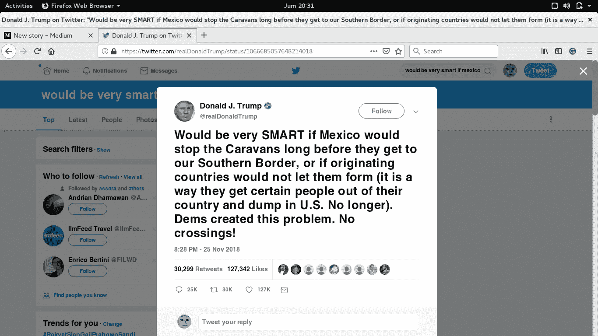

The number of retweets and likes on the image are already updated. (this image is captured on 1 Feb 2019)

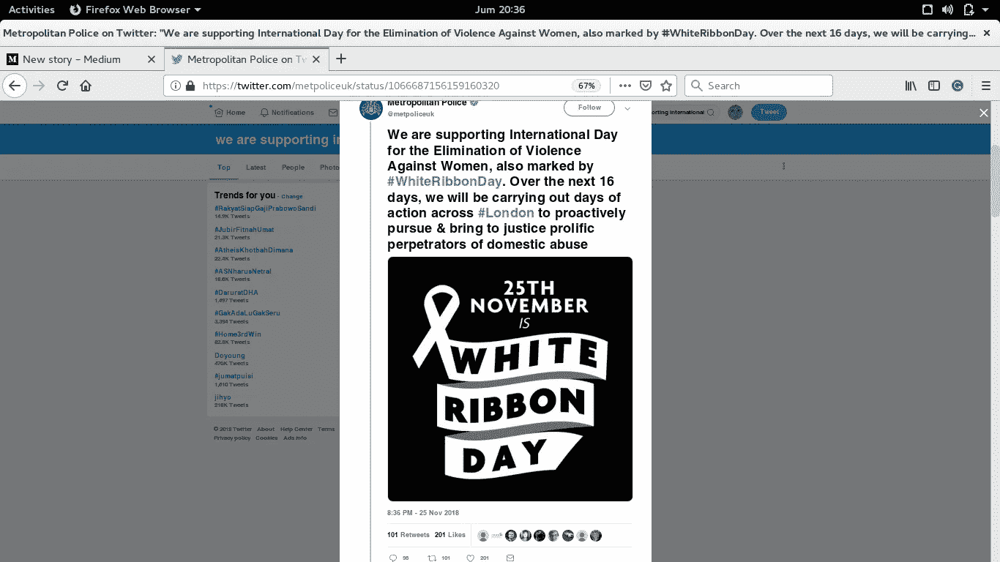

At the time of collection, the number of likes is 0 and the number of retweets is 38\. The tweet was retweeted by Sadiq Khan. (this image is captured on 1 Feb 2019)

Sadiq Khan 和 Prabowo Subianto 的 5 条推文并不出名，因为圆圈的颜色非常接近白色(非常透明)。

用于可视化的数据集由 tweet 对象组成，每个 tweet 对象由类`tweepy.models.Status`表示(在 [**Tweepy**](http://www.tweepy.org/) 包中有更多关于这个的信息)。该类存储了许多信息，如 tweet 文本、发布时间、作者信息、转发次数、喜欢次数等。

# 算法和数学

在本节中，我们将讨论算法及其背后的数学原理。为了在绘图中显示一个圆，我们可以使用`[matplotlib.patches.Circle](https://matplotlib.org/api/_as_gen/matplotlib.patches.Circle.html)`类。我们可以创建该类的一个实例，然后我们可以通过将该圆补片(实例)添加到轴上来绘制圆。例如，下面的代码将绘制一个蓝色的圆圈:

```
from matplotlib.patches import Circlea_circle = Circle(xy = (0, 0), radius = 1, color = "blue") #a blue circle with center at (0,0) and radius 1fig, ax = plt.subplots()
ax.axis('square')
ax.add_patch(a_circle)fig.show()
```

我们也可以用另一种方式设置蓝色，使用带有透明编号的 RGB 颜色序列:

```
blue_color = (0, 0, 1, 1) #edit the 4th number to change the transparency 
a_circle = Circle(xy = (0, 0), radius = 1, color = blue_color)
```

现在，我们的数据可视化将不仅仅是绘制圆圈，还将尽可能整齐地组织它们。我们不希望两个圆互相碰撞，但是如何使用 Matplotlib 实现呢？要回答这个问题，让我们分析一下圈子的一些行为。这是两个“几乎”相互重叠的相邻圆的图像:

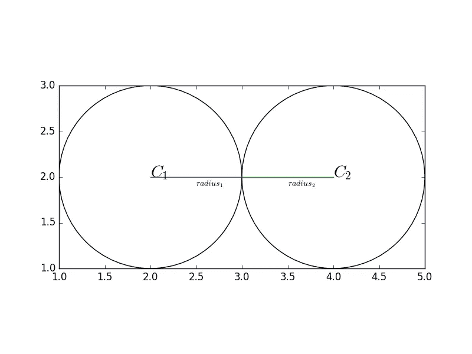

Two circles tangent to each other

上图是两个圆相互接触的情况。注意，我们还从图像中得到了一个小小的数学洞见: ***当两个圆相互接触时，它们的半径之和等于两个圆心之间的距离*** *。*这是回答撞圆问题的关键。你可以继续自己解决问题。这并不难，让我给个提示:想象另外两种情况(两个圆互相重叠，两个圆不互相接触)

到目前为止，我们应该已经知道如何绘制圆，以及如何设计图形以使两个圆不会发生碰撞。我们需要考虑的下一个概念是“*圆圈的位置分布”。*我们需要分配(或打包)所有的圆圈，这样就不会有两个圆圈碰撞，但是圆圈之间不应该有很大的间隙。这部分比较棘手，这里有一个显而易见的算法(但是比较耗时):

1.  创建一个圆心随机的圆
2.  然后检查该圆与所有其他绘制圆的“碰撞”状态
3.  如果发现一个碰撞，那么用另一个随机中心改变圆心，然后从上面的步骤 2 重新开始。如果没有发现碰撞，画圆。

我们讨论的可视化不采用上述算法。它从这条 [**条**](http://www.codeplastic.com/2017/09/09/controlled-circle-packing-with-processing/) 中取长补短。我们的算法看起来与我们排序的方式相似。例如，假设地板上有 10 个重叠的圆(由一张纸制成)，它们都位于非常靠近点 **P** 的位置。为了像*圆圈打包*一样组织它们，我们可以滑动与另一个圆圈重叠的每个圆圈(滑动是这样的，两个圆圈互相排斥，位移很小)。经过多次重复后，所有的圆圈都将装满 **P** 大约在包装的中心。这个算法看起来更生动，它使上面明显的“3 步”算法看起来非常僵硬。

此外，为了使我们的数据可视化更有趣，我们可以添加交互式元素。可视化可以设计成这样，我们有两个图形，一个用于圆圈(主要数据 viz)，另一个显示关于一条 tweet 的更详细的信息(文本)。更具体地说:如果我们点击一个圆圈，那么关于相应推文的一些信息(文本、转发次数、喜欢次数和发布日期)将出现在第二张图中。这可以通过使用 Matplotlib 的特性`[fig.canvas.mpl_connect](https://matplotlib.org/users/event_handling.html)`函数来完成。

# **增加互动性:点击**发布信息

在绘制和打包所有的圆后，我们可以让每个圆像一个按钮一样工作。为了实现这一点，我们可以包含来自函数`fig.canvas.mpl_connect.`的帮助。该函数可以接受两个参数，第一个参数是对应于交互类型的字符串(在我们的例子中，它必须是`"button_press_event"`)，第二个参数是当该类型的事件被触发时将被调用的函数。示例:

```
fig.canvas.mpl_connect('button_press_event', on_click)
```

上面的代码行将为图形`fig`添加交互性，但仅限于按钮按下事件(如果您想要另一种类型的交互:对于图形上的鼠标移动，使用`"motion_notify_event"`)。第二个参数中的函数必须设计成有一个名为`event.`的输入。在我们的例子中，我们将把函数命名为`on_click.`

现在，我们必须设计函数`on_click`,使我们每次在主图中选择并点击一个圆，另一个图就会显示该圆对应的 tweet 的一些细节。信息的呈现必须设计得简洁。以下是当前用于可视化的一个示例:

```
### fig2 is the figure for the tweet informationfig2, ax2 = plt.subplots()ax2.set_xlim([0, 50])
ax2.set_ylim([0, 50])
ax2.tick_params(colors = (0,0,0,0))def on_click(event):
    ax2.cla()
    x = event.xdata
    y = event.ydata
    print(x,y)
    for i in scattered:
       if abs(x-i.center[0]) <= i.radius:
           if lower_circle(x, i.radius, i.center) <= y <= upper_circle(x, i.radius, i.center):
               try:
                   text = i.tweet.full_text
               except:
                   text = i.tweet.text

               ax2.text(25, 35, i.tweet.created_at, fontproperties = helv, \
                        ha = 'center', va = 'center', color = 'black')
               ax2.text(25, 33, squeeze_text(text), fontproperties = helv, \
                        color = "white", ha = 'center', va = 'top', \
                        bbox = {'boxstyle': 'round', 'ec': "black", 'fc': "gray"}) ax2.text(25, 17, i.tweet.author.name + " (@{})".format(i.tweet.author.screen_name), \
                        fontproperties = helv, ha = 'center', va = 'center', color = "black") ax2.text(25, 15, "Retweet: {}, Likes: {}".format(i.tweet.retweet_count, i.tweet.favorite_count), \
                        fontproperties = helv, ha = 'center', va = 'center', color = "black") fig2.show()
               break
    print("done")fig.canvas.mpl_connect('button_press_event', on_click)
```

`scattered`是包含许多`CircleObj` 对象的列表。`CircleObj`是用户定义的类，继承自 Matplotlib 的`Circle`类。这是设计的一瞥:

```
class CircleObj(Circle):

    def __init__(self, tweet, value, label, *args, **kwargs):
        super().__init__(*args, **kwargs)
        self.value = value
        self.label = label
        self.tweet = tweet def collide(self, circles):
        colliding = []
        [colliding.append(i) for i in circles if (dist(self.center, i.center) < self.radius + i.radius)]
        return colliding

    #other methods
```

代码有`circles`，它是一个全局变量，是所有`CircleObj`对象的列表，它们的顺序在`scattered`列表中被随机化。`self.tweet`属性由`tweepy.models.Status.`用于 tweet 对象，`collide`方法旨在返回所有与`self`冲突的`CircleObj`对象。这里没有给出用上一节描述的算法分发和打包圆的完整代码。但是很明显..它包含一个代码块，该代码块反复更新圆的位置，直到它们都没有重叠。

当条件:`abs(x-i.center[0]) <= i.radius` 和`lower_circle(x, i.radius, i.center) <= y <= upper_circle(x, i.radius, i.center)`都为真时，tweet 信息将以文本形式绘制。`lower_circle`和`upper_circle`是圆方程的函数(给定`x`，它们将返回圆曲线上的点的 y 值(【T5，y】)。

当我们在图上的任何地方按下鼠标按钮时，总是会触发`on_click`功能，但是当我们在绘制的圆圈内单击时，它只会绘制 tweet 信息。以下是绘制信息的示例:

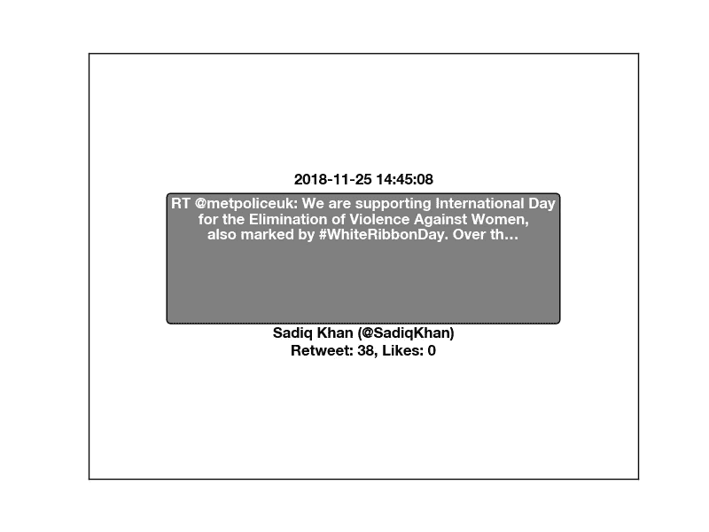

注意，该字体不是 Matplotlib 中的默认字体。您可以通过实现`matplotlib.font_manager.`来了解如何在 Matplotlib 中使用新字体。另外，请注意，还有另一个用户定义的函数来修饰圆形边界框内的 tweet 文本，即`squeeze_text`。它使文本每行最多 7 个单词，最多 8 行/行。

# 大型数据集的结果

使用 400 条 tweets 的实现通常需要大约 400-500 次检查所有圆圈的迭代，一次迭代通常需要半秒钟。如果 tweets 的数量更大，那么完成一次迭代所需的时间会更长。在第一次迭代时:所有的圆都非常接近原点，点(0，0)，与它的最大偏差为 0.01 半径。然后，对于之后的每一次迭代，我们通过应用排斥运动，对每两个重叠的圆中的每一个进行非常小的扫动，两个圆相互推开，而不必在一个步骤中使它们成为非重叠的圆。在本节中，我们将查看数据可视化的两个示例结果:

*   第一个例子是使用 1000 条推文的数据集。500 条推文来自印尼 CNN，另外 500 条来自 Metro TV。两者均于 2018 年 11 月 21 日采集。结果如下:

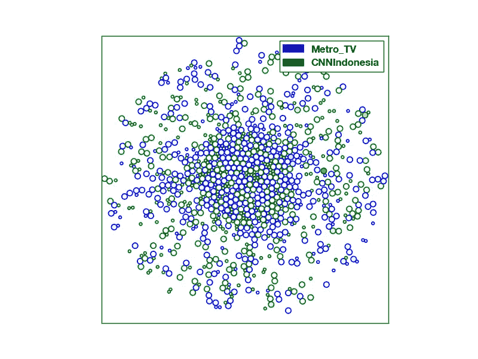

500 tweets from CNN Indonesia and 500 tweets from Metro TV. There are two green circles with quite strong color.

从这个结果我们可以得出一些结论:

—与所有其他推文相比，印度尼西亚 CNN 的 2 条推文(2 个绿色圆圈)的转发量非常高。似乎没有任何来自地铁电视台的推文像这些推文一样受欢迎。

——我们不能说有更多转发>喜欢的推文，或者其他

虽然从静态图像中没有太多的见解，但我们可以通过简单地点击圆圈来清楚地进行探索。而且可视化也挺好看的。

好吧，我们的第一次数据分析并不令人满意。接下来，如果我们使用包含 4 个不同账户的数据集，事情会变得更有趣。

*   第二个例子是使用来自四位政治家的 400 条推文的数据集:萨迪克汗先生、川普先生、普拉博沃先生和佐科·维多多先生(各 100 条推文)。萨迪克先生和特朗普先生的推文是在 2018 年 11 月 25 日收集的，而普拉博沃先生和佐科维先生的推文是在 2018 年 11 月 22 日收集的。对于第二个示例，我们还将看到一个展示用户交互的视频:

除了视频，这里是静态图像(*与视频中的略有不同:两者提供相同的信息，但由于不同的计算，它们在定位上有所不同)

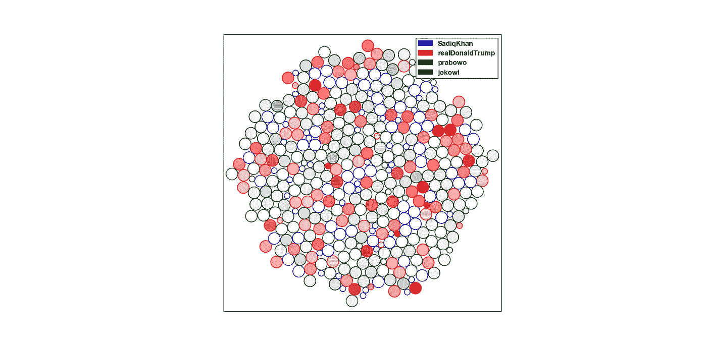

400 tweets from 4 politicians. Trump’s tweets appear to be more popular than all the others, with quite a large gap.

我不会写一些关于上述可视化的结论，但有一点很清楚，与其他 3 位政治家相比，特朗普的推文非常受欢迎。此外，突出的推文通常是有争议的，这里有一些例子:

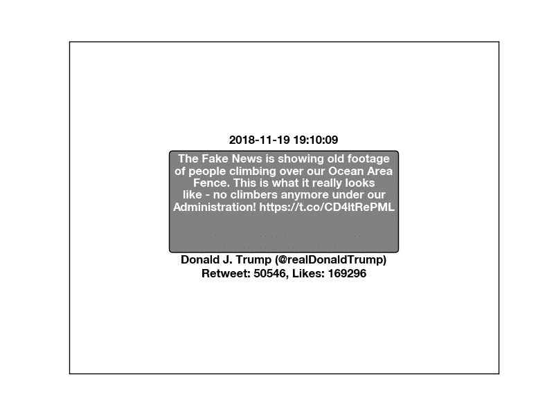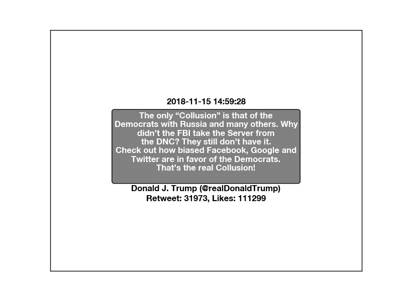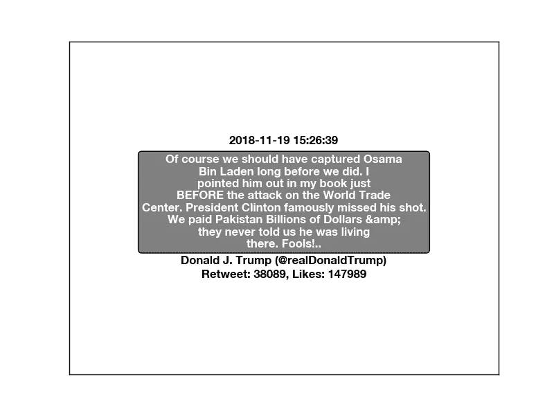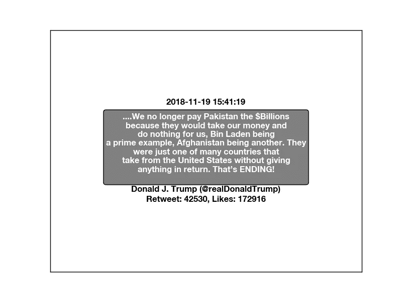

# 结束语

我们已经看到，像圆形这样简单的形状可以用来在数据可视化中表示推文。我们还可以使可视化具有交互性(尽管仍然非常简单)。使用 Matplotlib 实现并不困难。

这种可视化方法可以扩展:

*   可视化也可以用图形来建模:圆或 tweets 可以用顶点来表示，圆的邻接可以用边来表示。邻接也可以被设计成具有意义(当前的邻接不使用邻接来给出信息)。此外，圆的位置可以表示一个或多个测量值。没有意义的留下一个圈位置是一种浪费。
*   一个简单的扩展:我们可以将喜欢的数量附加到圆的半径上，从而将喜欢的数量包含到可视化中。请注意，我们不需要确切的数字来显示在主视图中，因为我们只需单击一个圆圈，然后 tweet 信息就会出现在另一个图中。以下是一个示例结果(使用每个账户的 50 条推文):

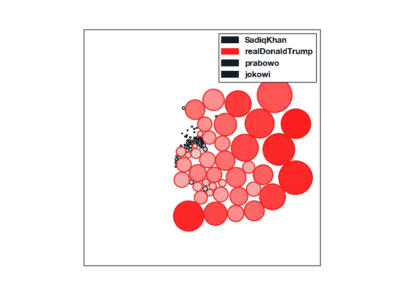

Visualization that includes the number of likes (represented by the size of the circle)

这个文笔离专家级还很远。有更多类型的复杂数据和数学可视化可以提供更多的见解和更多的应用。我欣赏建设性的意见。

*(*完整代码预计将在 Github 上提供)*