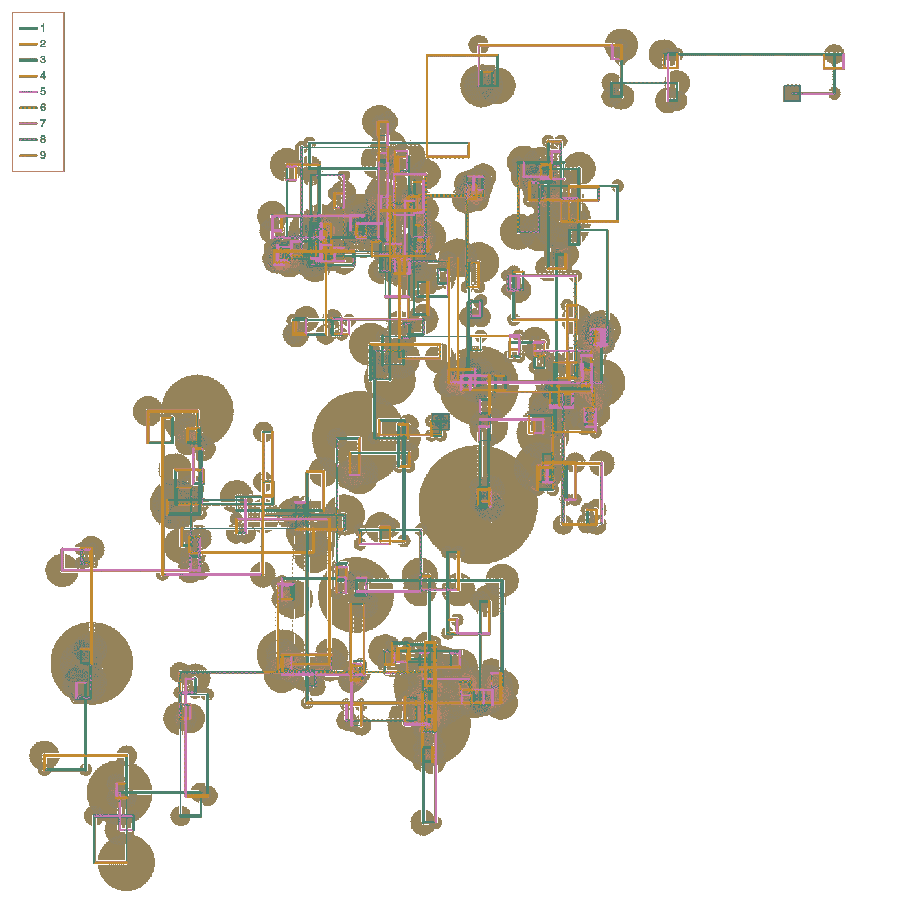
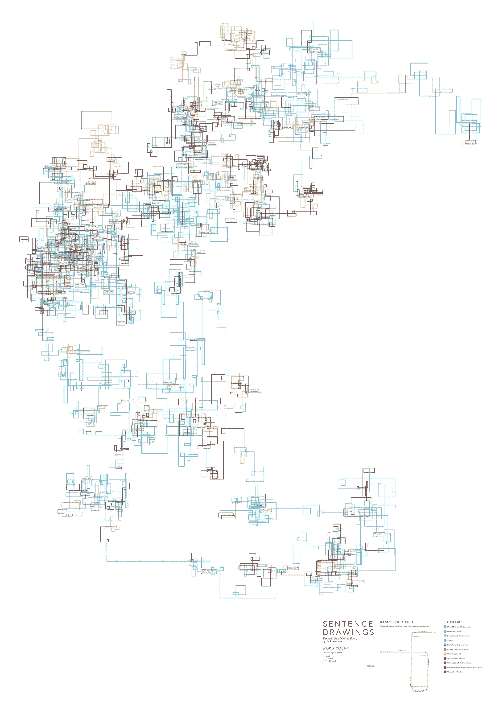
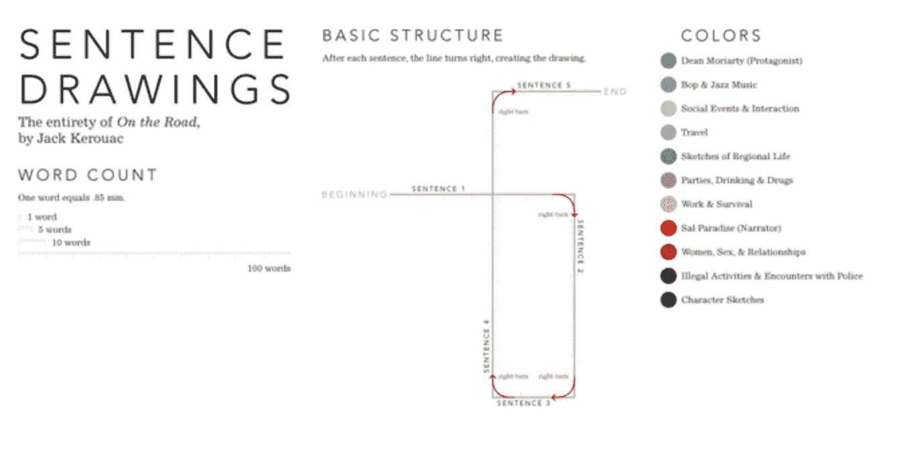

# 扭转图——来自推特行为的数据可视化(Art)

> 原文：<https://towardsdatascience.com/twiring-diagrams-data-visualization-art-from-tweeting-behaviour-38601aa2b2c6?source=collection_archive---------20----------------------->

## [https://twiring.appspot.com/](https://twiring.appspot.com/)

*twining*来自 Twitter+Wiring——因为这些图看起来像“接线”图。而且，*扭动*是为了 ***害羞或狡猾地瞥一眼*** 这正是这种可视化形式的功能。

## 灵感

我的灵感来自于吉姆·瓦兰丁汉姆的句子图画(最初灵感来自于斯蒂芬妮·波萨维克的句子图画艺术)，我想为用户的推特行为做一个类似的可视化。我的一些旧项目着眼于[生成 Twitter 自我网络](/generating-twitter-ego-networks-detecting-ego-communities-93897883d255)，然后[通过算法从推文中提取和描述主题](/information-flow-within-twitter-community-def9e939bb99)，所以这有点像混搭。

*Posavec’s original Sentence Drawings*

波萨维克的画句子的概念相当简单:你画一条相对相当于句子长度(字数)的线，右转，画一条对应下一句话的线，以此类推。这导致视觉在遇到连续的短句时变得拥挤，在出现长句时变得开阔。

*Posavec’s original Legend and Basic Structure*

## 扭曲

*Twiring* 采用上述句子绘图的基本结构，将*句子*替换为来自用户的 *tweet* 并执行概念上的扭曲:一行的长度代表自上次 tweet 以来的时间差，而不是 tweet 的字数。句子绘制的空间性成为一种可视化用户推特行为时间维度的方式。除了这个主开关之外，我还添加了一些其他可视化代码，以便在绘图上添加更多信息。

我还在绘图的背景中添加了一些圆圈，以表明一条推文的受欢迎程度。

此外，我还加入了搜索功能(基本的字符串匹配)来过滤图片上的线条/推文——我认为这很酷，因为你可以看到哪些术语何时出现，并缩小特定术语周围的推文行为。

## 可视化摘要

*   每条**线**都是一条推文
*   基本结构:在每条线的末端，你做一个**右转**然后开始画下一条线
*   在内有+的**黑框是最早的推文，空的黑框是最近的推文**
*   一行的**长度**是相对于从用户最后一次发推起有多长时间了
*   每行的**颜色**是推文被分组的**主题**
*   每一行的**粗细**与其**主题**有多密切的关系
*   点击任何一个**图例项**将会切换它们在图上的可见性
*   **搜索栏**(键入并按回车键)也可以用于过滤，基于你的输入与 tweet 中的文本的非常基本的比较
*   回复和不回复按钮可以分别切换推文。(注意:回复自己不被视为“回复”)
*   在每条线的开头画出了**圆圈**,表示基于 RTs 和喜欢的 tweet 的受欢迎程度(相对而言)
*   将鼠标悬停在一行上会显示该推文的更多细节
*   可以使用右边的工具栏平移、缩放和保存该图

## 笔记

**我将它作为一个 web 应用程序托管，供您使用和播放——请注意，主题建模和收集推文可能需要一些时间(0-3 分钟)。**

主题建模有一些随机性，因此刷新将重新计算它们，您将丢失当前配置。

我最多只分析了 1000 条最近的推文。

我还会过滤掉少于 50 个字符的 RTs/赞或推文。

出于可伸缩性/速度的原因，主题建模本身是简单的、轻量级的和未经过滤的(不使用词性标注或 NLP 来预处理文本)。

我不存储任何人的推文，我只要求 twitter 认证的只读权限。

> 链接:[https://twiring.appspot.com/](https://twiring.appspot.com/)

# 示例用法

*   直观感受你在发推之间休息了多长时间
*   搜索一个特定的术语，看看它是如何/何时出现在你的历史中的
*   以同样的方式分析其他用户的推文
*   立即看到热门推文脱颖而出，并找出任何模式
*   等等等等