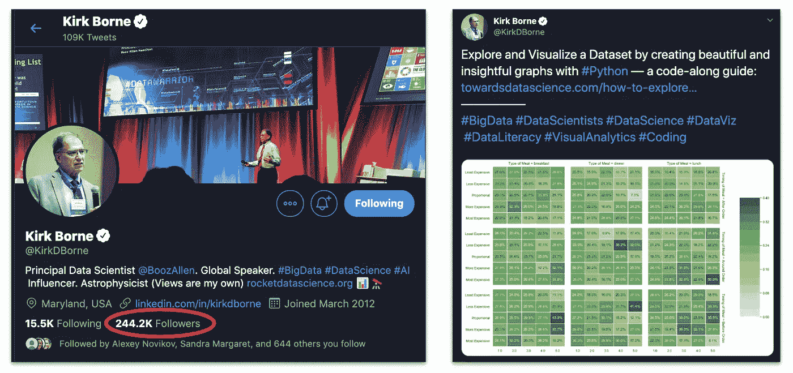
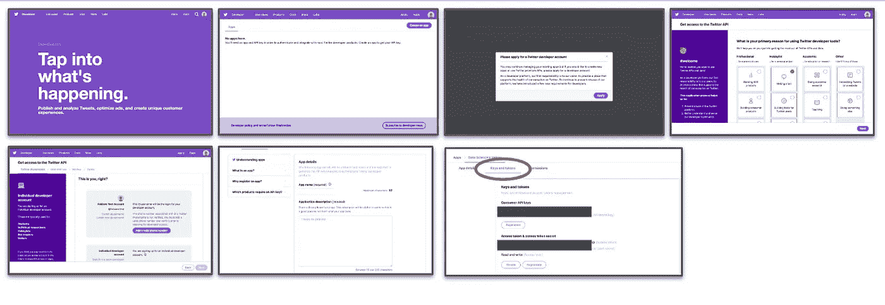
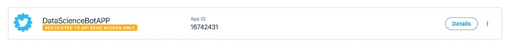
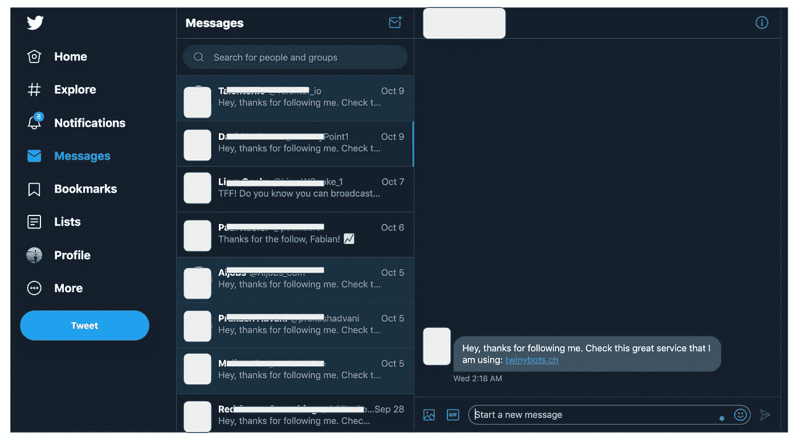
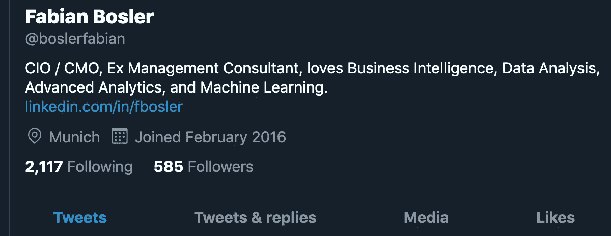

# Twitter——或者我的机器人和你的机器人说话的地方

> 原文：<https://towardsdatascience.com/twitter-3478a68d5875?source=collection_archive---------16----------------------->

## PYTHON DIY 终极指南——构建 TWITTER 机器人

## 阅读我如何用 Python 构建了一个 Twitter 机器人来运行一个有问题的实验。包括所有代码和详细的解释。

Image by [Jonny Lindner](https://pixabay.com/users/Comfreak-51581/?utm_source=link-attribution&utm_medium=referral&utm_campaign=image&utm_content=3010309) from [Pixabay](https://pixabay.com/?utm_source=link-attribution&utm_medium=referral&utm_campaign=image&utm_content=3010309)

# 摘要

在这个故事中，我将详细解释我如何构建一个 Twitter 机器人，它利用人类的一些基本情感来产生追随者。这种事每天都发生在我们所有人身上。我认为说明它是多么容易是至关重要的。我将分享一些有趣的经历，并在 Twitter 上展示 bot 感染的证据。

文章的后半部分深入描述了机器人的代码和功能。当前的生产代码可在 [Github](https://github.com/FBosler/TwitterBot) 上获得。我在 AWS 上运行 bot，并通过无服务器框架部署它。它甚至没有使用每月 AWS 免费层的 5%。所以试试吧。

如果这篇文章会让我的[推特账户](https://twitter.com/boslerfabian)被封禁，我不会感到惊讶。但是嘿，尤洛！

# 动机

Photo by [Patrick Fore](https://unsplash.com/@patrickian4?utm_source=medium&utm_medium=referral) on [Unsplash](https://unsplash.com?utm_source=medium&utm_medium=referral)

大约六周前，我开始在**媒体**上写作。我想写一些文章，帮助人们接触 Python，并且，总的来说，拓宽他们的技能。原因是我的一些团队成员想学习 Python，我想这可能会有协同作用。当我开始时，我对自己说，我会这样做两个月，看看会有什么结果。如果出现最坏的情况，我会有一些结构良好的文章，可以用来教 Python。我确信，几乎每个人都可以从了解 Python 中受益。

我写了第一篇关于群体的文章。我没有研究人们是否关心这个话题。坦白说，我不在乎。我不知道如何恰当地编排媒体文章的格式，甚至不知道你最初可以包含图片。我只是想开始，这是我最近做了一些工作的一个主题。

观众人数少得可笑，大约每天只有 30 次浏览。然后这篇文章出现在专栏**数据科学**和**编程**中，不久之后，出版物**更好的编程**发布了它。观众人数直线上升。至少按照我当时的标准。

> 当你从未见过建筑时，即使是一层楼的房子看起来也像一座大房子

我每天被浏览 150 次。感觉很好。那一刻，我设定了一个雄心勃勃的目标。我想写一篇在 30 天内有 100，000 浏览量的文章。实际上是一个任意的数字，但是明确和雄心勃勃的目标有助于不失去焦点。我对自己说，我每周至少要发表一篇文章。我在晚上写作，晚上 9 点到 11 点，周末也写作。有时候很有挑战性，但是我一直坚持。

第二篇[文章](/replacing-sheets-with-python-f1608e58d2ca)在观看人数方面要好得多。 [**走向数据科学**](https://towardsdatascience.com/) 发现了这个故事，因为我热爱这个出版物，所以我毫不犹豫地在那里发表。也许这个话题更贴切一点。谁知道呢。没关系。我正朝着正确的方向前进。

# 推特

Photo by [Nicholas Green](https://unsplash.com/@nickxshotz?utm_source=medium&utm_medium=referral) on [Unsplash](https://unsplash.com?utm_source=medium&utm_medium=referral)

**介绍 Twitter！我的第三篇文章是第二篇文章的后续。它包括了某种程度上先进的可视化。我在一个星期五的晚上发表了它，我知道它并不完美，但我没有时间早点完成它。毕竟，我必须达到我的目标。然后奇怪的事情发生了。我的观众人数爆炸了。仅在周日，这篇文章就获得了 4000 次浏览。我大吃一惊。我必须了解这一点，所以我开始寻找潜在的原因。经过一番挖掘，我发现了这个:**

Kirk Borne had tweeted a link to my third article

我没有想到 Twitter 是一个合适的媒体作品分销渠道，但不可否认它的影响。我想，如果柯克能做到这一点，我当然也能做到。因此，我重新启用了自己创建的账户，关注唐纳德·特朗普(Donald Trump)，偶尔开怀大笑。只有一个问题，这个账号有精确的零关注者。

我开始在推特上发帖，喜欢推文，转发，关注人。天啊，这太累了。我很快意识到，Twitter 就像一个疯狂的集市，每个人都通过扩音器以疯狂的频率不断脱口而出他们的想法和观点。我从事营销工作，对 Twitter 上的推荐活跃度做了一些研究，这简直太疯狂了。一些消息来源暗示每天多达 20 个帖子，其他人甚至更多。我没数过，但我想柯克大概是每天 200 个左右。

这样手动做了一天左右，我烦得要命。我决定我需要一种不同的方法。事实上，我的追随者增加了一个，这无助于我的动力。

# 十二岁

Photo by [Safar Safarov](https://unsplash.com/@codestorm?utm_source=medium&utm_medium=referral) on [Unsplash](https://unsplash.com?utm_source=medium&utm_medium=referral)

我在 Twitter 上的活动是令人麻木的重复。从柯克的所作所为来看，他也不像是在阅读他发布的所有内容。每当一件事被反复做的时候，它通常是自动化的首选。我找到了用于访问 Twitter API 的 Python 库 [tweepy](https://www.tweepy.org/) 。文档看起来很干净，代码维护得很好。我想试试这个。

## 资格证书

设置身份验证和获取凭证非常简单:

1.  前往 [Twitter 开发者页面](https://developer.twitter.com)
2.  使用您的 Twitter 帐户登录
3.  创建一个应用程序并获取凭证(在**密钥和令牌**下，见红色圆圈)

Steps to create a Twitter app

## 机器人的结构

我在 Jupyter 笔记本上用一个简单的 API 调用测试了凭证，一切看起来都很好。现在是时候让它更上一层楼了。我的机器人应该做两件事:

*   产生追随者
*   广告媒体文章

## 产生追随者

从几年前的一次 Instagram 机器人实验中，我知道了实现我第一个目标的确切方法。这相对来说是不道德的，因为它迎合了人们渴望被喜欢和被认可的心理。这是最假的了。不过话说回来，这是 Twitter。另外，我认为有必要谈谈这些做法。展示它们是如何工作的至关重要。关键是要表明它们每天都在以更大的规模被使用。

工作方式—给予员工认可和关注:

1.  与用户互动(点赞、转发、评论他们的推文并关注他们)
2.  等待和观察
3.  看着他们跟着你回来
4.  再等一段时间，然后放开他们

所以抛开所有的道德因素，让我们把这个编码起来。

## ①与用户互动

在我的项目中，我倾向于使用配置模块作为配置设置的抽象层。

bots.config

配置如下所示:

production.yml

然后，我们可以设置一个模块来提供 Twitter API，如下所示:

bots.twitter_api

下面这段代码包含交互逻辑。

bot.fetchfollow

我们从两个全大写的变量开始，`COMMENTS`和`HASHTAG_SETS`这两个变量稍后会被引用，给定内容和名称，用法是相当明显的。`COMMENTS`列表保存了一些通用的正面评论，`HASHTAG_SETS`保存了一个用于搜索的不同标签组合的列表。

主要功能是`fetchfollow`，它执行以下操作:

*   使用从`HASHTAG_SETS`设置的随机标签来搜索推文。
*   获得这些推文背后的独特用户。根据关注者的数量(越少越好)、关注者与关注者的比率(越低越好)和帐户的年龄(越新越好)对用户进行评分，并根据分数对他们进行排序，最高(即最有可能再次关注)在前，最低在后。
*   从 s3 中获取`following_history`,该文件包含用户被关注的日期(以及后来被取消关注的日期)。
*   从最高分到最低分与不在`following_history`中的用户互动(每次最多 10 分，我们毕竟不想触发机器人警报)。互动意味着给包含我们标签的用户推文打分，然后随机点赞、评论和转发
*   将用户添加到`following_history`并更新到 s3。毕竟，我们不想再跟着他们了。

## ②等待观察

这个阶段比较搞笑。这个阶段是你把你的机器人放到野外并观察结果的时候。有时带着娱乐，有时带着困惑。当我试验 Instagram 机器人的时候，我很快发现 Instagram 上有相当多的色情内容。但那是以后的事了。

在部署了第一个版本的 Twitter 机器人之后，我学到了三件事:

ⓐ **我不得不调整我搜索推文的方式，因为我最初只搜索 Python。**

Snakes are scary

ⓑ **我不得不调整机器人运行的频率，使其行为不那么确定。这个机器人的第一个版本很快就被屏蔽了，因为我像喝了一杯能量饮料后冰河时代的松鼠一样被机枪评论和传播。**

The first app got restricted to read access only after having commented a little too much

然而，这一次创建一个新的应用程序并采取更加谨慎的方法是相当容易的。

ⓒ:推特上有很多机器人。我得到了回应，“嘿，谢谢你关注我。检查我正在使用的这个伟大的服务: [https://xxxbots。](https://t.co/j90pPC4lV2?amp=1) xx”相当经常。向他们致敬。他们运用了一种聪明的病毒式营销方法。

Bots responding to my bot and the list goes on

## ③看着他们跟着你回来

在过去的四周里，我的 Twitter 账户已经积累了大约 600 名粉丝，除了偶尔在中型帖子列表中添加一个新条目之外，我什么也没做。

## ④等待一段时间，然后放开他们

因为你不想让你关注的人数过多，所以你必须时不时地取消关注以保持平衡。

bots.unfollow

unfollow 函数在执行时，获取之前上传的`following_history`，并按照日期升序对所有未被取消关注的进行排序。对于第一个一到三个用户，它将调用`destroy_friendship`(调用 unfollow)。如果你问我，我觉得这个名字很合适。它将更新`following_history`，然后准备好被再次调用。

## 广告媒体文章

这一部分是直截了当的，它的道德性肯定没有那么多问题。

bots.post

这个脚本从参考列表中随机发布了一篇文章。参考列表如下所示:

Sample posts

# 部署

Photo by [elCarito](https://unsplash.com/@elcarito?utm_source=medium&utm_medium=referral) on [Unsplash](https://unsplash.com?utm_source=medium&utm_medium=referral)

我使用[无服务器](https://serverless.com/framework/docs/providers/aws/)框架，利用 Lambda 函数和预定义的时间表(在 serverless.yml 中指定)将机器人部署到 AWS

serverless.yml

安装非常简单，但是解释无服务器将是另一篇文章。更新机器人需要我对脚本做一些修改，然后运行`serverless deploy`。

# 结束语

我会让这个机器人多运行一段时间，这样阅读这篇文章的人就可以有一个实时参考。不过，我最终会关闭它。

如果你想聊天，请在 LinkedIn 上连接！我很乐意和你谈谈，或者回答你可能有的任何问题。

看看我在 Medium 上写的其他文章，如果你喜欢这篇文章，请留下一两个掌声。