# 面向数据科学家的 Twitter 机器人

> 原文：<https://towardsdatascience.com/twitter-bot-for-data-scientists-8f4242c4d876?source=collection_archive---------12----------------------->

> 有没有想过如何创建你的@Getvideobot @threadreaderapp 之类的东西


Photo by [AbsolutVision](https://unsplash.com/@freegraphictoday?utm_source=medium&utm_medium=referral) on [Unsplash](https://unsplash.com?utm_source=medium&utm_medium=referral)

Twitter 是使用最广泛的社交平台之一。它被个人和组织使用。对于那些其信息(数据)驱动其生活和工作的人来说，它是一个巨大的信息库。

twitter API 的存在为平台上共享和提供的信息提供了无限的创造性访问，因此，不同的 twitter bot 被创建用于不同的目的，它帮助 twitter 成为一个更好的平台。

这些机器人的使用不仅仅使 twitter 平台变得有趣，它还可以作为数据科学家众包数据的一种手段。

在本文中，我们将学习如何为您的数据科学项目创建不同的 twitter bot 来众包数据，例如如何:

1.  通过监控特定关键字下载图像和视频。
2.  通过在推文中引用来下载媒体数据。
3.  收集被监控用户的推文。
4.  将 twitter 线程展开到文本文件中。
5.  在 aws s3 中存储数据集合。

这些不同的过程可以帮助众包数据，不仅用于 NLP，还用于计算机视觉(因为大多数人认为 twitter 最适合收集自然语言处理的数据)。

在本文中，我将假设您拥有 **Twitter API 认证证书**，并且知道如何使用 **Tweepy。**如果没有，请查看下面的**参考资料，了解如何获得 twitter API 证书以及如何安装 tweepy，并获得一些关于它的介绍。但是我建议您先阅读这篇文章，只是为了获得应用程序视图，然后再回到参考资料。**

如果您有 twitter API 凭证，那么要做的第一件事就是创建一个配置文件，用 twitter API 设置您的身份验证。

调用该函数有助于检查身份验证是否有效。您可以直接用 api 密钥替换`os.getenv()`，或者将 api 密钥存储在您的`environment`中。`wait_on_rate_limit`和`wait_on_rate_limit_notify`帮助 tweepy 等待，并在超过速率限制时打印出一条消息。

**通过监控特定关键字下载媒体数据**

数据收集是每个数据驱动项目的基础。收集的数据类型取决于正在进行的项目类型。例如，对于一个计算机视觉项目，它需要图像或视频。Twitter 可以作为一个平台，以不同的方式收集这些数据。其中一种方法是监控与项目所需数据类型相关的一组特定关键字。

比方说，你想策划或收集涉及特朗普的数据，可以创建一个 twitter 机器人来始终收听提到特朗普的每条推文。

监控机器人是使用 tweepy 接口的 Twitter `Stream service` api 创建的。这有助于机器人在 Twitter 平台上持续收听不同的推文。Monitor 类继承自`tweepy.StreamListener`，它包含两个方法；`on_status`这有助于传入推文，并对传入的推文做我们想做的任何事情，并且`on_error`提供了可操作点，以防在`on_status`过程中遇到错误。

`on_status`传入的 tweet 包含了每条 tweet 的 JSON 属性。因为在这个例子中我们需要媒体数据。tweet 的 json 元素包含将被称为`entities`的内容，实体包含媒体文件和 tweet 中嵌入的 url。例如

```
{u'hashtags': [{u'indices': [0, 12], u'text': u'NeurIPS2019'}],
 u'media': [{u'display_url': u'pic.twitter.com/GjpvEte86u',
   u'expanded_url': u'https://twitter.com/doomie/status/1206025007261876226/photo/1',
   u'features': {u'large': {u'faces': []},
    u'medium': {u'faces': []},
    u'orig': {u'faces': []},
    u'small': {u'faces': []}},
   u'id': 1206024997262618626,
   u'id_str': u'1206024997262618626',
   u'indices': [278, 301],
   u'media_url': u'http://pbs.twimg.com/media/ELypWGAUcAIpNTu.jpg',
   u'media_url_https': u'https://pbs.twimg.com/media/ELypWGAUcAIpNTu.jpg',
   u'sizes': {u'large': {u'h': 1536, u'resize': u'fit', u'w': 2048},
    u'medium': {u'h': 900, u'resize': u'fit', u'w': 1200},
    u'small': {u'h': 510, u'resize': u'fit', u'w': 680},
    u'thumb': {u'h': 150, u'resize': u'crop', u'w': 150}},
   u'type': u'photo',
   u'url': u'https://t.co/GjpvEte86u'}],
 u'symbols': [],
 u'urls': [],
 u'user_mentions': []}
```

`tweet.entities`包含该键和值项。因为我们需要媒体文件。对于图像文件，`media_url`将用于下载 tweet 中的图像。对于推文中上传的视频，将使用`expanded_url`下载；对于通过 url 嵌入的视频，如 youtube 视频。将从`urls`中提取，但是在这个 tweet 中，它不包含 URL，这就是为什么数组是空的。但是对于包含 url 的 tweet

```
{ ....
  u'urls': [{...,u'expanded_url':'youtube.com?...}]
```

因此，在`urls[0]['expanded_url']`中通过解析下载视频。

已经创建了各种 python 库或模块来简化图像和视频的下载。为了下载图像，使用了一个名为 [wget](https://pypi.org/project/wget/) 的 python 包。对于 youtube 视频下载，使用 pytube ，对于 twitter 视频，使用 twitter_dl 。所有这些库都是很棒的库，它们使得构建这个项目更加容易。但是对于 twitter-dl 和 pytube，由于我遇到的错误，我对它们做了一些修改，但是我认为新的更新应该可以解决这个问题。所以如果你遇到任何错误，你可以检查我的 github 下载它们。

为了下载这些媒体文件，我们将这些库合并成一个文件

现在我们可以将它与 Monitor.py 结合起来，开始下载媒体文件

**当被推文引用时下载媒体文件**

有时，我们可以让其他人在 twitter 上帮助我们众包数据，而不是试图监控一个特定的关键词。这种方法包括让人们在包含你想要的数据的推特下引用你的推特名字。这一过程与监控过程类似，只是我们不会使用流式 api，并且它不会监听所有推文，除了您在中提到的那条推文。

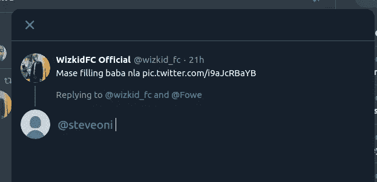

refrenced to a tweet.

提及功能利用`api.mention`，获取你被提及的所有 tweet。为了防止`api.Cursor`获取你被提到的所有推文，从你加入 twitter 开始，我们使用`since_id`。以确保它不断获取你被提到的新推文。首先，我们得到你最后一次提到的 tweet 的 id。

```
tweety = []
for tweet in tweepy.Cursor(api.mentions_timeline).items():
    if len(tweety) > 1:
        break
    else:
        tweety.append(tweet)
```

因为推文是基于新创建的推文获取的。我们只需要这个，然后我们索引`tweety`来获得 tweet 的 id。

```
tweety[0].idoutput[]:
1208298926627074049
```

在上述代码面板的`mention()`中，我们使用了`max(tweet.id,new_since_id)` ，因为对于每个新的 tweet，id 总是大于它之前的 tweet id。也就是说，新的推文 id 高于旧的推文 id。

不要忘记，收集的`tweet`不仅仅是文本，还有 json 元素，包含 tweet 属性。对于这个机器人，你会通过评论区被引用到一条推文。你想要的主要内容在用户通过评论引用你的推文中。所以用户在回复一条推文。

在 tweet json 元素中，可以提取用户回复的 tweet 的 id。我们把这个 id 叫做`in_reply_to_status_id`。当用户没有回复推文时，id 通常是`None`。为了创建 bot，我们首先检查回复状态 id 是否不是 None，然后我们处理 tweet。然后我们从状态 id 中获取 tweet，使用

```
status_id = tweet.in_reply_to_status_id                                   tweet_u = api.get_status(status_id,tweet_mode='extended')
```

然后，您现在可以打印出推文中包含的文本。

在这个基本过程之后，如果需要媒体文件，剩下的过程类似于 Monitor bot 的过程。对于上面的代码，我们可以将文本存储在数据库中。创建另一个名为 popular know has`Unrollthread`的机器人仍然需要这样一个过程，这将在本文结束之前讨论。

下载媒体数据

**收集被监控用户的推文**

可以创建一个 Twitter bot 来始终跟踪来自特定用户集的 twitter feeds，这可以帮助管理数据以创建基于特定数据的语言模型，并用于各种 NLP 数据分析。回顾一下最初创建的特定于 Monitor 的关键字 bot，但是在这个过程中，我们使用用户 id 来订阅用户，而不是订阅关键字。

在代码中，我指定了用户 id，这个用户 id 可以通过；例如

```
api.get_user("[@_mytwtbot](http://twitter.com/_mytwtbot)").id #specify the user screen name you want//1138739106031308800
```

因此，你将总是第一个获得这个用户创建的推文。

**将 Twitter 线程展开成文本文件**。

你在 twitter 上听说过展开的线程机器人，它总是创建一个 pdf 格式的线程。我们将创造这样的机会。这也有助于为您的数据科学项目收集数据。这个过程仍然与提及机器人相同。它利用回复状态 id，并使用一个`recursive`函数来获取一个线程中的所有 tweets。

**存储 AWS s3 中收集的数据**

既然我们已经有了不同的方法来收集数据，我们需要能够存储它们。如果您没有在线存储服务，Aws s3 提供了一种快速简便的在线存储媒体文件的方法。

首先，安装 aws sdk，它是通过 python 库 ***boto3*** 提供的

```
pip install boto3
```

然后，为了让 boto3 工作并连接到您的 aws 资源，您需要通过创建一个`iam`用户权限来获得 aws 凭证，然后可以将凭证存储在您的计算机主目录中

```
touch ~/.aws/credentials
```

然后在凭证中，我们存储必要的信息

```
[default]
aws_access_key_id = YOUR_ACCESS_KEY_ID
aws_secret_access_key = YOUR_SECRET_ACCESS_KEY
```

现在获取访问密钥；

首先，访问 aws 控制台并进入 iam 资源

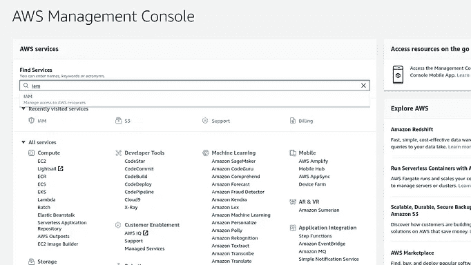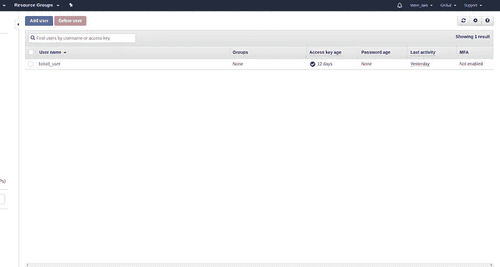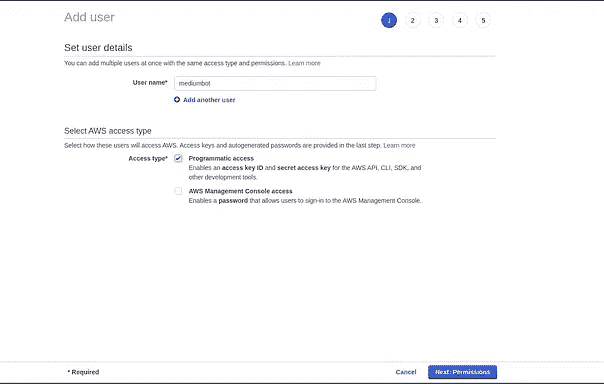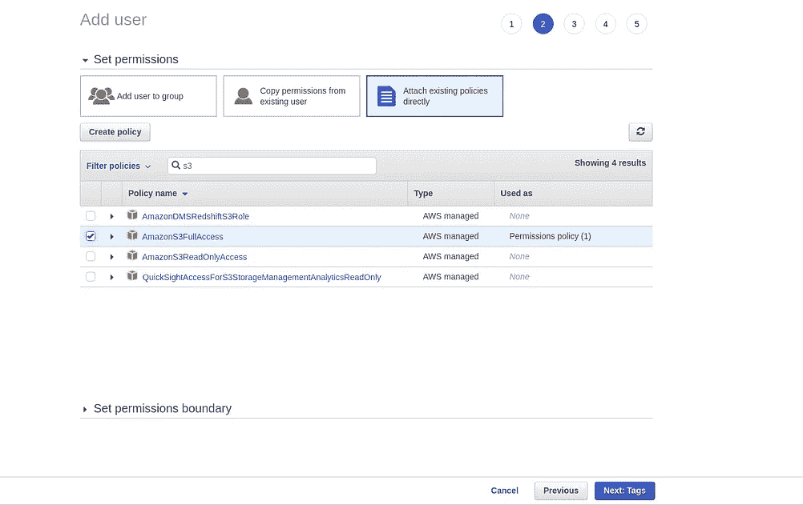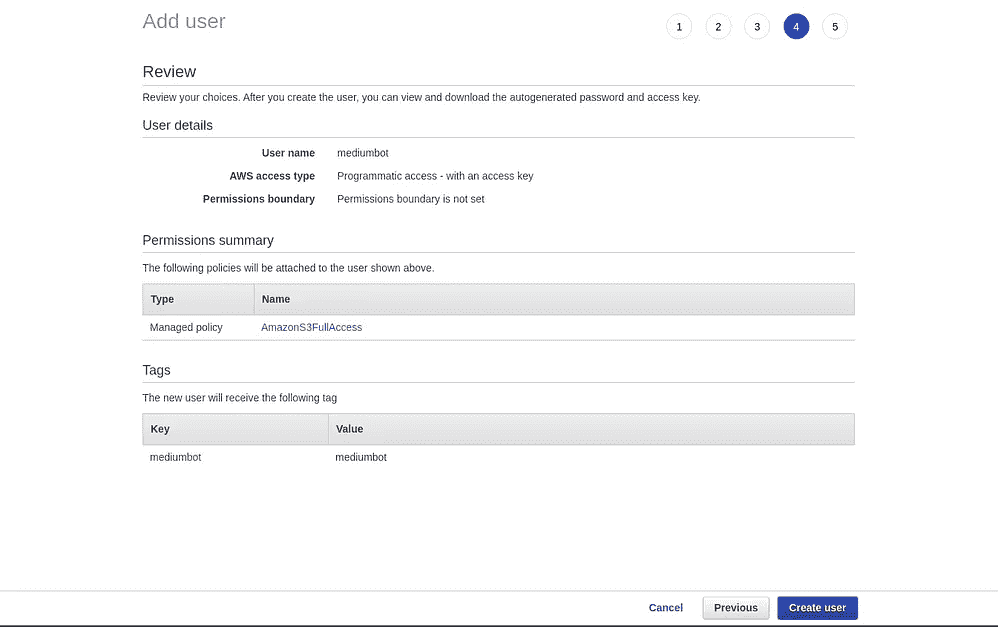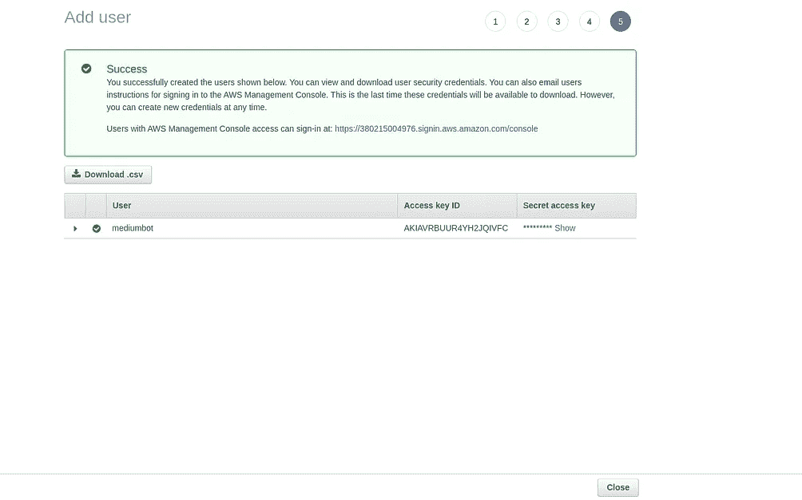

Step by step process of creating iam on aws.

按照图片从左到右的排列顺序在 aws 上设置 iam。完成后，你可以下载如上图所示的 csv 文件，复制其中的凭证并粘贴到`~/.aws/credentials`

完成后，我们继续在 aws S3 创建一个存储桶。

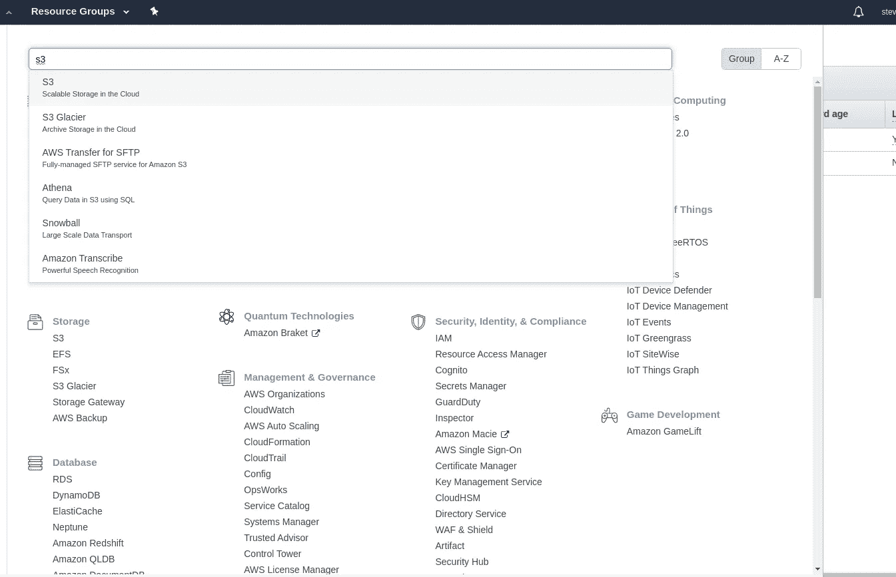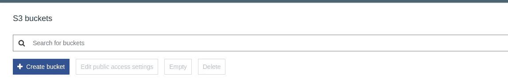

点击`create bucket`创建一个存储桶来存储您的文件。

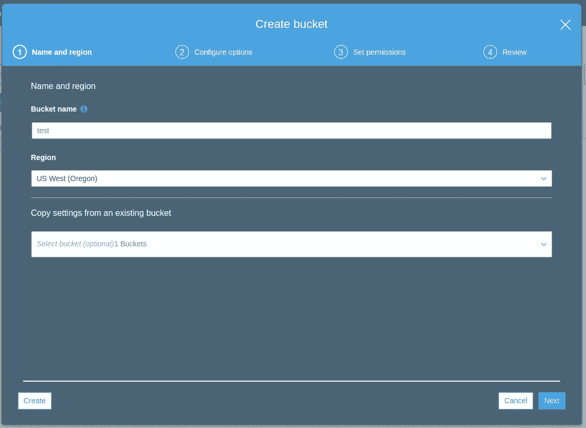

然后指定名称，你想要的地区，然后点击`create`，这样你的桶就创建好了。

既然创建了 bucket，我们就可以使用 boto3 调用它:

```
import boto3s3 = boto3.client("s3")
s3.upload_file(path,"bucket_name","name_to_store_file")
```

这是我们将用来在 s3 上存储文件的基本函数。upload_file 方法接受要上传的文件的路径，例如*/home/documents/bot/video . MP4*，而`bucket_name`是您创建的 bucket 的名称，那么第三个参数是您想要在 s3 上存储文件的名称。

因此，只要对我们的`download_t.py`稍加修改，我们就可以将文件保存在 aws s3 上

文件上传后，可以通过点击存储桶进行查看

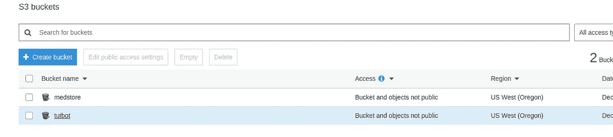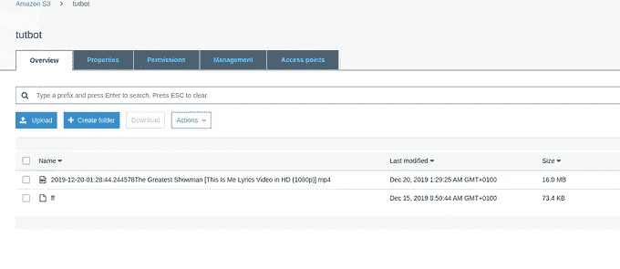

aws s3 scrrenshot.

现在一切都设置好了，我们现在可以创建 docker 映像，然后部署到 aws。查看下面的参考资料，了解如何部署到 aws。

但是，在您从 reference 链接中学习了如何部署到 aws 之后，只需添加一点东西，即 aws 凭证和环境变量

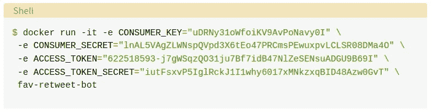

from [realpython](https://realpython.com/twitter-bot-python-tweepy/#how-to-make-a-twitter-bot-in-python-with-tweepy).com

此外，为了能够将媒体文件保存到 aws s3

```
-e aws_access_key_id="sjbkjgkjhfyfyjfyjyfj" \
-e aws_secret_access_key="1124knlkhk45nklhl" \
fav-retweet-bot
```

现在，作为一名数据科学家，我们已经学会了从 twitter 上收集数据并创建一个机器人的方法。看看这个，了解如何使用深度学习创建 twitter 机器人。

从 [github](https://github.com/steveoni/TwitterBot_Ds) 下载包含代码的回购协议

**参考**

这篇文章很大程度上依赖于来自 realpython.com**的某个团队的工作**查看[这里](https://realpython.com/twitter-bot-python-tweepy/#how-to-make-a-twitter-bot-in-python-with-tweepy)学习如何生成 twitter api 以及如何部署到 aws。