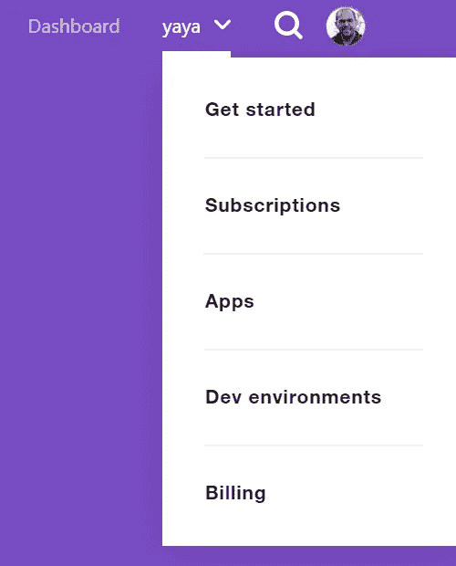

# 使用 Python 的 Twitter 数据收集教程

> 原文：<https://towardsdatascience.com/twitter-data-collection-tutorial-using-python-3267d7cfa93e?source=collection_archive---------0----------------------->

## “没有数据，你只是另一个有观点的人”——w·爱德华兹·戴明


Photo by [Carlos Muza](https://unsplash.com/@kmuza?utm_source=medium&utm_medium=referral) on [Unsplash](https://unsplash.com?utm_source=medium&utm_medium=referral)

在过去的一年里，我在 Twitter 上变得更加活跃，随着互动次数的增加，我需要回答一些基本问题，比如:

*   我的追随者来自哪里？
*   我的推文平均有多少赞？
*   我关注的客户分布情况如何？

所以我认为这可能是一个有趣的编程练习。但是在我进行任何分析之前，我们需要收集所需的数据。

在本教程中，我们将学习如何使用 Twitter 的 API 和一些 Python 库来收集 Twitter 数据。我们将介绍如何设置开发环境、连接 Twitter 的 API 以及收集数据。

对于“只给我看代码”的人来说，这是笔记本:

[](https://colab.research.google.com/drive/1cwefy0vNKHjW_XUZeyvKvc0U-no3gKGt#scrollTo=EaGv0ePkydNz) [## 谷歌联合实验室

### 编辑描述

colab.research.google.com](https://colab.research.google.com/drive/1cwefy0vNKHjW_XUZeyvKvc0U-no3gKGt#scrollTo=EaGv0ePkydNz) 

# 工具和 Python 库

这是我们将使用的工具清单

*   **用于开发环境的 Google Colab**
*   **Google Drive** 存储数据

它们是免费的，只需一个基本的谷歌账户，将有助于让事情变得简单。

至于 Python 库，下面是我们需要的

*   [**tweepy**](https://tweepy.readthedocs.io/en/latest/) 用于使用 Python 访问 Twitter API。
*   **google.colab** 将 Google Drive 链接到 colab 笔记本
*   **json** 用于加载和保存`json`文件
*   **csv** 用于加载和保存`csv`文件
*   **日期时间**用于处理日期数据
*   **时间**为定时代码执行

我们将导入我们需要的所有库，如下所示

```
**# Import all needed libraries**import tweepy                   **# Python wrapper around Twitter API**
from google.colab import drive  **# to mount Drive to Colab notebook**
import json
import csv
from datetime import date
from datetime import datetime
import time
```

# 将 Google Drive 连接到 Colab

要将 Google Drive *(存储数据的地方)*连接到 Colab 笔记本*(处理数据的地方)*运行以下命令。

```
**# Connect Google Drive to Colab** drive.mount('/content/gdrive')**# Create a variable to store the data path on your drive** path = './gdrive/My Drive/path/to/data'
```

执行上面的代码块将提示您跟随一个 URL 来验证您的帐户，并允许 Google Drive 和 Colab 之间的数据流。只需点击提示，当硬盘安装成功时，您将在笔记本中收到一条消息。

# 向 Twitter 的 API 认证

首先，[申请一个开发者账号](https://developer.twitter.com/en/apply-for-access)访问 API。对于本教程来说，标准 API 已经足够了。它们是免费的，但是有一些限制，我们将在本教程中学习如何解决。

设置好您的开发者账户后，点击右上角的用户名打开下拉菜单，然后点击*“应用”*，创建一个将使用 API 的应用，如下所示。然后选择*“创建应用”*，并填写表格。出于本教程的目的，使用 Google Colab 笔记本的 URL 作为应用程序的 URL。



Select “Apps” from the top right corner once you log into your developer account

现在您已经创建了一个开发人员帐户和一个应用程序，您应该有一组连接到 Twitter API 的密钥。具体来说，你会有一个

*   API 密钥
*   API 密钥
*   访问令牌
*   访问令牌秘密

这些可以直接插入到您的代码中，或者从外部文件加载以连接到 Twitter API，如下所示。

```
**# Load Twitter API secrets from an external JSON file** secrets = json.loads(open(path + 'secrets.json').read())
api_key = secrets['api_key']
api_secret_key = secrets['api_secret_key']
access_token = secrets['access_token']
access_token_secret = secrets['access_token_secret']**# Connect to Twitter API using the secrets** auth = tweepy.OAuthHandler(api_key, api_secret_key)
auth.set_access_token(access_token, access_token_secret)
api = tweepy.API(auth)
```

# Twitter 数据收集

## 概观

我们将创建函数来收集

*   **Tweets:** 这也包括转发，以及作为 [Tweet 对象](https://developer.twitter.com/en/docs/tweets/data-dictionary/overview/tweet-object)收集的回复。
*   **关注者:**作为[用户对象](https://developer.twitter.com/en/docs/tweets/data-dictionary/overview/user-object)收集的所有关注者信息。
*   **关注:**我关注的所有账户的信息*(又名好友)*收集为[用户对象](https://developer.twitter.com/en/docs/tweets/data-dictionary/overview/user-object)。
*   **今日统计:**当日跟随者及跟随者统计。

此外，我们将创建两个助手函数来简化我们的工作

*   **保存 JSON:** 将收集到的数据保存在 Google Drive 上的`json`文件中
*   **速率限制处理:**管理免费版本附带的 Twitter API 限制，主要是 15 分钟内允许的 API 调用数量。

## 助手功能

**保存 JSON**

```
**# Helper function to save data into a JSON file
# file_name: the file name of the data on Google Drive
# file_content: the data you want to save**def save_json(file_name, file_content):
  with open(path + file_name, 'w', encoding='utf-8') as f:
    json.dump(file_content, f, ensure_ascii=False, indent=4)
```

**费率限额处理**

```
**# Helper function to handle twitter API rate limit**def limit_handled(cursor, list_name):
  while True:
    try:
      yield cursor.next() **# Catch Twitter API rate limit exception and wait for 15 minutes**
    except tweepy.RateLimitError:
      print("\nData points in list = {}".format(len(list_name))))
      print('Hit Twitter API rate limit.')
      for i in range(3, 0, -1):
        print("Wait for {} mins.".format(i * 5))
        time.sleep(5 * 60) **# Catch any other Twitter API exceptions**
    except tweepy.error.TweepError:
      print('\nCaught TweepError exception' )
```

为了解开这段代码，让我们从定义什么是*光标*开始。下面是来自 [Tweepy 文档](https://tweepy.readthedocs.io/en/latest/cursor_tutorial.html)的介绍:

> 我们在 Twitter API 开发中大量使用分页。遍历时间表、用户列表、直接消息等。为了执行分页，我们必须为每个请求提供一个 page/cursor 参数。这里的问题是这需要大量的 boiler plate 代码来管理分页循环。**为了使分页更容易，需要更少的代码，Tweepy 有了光标对象。**

我的解释是，Cursor 对象是 Tweepy 管理和传递跨多页数据的方式，就像您最喜欢的书的内容分布在多页上一样。

记住这一点，上面的函数首先请求下一个数据指针(或页面)。如果在过去 15 分钟内收集的数据量超过了 API 限制，就会引发一个`tweepy.RateLimitError`异常，在这种情况下，代码将等待 15 分钟。最后一个异常是为了捕捉执行过程中可能出现的任何其他`tweepy.error.TweepError`，比如 Twitter API 的连接错误。

## 数据收集功能

**推文**

我们将重用 Github 上稍加修改的实现

```
**# Helper function to get all tweets of a specified user
# NOTE:This method only allows access to the most recent 3200 tweets
# Source:** [**https://gist.github.com/yanofsky/5436496**](https://gist.github.com/yanofsky/5436496)def get_all_tweets(screen_name): **# initialize a list to hold all the Tweets**
  alltweets = [] **# make initial request for most recent tweets 
  # (200 is the maximum allowed count)** new_tweets = api.user_timeline(screen_name = screen_name,count=200) **# save most recent tweets**
  alltweets.extend(new_tweets) **# save the id of the oldest tweet less one to avoid duplication**
  oldest = alltweets[-1].id - 1 **# keep grabbing tweets until there are no tweets left**
  while len(new_tweets) > 0:
    print("getting tweets before %s" % (oldest)) **# all subsequent requests use the max_id param to prevent
    # duplicates**
    new_tweets = api.user_timeline(screen_name = screen_name,count=200,max_id=oldest) **# save most recent tweets**
    alltweets.extend(new_tweets) **# update the id of the oldest tweet less one**
    oldest = alltweets[-1].id - 1
    print("...%s tweets downloaded so far" % (len(alltweets)))
 **### END OF WHILE LOOP ###** **# transform the tweepy tweets into a 2D array that will 
  # populate the csv** outtweets = [[tweet.id_str, tweet.created_at, tweet.text, tweet.favorite_count,tweet.in_reply_to_screen_name, tweet.retweeted] for tweet in alltweets] **#** **write the csv**
  with open(path + '%s_tweets.csv' % screen_name, 'w') as f:
    writer = csv.writer(f)
    writer.writerow(["id","created_at","text","likes","in reply to","retweeted"])
    writer.writerows(outtweets)
  pass
```

上面的代码块基本上由两部分组成:一个 while 循环用于收集列表中的所有 tweet，以及一些命令用于将 tweet 保存到一个`csv`文件中。

在我们解释 while 循环中发生了什么之前，让我们先了解一下使用的两个关键方法

*   `api.user_timeline([,count][,max_id])`返回指定用户最近的推文。`count`参数指定了我们希望一次检索的推文数量，最多 200 条。`max_id`参数告诉该方法只返回 ID 小于(即早于)或等于指定 ID 的 tweets。
*   `list.extend(*iterable*)`将`*iterable*` 中的所有项目添加到列表中，不像`append`只将单个元素添加到列表的末尾。

现在，让我们分析一下 while 循环中发生了什么

1.  这里有三个变量:`alltweets`是一个存储所有收集的 tweet 的列表，`new_tweets`是一个存储最新一批收集的 tweet 的列表，因为我们一次只能检索 200 条 tweet，而`oldest`存储我们迄今检索的最早的 tweet 的 ID，所以下一批检索的 tweet 在它之前。
2.  变量在循环开始前被初始化。注意，如果指定的用户没有任何 tweets，`new_tweets`将为空，循环将不会执行。
3.  在每次迭代中，检索在`oldest`之前发布的 200 条推文的新列表，并将其添加到`alltweets`。
4.  while 循环将继续迭代，直到在`oldest`之前没有找到 tweet，或者达到 3200 条 tweet 的[限制。](https://developer.twitter.com/en/docs/tweets/timelines/api-reference/get-statuses-user_timeline)

现在，为了将 tweet 数据写入一个`csv`文件，我们首先从每条 tweet 中提取我们关心的信息。这是通过使用一个列表理解来完成的，在这个列表中，我们将 tweet ID、文本和赞数等信息捕获到一个名为`outtweets`的新列表中。最后，我们打开一个`CSV`文件，首先用我们的表的标题名写一行，然后在下面的行中写`outtweets`中的所有数据。

**追随者**

```
**# Function to save follower objects in a JSON file.**def get_followers():
 **# Create a list to store follower data** followers_list = [] **# For-loop to iterate over tweepy cursors** cursor = tweepy.Cursor(api.followers, count=200).pages()for i, page in enumerate(limit_handled(cursor, followers_list)):  
    print("\r"+"Loading"+ i % 5 *".", end='')

    **# Add latest batch of follower data to the list**
    followers_list += page

 **# Extract the follower information**
  followers_list = [x._json for x in followers_list] **# Save the data in a JSON file**
  save_json('followers_data.json', followers_list)
```

如您所见，我们使用了上面创建的助手函数。此外，`tweepy.Cursor(api.followers, count=200).pages()`创建一个 Cursor 对象，一次返回 200 个关注者的数据。我们现在可以将这个光标和`followers_list`一起传递给我们的`limited_handled`函数。注意，检索到的用户对象包含两个键`_api`和`_json`，因此我们只需使用 List comprehension `[x._json for x in followers_list]`提取我们关心的数据。

**跟随**

```
**# Function to save friend objects in a JSON file.**def get_friends():
 **# Create a list to store friends data** friends_list = [] **# For-loop to iterate over tweepy cursors** cursor = tweepy.Cursor(api.friends, count=200).pages()for i, page in enumerate(limit_handled(cursor, friends_list)):  
    print("\r"+"Loading"+ i % 5 *".", end='')

    **# Add latest batch of friend data to the list**
    friends_list += page

 **# Extract the friends information**
  friends_list = [x._json for x in friends_list] **# Save the data in a JSON file**
  save_json('friends_data.json', friends_list)
```

您可以看到，这与我们的`get_followers()`函数完全一样，只是我们使用`api.friends`来定义我们的光标对象，因此我们可以检索我们所关注的用户的数据。

**今天的统计数据**

```
**# Function to save daily follower and following counts in a JSON file**def todays_stats(dict_name): **# Get my account information**
  info = api.me() **# Get follower and following counts**
  followers_cnt = info.followers_count  
  following_cnt = info.friends_count **# Get today's date**
  today = date.today()
  d = today.strftime("%b %d, %Y") **# Save today's stats only if they haven't been collected before**
  if d not in dict_name:
    dict_name[d] = {"followers":followers_cnt, "following":following_cnt}
    save_json("follower_history.json", dict_name)
  else:
    print('Today\'s stats already exist')
```

`api.me()`返回认证用户的信息，在本例中是我。从那里，收集追随者和以下计数是简单的。我指定的日期格式`%b %d, %Y`将以类似于*2019 年 11 月 11 日、*的格式返回日期。有许多格式可供选择。

# 结束语

我希望你喜欢这篇介绍 Twitter 数据收集的教程。写这篇文章对澄清我对自己代码的理解很有帮助。例如，我更好地理解了 tweepy 光标对象。这让我想起了那句名言

> 如果你想学什么，就去教它

我一直在寻找提高写作的方法，所以如果你有任何反馈或想法，请随时分享。感谢阅读！