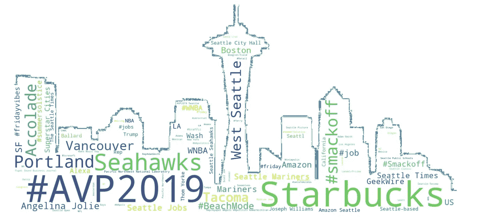
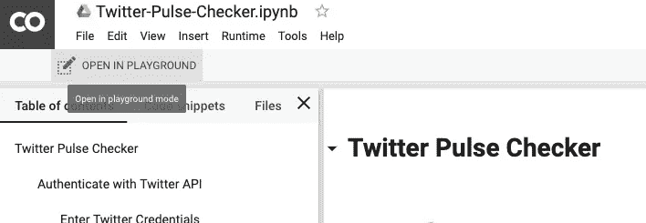
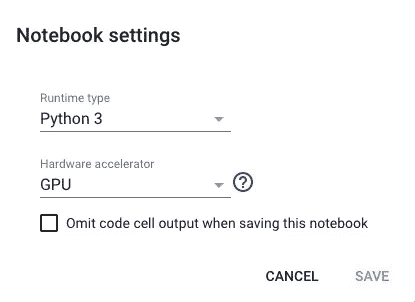
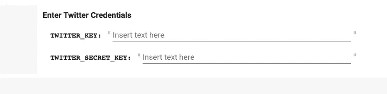
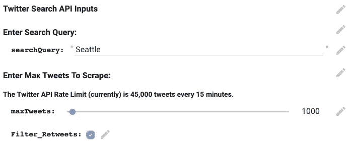
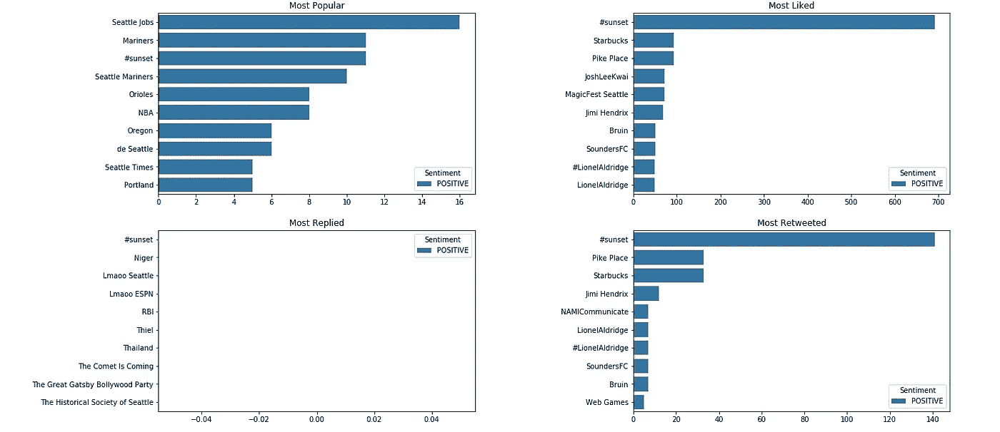
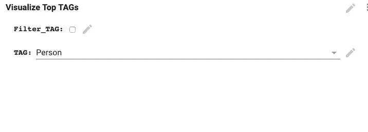
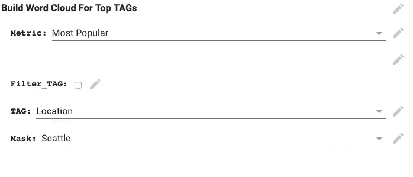

# Twitter Pulse Checker:Twitter 上用于数据科学的交互式 Colab 笔记本

> 原文：<https://towardsdatascience.com/twitter-pulse-checker-an-interactive-colab-notebook-for-data-sciencing-on-twitter-76a27ec8526f?source=collection_archive---------14----------------------->

What’s popping in Seattle? Original background image: [http://clipart-library.com/clipart/2099977.htm](http://clipart-library.com/clipart/2099977.htm)

想用 Twitter 数据进行奇特的数据科学研究吗？

我创建了一个交互式的 Google Colab，它可以带你浏览一个选定主题的端到端趋势分析。

Colab 是一个很棒的(也很少被使用的)工具，它的表单功能可以让你创建一个很棒的类似于应用程序的 UX 体验，同时提供了深入挖掘底层代码的选项。

我在笔记本中使用西雅图作为我的例子，但是它被设置用于任何主题。你可以搜集 twitter 数据，解析标签(NER)，进行情感分析，用情节和文字云将所有好东西可视化。

要直接进入实验室，请点击这里:[https://lnkd.in/ghKzQV4](https://lnkd.in/ghKzQV4)

# 概观

这是一种快速而肮脏的方式来了解 Twitter 上与特定主题相关的趋势。对于我的用例，我关注的是西雅图市，但是您可以很容易地将它应用于任何主题。

笔记本中的代码执行以下操作:

*抓取与你感兴趣的话题相关的推文。
*从文本中提取相关标签(NER:命名实体识别)。
*对这些推文进行情感分析。
*以互动的形式提供了一些可视化效果，以获得正在发生的事情的“脉搏”。

我们使用 Tweepy 收集 Twitter 数据，使用 Flair 进行 NER /情绪分析。我们使用 Seaborn 进行可视化，所有这一切都是可能的，因为有了精彩、免费和快速(使用 GPU)的 Google Colab。

**关于 NER 的一点信息**

这是从文本中提取标签的过程。

所以，举个例句:‘乔治·华盛顿去了华盛顿’。NER 将允许我们提取标签，如“乔治华盛顿的人”和“华盛顿(州)”的位置。它是 NLP 中最常见和最有用的应用之一，使用它，我们可以从推文中提取标签并对它们进行分析。

**关于情感分析的一点看法**

最常见的是，这是一个判断某个文本是正面还是负面的过程。更普遍的是，你可以把它应用到你选择的任何标签上(垃圾邮件/非垃圾邮件等等。).

因此，“我讨厌这部电影”将被归类为负面陈述，而“我喜欢这部电影”将被归类为正面陈述。同样，这是一个非常有用的应用程序，因为它让我们能够了解人们对某些事情的看法(Twitter 话题、电影评论等)。

要了解这些应用程序的更多信息，请查看 Flair Github 主页和教程:[https://github.com/zalandoresearch/flair](https://github.com/zalandoresearch/flair)

# 使用

你显然需要一个谷歌账户才能使用 Colab。您可以通过点击顶部的“在操场上打开”选项来编辑笔记本。我建议在继续之前，将它作为你自己的副本保存在你的 Google Drive 中。

Open in Playground mode and then Save in your drive

**快速提示:**运行单元格的快捷方式是按键盘上的 SHIFT+ENTER。这是很方便的，因为你要穿过很多单元格。

你也应该去笔记本电脑设置，并确保选择了 GPU，因为只有一个 CPU 的刮/分析会变得非常慢。

GPU should be selected

你需要 Twitter API 密匙(当然还有一个 Twitter 账户)来实现这个功能。在这里报名就能拿到:【https://developer.twitter.com/en/apps 

一旦有了 API 密钥和 API 秘密密钥，就可以将这些凭证输入到身份验证单元中，并运行整个笔记本。

Enter your Twitter API Keys here

# 获取数据

一旦通过认证，您就可以开始刮！输入您感兴趣的搜索词和要推送的推文。我们每 15 分钟最多可以使用 API 抓取 45，000 条推文，因此滑块允许您选择这个限制。

您可以选择是否要过滤掉转发。我选择过滤掉它们，专注于原始推文。

一旦我们收集了推文，我们就把它们加载到熊猫的数据框架中。在这里，我们做一些切片和切块，为一些视觉效果做好准备。

# NER 和情感分析

我们使用 NER 提取相关标签:人、组织、位置等。

因为 Flair 不具备处理标签的能力，所以我们为它们创建了一个自定义标签。

最后，我们创建了一个数据框架，其中我们将所有标签按照它们的流行度、喜欢、回复、转发指标进行分组。

我们还计算这些标签的平均极性(情感得分)。

# 视觉化！

我们为最受欢迎的、喜欢的、回复的、转发的标签创建一些基本的情节。我们也用感情来切割这个。

What’s hot in Seattle today?

该单元格设置为允许您按标签过滤。

我们可以选中 Filter_TAG 框，然后选择我们想要度量的标记。然后，我们简单地重新运行单元以获得刷新的图。

# 词云

我承认我花了太多的时间来设置背景蒙版，但是它看起来很酷！

你可以选择你所选择的面具(如果你喜欢马或者出于某种原因做马的分析，就选一匹马…)。

我选择了西雅图，并用这个掩码生成了一个单词云(如顶部的第一幅图所示)。

希望这能给你的数据项目一个好的开始。Colab 设置为以最少的输入运行，但是如果您想深入研究并根据您的需要定制它，代码就在那里。这就是笔记本的魅力。

你可以从这里开始玩笔记本:【https://lnkd.in/ghKzQV4】T4