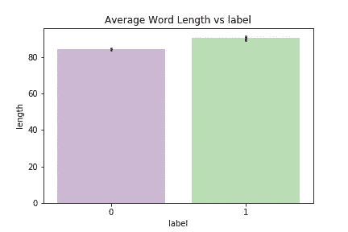
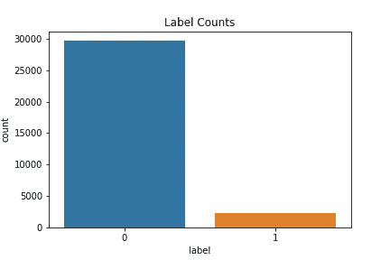
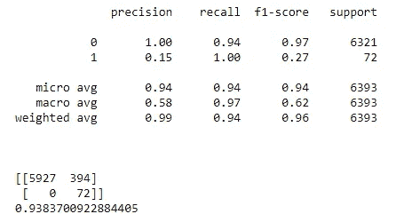

# 使用 NLTK、Python 的 Twitter 情感分析

> 原文：<https://towardsdatascience.com/twitter-sentiment-analysis-classification-using-nltk-python-fa912578614c?source=collection_archive---------2----------------------->

自然语言处理(NLP)是机器学习的一个独特子集，它关注现实生活中的非结构化数据。尽管计算机不能识别和处理字符串输入，但是 NLTK、TextBlob 和许多其他库找到了一种用数学方法处理字符串的方法。Twitter 是一个平台，大多数人在这里表达他们对当前环境的感受。作为人类，我们可以猜测一个句子的情绪是积极的还是消极的。同样，在本文中，我将向您展示如何使用 python 和 NLP 库来训练和开发一个简单的 Twitter 情感分析监督学习模型。

让我们从导入这个项目所需的库开始。

由于这是一个监督学习任务，我们得到了一个由标有“1”或“0”的推文组成的训练数据集和一个没有标签的测试数据集。训练和测试数据集可以在[这里](https://github.com/MohamedAfham/Twitter-Sentiment-Analysis-Supervised-Learning/tree/master/Data)找到。

*   标签“0”:积极情绪
*   标签“1”:消极情绪

现在我们用熊猫来读数据。

```
train_tweets = pd.read_csv('train_tweets.csv')
test_tweets = pd.read_csv('test_tweets.csv')
```

## 探索性数据分析

无论在哪个领域，对机器学习问题进行数据分析都是必要的。让我们做一些分析，以获得一些见解。

```
sns.barplot('label','length',data = train_tweets,palette='PRGn')
```



```
sns.countplot(x= 'label',data = train_tweets)
```



上面两张图告诉我们，给定的数据是不平衡的，只有很少数量的“1”标签，推文的长度在分类中没有起主要作用。处理不平衡数据是一个单独的部分，我们将尝试为现有的数据集生成一个最佳模型。

## 数据预处理和特征工程

给定的数据集由非常多的非结构化 tweets 组成，应该对其进行预处理以建立 NLP 模型。在这个项目中，我们尝试了以下预处理原始数据的技术。但是预处理技术不受限制。

*   删除标点符号。
*   删除常用词(停用词)。
*   文字规范化。

**标点符号**在 NLP 中总是一个干扰，特别是标签和“@”在 tweets 中扮演主要角色。TextBlob 从句子中提取单词的功能可以在最佳水平上删除标点符号。遗漏的标点符号和其他不常见的符号将在即将到来的预处理技术中删除。

**在 NLP 任务中，停用词**(最常见的词，例如:is，are，have)在学习中没有意义，因为它们与情感没有联系。因此，去除它们既节省了计算能力，又提高了模型的准确性。

所有不常见的符号和数值都被删除，并返回一个包含单词的纯列表，如上所示。但是我们仍然会遇到同一个词的多种表达。(例如:play，plays，played，playing)尽管单词不同，但它们给我们带来的意思和正常单词“play”一样。所以我们需要做**词汇规范化**的方法来解决这个问题。NLTK 内置的 WordNetLemmatizer 就做到了这一点。

现在我们已经完成了我们的文本预处理部分，我们将进入矢量化和模型选择。

## 矢量化和模型选择

在让我们的数据训练之前，我们必须用数字表示预处理过的数据。自然语言处理中比较著名的单词矢量化技术有:CountVectorization 和 Tf-IDF 变换。让我们深入了解一下这些矢量化技术的理论背景。

**计数矢量化**生成一个代表文档中所有单词的[稀疏矩阵](https://en.wikipedia.org/wiki/Sparse_matrix)。计数矢量化的演示如下所示:


Demonstration of Count Vectorization

*   **Tf(d，t)** (术语频率)定义为术语 t 在文档 d 中的出现次数。
*   **Idf(t)** (频率的逆文档)定义为 log(D/t)，其中 D:文档总数，t:带项的文档数。

**Tf-Idf** transformer 做的是返回 **Tf** 和 **Idf** 的乘积，也就是该项的 **Tf-Idf** 权重。

因此，我们现在已经将我们的 sting 数据矢量化为数值，以便将其输入到机器学习算法中。我们选择**朴素贝叶斯分类器**进行二进制分类，因为它是 NLP 中最常用的算法。此外，我们使用 scikit-learn 内置的机器学习流水线技术来预定义算法的工作流程。这节省了大量时间和计算能力。

## 模型验证

因为我们决定选择自然语言处理技术，所以在应用于测试数据集之前，我们必须用现有的训练数据集来验证它。我们将使用传统的 train_test_split 技术来分割测试大小为 0.2 的训练数据集，并让我们的管道模型在分割的数据集上得到验证。一旦我们对验证的准确性感到满意，我们就可以将获得的模型应用于测试数据集。使用 scikit-learn、混淆矩阵和分类报告的内置功能来测量准确度。



Output of the above code

对于我们的简单管道模型，获得了 0.93837 的精度。请注意，通过使用 GridSearchCV 和其他预处理技术调整参数，有机会提高这种准确性。

希望这篇文章给你一个用 NLTK 和 Python 进行情感分析的基本概念。此处提供了该项目的完整笔记本[。](https://github.com/MohamedAfham/Twitter-Sentiment-Analysis-Supervised-Learning)

下面是一些有用的链接，可以帮助我们开始使用我们在这个项目中使用的自然语言处理库:

*   [NLTK 书籍](https://www.nltk.org/book/):分析文本的完整指南
*   [文本斑点处理](https://textblob.readthedocs.io/en/dev/)
*   [在 scikit 中处理文本数据-学习](https://scikit-learn.org/stable/tutorial/text_analytics/working_with_text_data.html)
*   [monkey learn 的情感分析指南](https://monkeylearn.com/sentiment-analysis/)