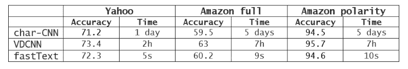
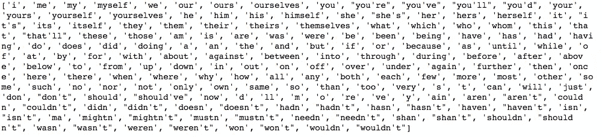
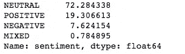
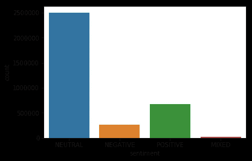

# 使用 fastText 的 Twitter 情感分析

> 原文：<https://towardsdatascience.com/twitter-sentiment-analysis-using-fasttext-9ccd04465597?source=collection_archive---------6----------------------->

在这篇博客中，我们将使用一个快速文本库来分析各种推文的情绪，该库易于使用和快速训练。


Twitter sentiment analysis

# 什么是 fastText？

FastText 是由脸书人工智能开发的自然语言处理库。这是一个开源、免费、轻量级的库，允许用户学习文本表示和文本分类器。它在标准的通用硬件上工作。模型可以缩小尺寸，甚至适合移动设备。

# 为什么选择 fastText？

深度神经网络模型的主要缺点是它们需要大量的时间来训练和测试。在这里，fastText 有一个优势，因为它只需要很少的时间来训练，并且可以在我们的家用电脑上高速训练。

根据 fastText 上的[脸书人工智能博客](https://research.fb.com/fasttext/)的说法，这个库的准确性与深度神经网络相当，并且只需要很少的时间来训练。



comparison between fastText and other deep learning based models

现在，我们知道了 fastText 以及我们为什么使用它，我们将看到如何使用这个库进行情感分析。

# 获取数据集

我们将使用 betsentiment.com 的[上可用的数据集。推文有四个标签，分别是正值、负值、中性和混合型。我们会忽略所有带有混合标签的推文。](https://betsentiment.com/resources/dataset/english-tweets)

我们将使用团队 tweet 数据集作为训练集，而球员数据集作为验证集。

# 清洗数据集

正如我们所知，在训练任何模型之前，我们需要清理数据，在这里也是如此。

## 我们将根据这些规则清理推文:

1.  移除所有标签，因为标签不会影响情绪。
2.  删除提及，因为它们在情感分析中也不重要。
3.  将任何表情符号替换为它们所代表的文本，作为表情符号或表情符号在代表一种情绪方面发挥着重要作用。
4.  用完整的形式代替收缩。
5.  删除推文中出现的任何 URL，因为它们在情感分析中并不重要。
6.  删除标点符号。
7.  修复拼写错误的单词(非常基础，因为这是一个非常耗时的步骤)。
8.  将所有内容转换为小写。
9.  删除 HTML 标签(如果有)。

## 清理推文的规则:

我们将清理这条推文

```
tweet = '<html> bayer leverkusen goalkeeeeper bernd leno will not be #going to napoli. his agent uli ferber to bild: "I can confirm that there were negotiations with napoli, which we have broken off. napoli is not an option." Atletico madrid and Arsenal are the other strong rumours. #b04 #afc </html>'
```

## 删除 HTML 标签

有时 twitter 响应包含 HTML 标签，我们需要删除它。

为此，我们将使用`[Beautifulsoup](https://www.crummy.com/software/BeautifulSoup/bs4/doc/)` [包](https://www.crummy.com/software/BeautifulSoup/bs4/doc/)。

如果没有 HTML 标签，那么它将返回相同的文本。

```
tweet = BeautifulSoup(tweet).get_text()#output
'bayer leverkusen goalkeeeeper bernd leno will not be #going to napoli. his agent uli ferber to bild: "I can confirm that there were negotiations with napoli, which we have broken off. napoli is not an option." Atletico madrid and Arsenal are the other strong rumours. #b04 #afc'
```

我们将使用正则表达式来匹配要删除或要替换的表达式。为此，将使用`[re](https://docs.python.org/3/library/re.html)` [包](https://docs.python.org/3/library/re.html)。

## 移除标签

Regex `@[A-Za-z0-9]+`代表提及次数，`#[A-Za-z0-9]+`代表标签。我们将用空格替换匹配这个正则表达式的每个单词。

```
tweet = ' '.join(re.sub("(@[A-Za-z0-9]+)|(#[A-Za-z0-9]+)", " ", tweet).split())#output
'bayer leverkusen goalkeeeeper bernd leno will not be to napoli. his agent uli ferber to bild: "I can confirm that there were negotiations with napoli, which we have broken off. napoli is not an option." Atletico madrid and Arsenal are the other strong rumours.'
```

## 删除 URL

Regex `\w+:\/\/\S+`匹配所有以 http://或 https://开头并用空格替换的 URL。

```
tweet = ' '.join(re.sub("(\w+:\/\/\S+)", " ", tweet).split())#output
'bayer leverkusen goalkeeeeper bernd leno will not be to napoli. his agent uli ferber to bild: "I can confirm that there were negotiations with napoli, which we have broken off. napoli is not an option." Atletico madrid and Arsenal are the other strong rumours.'
```

## 删除标点符号

用空格替换所有标点符号，如`.,!?:;-=`。

```
tweet = ' '.join(re.sub("[\.\,\!\?\:\;\-\=]", " ", tweet).split())#output 
'bayer leverkusen goalkeeeeper bernd leno will not be napoli his agent uli ferber to bild "I can confirm that there were negotiations with napoli which we have broken off napoli is not an option " Atletico madrid and Arsenal are the other strong rumours'
```

## 小写字母盘

为了避免大小写敏感问题

```
tweet = tweet.lower()#output
'bayer leverkusen goalkeeeeper bernd leno will not be napoli his agent uli ferber to bild "i can confirm that there were negotiations with napoli which we have broken off napoli is not an option " atletico madrid and arsenal are the other strong rumours'
```

## 替换收缩

去掉缩写，翻译成合适的俚语。没有通用的列表来代替缩写，所以我们为了自己的目的制作了这个列表。

```
CONTRACTIONS = {"mayn't":"may not", "may've":"may have",......}tweet = tweet.replace("’","'")
words = tweet.split()
reformed = [CONTRACTIONS[word] if word in CONTRACTIONS else word for word in words]
tweet = " ".join(reformed)#input
'I mayn’t like you.'#output
'I may not like you.'
```

## 修复拼写错误的单词

在这里，我们实际上并没有构建任何复杂的函数来纠正拼写错误的单词，而只是检查每个字符在每个单词中出现的次数是否不超过 2 次。这是一个非常基本的拼写错误检查。

```
tweet = ''.join(''.join(s)[:2] for _, s in itertools.groupby(tweet))#output
'bayer leverkusen goalkeeper bernd leno will not be napoli his agent uli ferber to bild "i can confirm that there were negotiations with napoli which we have broken off napoli is not an option " atletico madrid and arsenal are the other strong rumours'
```

## 替换表情符号或表情符号

由于表情符号和表情符号在表达情感方面发挥着重要作用，我们需要用它们在简单英语中所代表的表达方式来取代它们。

对于表情符号，我们将使用`emoji`包，对于表情符号，我们将建立自己的字典。

```
SMILEYS = {":‑(":"sad", ":‑)":"smiley", ....}words = tweet.split()
reformed = [SMILEY[word] if word in SMILEY else word for word in words]
tweet = " ".join(reformed)#input 
'I am :-('#output
'I am sad' 
```

## 表情符号

表情包返回给定表情的值为`:flushed_face:`，所以我们需要从给定的输出中删除`:`。

```
tweet = emoji.demojize(tweet)
tweet = tweet.replace(":"," ")
tweet = ' '.join(tweet.split())#input
'He is 😳'#output
'He is flushed_face'
```

所以，我们已经清理了我们的数据。

# 为什么不用 NLTK 停用词？

清除数据时，删除停用词是一种有效的方法。它去掉了所有无关紧要的词，通常是每个句子中最常用的词。获取 NLTK 库中存在的所有停用词

```
from nltk.corpus import stopwords
stop_words = stopwords.words('english')
print(stop_words)
```



NLTK stop words

我们可以看到，如果使用 NLTK 停用词，那么所有的负面缩写都将被移除，这在情感分析中起着重要的作用。

# 格式化数据集

需要格式化 fastText 监督学习所需的数据。

[FastText](https://github.com/facebookresearch/fastText/blob/master/README.md#text-classification) 假设标签是以字符串`__label__`为前缀的单词。

fastText 模型的输入应该如下所示

```
__label__NEUTRAL _d i 'm just fine i have your fanbase angry over
__label__POSITIVE what a weekend of football results & hearts
```

我们可以使用以下方式格式化数据

```
def transform_instance(row):
    cur_row = []
    #Prefix the index-ed label with __label__
    label = "__label__" + row[4]  
    cur_row.append(label)
    cur_row.extend(nltk.word_tokenize(tweet_cleaning_for_sentiment_analysis(row[2].lower())))
    return cur_rowdef preprocess(input_file, output_file):
    i=0
    with open(output_file, 'w') as csvoutfile:
        csv_writer = csv.writer(csvoutfile, delimiter=' ', lineterminator='\n')
        with open(input_file, 'r', newline='', encoding='latin1') as csvinfile: # encoding='latin1'
            csv_reader = csv.reader(csvinfile, delimiter=',', quotechar='"')
            for row in csv_reader:
                if row[4]!="MIXED" and row[4].upper() in ['POSITIVE','NEGATIVE','NEUTRAL'] and row[2]!='':
                    row_output = transform_instance(row)
                    csv_writer.writerow(row_output )
                    # print(row_output)
                i=i+1
                if i%10000 ==0:
                    print(i)
```

这里，我们忽略标签不是`Positive, Negative and neutral`的推文。

`nltk.[word_tokenize](https://www.nltk.org/api/nltk.tokenize.html#nltk.tokenize.punkt.PunktLanguageVars.word_tokenize)()`将字符串转换成独立的单词。

```
nltk.word_tokenize('hello world!')#output
['hello', 'world', '!']
```

# 对数据集进行上采样

在我们的数据集中，数据并没有被平均划分到不同的标签中。它包含中性标签中大约 72%的数据。因此，我们可以看到，我们的模型往往会被大班淹没，而忽略小班。

```
import pandas as pd
import seaborn as snsdf = pd.read_csv('betsentiment-EN-tweets-sentiment-teams.csv',encoding='latin1')df['sentiment'].value_counts(normalize=True)*100
```



percentage of tweets for each labels

```
sns.countplot(x="sentiment", data=df)
```



countplot for sentiment labels

由于中性类由数据集的大部分组成，该模型将始终尝试预测中性标签，因为它将保证 72%的准确性。为了防止这种情况，我们需要每个标签有相同数量的推文。我们可以通过向 minor 类添加新的 tweets 来实现这一点。向少数族裔标签添加新推文的过程被称为上采样。

我们将通过一次又一次地重复给定标签中的 tweet 来实现上采样，直到每个标签中 tweet 的数量相等。

```
def upsampling(input_file, output_file, ratio_upsampling=1):
    # Create a file with equal number of tweets for each label
    #    input_file: path to file
    #    output_file: path to the output file
    #    ratio_upsampling: ratio of each minority classes vs majority one. 1 mean there will be as much of each class than there is for the majority class 

    i=0
    counts = {}
    dict_data_by_label = {}# GET LABEL LIST AND GET DATA PER LABEL
    with open(input_file, 'r', newline='') as csvinfile: 
        csv_reader = csv.reader(csvinfile, delimiter=',', quotechar='"')
        for row in csv_reader:
            counts[row[0].split()[0]] = counts.get(row[0].split()[0], 0) + 1
            if not row[0].split()[0] in dict_data_by_label:
                dict_data_by_label[row[0].split()[0]]=[row[0]]
            else:
                dict_data_by_label[row[0].split()[0]].append(row[0])
            i=i+1
            if i%10000 ==0:
                print("read" + str(i))# FIND MAJORITY CLASS
    majority_class=""
    count_majority_class=0
    for item in dict_data_by_label:
        if len(dict_data_by_label[item])>count_majority_class:
            majority_class= item
            count_majority_class=len(dict_data_by_label[item])  

    # UPSAMPLE MINORITY CLASS
    data_upsampled=[]
    for item in dict_data_by_label:
        data_upsampled.extend(dict_data_by_label[item])
        if item != majority_class:
            items_added=0
            items_to_add = count_majority_class - len(dict_data_by_label[item])
            while items_added<items_to_add:
                data_upsampled.extend(dict_data_by_label[item][:max(0,min(items_to_add-items_added,len(dict_data_by_label[item])))])
                items_added = items_added + max(0,min(items_to_add-items_added,len(dict_data_by_label[item])))# WRITE ALL
    i=0with open(output_file, 'w') as txtoutfile:
        for row in data_upsampled:
            txtoutfile.write(row+ '\n' )
            i=i+1
            if i%10000 ==0:
                print("writer" + str(i))
```

至于重复推文，一次又一次，可能会导致我们的模型过度适应我们的数据集，但由于我们的数据集很大，这不是一个问题。

# 培养

尝试用 [git 克隆](https://github.com/facebookresearch/fastText/tree/master/python#building-fasttext)安装 fastText，而不是使用 pip。

我们将使用监督训练法。

```
hyper_params = {"lr": 0.01,
                "epoch": 20,
                "wordNgrams": 2,
                "dim": 20}     

        print(str(datetime.datetime.now()) + ' START=>' + str(hyper_params) )# Train the model.
        model = fastText.train_supervised(input=training_data_path, **hyper_params)
        print("Model trained with the hyperparameter \n {}".format(hyper_params))
```

`lr`代表`learning rate`，`epoch`代表`number of epoch`，`wordNgrams`代表`max length of word Ngram`，`dim`代表`size of word vectors`。

`train_supervised`是用于使用监督学习来训练模型的函数。

# 评价

我们需要评估这个模型以确定它的准确性。

```
model_acc_training_set = model.test(training_data_path)
model_acc_validation_set = model.test(validation_data_path)

# DISPLAY ACCURACY OF TRAINED MODEL
text_line = str(hyper_params) + ",accuracy:" + str(model_acc_training_set[1])  + ",validation:" + str(model_acc_validation_set[1]) + '\n' print(text_line)
```

我们将在训练和验证数据集上评估我们的模型。

`test`返回模型的精度和召回率，而不是精度。但是在我们的例子中，两个值几乎相同，所以我们只使用精度。

总的来说，该模型对训练数据给出了 97.5%的准确度，对验证数据给出了 79.7%的准确度。

# 预测

我们将预测传递给我们训练好的模型的文本的情感。

```
model.predict(['why not'],k=3)
model.predict(['this player is so bad'],k=1)
```

`predict`让我们预测传递的字符串的情感，而`k`代表返回的带有置信度得分的标签的数量。

# 量化模型

量化有助于我们降低模型的规模。

```
model.quantize(input=training_data_path, qnorm=True, retrain=True, cutoff=100000)
```

# 保存模型

我们可以保存训练好的模型，然后随时使用，而不是每次都训练它。

```
model.save_model(os.path.join(model_path,model_name + ".ftz"))
```

# 结论

我们学习如何清理数据，并将其传递给训练模型来预测推文的情绪。我们还学习使用 fastText 实现情感分析模型。