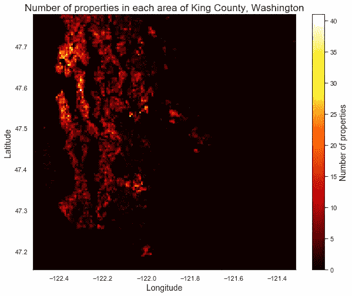
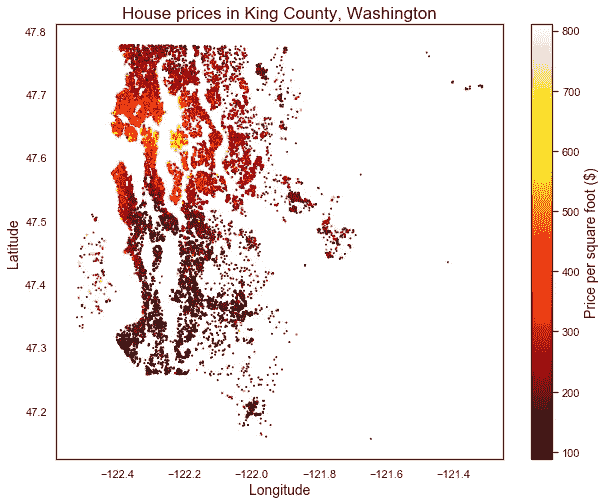

# 利用 Python 的 matplotlib 可视化空间数据

> 原文：<https://towardsdatascience.com/two-dimensional-histograms-and-three-variable-scatterplots-making-map-like-visualisations-in-7f413955747?source=collection_archive---------14----------------------->

## 在 matplotlib 中制作类似地图的可视化效果

# 为什么要对空间数据使用 matplotlib？

作为预测房价项目的一部分，我收到了一个来自美国华盛顿州金县的大型房屋数据集。该数据集包含大量与房屋相关的数据，包括一年内售出的每栋房屋的经度和纬度。因为纬度和经度都是连续的数字数据，所以在多元线性回归模型中，这些是潜在有用的特征。然而，甚至在项目进行到那个阶段之前，在数据集中看到纬度和经度就表明您也可以看到令人兴奋的空间数据制图世界。

确实存在一些免费或低价的基于 GUI 的电子表格程序，具有半功能地图功能——从笨重的 Excel Power Map，到有限的 Google My Maps，再到可悲的即将停产的 Google Fusion Tables。然而，只需几行代码，您就可以使用 Python 更快地创建信息丰富的类似地图的可视化效果，并且有更多的定制选项。你甚至不需要专门的地理空间分析库的知识就可以做到这一点——只要你的数据集中有纬度和经度，你就可以使用每个人都喜欢的绘图伙伴 matplotlib 来可视化它。

# 二维直方图

直方图是可视化数据集中变量分布的一种很好的方式，它显示数据集中位于特定值范围或区间的条目数量。下面的代码为 King County ('kc ')数据集中的纬度和经度生成简单的(一维)直方图:

```
import matplotlib.pyplot as pltfig, (ax1, ax2) = plt.subplots(1, 2, figsize=(12, 5))fig.suptitle(‘Distributions of latitude and longitude in the King County housing dataset’, fontsize=16)ax1.hist(kc.lat)ax1.set_xlabel(‘Latitude’, fontsize=13)ax1.set_ylabel(‘Frequency’, fontsize=13)ax2.hist(kc.long)ax2.set_xlabel(‘Longitude’, fontsize=13)ax2.set_ylabel(‘Frequency’, fontsize=13);
```


这些很好地显示了每个变量的分布，但是它们并没有给你一种地理上的感觉。我们想要的是一张地图。幸运的是，我们可以用二维直方图来实现这一点。这实质上是将沿 x 轴(经度)的直方图与沿 y 轴(纬度)的直方图相结合。不再是条的宽度(即一维)，它们现在基本上是一个网格(即二维的正方形)。我们可以添加一个带有`plt.colorbar()`的颜色条，帮助我们将它可视化为一种热图:

```
plt.figure(figsize = (10,8))plt.hist2d(kc.long, kc.lat, bins=150, cmap=’hot’)plt.colorbar().set_label(‘Number of properties’)plt.xlabel(‘Longitude’, fontsize=14)plt.ylabel(‘Latitude’, fontsize=14)plt.title(‘Number of properties in each area of King County, Washington’, fontsize=17)plt.show()
```



如果你仔细观察，稍微眯着眼睛，你可以分辨出国王郡的形状，西雅图在左上方，还有普吉特湾的形状。


Map of King County, Washington, USA. Source: Google Maps

# 三变量散点图

使用 matplotlib 绘制空间数据的另一种方法是使用散点图。散点图将两个变量之间的关系可视化，一个在 x 轴上，一个在 y 轴上，通过在 x 和 y 变量的值上绘制每个数据点的点。Matplotlib 允许我们更进一步，使用第三个变量根据第三个变量的数据点值来改变每个点的颜色(或形状，或大小)。

King County 数据库包含每栋房屋的销售价格和每栋房屋的居住面积等信息。从上面的 2D 直方图中可以清楚地看到，在西雅图及其周边地区发现了许多房产，但是数据集也包括了远离城市的房产。地段大小可能以非随机方式变化，城市中的地段较小，乡村中的地段较大。因此，比较同类产品的更好方法是比较每平方英尺的价格。

在该散点图中，绘制了经度和纬度，并根据每平方英尺的价格对各点进行了着色，从而生成了一张地图，显示了每个地区的价格:

```
plt.figure(figsize = (10,8))plt.scatter(kc.long, kc.lat ,c=kc.price_per_sqft, cmap = ‘hot’, s=1)plt.colorbar().set_label(‘Price per square foot ($)’, fontsize=14)plt.xlabel(‘Longitude’, fontsize=14)plt.ylabel(‘Latitude’, fontsize=14)plt.title(‘House prices in King County, Washington’, fontsize=17)plt.show()
```



毫不奇怪，最昂贵的房产(以每平方英尺的价格计算)位于贝尔维尤和麦地那——科技亿万富翁比尔·盖茨和杰夫·贝索斯的家，以及美国一些最昂贵的邮政编码。

这就是我们使用 matplotlib 创建类似地图的可视化的两种方法。下次当您发现自己拥有包含纬度和经度的数据集时，为什么不尝试一下呢！