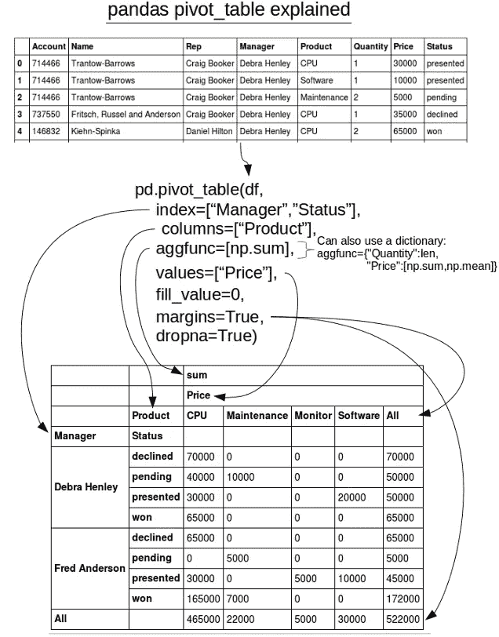
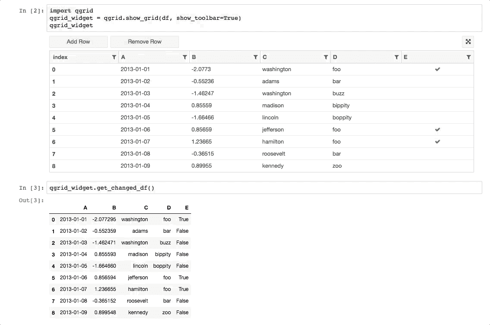

# 两个基本的熊猫附加产品

> 原文：<https://towardsdatascience.com/two-essential-pandas-add-ons-499c1c9b65de?source=collection_archive---------3----------------------->

## 这两个必备的用户界面将帮助你提高你的熊猫技能


Python 数据分析库(Pandas)是 Python 事实上的分析工具。如此强大的分析库居然可以开源免费使用，这还是让我很惊讶。

但它并不完美…


Yes Pandas does have *some shortcomings*

我对这个库有一些不满，尤其是在执行简单的过滤和旋转时。在某些情况下，用户界面确实可以加速分析。对于探索和过滤数据的直观方式来说，没有什么比“拖放”更好的了，而这不是 Pandas 允许你做的事情。令人欣慰的是，有两个图书馆解决了这些问题，并与熊猫完美地合作。

## [Pivottable.js](https://github.com/nicolaskruchten/jupyter_pivottablejs) ，交互式数据透视表和图表

Pandas 中的数据透视表非常强大，但它并不适合快速简单的数据浏览。事实上，事情会很快变得非常复杂:



Pandas pivot tables can leave you scratching your head. Credit [https://pbpython.com](https://pbpython.com/)

谢天谢地，有一个奇妙的交互式数据透视表和绘图插件，[](https://github.com/nicolaskruchten/jupyter_pivottablejs)****。**它可以用 4 行代码安装和运行:**

```
!pip install pivottablejs
from pivottablejs import pivot_uipivot_ui(df,outfile_path=’pivottablejs.html’)
HTML(‘pivottablejs.html’)
```

**这给了你一个交互式的 HTML 数据透视图。这可以在笔记本中显示，也可以在浏览器中以 HTML 文件的形式打开(这样可以方便地与他人共享):**

****

**pivottable.js allows for interactive pivoting and charting of a Pandas dataframe**

## **QGrid :快速的交互式表格**

**厌倦了看熊猫数据框的第一行和最后 5 行？您是否经常希望能够快速过滤并**查看**您的数据发生了什么？Pandas 使用 *loc* 和 *iloc* 提供了有用的过滤功能，然而，数据透视表同样会变得非常复杂，使用这些索引功能的语句也是如此。**

**QGrid 允许你这样做，甚至更多。一些关键特征是:**

*   **过滤和排序数据帧**
*   **在不降低性能的情况下滚动大型数据帧(超过 100 万行)**
*   **直接通过用户界面编辑数据框中的单元格**
*   **返回应用了过滤器/排序/编辑的新数据帧**
*   **兼容 Jupyter 笔记本和 JupyterLab**

**通过 pip 或 Conda 安装非常简单:**

```
pip install qgrid
jupyter nbextension enable --py --sys-prefix qgridimport qgrid# only required if you have not enabled the ipywidgets nbextension yet
jupyter nbextension enable --py --sys-prefix widgetsnbextension#to show a df simply use the below:
qgrid.show_grid(df)
```

**要了解什么是可能的，请参见 QGrid Github 页面上的以下演示:**

****

**Visit [https://github.com/quantopian/qgrid](https://github.com/quantopian/qgrid) for more information on QGrid**

**仅此而已。希望这两个工具将有助于加快您在 Python 中的数据分析。**

**如果你知道任何其他的熊猫用户界面库，请在下面的评论中告诉人们。**