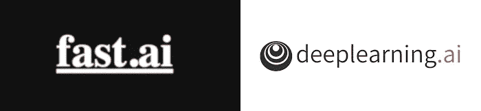
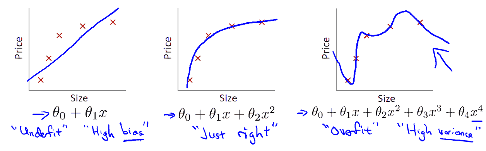
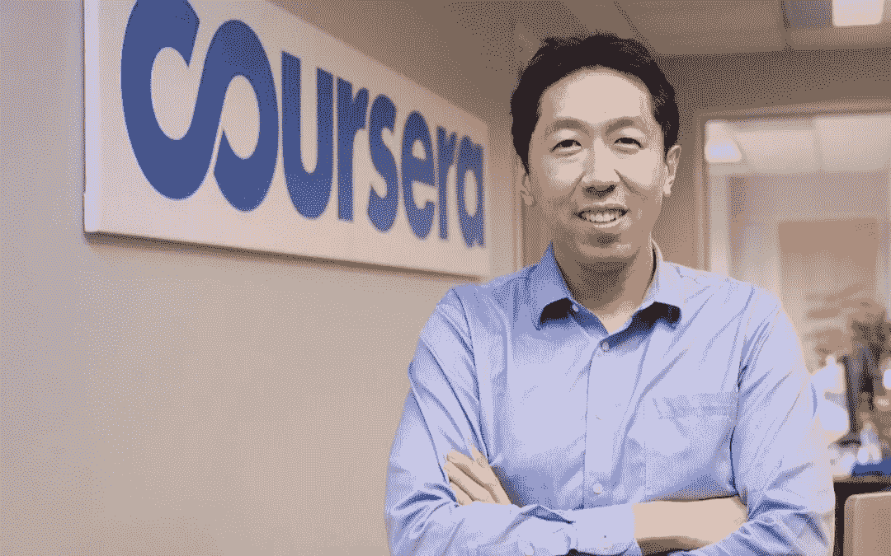
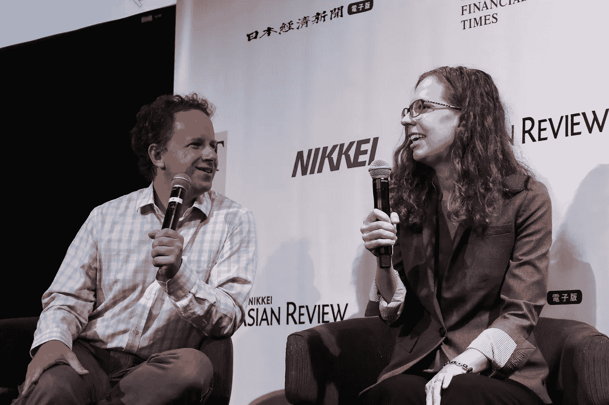

# 一枚硬币的两面:杰瑞米·霍华德的 fast.ai vs 吴恩达的 deeplearning.ai

> 原文：<https://towardsdatascience.com/two-sides-of-the-same-coin-fast-ai-vs-deeplearning-ai-b67e9ec32133?source=collection_archive---------10----------------------->

## 如何不通过同时参加 fast.ai 和 deeplearning.ai 课程来“过度适应”你的人工智能学习

Which One to Take? WHY NOT BOTH!

数据科学和人工智能可能是目前科技领域最热门的话题，这是理所当然的。在应用层面和研究领域都有巨大的突破。这是一种祝福，也是一种诅咒，至少对于想要进入这一领域的学生和爱好者来说是这样。有太多的算法要学习，太多的编码/工程技能要磨练，太多的新论文要跟上，即使你觉得你已经掌握了这门艺术

旅程漫长，学习曲线陡峭，冲突真实存在，但潜力如此之大，人们仍然蜂拥而至。好的一面是，我们也有很棒的教育者和指导者致力于减轻痛苦，让这个过程少一点苛刻，多一点乐趣。我们将探索其中最伟大的两个，并分享一种潜在的有效方法，以帮助您更快乐地在数据科学的海洋中畅游。

# 人工智能学习“耗尽”

Photo by [Toa Heftiba](https://unsplash.com/@heftiba?utm_source=medium&utm_medium=referral) on [Unsplash](https://unsplash.com?utm_source=medium&utm_medium=referral)

如果你列出一个人要成为一名“好的”数据科学家或机器学习工程师需要学习的东西，那可能会长得吓人:

> **数学:**线性代数，微积分，统计学，算法，…
> 
> **编码:** Python，R，SQL/NoSQL，Hadoop，Spark，Tensorflow/PyTorch，Keras，Numpy，Pandas，OpenCV，数据可视化…
> 
> **算法:**线性回归、逻辑回归、支持向量机、PCA、异常检测、协同过滤、神经网络、CNN、RNN、K-Means、NLP、深度学习、强化学习、AutoML、…
> 
> **工程:**命令行，云平台(AWS，GCP，Asure)，DevOps，部署，NGINX/Apache，Docker…

对于一个刚刚进入这个领域的人来说，这份名单很容易让人晕头转向。然而，它仍然只是触及表面。有些人制定了一个雄心勃勃的计划，并投入其中。一些人失去了动力，感觉完全淹没在水下，出口看不见了。哪里出了问题？

# 你“过度适应”了自己

From Andrew Ng’s Machine Learning course

对于了解一点机器学习的人来说，verfitting 是一个非常熟悉的想法。这基本上意味着你的算法学习了“太多”的数据，把自己埋进了数据集的小细节中，错过了大画面。想一想，有时当我们学习一件事情时，我们太投入了，以至于忘记了我们为什么要学习它，以及它将如何融入大局。我称之为“过度适应”你自己的学习。这种情况经常发生在有学术背景的人身上。数学博士倾向于确保在继续下一个之前所有的定理都被完全理解。这对学习数学很有帮助。对理论有深刻的理解会给你很大的直觉和信心。它将使您能够看到未经培训的人不容易看到的模式和问题，但数据科学要求更多。

抛开理论不谈，这其中也有实用的部分。一个恰当应用的算法，加上高效的代码、精心调整的超参数和精心设计的流水线，通常会取得不错的结果，但光有算法是不够的。过于深入地钻研理论，你可能会错过学习的实践部分。同样重要的是，积累如何实施所学知识和处理现实生活中的复杂问题的经验。如何解决这个问题？进入 deeplearning.ai 和 fast.ai 课程。

# Deeplearning.ai 和 Fast.ai

已经开发了很多课程来帮助人们完成学习过程。其中，Deeplearning.ai 和 fast.ai 是两个独特的，它们有自己的方法，可以给我们一些关于学习数据科学的潜在有效方法的见解。

## deeplearning.ai

[deeplearning.ai](https://www.deeplearning.ai/) 是由[吴恩达](https://medium.com/u/592ce2a67248?source=post_page-----b67e9ec32133--------------------------------)开发的付费课程。[和他的其他课程](https://medium.com/datadriveninvestor/thoughts-on-andrew-ngs-machine-learning-course-7724df76320f)一样，它以精心设计的学习曲线、平静流畅的教学风格、充满挑战而又有趣的作业而闻名。它被公认为是一门不会出错的深度学习课程。它从基础理论开始，并逐步发展到如何将所有部分结合起来解决现实生活中的问题。这也被称为“自下而上”的方法。

## fast.ai

fast.ai 由[杰瑞米·霍华德](https://medium.com/u/34ab754f8c5e?source=post_page-----b67e9ec32133--------------------------------)和[雷切尔·托马斯](https://medium.com/u/ee56d0bac1b7?source=post_page-----b67e9ec32133--------------------------------)推出，作为一门免费课程，教授有基本编码经验的人最先进的深度学习技术。在没有太多基础理论解释的情况下，使用很少几行代码，fast.ai 的学生能够在自己的领域内快速取得惊人的成果。(在完成 fast.ai 课程的第一课后，我构建了一个达到 96%准确率的[中国书法风格分类器](https://medium.com/datadriveninvestor/deep-learning-models-by-fast-ai-library-c1cccc13e2b3)和[部署在云上](/how-to-deploy-your-machine-learning-web-app-to-digital-ocean-64bd19ce15e2)。)它首先教你如何解决现实世界的问题，然后越来越深入地探究事物是如何工作的以及为什么工作。这也被称为“自上而下”的方法。

# 哪一个是最好的方法？都是！

那么‘自下而上’和‘自上而下’，哪个更好？我们应该走哪一条？答案是**双双**！

Photo by [Maarten Deckers](https://unsplash.com/@maartendeckers?utm_source=medium&utm_medium=referral) on [Unsplash](https://unsplash.com?utm_source=medium&utm_medium=referral)

看，这两门课程相辅相成。假设你从[吴恩达](https://medium.com/u/592ce2a67248?source=post_page-----b67e9ec32133--------------------------------)的 deeplearning.ai 课程开始，你将自己埋进了无尽的公式和理论中，你获得了很多直觉，但是经过几周的学习，你仍然没有什么可以展示给你的朋友，也不太确定你什么时候可以应用你新获得的知识。你对机器学习基础的研究回报越来越少。你的大脑变慢了，你开始觉得无聊。现在是开始上一两课 fast.ai 课程的最佳时机。在强大的 fast.ai 库和几行代码的帮助下，你将能够构建令人印象深刻的模型来解决现实生活中的问题，甚至击败一些最先进的论文和竞赛。这将给你的大脑一种完全不同的刺激，给你的心更多的信心和激情去更深入地探究为什么一切都在运转。一旦你建立了几个项目，让你的朋友们惊叹不已，你就会更有动力去学习更多的基础知识，然后你就可以回到 deeplearning.ai 课程，并在那里继续学习。这两个过程互相推动，你可以只是冲洗和重复，直到你完成这两个。

> 这就形成了一个完美的学习圈。

Photo by [Dan Freeman](https://unsplash.com/@danfreemanphoto?utm_source=medium&utm_medium=referral) on [Unsplash](https://unsplash.com?utm_source=medium&utm_medium=referral)

以这种方式选修两门课程的最大好处是，一旦你完成了两门课程，你就会做好充分的准备。从 fast.ai 课程到向潜在雇主展示，你有大量的项目，你也对一切如何运作有深刻的了解，甚至发表过一两篇论文来展示你的发现。你现在是一名全面发展的数据科学家。多酷啊。

欢迎任何反馈或建设性的批评。你可以在 Twitter 上找到我，也可以在我的博客网站 wayofnumbers.com T2 找到我。