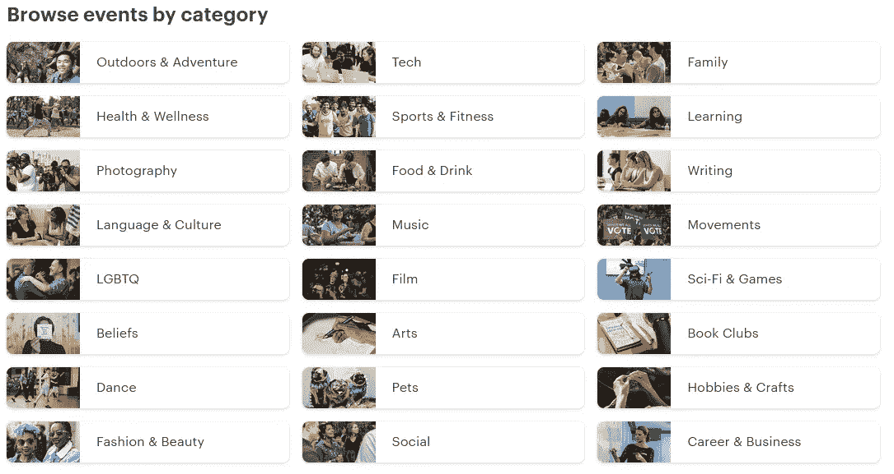

# 关于手工标注数据的两个故事——它仍然有效

> 原文：<https://towardsdatascience.com/two-stories-about-labeling-data-by-hand-it-still-works-fec167d74ac7?source=collection_archive---------21----------------------->

## 当然，这是一个屁股痛，有自己的问题，但人类的大脑仍然是惊人的

我知道。手动标注数据可能会非常乏味，让人麻木。这是你能得到的最迷人、最性感的机器学习工作。作为超级聪明的数据科学家，我们难道不应该超越这种经常强加给实习生、研究生或机械土耳其人的苦差事吗？

事实上，不是。在很多情况下，我认为它比许多涉及无监督学习方法的替代方法更少痛苦(也更快)。它还会产生非常重要的特定领域见解，我认为一名优秀的数据科学家绝对需要在他们选择的行业中保持高效。

[https://xkcd.com/2173/](https://xkcd.com/2173/)

也许是因为十年前我作为数据分析师在这个行业崭露头角，艰难地拼凑出自己的见解。或者可能是因为我的社会科学背景，手动编码回答是我们定量工具箱中非常重要的工具。尽管如此，我不是唯一相信这一点的人。

总的来说，我发现手动分类数据是最有用的，当你陷入这样一种情况时，你需要:1)作为研究人员学习理解数据集/问题空间，2)提出一个分类系统。

在这种情况下，很难制造一个开箱即用的自动化系统。当然，有一些无人监管的方法，你可以尝试各种形式的聚类，然后进行分类，但是当你自己不熟悉问题空间时，你得到的聚类是否有效和可用并不完全明显。既然事实上没有地面真理可言，你也可以在你的头脑和你的分类器中，潜进你自己去建立一些地面真理的表象。

人类的分类器会错吗？绝对的。有无意识(或有意识)的偏见？你打赌。错过重要功能？当然了。但对于我平时操作的应用来说，这些都不重要。我们需要足够好的东西来开始，来建立一个测试用例。一旦事情被引导，我们可以看到事情如何执行并检查问题。

这里有两个 2010 年代早期的说明性故事，当时技术是不同的(但并不完全不同)。

技术提示:我通篇交替使用动词“编码”和“标签”。只是习惯。

# 故事#1，在黑客马拉松上给一些企业分类

2012 年，我参加了某种形式的数据黑客马拉松，我相信是由 [Data Kind](https://www.datakind.org/) 的人与各种政府机构和非营利组织合作举办的。我们分成几个小组，每个小组都有一些需要数据帮助的问题，我们都尽力在几个小时内提供帮助。输出可以是一个模型，或者一个方法，或者任何有用的东西。

对于我的团队，我们与纽约的一家代理机构合作，我忘了是哪家了。我们的任务基本上可以归结为企业的大型 csv 文件和他们拥有的专业许可证(香烟零售商、台球室、讨债、路边咖啡馆、一般供应商等)。这些企业也有他们的注册地址和建筑类型，是否有与该网站相关的餐馆执照或酒类执照，以及其他一些细节。我们的目标是了解企业和执照是如何结合在一起的，这样如果一家企业碰巧丢失了执照(比如说，一家没有执照的酒吧)，就可以标记出来。

我的四五人团队(我觉得？我忘记了一些细节，但有旧数据文件的副本要查看)有许多超级聪明的人，数据科学界的一些名人。首先，他们拿出 R(一种我还不知道的语言)，并开始研究如何摄取我们拥有的各种 CSV 文件，以便他们可以运行各种分析(相似性计算等)。

## 潜入水中

看到他们在工作中有编码的一面，我继续做我通常做的事情，努力通过原始数据获得对事物的感觉，试图让自己在这方面有用。因为我们最终想要的是一种不使用现有的业务分类代码，根据业务实体拥有的许可证对其进行独立分类的方法，所以我有一种预感，我们必须找到一种方法，用我们不应该使用的标签之外的非常非常少的数据对这些业务实体进行分类(因为我们试图预测它以找到差异)。

另一种方法是做一个两步分类系统，我们将 1)把许可证分组在一起，希望企业的属性能够自然地聚类，然后 2)利用聚类并使用它们来形成一个分类器，可以捕获没有正确许可证的企业。这两者都不能保证商业/许可证集群会以任何合理的方式真正形成。只有大约 10k 个许可证(一个给定的企业可能有多个许可证和行)，可能会有太多的干扰。

当我浏览这些企业并试图猜测它们是什么时，奇怪的是，我发现这出奇的容易。我会查看该实体的名称，并会不断地看到类似“弗雷德自助洗衣店”或“阳光咖啡馆”的东西。我意识到虽然没有严格的要求，但人们经常以他们从事的业务来命名他们的商业实体。几乎没有人会开一家名为“玛丽咖啡有限责任公司”的汽车商店。如果没有人坐下来通读大量数据，我们永远不会发现这一点。

我最终做的是编辑一个关键词列表，我觉得这些关键词是某类业务的高度指示，例如:“汽车”、“熟食店”、“Duane”(Duane Reade 连锁药店)、“超市”等..然后，我们分析了哪些许可证与这些词相关联。例如，卷烟零售许可证常常与名称中带有“熟食店”的企业联系在一起，也与“食品”和“市场”联系在一起，偶尔还会与“汽车”联系在一起。下表显示了我们发现的一些关联。

The number of business entities w/ a word in its name (top row) vs business licenses associated (down the left)

到这一步时，我们的时间有点紧，但我们本质上构建的是一个系统，它可以接受一个企业名称，并生成它可能拥有的许可证列表。它不会对所有东西进行分类，但它是一种比其他可用功能(如地址、建筑类型(两个家庭与电梯合作公寓等)、零售面积)更强大的将企业聚集在一起的方式。

有了这个初始分类，我们就可以试验其他特征，看看是否有任何有意义的聚类，因为我们已经半手工标记了数以千计的企业。这是我们(相当)坚定的基础事实，允许我们利用数据集的其余部分。

可悲的是，数据黑客马拉松很快就结束了，我不知道这个模型发生了什么，不管它是否被使用过。但希望它能帮助某人更接近目标。

# 故事#2，为 Meetup 创建一些组类别

我不记得这个项目是什么时候出现的了，但是大概是在 Meetup 第一次尝试在直接关键词搜索之外进行群体发现的时候，大概是 2012 年左右吧？自从我帮助建立这个系统以来，他们的分类已经发生了很大的变化，所以我确信这与现有的系统没有任何关系，在这里谈论应该是安全的。

作为背景，在 2011 年之前，Meetup 群组最初有多达 15 个“主题**”**与之相关联。这些影响了当你的组被宣布时什么用户会得到通知，你可以用它来浏览组。疯狂的是，**主题是完全自由形式的用户字符串，由组组织者**创建。有一些轻微的监管，以防止人们使用顽皮的词语，但除此之外，你可以自由地写下像“摄影”这样的单个单词或像“晚上拍奶酪汉堡的照片”这样的完整句子。

问题是，虽然大多数类型的小组通常都有一个主导主题，就像大多数摄影小组使用“摄影”一样，但并不是所有的小组都这样做。这在“全职妈妈”组和“全职爸爸”组中最为突出，这两个组本质上都是育儿组，但一个组可能只选择一个。

好吧，如果我们要有一个更好的方法来找到群体，就需要有一种方法通过某种类别来组织群体。我们需要将 1-15 个主题标签提取到 1 个(也许 2 个)类别中。这些类别应该是什么？虽然新创建的组无论如何都要经过人工审核，并且可以在那里进行人工分类，但是我们如何处理大约 10 万个现有的组呢？

盲目地来看这个问题，你可能会试图分析和 k-means 聚类所有的主题字符串，基于什么组使用它们。因为我们知道我们希望 K 是一个“可管理的数字”(低于 30 岁)，所以它可能会起作用。这可能需要一些调整和反复试验，但听起来可行。

## 这个计划

我没有采用 k-means 方法，而是走了一个不同的方向。凭直觉工作(深入研究 Meetup 的内部数据 2-3 年)，我有一种感觉，“最常用的主题可能已经足够有信息了”，这意味着我可以忽略主题的超长尾巴。

因此，我转而抛弃了所有与超过一定数量的群组相关联的主题(超过 50 个群组或者类似的，我忘了)。这产生了一个大约 1800 个主题的列表，相比之下，一个巨大的列表包含超过 15k 个主题字符串。

在那之后，我和我的犯罪定性研究伙伴谈了谈，我们分开了数据集，然后坐下来用手对主题进行分类。就像编码自由形式的调查回答一样，我们创建了我们认为合适的类别，并努力通过。

创建映射后，我创建了一个非常简单的算法来给一个组分配一个类别，1 个分类主题=一个类别的 1 票，投票最多的类别就是该组的类别。仅用这种简单的算法，我们就覆盖了大约 85-90%的现有群体。对一组随机样本进行的抽样检查显示，这些类别总体上相当准确(我忘记了细节，但与人类的一致性达到了 90%左右)。

我们如何处理无法以这种方式分类的~ 10–15k 组？我们为它制作了一个简单的网络工具，并要求客户支持团队中的每个人在他们轮班的安静时间里对它进行整理。对所有东西进行分类并不需要很长时间，可能需要 1-2 周的时间。

接下来，我们使用相同的算法来建议类别应该是什么，但是支持团队无论如何都会在审查新组的 TOS/质量时检查并更改它。

我确信他们现在使用的系统和我很久以前帮助建立的系统是不同的。当前类别似乎修复了我们在 v1 中发现的一些问题。例如，我们最初的遗憾之一是某些类别“太大”，太多的商业/创业/企业家/投资团体都被归为“商业”一类。我们应该回去平衡事情，但是我们选择不这样做，因为我们不确定类别在那个时候会如何被使用。

Meetup’s current categories (2019), about half of which weren’t ones I put together almost a decade ago

# 所以卷起你的袖子

想试试吗？这里有一些快速提示。

建立一个良好的编码环境。贴标签的行为应该让你进入一个流程，在那里你可以快速制作出准确的标签。当你最大限度地减少点击链接或眼睛在屏幕上跳来跳去的摩擦时，你就帮助最大限度地减少了引入非受迫性错误的精神疲劳。然后，当你感到疲劳时，确保经常休息(我喜欢吃零食)。

如果你有多个编码员，确保每个人都同意用相似的方式编码(更正式的说法是你有一本编码书)，经常交流，检查你的工作。对于更严格的东西，确保你做了健全的交叉检查，并检查了[评分者之间的可靠性](https://en.wikipedia.org/wiki/Inter-rater_reliability)。

最后，想办法把工作分散开来。在团队环境中，编程更有趣。我们可以就奇怪的例子交换笑话，或者在飞行中讨论奇怪的边缘案例。另外，有另一个人和你一起工作有助于集中注意力。

# 但是，这不会扩展！

当然，如果你有 5000 万件事情要编码，你不会手工去做所有的事情。但是从 500 个到 5000 个，甚至到 15000 个标记条目将使你制作的任何分类器表现得更好。然后，您应该能够比以前更有信心地扩大规模。

希望我的小故事能让你相信，手动标注数据这种完全不性感、时常令人头脑麻木和痛苦的工作是你工具箱中的一个超级有用的工具。