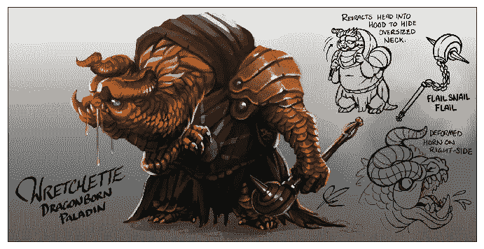
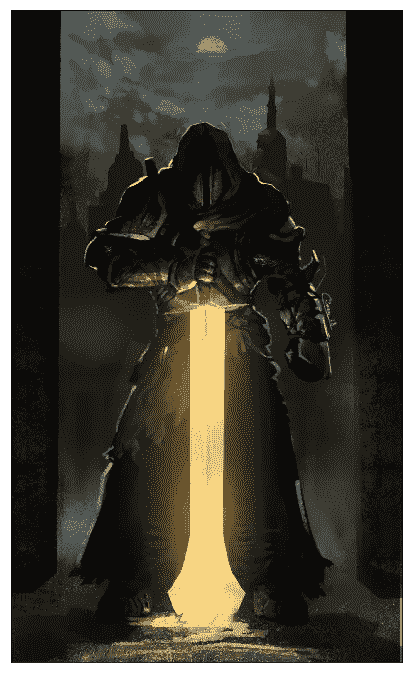
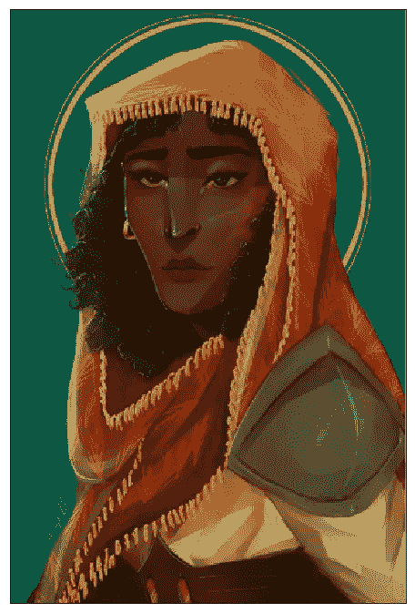
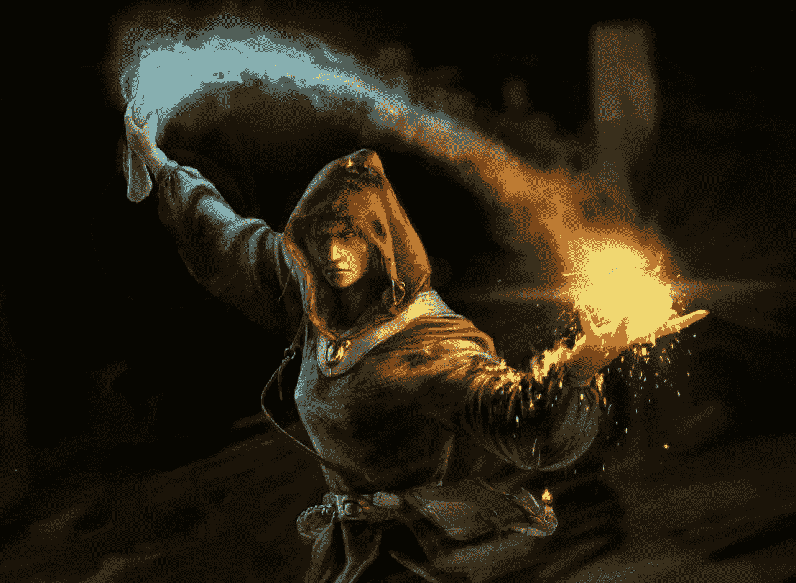

# 两个任务，两个数据集，一个网络:DnD 的多任务学习

> 原文：<https://towardsdatascience.com/two-tasks-two-datasets-one-network-multi-task-learning-with-dnd-eaef00b5e741?source=collection_archive---------12----------------------->

elf/human (.95), rogue (.65). [HERE](/two-tasks-two-datasets-one-network-multi-task-learning-with-dnd-eaef00b5e741?source=friends_link&sk=113c9f9d9180a577e055242be6fb6bd2) is a link to view for free if you like

这篇文章的动机是我在 Shoprunner 的实际工作中一直试图解决的问题。对于上下文，我负责对不断增长的类别进行建模，我们可能永远不会有一个我们想要建模的事物的完整列表。因此，建立一个数据集来统治所有这些被我们需要的所有类别完全标记的数据并不特别可行。虽然这可以在物理上实现，但存在许多风险，例如新的类别在统一数据集中表现不足，然后我们必须用所有以前的类别标记一个全新的数据集。此外，它可能只是花费一堆额外的钱。

有很多解决方案，我会考虑部分解决方案，如建立一堆特定类别的模型并部署这些模型，或者继续寻找用一个数据集来统治所有模型的方法。

构建和部署单个模型似乎很容易，直到从现在起一年内您必须维护几十个模型，这时您可以使用单个模型来完成相同的任务。因此，如果能用一个单一的多任务网络解决所有这些问题，那就更好了。

为了继续追求“一个数据集来统治所有路径”，我一直在建立针对特定类别训练的较小模型，并使用这些模型来标记更大的图像池，以创建大型完全标记的数据集。然而，这个过程需要手动检查类别来测量清洁度，并且存在许多与保持完全标记的数据集的清洁度相关的问题。对我来说，这是一个权宜之计，可能很难维持。

对我来说，我真正需要的是一种训练多任务模型的方法，可以灵活地为单个任务使用多个数据集。

Dragonborn (.96) Paladin/Warrior (.91). When I looked at this image in my jupyter notebook I was confused as to what it was… then I saw the race and class was written on it. Gogo model I guess? The only label this image would have in the dataset was “dragonborn” so the model gets paladin right which is cool.

# 背景:滚动历史检查

能够使用多个数据集来训练我的多任务网络，而不是依赖于一个统一的完全标记的数据集，这将给我带来相对容易地添加和删除类别的灵活性。在过去的几个月里，我对网络架构和管道做了很多实验，但是直到最近我才接近成功。

大约一周前，我很无聊，当天早些时候又听了一遍吴恩达的多任务学习讲座，但直到我在咏春练习中与一些人对练，我才真正理解了视频的细节。在对练过程中，我意识到吴恩达简要地提到了使用非统一数据集进行多任务学习(视频中大约 5:30)。这分散了我的注意力，我被打了几次，但这非常值得。

multi-task learning lecture from Andrew Ng’s deep learning course

虽然非常模糊，但吴恩达的基本思想是，通过只计算相关损失并将其用于反向传播，可以在部分标记的数据集上进行多任务学习。

这个高层次的想法看起来很直观，因为吴恩达在一次演讲中提到了它，所以我认为这是可能的。所以我经历了几次不同的管道迭代，试图做到这一点。所有失败。太好了，又回到起点了…我还是错过了一些东西。

对我有帮助的第二点信息来自于对 Google 的 Bert NLP 模型应用的最新研究。虽然我不喜欢芝麻街的命名趋势(ELMO，伯特，大鸟)，但如果你没有检查过的话，这些模型非常有趣。我在斯坦福黎明看到了一个帖子。对我来说，关键在于以下几点。

> 我们的训练时间表也很简单:将所有参与的任务分成几批，随机排列，通过网络一次传送一个，这样每个任务中的每个训练例子在每个时期就可以看到一次。

我有一种相当强迫性的需要去做数据科学的事情，我自称是一个“数据科学迷”。所以当我读完这篇文章后，我基本上是下班回家，直到凌晨 2 点才开始修改我在这篇文章中使用的细节。

# 数据集:主动滚动

humanoid (.57) warrior/paladin (.57). swords and plate armor for warrior/paladin. Dataset label is just warrior/paladin.

与所有项目一样，首先需要找到/构建一个数据集。然而，在这篇文章中，我使用了两个小数据集，它们是我收集的与两个 DnD 种族和阶层相关的图片/艺术品。

种族包括人形种族(精灵/人类)，侏儒，龙族，职业包括圣骑士/战士，盗贼，巫师/巫师。

这些都包括在内，并能概括 DnD 的一切吗？绝对不是，但是它们符合我的目的，对于每个数据集，随机猜测大约是 35–40%

另一个细节是，我使用 fastai 讲座中提到的方法快速建立了这些数据集，该方法参考了来自 [pyimagesearch](https://www.pyimagesearch.com/2017/12/04/how-to-create-a-deep-learning-dataset-using-google-images/) 的另一篇博客文章。

总的要点是，你可以使用谷歌图片搜索来挖掘数据集相对一致的类别，然后手动删除不相关的图片，以彻底清理它。作为一个曾经手工构建图像数据集并对其进行标记的人，这是生活质量的巨大提高，我强烈推荐你尽你所能使用它。目前，我仍在试图用这种方法解决多标签问题，但这可能是另一个话题。

# 版本 1 管道:滚动修补检查？

我建立这条管道的第一步主要是修改我现有的培训管道。下面是一些实现细节。

*   制作了两个数据集加载器，而不是一个。我将两者分开，这样我就可以对它们进行迭代，分别生成批次，并只计算网络中那个任务头的损失。
*   现在，我使用两个数据集中较小的一个来确定一个时期内要生成的批次数量。这可能是不必要的，可能只有在两个数据集具有相似数量的样本的用例中才是有意义的。
*   我只做一次反向传播。我运行一个数据集的批处理，并计算该任务的相关损失(完全忽略吴恩达建议的另一个任务的损失计算)。然后运行第二个数据集的批处理，并计算第二个任务的损失。一旦这两个做了，我总结他们的损失，并执行反向传播

> 请随意检查我做修补的笔记本。我制定培训计划的初始笔记本是[这里](https://github.com/sugi-chan/DnD_multi_task_multi_dataset/blob/master/dnd_sepeated%20batches.ipynb)

我在让这个模型收敛时遇到了问题，但是我发现稍微低于正常的学习速度就能很好地工作。这可能有助于网络不过度适应某个特定的任务，避免它在两者之间来回跳跃。高度推测性的，它在我这边经得起进一步的测试。

这条管道的最终结果是，我能够以大约 70%的准确率预测输入图像的种族和类别。

一方面，这是一个胜利，因为我得到了以上的随机猜测…然而，它仍然有点畏缩值得，因为我觉得它应该能够做得更好…所以，现在管道工程，我应该如何改善它？

由于我使用的学习率低于正常水平，我认为主干网 Resnet 模型很可能无法很好地适应这个 DnD 特有的领域。为了测试这个假设，我需要做的就是得到一个 DnD 微调模型。

# 具有微调主干的版本 2:滚动洞察检查

因为我已经有了数据集，所以我训练了一个 Resnet50 模型来预测种族类别。我对我的标准培训管道做了一些小的修改(大部分只是将它们转换回只做一项任务，因为我身边的大多数管道都是多任务学习者)。目标是将更多的领域专门化到主干模型中，主干模型承担了大部分繁重的工作。

虽然我可能已经从这个模型中挤出了更高的性能，但它在任务中达到了 80%的准确率。因此，这超过了比赛任务 40%的随机猜测阈值和版本 1 多任务模型 70%的准确性。

> 微调主干网 Resnet50 模型发生在[这里](https://github.com/sugi-chan/DnD_multi_task_multi_dataset/blob/master/dnd_single_model_fine_tuning.ipynb)

我用这种新的微调过的 Resnet50 替换了 vanilla Resnet50 模型，并运行了几次培训管道。我发现，循环学习率并实际上让它使用稍高的学习率(低于正常水平，但高于我之前使用的水平)可以让模型在种族方面达到 83%的准确率，在类别方面达到 75%。

> 具有微调主干的版本 2 管道在这里是。当我基本上只是循环学习率时，我还记下了不同的跑步。

这和我想要的一样高吗？仍然没有，但我认为它演示了一个相当有效的方法来训练这些模型，并表明一个微调的主干提高了这个设置的性能。

humanoid (.998) and wizard/sorcerer (.834). Staff and robes seem to equal wizard to the model.

# 结果:进行感知检查

因此，与使用非微调模型的管道版本 1 相比，微调模型显示了显著的改进。版本 1 模型在最低损失 1.681 上具有 70%和 71.25%(种族和阶级)的最高准确度。相比之下，第二版模型提高了良好位得分 83.75%和 75%，最佳损失为 1.5751。

唯一的区别是用一个微调的模型替换了网络的主干，这很有帮助，因为它提供了一个很好的方法来解决我在 Shoprunner 面临的问题。基本上，您可以应用当前调整良好的模型，并使用这种多数据集训练方法添加其他类别。

我感兴趣的另一件事是，这个网络的多任务版本能够在同一问题上胜过单一任务网络。

对于 DnD 竞赛类别，优化的 Resnet50 得分为 80%，但使用该网络作为主干的多任务网络在同一任务中得分为 85%。使用多任务学习的原因之一是因为在多任务上训练网络充当了一种正则化的形式。Sebastian Ruder 经历了多任务学习，并在这里谈到了一些。

在不同的任务上训练一个网络比单独训练每个任务可以看到泛化能力的提高，因为网络因过度适应一个任务而受到惩罚。

这种性能提升也很有趣，因为当我向我的工作模型中添加更多类别时，随着更多任务的学习和网络获得比以前更多的主题专业知识，它可能会在以前的迭代中提供性能改进。

gnome (.778) rogue (.9112). Because of the way I constructed these classes paladin/warrior is mostly people wearing plate armor, rogue is for characters dressed fairly normally, and wizard/sorcerer is people with long robes who are using magic/have staffs. My fault, not really the model’s

# 结论:进行一次智慧检查

humanoid (.995) wizard/sorcerer (.93). likely says wizard due to the robe-y feel?

因为这主要是我在做实验，这方面还有很多需要改进的地方，我希望我会回顾这项工作，并从我攻击这个问题的方式中获得笑声。然而，就目前而言，这种方法似乎相对有前途，实施起来也不可怕。

我认为，随机选择批次，而不是像我现在这样按顺序循环不同任务的批次，可能会提高性能，并给模型的训练周期增加更多变化。

对于计算损耗并将其反向传播回网络的最佳方式，也需要进行实验。我试着做了两个优化步骤，并得到了一些错误，这就是为什么我默认回到像其他多任务模型一样将损失加在一起。

也像其他多任务网络一样，我需要找出好的方法，在任务执行不良的情况下，改进特定的任务。

即使有我认为可以改进的地方，这个管道对我目前的工作来说是一个很大的进步，也是我几个月来一直在纠结的一个问题。

构建大型统一数据集既费时又费钱。也许之前的一些工作已经完成，所以在一个地方有特定类别的标签，另一个是全新的，所以你必须众包该类别的标签，第三个是来自一些已购买的数据集。在一个需要统一数据集的环境中，你需要做一些像我所做的工作一样的事情，我在每个问题上训练更小的模型，并用它来标记统一的数据集或支付众包标签。对于这两种情况，您需要花费大量精力来确保初始数据集和生成的标签都是干净和可用的，否则会有交叉污染的风险，并且最终模型的性能会下降。

您可以单独使用这三个数据集，并同时使用每个数据集对每个任务训练一个多任务网络，而不是找到某种方法来统一这三个数据集的标签以训练一个模型。这减少了需要训练的模型数量和需要进行的人工检查的数量。

能够使用为特定任务标记的数据集来训练多任务网络意味着您可以使用在任何给定点最有意义的任何方法来生成这些标签。

> 这里是[回购](https://github.com/sugi-chan/DnD_multi_task_multi_dataset)的一般链接。它还包括一个笔记本，我只是在这个博客中使用的一堆不同的图像上运行这个模型。

humanoid (.995) wizard/sorcerer(.964)