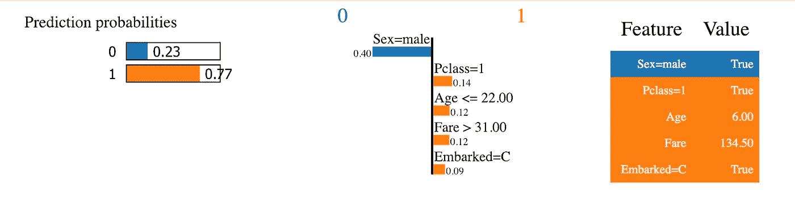

# 在数据科学面试中脱颖而出的两个技巧带回家的挑战或工作

> 原文：<https://towardsdatascience.com/two-tips-to-stand-out-in-your-data-science-interview-take-home-challenge-or-job-a4682b3e9afb?source=collection_archive---------10----------------------->

# TL；速度三角形定位法(dead reckoning)

技巧 1:使用 h2o.ai 而不是 scikit-learn 构建随机森林模型。

技巧 2:使用 LIME 提供本地模型解释。

下面我会告诉你怎么做、为什么做以及一个简单的方法。

# 谁应该读这篇文章？

本文面向两类读者:

1.  您正在寻找您的第一份/下一份数据科学工作，并且有兴趣在带回家的挑战中领先一步，以便从人群中脱颖而出。
2.  您是一名数据科学家，希望提高随机森林模型的性能，或者厌倦了向业务伙伴解释机器学习模型的准确性与可解释性之间的权衡。

# 技巧 1:使用 h2o.ai 而不是 scikit-learn 构建随机森林模型

你已经花了几个小时来润色这些杂乱的数据，进行特色工程，并最终准备好用你的机器学习模型来攻击你的训练数据集。随机森林通常是我的首选武器，因为它们易于实现，并且往往提供良好的开箱即用性能，而不需要密集的超参数调优。如果您的数据集中有分类要素，您需要对它们进行一次性编码，使其便于 scikit 学习。您是否知道，在大多数情况下，这一步骤实际上会阻止您的模型发挥其全部性能潜力？

假设你有两个特征——年龄(连续)和教育程度(分为四个等级——高中、学士、硕士和博士)。一键编码将这两个特征转换成五个特征。当决策树为节点处的分裂选择最佳特征时，除非其中一个分类级别**单独**比年龄具有更强的预测能力，否则连续特征往往会首先被选中。因此，如果你曾经看过 scikit-learn 的特性重要性图，你会注意到连续变量通常在最上面。

然而，h20.ai 或 R 的随机森林实现通过整体考虑分类特征来规避这个问题。使用一个热点编码，在一个节点上只检查四个教育条件以进行分割。如果训练数据点具有高中的一键编码值，那么将数据点移动到节点的左侧，否则将它们移动到右侧，并且对于学士、硕士和博士进行同样的检查

另一方面，h2o.ai 检查上述条件，但也检查复合条件。复合条件是指不同的分类级别被归入一个类别。例如，如果数据点具有高中值**或学士值**，则将数据点移动到节点的左侧，否则向右移动。还会检查所有其他级别组合的拆分。例如，高中或硕士、学士或博士、高中或学士或硕士(这类似于博士的一键编码值)等。这些额外的复合条件导致分类变量被选择用于拆分的概率更大。请记住，由于这些实现检查附加的复合条件，它们的训练时间通常比 scikit-learn 实现长。

看完上面一段就挠头？这篇[文章](https://roamanalytics.com/2016/10/28/are-categorical-variables-getting-lost-in-your-random-forests/)用例子详细解释了这一现象。

如果你从未使用 h2o.ai 建立过模型，不用担心，我会支持你的。本文末尾有一个 Jupyter 笔记本的链接，里面有一个简单的例子。这很简单！

# 技巧 2:使用 LIME 提供本地模型解释

LIME 代表局部可解释的模型不可知解释。虽然随机森林的特征重要性提供了对预测的全局解释，但是 LIME 让您可以对测试集中的每个预测进行解释。如果你以前从未听说过 LIME，[这里有](https://cran.r-project.org/web/packages/lime/vignettes/Understanding_lime.html)一个很好的资源来理解它是如何工作的，并把你指向原始论文和 Python 包。

下面是对著名的泰坦尼克号数据集中的一个预测的解释。

LIME Example

上面的图表告诉我们，模型使用橙色突出显示的特征来分配此人生存的高概率。

不幸的是，将 LIME 与 h2o.ai 一起使用可能会令人困惑，但为了帮助你，我编写了一个名为 limewrapper 的包来简化功能工程过程，以便能够轻松地将 LIME 与 h2o.ai 一起使用。如果你想深入研究，[这里有一个](https://github.com/joelprince25/limewrapper/blob/master/example/example.ipynb)示例笔记本，我将向你展示如何使用 h2o.ai 构建一个简单的随机森林模型(分类器和回归器)，以及如何使用 limewrapper 包获得本地解释。

有了这两条锦囊妙计，你应该可以毫不费力地给面试官留下深刻印象，或者减轻一些(但不是全部)对 ML 持怀疑态度的商界人士的担忧。

我希望这对您的数据科学之旅有所帮助。你可以在这里了解更多关于我的旅程。如果你有任何问题，可以通过 LinkedIn 联系我——www.linkedin.com/in/joelprince。聊的开心！

如果你喜欢这篇文章，请查看:

1.  [我的第一份数据科学简历](https://medium.com/@joelprince25/my-first-data-science-resume-sample-data-scientist-resume-6a3c42b7cdb7)
2.  [从研究生到数据科学家:我对成功转型的两点看法](/from-graduate-student-to-data-scientist-my-two-cents-on-making-a-successful-transition-6fbd5c89e8a7)