# 调整神经网络的两种奇怪方法 Tensorflow 中的手动反向传播]

> 原文：<https://towardsdatascience.com/two-weird-ways-to-regularize-your-neural-network-manual-back-propagation-in-tensorflow-f4e63c41bd95?source=collection_archive---------27----------------------->

## 两个奇怪的想法，实际上调整了一个神经网络。

Image from this [website](https://pixabay.com/en/milky-way-universe-person-stars-1023340/)

这个帖子纯粹是为了满足我的好奇心。看了多篇论文，了解到在深度神经网络的训练过程中注入噪声，会产生更好的泛化能力。(与这个概念相关的一些论文是[摇动-摇动正则化](https://arxiv.org/abs/1705.07485)和[添加梯度噪声](https://arxiv.org/abs/1511.06807))

但是有一天，我想，与其注入噪音，不如我们采样会发生什么？此外，可以使用激活函数作为正则化，旨在创建稀疏的内部数据表示？

我感谢我的导师[Bruce](http://www.scs.ryerson.ca/~bruce/)博士的有益讨论。此外，我还要感谢我在[瑞尔森视觉实验室](https://ryersonvisionlab.github.io/)、 [Jason](https://www.eecs.yorku.ca/~jjyu/) 的一名实验室成员的有益讨论。更多文章请访问我的网站， [jaedukseo.me](https://jaedukseo.me/) 。

**简介**

正则化深度神经网络是一项棘手的任务，一方面，我们不希望网络简单地记住所有的输入和输出映射。而另一方面，我们希望网络达到最高的性能。

今天，我想尝试两种非常规方法，看看这些方法是否可以执行正则化。

**方法 1:随机抽样反向传播**

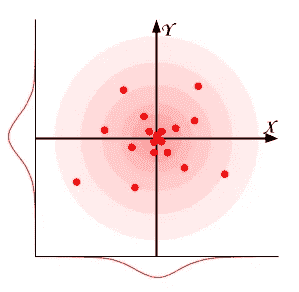

Image from this [website](https://www.alanzucconi.com/2015/09/16/how-to-sample-from-a-gaussian-distribution/)

这个想法很简单，我们不是直接采用梯度，而是对高斯分布进行采样，将计算出的梯度视为该分布的平均值。

但是我们可以在三个不同的地方进行这种采样。

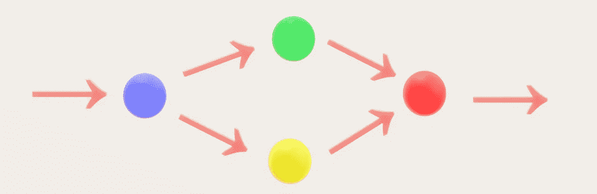

**蓝色球体** →每层渐变
**绿色球体** →权重动量
**黄色球体** →权重速度
**红色球体** →计算出的亚当更新

上述过程显示了 Adam optimizer 如何使用梯度信息来计算权重的更新值。从上面的图像中，我们可以看到，我们可以从红色球体或蓝色球体中取样，或者从两者中取样！我对所有情况都进行了实验，所以我们将看到每种情况的表现。最后，我们可以执行采样的最后一个地方是前馈过程。

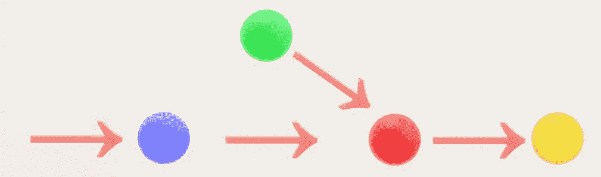

**蓝色球体** →每层输入
**绿色球体** →每层权重
**红色球体** →每层卷积运算
**黄色球体** →每层激活运算

我执行采样的下一个区域是权重本身，在训练期间，模型使用权重值，然而，在测试期间，模型执行采样以获得权重值。

所有这种抽样方法的一个缺点是，我们需要选择一些标准偏差。对于所有的实验，我将标准偏差设为 0.00005。这种方法的一个优点是这种方法可以克服消失梯度，因为即使梯度为零，它也会重新采样并得到一个小的值。(布鲁斯博士已经向我提到了这个优点。).最后，合并了每种情况的卷积层可以在下面看到。

**方法 2:作为正则化激活**

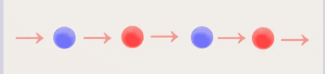

**蓝色球体** →卷积层
**红色球体** →非线性激活

该方法背后的思想是划分稀疏约束和特征提取部分。因此，我们不打算在权重上添加稀疏性约束，而是添加激活权重。

如何实现这一点很简单，简单地说 ReLU layer 只让正值通过。这可以被认为是一个掩码，其中这个掩码被乘以数据的内部表示。

现在，我们可以通过拥有与内部数据维度完全相同的权重来放松 ReLU 激活的零和一约束，并执行元素级乘法。我们可以在这些权重上添加稀疏约束。

如上所示，我们有一个称为 ReLU 的正则化层，这个层简单地执行元素乘法。然而，在执行反向传播时，我们添加了稀疏项，最后为了实现 ReLU 的软化版本，我们应该将该值从 0 剪切到 1。

**实验设置**

**蓝色球体** →输入图像数据 [STL10](https://cs.stanford.edu/~acoates/stl10/)
**黄色矩形** →卷积层
**红色方块** →交叉熵损失项用于分类

网络架构相当简单，六个卷积神经网络。此外，我在多集上训练了 200 个时期的网络，以研究该方法是否能重复产生稳定的结果。

**结果 1)随机抽样反向传播**

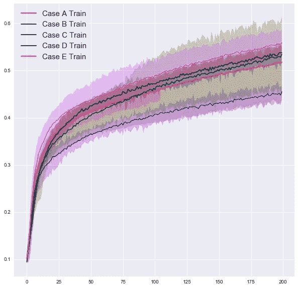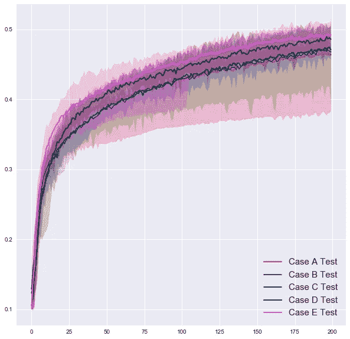

Training Accuracy Plot (left) Testing Accuracy Plot (right) over 10 episodes

**情况 A** →基础情况无随机抽样
**情况 B** →退出
**情况 C** →在 Adam 更新中随机抽样
**情况 D** →在 Adam 更新/梯度中随机抽样
**情况 E** →在前馈期间在 Adam 更新/梯度/权重中随机抽样

粗线代表 10 集的平均准确度，最小-最大范围以透明色显示。我们可以直接观察到情况 E 在训练和测试图像上都达到了最高的准确度。它也胜过辍学。

然而，我们应该注意案例 C 能够跑赢其他案例的情况。当我们绘制一段时间内精度的标准偏差时，我们会得到如下图。

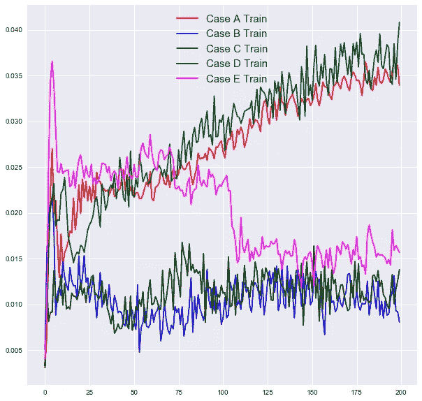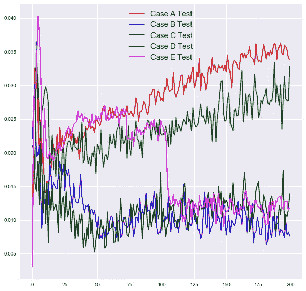

STD of Training Accuracy Plot (left) STD of Testing Accuracy Plot (right) over 10 episodes

令人惊讶的是，当我们增加随机抽样的区域时，每集之间的方差减少了，这意味着我们得到了一致的结果。

**结果 2)作为正则化/随机采样反向传播的激活**

> **对于以下所有实验，随机采样仅在 Adam 更新和梯度上执行。(案例 D)。**

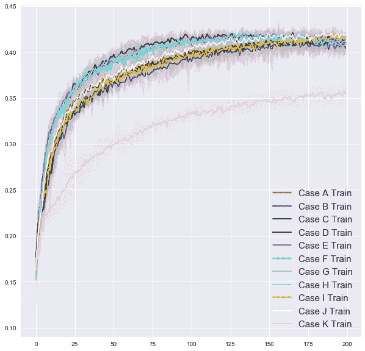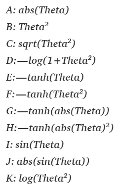

Training Accuracy Plot (left) Testing Accuracy Plot (right) over 5 episodes

> 左边显示了所有不同的正则项及其情况。

我们可以注意到，每种方法都给出相似的结果。

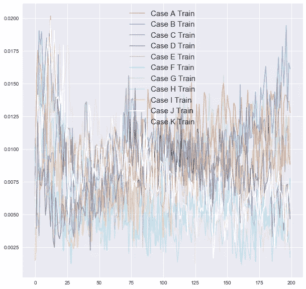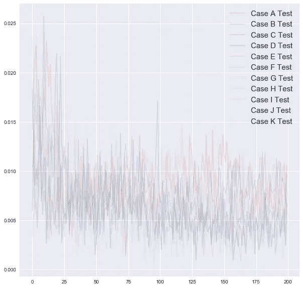

STD of Training Accuracy Plot (left) STD of Testing Accuracy Plot (right) over 5 episodes

绘制每集的标准差变得极其混乱，对于这个实验，我不认为它增加了任何有价值的信息。

**结果 3)测试集的最高准确度**

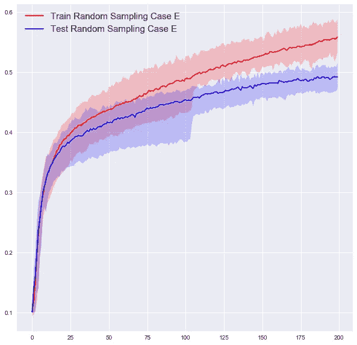

如上所述，实现最高测试精度的方法是来自随机采样反向传播的情况 E。这是我们随机采样的情况，不仅是梯度，还有 Adam 更新的值和用于测试图像的过滤器的权重。

**讨论**

多名研究人员发现，注入某种随机噪声最有可能提高泛化能力，因此这多少有些出乎意料的结果。我确实想联系的一件事是，从论文“[识别和攻击高维非凸优化中的鞍点问题](https://arxiv.org/abs/1406.2572)”可以看出，鞍点是深度神经网络训练时的问题。因为随机采样反向传播总是确保到处都有一点梯度，所以它在避开那些区域方面可能非常有效。

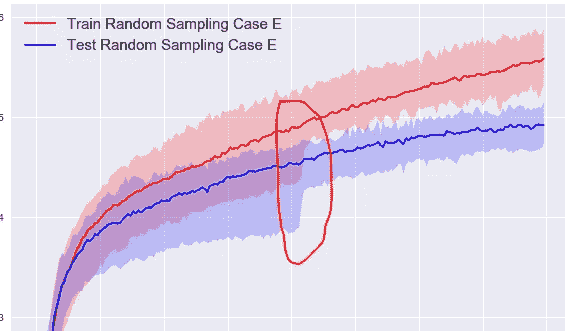

从上面的下降来看，由于随机性，网络可能会逃离其中一个区域。(不是 100%确定)。

对于将激活视为规则，在计划这项研究时，我认为这是一个好主意，并将提高泛化能力，但将特征选择和稀疏性约束分开似乎真的不是一个好主意。

**结论/代码**

总之，添加随机噪声，无论是以添加还是采样的形式，似乎都有正则化的效果。此外，复合噪声因子似乎是一个好主意，这意味着在几个不同的地方添加噪声。最后，划分特征学习和稀疏性似乎不是一个好主意。(针对泛化和网络性能)。

要访问随机抽样反向传播代码，[请点击此处](https://github.com/JaeDukSeo/Daily-Neural-Network-Practice-2/blob/master/Class%20Stuff/Three%20Werid%20Ways/a%20things%20to%20compare%20(%20batch%20size%20100)-Copy1.ipynb)。
要访问代码激活为正规化，[请点击这里](https://github.com/JaeDukSeo/Daily-Neural-Network-Practice-2/blob/master/Class%20Stuff/Three%20Werid%20Ways/b%20reg%20as%20activation.ipynb)。
要访问创建图的代码，[请点击此处](https://github.com/JaeDukSeo/Daily-Neural-Network-Practice-2/blob/master/Class%20Stuff/Three%20Werid%20Ways/z%20viz.ipynb)。

所有这一切都有些令人惊讶，但在我的目标范围内，没有什么接近的泛化能力。

> 最后，我想提一个事实，这些技术都没有数学证明。只有实证结果。所以请对这一切有所保留。

**参考**

1.  Pixabay 上的自由图像——银河系，宇宙，人，星星。(2019).Pixabay.com。检索于 2019 年 2 月 3 日，来自[https://pix abay . com/en/milky-way-universe-person-stars-1023340/](https://pixabay.com/en/milky-way-universe-person-stars-1023340/)
2.  Gastaldi，X. (2017)。抖抖正则化。arXiv.org。检索于 2019 年 2 月 3 日，来自[https://arxiv.org/abs/1705.07485](https://arxiv.org/abs/1705.07485)
3.  Neelakantan，a .，Vilnis，l .，Le，q .，Sutskever，I .，Kaiser，l .，Kurach，k .，和 Martens，J. (2015 年)。添加梯度噪声改善了对非常深的网络的学习。arXiv.org。检索于 2019 年 2 月 3 日，来自[https://arxiv.org/abs/1511.06807](https://arxiv.org/abs/1511.06807)
4.  Zucconi，a .，Zucconi，a .，和 Zucconi，A. (2015 年)。如何生成高斯分布数？艾伦·祖科尼。检索于 2019 年 2 月 3 日，来自[https://www . alanzucconi . com/2015/09/16/how-to-sample-from-a-Gaussian-distribution/](https://www.alanzucconi.com/2015/09/16/how-to-sample-from-a-gaussian-distribution/)
5.  RELU 市(2019)。要点。检索于 2019 年 2 月 4 日，来自[https://gist . github . com/JaeDukSeo/239890 e 40 AC 72705 ed 0 c 82 Fe 25 b 39680](https://gist.github.com/JaeDukSeo/239890e40ac72705ed0c82fe25b39680)
6.  JaeDukSeo/每日神经网络实践 2。(2019).GitHub。2019 年 2 月 4 日检索，来自[https://github . com/JaeDukSeo/Daily-Neural-Network-Practice-2/blob/master/Class % 20 stuff/Three % 20 werid % 20 ways/a % 20 things % 20 to % 20 compare % 20(% 20 batch % 20 size % 20100)-copy 1 . ipynb](https://github.com/JaeDukSeo/Daily-Neural-Network-Practice-2/blob/master/Class%20Stuff/Three%20Werid%20Ways/a%20things%20to%20compare%20(%20batch%20size%20100)-Copy1.ipynb)
7.  权重观点中的正则化[张量流中的手动反向传播]。(2019).走向数据科学。检索于 2019 年 2 月 4 日，来自[https://towards data science . com/regulation-in-weights-point-of-view-manual-back-propagation-in-tensor flow-4 FDC 7b 389257](/regularization-in-weights-point-of-view-manual-back-propagation-in-tensorflow-4fdc7b389257)
8.  道芬、y、帕斯卡努、r、古尔切雷、c、乔、k、甘古利、s 和本吉奥(2014 年)。高维非凸优化中鞍点问题的识别与攻击。arXiv.org。检索于 2019 年 2 月 4 日，来自[https://arxiv.org/abs/1406.2572](https://arxiv.org/abs/1406.2572)