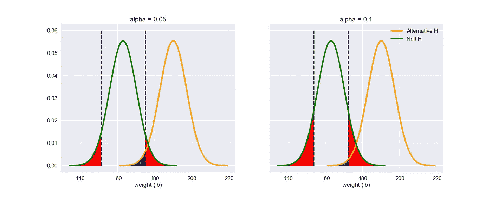

# 假设检验的第一类和第二类错误:用图表理解

> 原文：<https://towardsdatascience.com/type-i-and-type-ii-errors-of-hypothesis-tests-understand-with-graphs-43079fdd936a?source=collection_archive---------8----------------------->

当我在我的第一堂统计学课上第一次学习假设检验时，我学习了第一类错误(α)和第二类错误(β)的定义。

*   第一类误差(α，也称为显著性水平):当 H₀(零假设)为真时拒绝它的概率。(假阳性)
*   置信水平(1 - α):如果要生成许多样本，产生包括真实参数值的准确区间的能力
*   第二类误差(β):当 H₀为假时拒绝失败的概率。(假阴性)
*   统计检验的功效(1- β):当 H₀为假时拒绝它的概率

当我们进行假设检验以获得临界值或置信区间时，我们使用α。如果 p 值落在置信区间内，我们不能拒绝零假设，如果它在区间外，我们就拒绝它。

这是一种模式，但我对统计能力或β并没有很好的了解。事实上，假设检验是一种“巡航控制”,只要我知道要进行哪种检验。

但最近我意识到，在实验设计中，假设检验的力量对于理解选择合适的样本量是至关重要的。然后，我被介绍给[克里斯托佛·马格努松的关于统计能力和显著性测试的交互式可视化](https://rpsychologist.com/d3/NHST/)，我终于在脑海中有了一个解释α、β、样本大小和效应大小如何一起工作的画面。

在本文中，我将展示统计功效与α的关系。

# 树立榜样:

首先让我们先设定解决方案。进行单样本 z 检验的目的是检验总体均值𝜇(未知)是否是一个特定值 m

我们将确定一个正态分布作为总体的分布，使总体均值开始。

## 人群:从平均和标准偏差分别为 163 磅和 7.2 磅的人的体重中收集的数据。

假设我们正在进行假设单样本 z 检验，以检查给定样本组的总体参数是否为 163 lb。

**H₀: 𝜇=163**

**Hₐ: 𝜇≠163**

# 1.1α和β的关系

Fig.1: β level changes depending on α level: The sum of two red parts represent Type I error and the blue part represent Type 2 error.

根据定义，红色部分的总和代表 I 型误差:当 p 值落入读取部分时，当零假设为真时，我们拒绝 H₀(当群体 PDF 为绿线时)。同样，蓝色部分是第二类误差，当它不成立时，我们接受 H₀(当人口 PDF 是橙色线时)。

看到当 alpha 级别从 0.05 增加到 0.1 时，蓝色部分变小了！你也可以这样想，当你拒绝的多了，不拒绝(拒绝失败)带来的误差就减少了！

# 1.2 绘图生成

以下是用于绘制图 1 的 python 代码。

备选假设图是从正态分布生成的，平均值为 190 磅，标准偏差为 7.2 磅。

Importing libraries

Setting up the distributions and function to create points to plot PDFs